# ENACT — Technical Specification

**Section 03: Store**
Status: draft · Owner: Debith · Last updated: 2026-09-23

What is written down, in what form, and how it survives the three things that happen to a
memory repository in real use: a process dying mid-commit, two sessions writing at once, and
two people's copies being merged by git. The types are [section 01](01_domain_model.md)'s;
the vocabulary's files are [section 02](02_taxonomy_and_sources.md)'s; this section is
everything else on disk.

| Scenario | What it needs from this section |
|---|---|
| [0 — starting up](00a_how_a_memory_is_made.md#scenario-0-starting-up) | the load: replay, checks, checkpoint, the version that survives restarts |
| [2.1–2.3 — writing](00a_how_a_memory_is_made.md#feature-2-create-a-new-spell) | the commit: its point of no return, and the checks re-run under the lock |
| [3.1 — learning](00a_how_a_memory_is_made.md#scenario-31-the-right-note-is-in-a-neighbouring-space) | usage records that may be lost, and a promotion that may not |
| [4 — a colleague's notes](00a_how_a_memory_is_made.md#feature-4-bring-in-a-colleagues-notes) | ingestion, reconciled by slug and digest |
| [5.1, 5.2 — two notes, one point](00a_how_a_memory_is_made.md#feature-5-two-notes-turn-out-to-say-one-thing) | merges — of memories, and of whole histories |
| [6 — a wrong note](00a_how_a_memory_is_made.md#feature-6-a-note-turns-out-to-be-wrong) | a correction that leaves the old text readable |

---

## 1. What is written down

Three kinds of record, and they are treated differently because they fail differently.

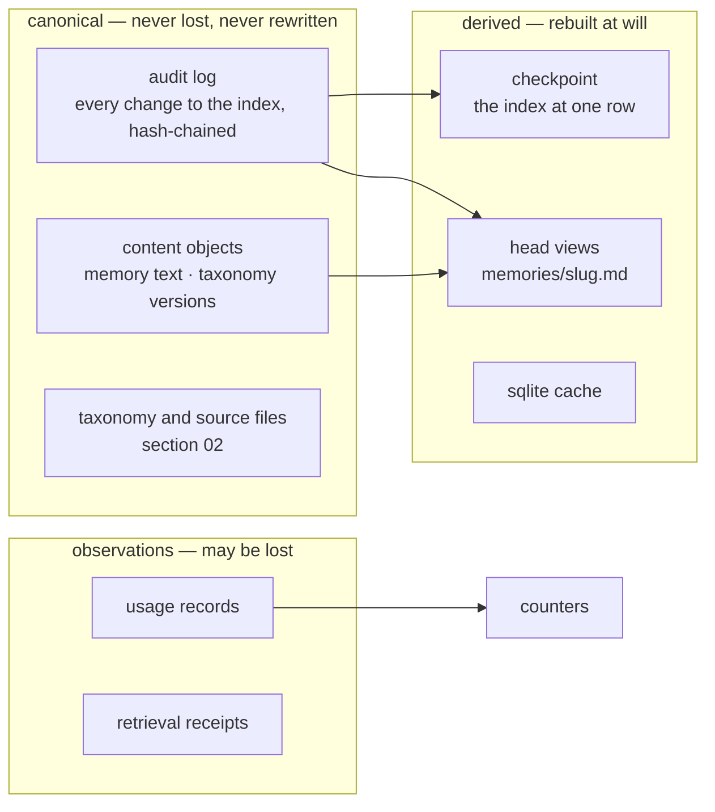

**Decision 1 — the audit log is the index.** Every change to the index side — a write, a
link, an unlink, a promotion, a merge, a retirement, a proposal's state, an inventory change,
a hand edit noticed at startup — is one audit row, and the index at any moment is the rows up
to that moment, replayed. Nothing else about the index is canonical. The overview's G10 asked
that the index as it stood after any audit row can be rebuilt. With the log as the only canonical
record, the index after any row *is* the replay of the rows up to it — so what G10 asked for stops
being a feature to implement and becomes the definition of the index.

What is *not* in the log is content: a memory's text is written once into a content object
and the row carries its digest. Rows stay small, and the log stays readable in a diff.

---

## 2. Identity

### 2.1 A row's id is the hash of the row

```text
row = { parents: [row ids], clone, seq, time, op, payload }
id  = digest(parents, clone, seq, time, op, payload)
```

Each row names the row or rows its writer had seen as the head — normally one. Rows therefore
form a chain. A chain of hashes is tamper-evident: a row's id is the digest of its content, its
parents' ids included, so editing any row changes its id, and the rows that name the old id no
longer match anything. More usefully here, the chain is **mergeable**: because each row names its
parents, two copies of a repository that each grew their own rows still form one graph when
joined, and the join has an identity of its own (§5).

| Name | Is | Seen as |
|---|---|---|
| `row_id` | a row's 128-bit digest | `7f3a91c2…` |
| `snapshot_id` | the `row_id` of the head the snapshot was built at | what a retrieval receipt pins |
| `snapshot_version` | how many rows the head's history holds | the "v55" a person reads |

This refines section 01, where `snapshot_version` alone was what a receipt pinned. A counter
names a moment only inside one copy of a repository: two people who both commit after v55
both reach "v56". The head's digest names the moment everywhere.

### 2.2 A memory is identified by the row that made it

01 took a memory's identity from its content digest. That breaks on one real case — a
correction that is later reverted:

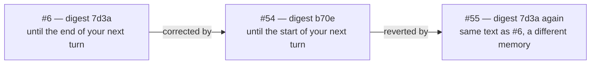

\#55's text is byte-for-byte \#6's, but it is a different memory: different lineage, different
time, different reason, and \#6 must stay retired while \#55 is findable. So:

**Decision 2.2.** A memory's persistent identity is its `key` — the `row_id` of the row that
created it (a write, an ingestion, a merge, a correction). The content digest keeps the two
jobs it is good at: integrity, and the identical-content check, which only ever compares
against current heads. The dense `memory_id` of section 01 is still what a snapshot uses
inside; it is assigned in replay order, lives in one snapshot, and is never written down —
the same rule section 02 gave tag ids. The "#6" a person reads is that dense id.

---

## 3. On disk: the files store

### 3.1 Layout

```text
.memory/
  taxonomy/        base.yaml, pack-*.yaml, studies/          section 02
  sources/         inventory.yaml, renditions, structure     section 02
  objects/7d/3a…   content, addressed by its digest — memory text and frozen taxonomy versions
  audit/<clone>.jsonl        this copy's rows, append-only, hash-chained
  usage/<clone>/<day>.jsonl  observations, append-only
  receipts/<clone>/<day>.jsonl
  memories/<slug>.md         one head view per chain, regenerated
  reviews/session-<n>.md     a session's lessons-learnt report, regenerated
  corpus/                    hand-written memory files for ingestion (Feature 4)
  local/                     never committed: clone id, commit lock, checkpoint, sqlite cache
```

**One audit file per clone.** A clone is one copy of the repository — one person's checkout
on one machine — and it gets a random id when it first opens the repository, kept in
`local/`. Every session on that machine appends to that clone's file, under a lock (§4).
Another person appends to theirs. Two people therefore never append to the same file, and
`git merge` never has a conflicting line to resolve; `*.jsonl merge=union` in
`.gitattributes` is there for the rare hand-copied file, not for normal work.

**Content objects** are the memory text. An object is named by the digest of its text, so the
same text always lands at the same name, and writing it twice is a no-op. It is written by
temp-file-and-rename: the bytes go to a temporary file first, and the rename is what makes the
object appear, so a torn write is never visible.
Every distinct taxonomy version is frozen the same way when it is first seen, so a receipt
pinned to an old vocabulary can still be rerun after the files have moved on.

### 3.1.1 The layout is data; each folder kind is a class — settled 2026-09-23, not built yet

**Scenario.** A new kind of record needs a folder, say a trace per session. Today that means a
fourth pair of methods in `strategy/files/store.h` beside the three identical pairs for usage,
receipts and mailbox, and the folder's name spelled in `init()`, in the methods and in the file's
header comment. Those copies already disagree: `init()` does not create `sources/`, and the header
comment lists neither `sources/`, `reviews/` nor `corpus/`. A sweep of the file found 86 string
literals, 36 of them folder names. Settled: the new folder is one row of the layout,
`{"traces", kind::daily_log, committed}`, served by the `DailyLog<Record>` that already exists,
with the record's own codec. No method is written.

Each class below says what it is responsible for, not what members it has; the arrows follow
[the relationship pattern](../plantuml_relationship_pattern.md).

```mermaid
classDiagram
    direction TB
    class Views {
        <<strategy>>
        shows each memory to people
    }
    class FilesStore {
        puts each kind of bytes in the folder the layout names
    }
    class Layout {
        <<constexpr data>>
        which folder holds what, and of which kind
        committed or local
    }
    class ContentFolder {
        keeps bytes under their digest
        a second write is no write
        objects/
    }
    class CloneLog {
        appends the rows of this copy for good
        hands back the new rows of every copy
        audit/
    }
    class DailyLog~Record~ {
        one line a record, one file per copy per day
        usage/ receipts/ mailbox/
    }
    class DocumentFolder {
        lists its documents in one fixed order
        replaces one only if it is unchanged since read
        taxonomy/ sources/ corpus/
    }
    class ViewFolder {
        writes finished text under a name
        skips it when unchanged
        memories/ reviews/
    }
    class LocalState {
        what never leaves this machine
        the copy id, the session number, the commit lock
        local/
    }
    class Problems {
        a person must look at this file, at this line
        replaced one source at a time
    }
    Views <|.. ViewFolder
    FilesStore ..> Layout : reads
    FilesStore *-- ContentFolder
    FilesStore *-- CloneLog
    FilesStore "1" *-- "3" DailyLog
    FilesStore "1" *-- "3" DocumentFolder
    FilesStore "1" *-- "2" ViewFolder
    FilesStore *-- LocalState
    FilesStore *-- Problems
    note for Problems "every folder kind reports here"
```

What each folder kind takes from pathlike — the primitives of
[pathlike: writes that survive](../pathlike_writes.md) and the engines of
[the engine registry](../pathlike_engine_registry.md) (its section on core and adapter):

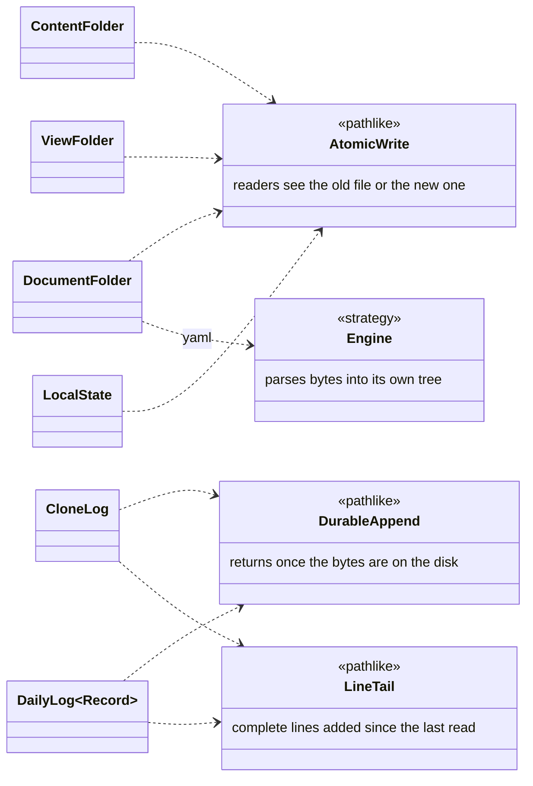

**The layout, as a table.** Each folder has one kind — the class that handles it — and either
git commits it or it never leaves this machine:

| Folder | Kind, and the class that handles it | Committed |
|---|---|---|
| `objects/` | content: `ContentFolder` | yes |
| `audit/` | one log per copy: `CloneLog` | yes |
| `usage/`, `receipts/`, `mailbox/` | one log per copy per day: `DailyLog` | yes |
| `taxonomy/`, `sources/`, `corpus/` | documents: `DocumentFolder` | yes |
| `memories/`, `reviews/` | pages for people: `ViewFolder` | yes |
| `local/` | this machine's own state: `LocalState` | never |

Today `init()` also writes two small files as fixed text: `.gitignore`, which says `local/`, and
`.gitattributes`, which says `*.jsonl merge=union` — git's instruction to merge a log file by
keeping the lines of both sides. Both repeat what the table already knows: which folder is never
committed, and which folders hold logs. So they are produced from the table rather than typed
out, and a folder added to the table reaches both files by itself; today a new folder has to be
spelled in three places. In the code the table is a `constexpr` array, so the compiler can check
it: no folder listed twice, every kind handled.

A folder kind is where behaviour lives; the table only says which folder has which kind. A
table with no class behind it would be a list of constants with the logic still spread over the
store (global #14 has why that is the half that usually gets dropped). What each of today's
methods becomes is in §7.2.

### 3.2 A row, concretely

The write that created \#6 in Scenario 2.3:

```json
{"id":"9c41e2…","parents":["51b0a7…"],"clone":"c-4f1d","seq":212,"time":"2026-09-09T14:03:11Z",
 "op":"write","payload":{"slug":"frost-ward-typed-resistance","title":"The Ward family",
 "content":"7d3a1f…","supersedes":["3c1e88…"],"session":7,"turn":12,
 "tags":["domain=dnd","artifact=spell","task=design","purpose=defensive","kind=example","tier=mid"],
 "seen":["a0e3…","5f21…","3c1e88…","e91c…","b2d7…"],"reason":"the rule was narrower than the preference"}}
```

Tags by name, memories by key, content by digest: nothing in it depends on the order another
copy of the repository happened to load things in.

### 3.3 Head views

`memories/<slug>.md` holds the current head of each chain as a human reads it — a short YAML
header with its key, title, tags and citations, then the text. It is **generated**: rewritten
whenever what it shows changes — a new head, but also a link, an unlink, a promotion, an accepted
proposal, or rows caught up from another process — and removed when its chain has no head. The
service compares each published snapshot with the one before it; whatever operation changed what a
view shows, the change reaches the views through that one comparison. Opening a store checks every
view, and a view already right is not rewritten, so git sees no churn. The reason it is committed is the diff: a committed file's changes show
up where people already review, so a change to a memory is reviewed as a change to its page.
A correction appears in review as an edit to a file that already existed, which is how a person
expects to see it (overview §4.5, step 5).

Because it is generated, a view is never read back as truth. A view whose text is no
version of its chain was edited by hand — and that is the human's, not the service's, to
resolve (§3.4).

### 3.4 When a human edits a view

**Built so far: keep and report.** A view whose text is no version of its chain is neither
rewritten nor removed — not by a tag change, not by opening the store. It stays as the person left
it, with a review item naming it, until someone writes the edit as a memory superseding the head;
the view then matches a version again, and the review goes. Either option below starts from that.

| Option | Concretely | For | Against |
|---|---|---|---|
| **Take it as a correction** (drafted) | at startup, `memories/frost-ward-typed-resistance.md` differs from \#54's text; the store commits a `corrected` write, author *human, file edit*, superseding \#54, reason *edited in memories/frost-ward-typed-resistance.md* | editing the file you are reading is the most natural correction there is, and it gets a cause on record without a tool | the no-unread-write check does not apply — but a supersede of the current head never needed it |
| Report only | a review item: *view edited by hand*, the view regenerated from \#54 on next write | nothing changes without an operation | the human's edit is overwritten the next time the chain moves, which will feel like data loss |

### 3.5 What can actually lose a memory

No operation deletes anything: `retire` and a supersede append rows, and nothing removes a row or
an object. So losing knowledge takes a file-level accident, and the six that matter were measured
on a scratch store (2026-09-17):

| What happens | What is lost | Told? |
|---|---|---|
| `retire`, or a supersede | nothing — the text stays readable through `show`, out of retrieval only | — |
| every file under `memories/` deleted | nothing: views are derived and regenerate at the next open | — |
| `local/` deleted | nothing: the clone id is reissued, the cache rebuilt | — |
| **a content object deleted** | **the memory's text, which comes back empty in `show` and in reads** | **no** |
| a row hand-edited | that row, dropped from replay, so its memory disappears | yes: *its id does not match its content — edited by hand* |
| a line removed from an audit file | that row's memory; its object is left orphaned on disk | no |

Two consequences. The first silent loss is closed: opening a store checks that every head's object
is there and reports `text missing` when one is not, naming the view file that may hold the only
copy. A row removed from an audit file stays unreportable — nothing records that it existed. And
because nothing is ever deleted, a secret written into a memory stays in the row's history and in
`objects/` after a retire: removing it means rewriting history by hand, which is §9.4's subject.

### 3.4.1 `Stores`: what this machine holds — settled 2026-09-22

Discovery began as module functions, each taking the environment as its first argument: `find`,
`discover`, `find_global`, `guidance`, four `setup_*`, `ask_reload`. Nine of them, `discover`
reaching into that argument ten times. That is Feature Envy — a method list written outside its
object — and it has a cost beyond reading: a free function cannot remember, so every scoped tool
call re-walked the filesystem and shelled out to git.

`Stores` is that object. It is built from an `Environment` where the program is wired, and it
lives as long as the session does. The lifetime is chosen to match the answer: which stores this
machine holds stays true for the length of a session, so a value found once may be held, and
trusted, for exactly that long.

| | Before | After |
|---|---|---|
| naming every store, first call | 6.6 ms | 7.0 ms |
| naming them again, same session | 6.6 ms, each time | 0.08 us |
| what a reader sees | nine functions and a value | one object with a reason to exist |

The lifetime is the justification, not the milliseconds: **an object with a lifetime can hold what
it found, and a free function cannot.** That is also the test for whether an object earns its name
— what does it hold between calls? Nothing means a namespace; its own arguments means a DTO.

Nothing is looked up until it is asked for, and `refresh` drops it: a setup creates a store, and
what was true a moment ago is not. What remains a module function takes only paths — `is_store`,
`policy`, `publish`, `create`, `project_of` — and is genuinely free.

### 3.5.1 A citation moves like a tag — settled 2026-09-22

A memory's `cites` were fixed at the write that made it, so correcting one line number meant
superseding the whole memory: a new version, a new number, and every text that named the old one
left pointing at a superseded head. The adventure-craft field report (2026-09-21, item 6) left
fifteen precision fixes unmade for that reason, and this design's own DDD store had to supersede a
memory to move two locators — three lines after the report was answered.

A citation is evidence *about* a memory, not part of what it says. So it moves the way a tag does:
two more ops, `cite` and `uncite`, each naming the memory and one locator, with the same refusals —
not a head, already cited, not cited. Replay copies the record before changing it: earlier
snapshots share the same record, so changing it in place would change what a reader holding an old
snapshot sees — and that reader must keep seeing the citations it was given.

| What changes | Before | After |
|---|---|---|
| fixing one line number | `remember` with `supersedes` — #1 becomes #2 | `unlink --cite`, `link --cite` — still #1 |
| what a reader's receipt replays | a different memory | the same memory, its old citations |
| what names the memory elsewhere | strands on the old number | unaffected |

The agent surface is `link` and `unlink` with `cite` instead of `tag` — one job on two targets is
one command with an option, not two commands. A locator is checked against the store's own
inventory before it is recorded, and the passage comes back with the result. That check is honest
about its limit: it proves the document is known here and the lines exist, not that they say what
they are cited for. Both of this design's own wrong locators were in range.

### 3.5.2 A timestamp is not an order — found 2026-09-22

Rows carry a second-resolution time, a clone and a per-clone `seq`. Anything that needs *the latest*
row of some kind has to say what latest means, and twice now the answer was "the greatest time,
ties broken by row id". Rows written inside the same second carry the same time, so the tie falls
to their row ids — digests, whose order says nothing about which row was written first. Inside one
second, "latest" is a coin toss.

The mailbox hit it first and was given `seq` (§3.6). The vocabulary hit it next. Opening a store
appends a `taxonomy` row when the loaded vocabulary differs from the one the last such row records,
and that row was found by scanning for the greatest time. A store created, given a pack and written
to inside the same second holds its base-vocabulary row and its pack row at one time, so which of
them reads as "the last" falls to the digest toss. When the earlier, base row wins, the comparison
always says changed — last recorded is the base, loaded is the base plus the pack — so the open
appends a taxonomy row claiming a change that had not happened. And the toss has no memory: while
the winning row keeps winning, every open repeats the append and the hash chain grows without
bound. The black-box test that found it watched three reads in a row each add a row; its name now
pins the fix (`test_reading_three_times_over_does_not_grow_the_hash_chain`).

| | Before | After |
|---|---|---|
| after `setup`, a pack and one write | a taxonomy row per open, without end | none |
| what decides which row is latest | `time`, ties by row id | the order replay applied them in |

Replay is already causal — it topologically sorts on `parents` — so the snapshot records the
version as it applies each taxonomy row, and nothing has to guess. The rule, stated once: **a row's
time is for people; only replay order is an order.** Any future "the latest row that…" belongs in
the snapshot, not in a scan.

It was invisible from inside one process, which is why it survived a suite that exercised every
operation. It showed on the first test that asked what an operation had left behind (§3.5.3).

### 3.5.3 Tested from outside, on what is left behind — settled 2026-09-22

The suite drives ENACT in-process, which is the only way to test most of it quickly, and which
cannot see anything a *process* does on its way in or out. `tests/unittests/test_enact_cli.py` is
the other kind: every step is `oo enact ...` as a process, JSON in and JSON out, nothing imported.
It sees the CLI, the MCP dispatch, the adapter, the service and the files store in one round trip,
which costs about 90 ms — cheap enough that being black box is not a sacrifice.

Two surfaces are shipped and they are not one path. `oo enact call` reaches the server's dispatch
and stops; the MCP server has a loop around it — framing, `initialize`, `tools/list`, recovery from
a bad line, and everything that needs more than one message in one process: a session, turn counts,
notices said once, a reload taken between messages. Both are production, so both are driven as
themselves and neither stands in for the other. `TestOverTheRealProtocol` runs the installed
`oo enact mcp` as a subprocess and speaks JSON-RPC over its pipes, which is what an agent host
does; one test asserts the same refusal reads identically through both.

Nothing in the shipped code knows it is under test: no branch on an environment variable, no import
from `tests/`, no seam that exists for a fixture. The isolation is the one a person gets from
`$PYGIM_ENACT_GLOBAL`, `$XDG_DATA_HOME` and `$GIT_CONFIG_GLOBAL`, and it is the only kind on
offer: a separate process cannot be monkeypatched. That impossibility is part of what makes this
suite worth its cost.

It is deliberately about refusals, because a refusal is this design's most distinctive behaviour:
it is a result rather than an exception, it names the facts that would make the call succeed, and
it must leave the store exactly as it was. That last clause is the one no other test states, so
each scenario ends by fingerprinting `audit/`, `memories/`, `objects/` and `taxonomy/` and
requiring them byte-identical. Usage and receipts are left out on purpose: being read is a thing
that happened, and it is right that it is recorded.

Writing it found §3.5.2 within the hour, in a place no in-process test could reach.

A note on what "a fake repository" can mean here. The store is a strategy (§7), so an in-memory one
is buildable — but a test that speaks only through commands runs a new process per step, and a
store held in one process's memory is gone before the next one starts. The two cannot both hold.
What these tests need from a fake is isolation, not speed, and that is what a store under the
test's own temporary directory gives: the real strategy, exercised in full, over data that is the
test's own and nobody else's (global memory #26). Where speed does matter, pointing the temporary
directory at a RAM-backed filesystem costs no code at all.

### 3.6 The mailbox — settled 2026-09-21

Several sessions and agents work on one project, on different branches and machines, and they have
had no way to leave each other anything: feedback on what another session built, a request to
finish something, a comment on a report. Debith asked for one ("so that other sessions and agents
can leave there feedback, requests and comments").

**A message is not a memory.** A memory is knowledge that outlives the task; a message is
addressed, answered and done. Making messages rows would put transient chatter in the hash chain,
move the store's version on every note, and change what a rerun of an old receipt has to replay.

| Option | Concretely | For | Against |
|---|---|---|---|
| **Its own stream** (chosen) | `mailbox/<clone>/<day>.jsonl`, exactly as `usage/` and `receipts/` are | travels with the store through git, merges by union across clones, and touches neither the snapshot nor any receipt | a second thing to read when asking "what is going on here" |
| Rows in the audit log | `ops::message` | ordering and provenance for free | the version moves for a comment, and replay carries chatter forever |
| Memories tagged `kind=message` | one mechanism | nothing new to build | a read's ranking fills with notes; the unread check makes answering a comment a write |

**The shape.** Each message carries `kind` (feedback · request · comment), text, `author`, an
optional `to` (a session, an agent, a person; empty means whoever reads next), an optional `about`
(a memory, a path, a report), and `reply_to`. Its id is the digest of who posted it, when, and
what it says.

**State by appending**, as everywhere else here: a message that carries `resolves` closes the one
it names, and it needs text of its own, so a thread is never closed silently. `mailbox` returns
what is open, oldest first by time then id — a key each message carries itself, so the order is
the same whoever merged the clones — and `all` returns everything, since nothing is deleted.

**Delivery.** `session` lists what is open, so the first call of every session shows it; the
session-start hook prints the same list (§9.1.2), so it arrives without anyone asking; and
`oo enact mailbox` lists or posts from a terminal. Each store has its own mailbox, addressed like
any other scope — a community store's mailbox is where its contributors talk.

---

## 4. Committing

### 4.1 The row is the point of no return

A **row** is one line in this copy's audit log, `audit/<clone>.jsonl` (§3.2): the record that an
operation happened — a memory remembered, a tag linked, a memory retired — with who, when and
why. Replaying the rows in order rebuilds everything the store knows (00 §4, *audit row*). A
memory's text is not in its row: it is a separate content object, which the row names by its
digest.

So an operation writes its content first and its row last, and the row is what makes it
happen:

| The process stops… | What is on disk | What a reader sees |
|---|---|---|
| before it writes anything | nothing | the operation did not happen |
| after the content object, before the row | an object nothing names: an orphan | the operation did not happen; the orphan is harmless, and a later collection may remove it (§9.3) |
| after the row | the object and the row | the operation happened, completely |

There is no fourth moment — the work done but not committed — because an operation is complete
when its row is appended, and not before. Until then its work is only an orphan: the caller has
not been told it succeeded, and asking again writes the same object (it is addressed by its
digest, so writing it twice is writing it once) and then the row.

**Found 2026-09-23: seen whole, not yet kept whole.** The order holds for a reader, not for a power
cut. `append_durably` forces the row to the disk (`fsync`); `write_atomically`, which writes the
content object the row names, forces neither the file nor its folder
(`strategy/files/lock.h`). After a power cut the row can be on the disk while the object it names
is empty, which is exactly the in-between state this section rules out. This is reasoned from
the code, not reproduced. The same helper names its temporary file `<file>.tmp` — one fixed
name per file, so two writers of one file would be writing the same temporary file. That is safe
only while every writer of that file holds the commit lock, and the store's constructor writes
`local/clone` without taking it. Both are closed by pathlike's `AtomicWrite`
([pathlike: writes that survive](../pathlike_writes.md)), which the folder kinds of §3.1.1 write
through.

**How it will be tested.** A unit test cannot cut the power, but it can check the order that
survives a cut. `AtomicWrite` and `DurableAppend` take the way they force bytes to the disk as a
policy (a template parameter): the real one calls `fsync`, and a recording one in tests writes
down every write, force and rename. The test runs one `remember` and asserts the object's
temporary file was forced, renamed and its folder forced, all before the row's append was
forced. Today's helpers fail it at the first step, since nothing forces the object — which is
the test to write first ([pathlike: writes that survive](../pathlike_writes.md), under tests).

### 4.2 Two sessions, one repository

One MCP server runs per session (overview §6), so two open sessions on one machine are two
processes writing to one clone. The commit is serialised by an operating-system lock on
`local/commit.lock`, and — this is the part that matters — the four checks of overview §4.5
are **re-run under the lock** if anything was committed since the snapshot they were checked
against:

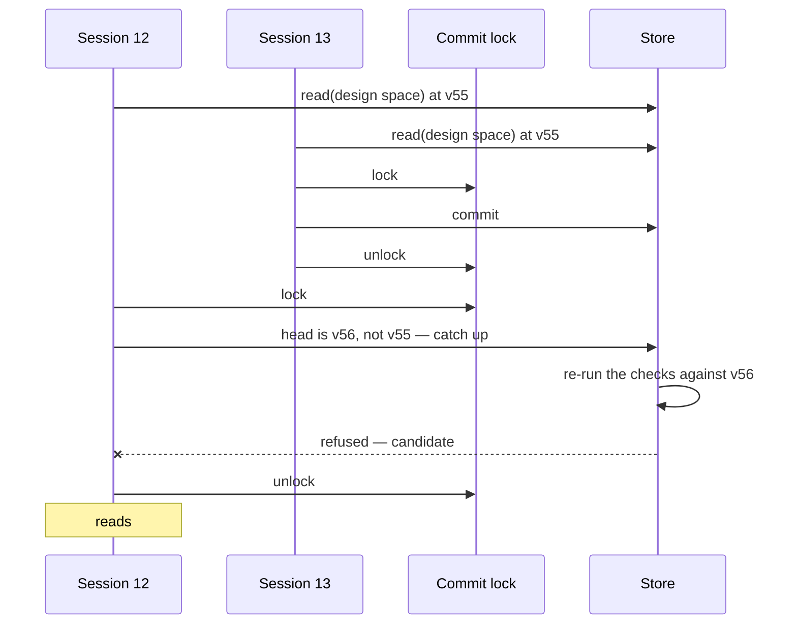

Without the re-check, session 12's *seen* list would be true of the snapshot it read and false
of the repository it wrote into, and the no-unread-write guarantee (G14) would hold only for
one session at a time. With it, the guarantee holds for every session sharing a clone.

Another process notices new rows by the size of the audit files, checked before each read —
a `stat` per file — and replays only what it has not seen.

### 4.3 What is synchronous and what is not

| Record | When it is written | If the process dies first |
|---|---|---|
| audit row — write, link, unlink, promotion, merge, retire, accept, reject, inventory | inside the commit, before the call returns | the change did not happen, and the caller was not told it did |
| usage record | by the statistics observer, batched | a few observations are lost; counters are slightly low |
| retrieval receipt | by the query logger, batched | that read cannot be rerun from its receipt |

A promotion (Scenario 3.1) is the one place the two meet: three usage records reach the
threshold, and the association they justify is committed as an audit row carrying the
evidence it was promoted on. Replay applies the row; it never recounts usage. So a usage record
lost before the threshold is reached can delay the promotion; one lost after the row is committed
changes nothing, because the row, not the count, is what replay applies.

---

## 5. When git merges two histories

Two people work in their own clones, then one pulls the other's. The files merge cleanly —
separate audit files, content addressed by digest — and the store is left with two heads:

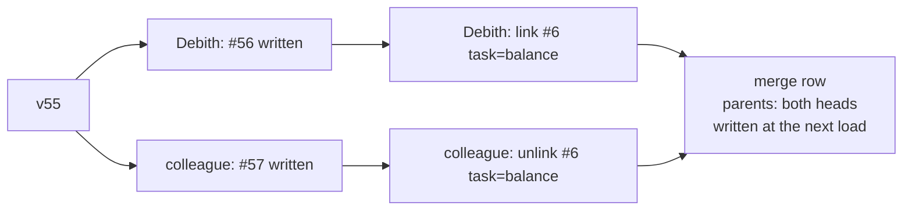

The next load finds two heads and writes a **merge row** whose parents are both of them. Its id
is the digest of the sorted parents: the parents are put in one fixed order before hashing, so
the direction of the merge never enters the digest. Whoever merges first — and in whichever
direction — therefore produces the same row, and merging A into B and B into A gives the same
snapshot.

Replay walks the rows in topological order, breaking ties by row id. Two things need a rule
because two people can disagree about them concurrently:

| Concurrent pair | Rule | In the example above |
|---|---|---|
| a link and an unlink of the same association | **add wins**: an unlink row removes only the links that exist in the history behind its own parents — the rows its writer had replayed; a link made concurrently in the other clone is not in that history, so it survives | the colleague's unlink had not seen Debith's link, so \#6 keeps `task=balance` |
| two supersedes of the same head | **both survive, and the chain is marked forked** | two corrections of \#6 are two heads; both are findable and a review item says the chain forked |

A forked chain is a recollection failure between people rather than between sessions, and it
is resolved the way Feature 5 resolves any other: someone reads both and merges them. The store
shows both rather than choosing, because choosing would mean discarding one person's work on a
rule neither of them saw. Section 01's head-uniqueness law is therefore amended: it holds along
any single line of history, and a fork created by a merge is reported, never silently resolved.

What a merge cannot do is run the no-unread-write check across people who had not seen each
other's rows. That is inherent — nobody can read what does not exist yet — so two people can write
the same thing with neither having seen the other's note. That duplicate is exactly the one
Feature 5 finds and names.

---

## 6. Loading

Scenario 0, as the store runs it:

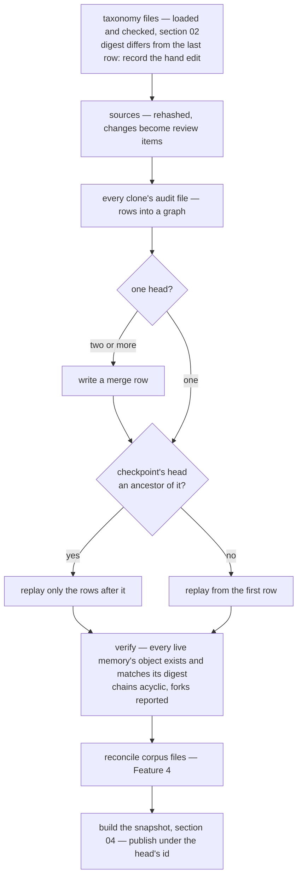

**The checkpoint** is the index as it stood at one row — associations, heads, the dense id map
— kept in `local/`. It is trusted only when its row is an ancestor of the current head — everything it
was built from is then part of the head's own history — and then only the rows after it are
replayed. Deleting it costs one full replay and changes nothing else.

**Content is loaded lazily.** The snapshot keeps each memory's digest, title and token estimate;
the text is read from its object when a context is actually built. A corpus of a hundred
thousand one-kilobyte memories is a hundred megabytes nobody needs in memory to answer a query.

**Ingestion** of hand-written corpus files reconciles by slug and digest, as Feature 4 draws: an
unknown slug is an ingestion row, a known slug with a new digest is a supersede, and an unchanged
block is nothing at all. A block that fails the vocabulary is named by file and line, and the
others land. A block's `cites:` header carries its locators, comma-separated, as a written
memory's `cites` does. Ingestion is a door with no look step (section 00a, Feature 4): a
hand-written block is landed without the no-unread-write check, because its writer chose its tags
outside any session. The same exemption is open to `remember` with origin `seed`, for an agent
seeding a store from documents it has not yet written anything from — and to nothing else: a
write during work always looks first.

---

## 7. The service, and its strategies — redrawn 2026-09-23

**Scenario: two wirings, one service.** The stores on this machine are wired as
`MemoryService<FilesStore, SystemClock, ViewFolder>` over a directory. A test that has to control
time swaps in `FixedClock`, and nothing else changes. A store that must never publish plaintext
is wired as `MemoryService<SealedStore<FilesStore>, SystemClock, LocalViews>`. In all three the
service, the snapshot and the vocabulary loader are the same code, because they only ever speak
to three strategies: where the bytes go, what time it is, and how a memory is shown to people.

The diagrams in this section, and in §3.1.1, describe behaviour: each class says in a few words
what it is responsible for, and the arrows carry how the classes relate. The arrows follow
[the project's relationship pattern](../plantuml_relationship_pattern.md).

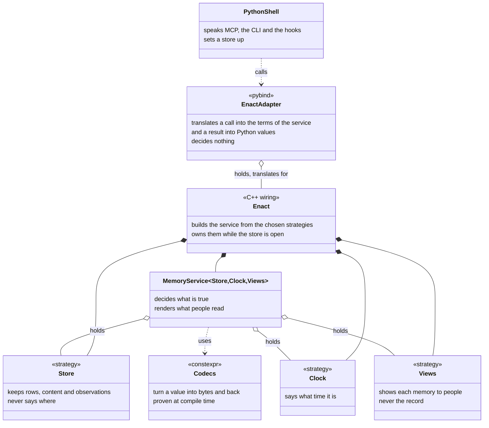

`EnactAdapter` owns nothing: it holds the one `Enact` object and translates calls into it.
`Enact` is the C++ side's wiring — it picks the strategies, builds the service from them, and
owns all of it for as long as the store is open — so a C++ caller or test gets the same object
the Python side does.

Each strategy and what implements it, one diagram per family. Clock and Views have no arrows to
anything outside their own family, so each is drawn alone, and the diagram above only names
them. The ones marked *end state* are directions this design keeps a seam for, not work planned
now (the owner's standing rule: a direction is not dropped because today's scale does not need
it).

**Store** — where the record goes:

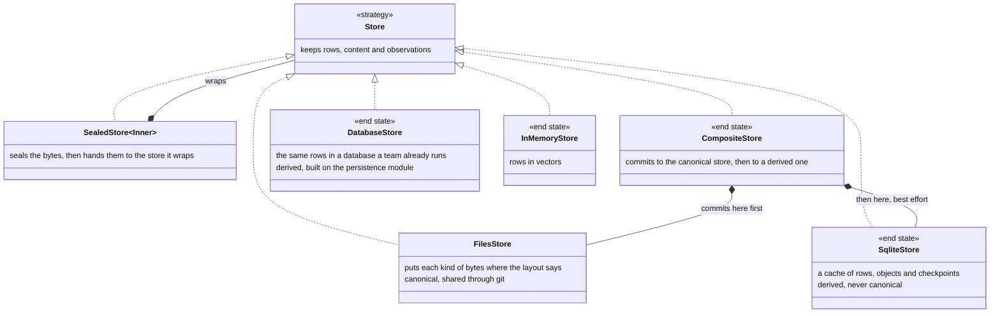

**Clock** — what time it is:

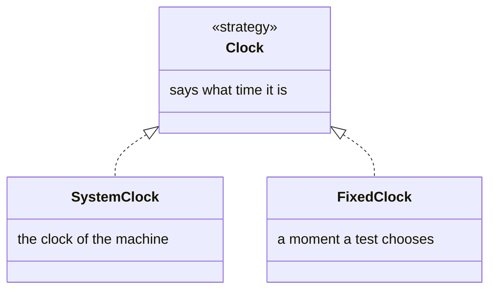

**Views** — where a memory's page for people goes:

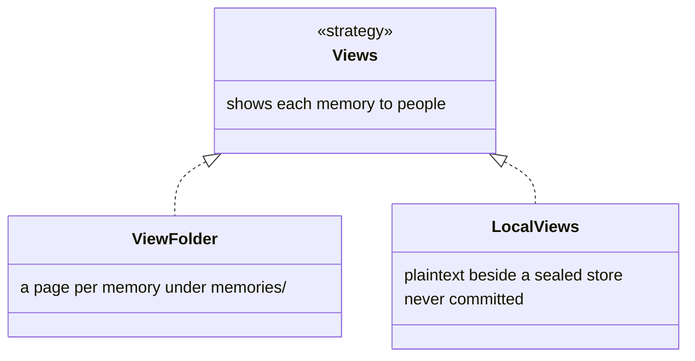

Each strategy interface is a C++ concept, as `BackendPolicy` is for the persistence module, and
the service is `MemoryService<Store, Clock, Views>`: a strategy is chosen at compile time, and a new
one is a new type under `strategy/`, not a flag. `SealedStore` is a template on the store it wraps,
so sealing composes with any backend. The composite commits to the canonical store — the commit
point — and then to the derived one; a derived store that falls behind is noticed at load by its
head and rebuilt. The in-memory store stays buildable, though the black-box tests of §3.5.3 do
not want it.

**Views are a strategy of their own, not part of the Store** (settled 2026-09-23). A *view* is
the page a person reads for one memory — in the files store, `memories/<slug>.md`. It is not the
record: the rows and content objects are, and a view is regenerated from them whenever they
change. Where such a page can go depends on the backend:

| Backend | Where a memory's page goes |
|---|---|
| files store | `memories/`, committed with the store |
| sealed store | a local folder, never committed — a committed page would leak the text the store seals (the leak table below) |
| database store | nowhere: it has no folder to put a page in |

If views were part of the Store, every backend would have to handle them, including the one with
nowhere to put them. So the wiring chooses a `Views` beside the store; the service renders the
page (the `MemoryView` codec) and hands the finished text to it, and no store ever renders or
writes a page.

**Time is a strategy** (settled 2026-09-23). The service asked the store for the time
(`now()`), which made time a storage concern and left a test no way to fix it. The clock is
configuration in the sense of global #9, so it is a template parameter the wiring chooses.

**A strategy is also where encryption belongs** (Debith, 2026-09-17: the backend should be
configurable — "local to be encrypted and file system", a shared one a database — and the code
above it should not know). An encrypting store is a decorator over any other: it takes the bytes a
row and an object are made of, seals them, and hands the ciphertext to the store it wraps. The
service, the snapshot and the vocabulary loader are untouched, and every backend inherits it —
files, a database, whatever is written next. That is stronger than encrypting on the way into git,
which protects one transport and leaves the bytes on disk in the clear.

Three things a content decorator cannot hide, which the design has to answer instead:

| What leaks | Why | The answer |
|---|---|---|
| file names | `memories/<slug>.md` spells a memory's title; `taxonomy/pack-<domain>.yaml` names the domain | views are derived, so an encrypted store keeps them out of what is committed, as local plaintext a person still reads |
| commit messages | the global store's automatic commit names the memory it wrote | a store that is encrypted commits under an opaque message |
| a content digest | content is addressed by the digest of its plaintext, and replay must stay deterministic, so ids cannot depend on a key | fine for prose; a short, guessable secret can still be confirmed by hashing the guess and looking for that digest among the object names, so the rule is that secrets do not belong in memories at all |

### 7.1 What a Store answers for

**The point:** the service has to work with any store — files today, sealed or a database later —
so the store's contract (the `memory_store` concept) must list exactly what every backend has to
do, and nothing that only one backend can. On 2026-09-23 it did neither. It listed 22 operations,
some of them not storage at all (the time, rendering pages); the service called `write_report`,
which the contract does not list; and the adapter called five more that are not in it (`root`,
`problems`, `inventory_ids`, `write_file`, `receipts`). Those five meant the adapter was written
against the files store in particular: a second backend could not be swapped in without changing
the adapter.

The table takes today's operations, grouped by what they are for, and says what becomes of each.
*Stays* means every store must provide it; *leaves* means it moves to `Clock` or `Views`, which
the wiring supplies beside the store (§7).

| What it is for | Operations on 2026-09-23 | In the redrawn contract |
|---|---|---|
| the record | `rows`, `new_rows`, `append`, `next_seq`, `clone`, `lock` | stays: the rows, whose they are, one writer at a time |
| memory text | `put_object`, `object` | stays: content, found by its digest |
| old vocabularies, kept for rerunning receipts | `freeze_taxonomy`, `load_frozen_taxonomy` | stays, as content: the `FrozenVocabulary` codec turns a vocabulary into one content object and back |
| what happened around the record | `append_usage`, `usage`, `append_receipt`, `append_mailbox`, `mailbox`; `receipts` from the adapter | stays; `receipts` joins the contract |
| the vocabulary and the source inventory | `load_taxonomy`; `write_file`, `inventory_ids` from the adapter | stays, as documents: list, read, and replace only if unchanged since read |
| things a person must look at | `problems`, from the adapter | stays, as a type: file, line, what |
| numbering sessions | `next_session` | stays: sessions are numbered per store |
| the time | `now` | leaves, to `Clock` |
| pages for people | `write_view`, `view_text`, `remove_view`, `write_report` | leave, to `Views` |
| where the files are | `root`, from the adapter | leaves the contract: only `FilesStore` has a folder |

### 7.2 From today's code

Where each part of `strategy/files/store.h` goes (§3.1.1 has the classes). Listed so the change
can be made one row at a time, each landing working.

| Today in `store.h` | Goes to |
|---|---|
| `init` | creates the folders the layout names; `.gitignore`, `.gitattributes` and `base.yaml` come from the layout's data, not from literals |
| constructor | sets values only (global #9); "is this a store" becomes an `open()` check; the copy id is made by `LocalState` on first use, under the lock, from randomness it is handed |
| error text naming `oo enact setup` | the store states the fact, "no store at X"; the command line adds the command |
| `root` | `FilesStore` only |
| `clone` | a `CloneId` codec (`c-` and eight hex digits) held by `LocalState`; named `clone_id`, since `clone()` means a copy of the object in C++ and in `PathSet` |
| `problems` | `Problems` |
| `inventory_ids` | `DocumentFolder` over `sources/` and the yaml engine; an inventory that does not parse, has two documents or repeats an id is a problem, not an empty list |
| `write_file` | `DocumentFolder`: replace only if unchanged; which files may be written comes from the layout |
| `taxonomy_files`, `load_taxonomy` | `DocumentFolder` over `taxonomy/`, listed in a fixed order: the directory's own order differs between machines, and a frozen vocabulary written in it differs byte for byte |
| `freeze_taxonomy`, `load_frozen_taxonomy` | the `FrozenVocabulary` codec, which owns the tag `pygim-taxonomy-files-1` (spelled three times today) and checks every length it reads; today a truncated object makes `remove_prefix` run past the end, which is undefined behaviour |
| `rows`, `new_rows`, `append`, `next_seq` | `CloneLog`, over `LineTail`, `DurableAppend` and the row codec |
| `lock` | `LocalState` |
| `put_object`, `object`, `object_path` | `ContentFolder`; the `ab/cdef…` split is its addressing rule |
| `append_usage`/`usage`, `append_receipt`/`receipts`, `append_mailbox`/`mailbox`, `day_file`, `lines_under` | one `DailyLog<Record>`, instantiated three times; the day comes from the record's own `time`, which all three records carry; an unreadable line is a problem, where today it is dropped without a word |
| `write_view`, `view_text`, `remove_view` | the `MemoryView` codec (front matter, CR-LF read as LF) in the service, and `ViewFolder` over `memories/` |
| `write_report` | `ViewFolder` over `reviews/`; it already receives finished text |
| `next_session` | `LocalState`, reading the number with `std::from_chars`; today `1a2` reads as 12 |
| `now` | `Clock`, and a `Timestamp` codec |
| `lock.h`: `write_atomically`, `append_durably`, `read_file` | pathlike's `AtomicWrite`, `DurableAppend` and `file` |

**The adapter.** `adapter/enact_adapter.h` is the pybind layer between Python and the C++
service. Its only job is translation: a Python call into a C++ call, and the result back into
Python values ([00 §8](00_overview.md#8-layering-rules)). On 2026-09-23 it also made decisions of
its own. A decision made there reaches only callers that come through Python: a C++ caller or a
test driving the service directly gets different answers, and nobody can see why. Each moves into
the C++ side, so every caller gets one answer:

| Adapter function | The decision it makes today | Moves to |
|---|---|---|
| `vocabulary` | leaves retired values out; builds the refusal for an unknown dimension | the service's vocabulary answer |
| `heads` | keeps only current memories, removes duplicates, sorts | a query on the snapshot |
| `waiting_acceptance` | what "waiting" means: generalises something, is current, is not yet accepted | a query on the snapshot |
| `coverage_dict` | works out which inventoried documents nothing cites, and cuts the list at 8 | the read's own coverage, with the cut stated in the answer |
| `ingest` | reads a file from disk and parses the corpus | the Python shell reads the file; the service parses the text |
| `hex().substr(0, 12)`, seven times | the short form of a key | one `short()` on the key type |

---

## 8. Laws

| Law | Statement | What breaks without it |
|---|---|---|
| Commit point | a change is visible if and only if its row is durable, and everything the row names was written before it | a crash leaves a row pointing at text that does not exist, and the next load cannot build a snapshot |
| Replay determinism | the same set of rows replays to the same snapshot, whatever order the files were read in | two machines holding the same repository disagree about what a query returns |
| Merge symmetry | merging A into B and B into A produce the same merge row and the same snapshot | the snapshot a receipt names depends on who pulled first |
| Add wins | an unlink removes only associations its row had seen | a colleague's cleanup silently erases a link they never knew existed |
| Forks are shown | a chain with two heads after a merge keeps both findable and is reported | one person's correction disappears on a rule neither person saw |
| Checked where committed | the four checks run against the head the row will follow, not the one the caller read | two sessions on one machine write the duplicate the no-unread-write check exists to prevent |
| Derived is disposable | deleting `local/` and the cache and loading again yields the same `snapshot_id` | a stale cache is quietly believed, and the index is whatever it last remembered |
| Loss tolerance | deleting every usage and receipt file never changes a `snapshot_id` | an observation, which may be lost by design, turns out to have been load-bearing |

---

## 9. Open decisions

### 9.1 Where the repository lives — settled

Anywhere, and found the same way from every worktree. A project may keep its store in three
places, and every command and the MCP server find it in one order: an explicit `--root`;
`$PYGIM_ENACT_ROOT`; `git config pygim.enact`; a `.enact` directory above the working
directory.

| Where | Concretely | For | Against |
|---|---|---|---|
| **An orphan `enact` branch** | a worktree of its own beside the project, `pygim-enact/`, named by `git config pygim.enact` | shared through the project's own remote; independent of code branches, so every worktree on any branch sees one memory; still reviewed in diffs | a second branch to push and pull |
| **A user-level directory** | `~/.local/share/pygim/memory/pygim/` (the platform's user data directory) | nothing in the project's git at all | stays on one machine unless copied |
| Inside the project | `pygim/.enact/`, committed | memories branch with the code they are about | only the branch that carries it has a memory — a project with several worktrees on several branches has several, or none |

`git config` is what makes a store global to a project: the setting lives in the clone's
configuration, which every worktree of that clone shares, so the path one `oo enact setup`
writes is the path every worktree reads — one store for all of them. The server is
registered once, at user scope and without a root, and finds each project's store from the
directory the host starts it in. A consequence for sources (02 §5.2): a store outside the checkout
cannot hold paths relative to itself, so an inventory path is relative to the project's root.

**A store says which checkout it serves.** Citation paths are relative to a project's root (02
§5.2), which a store kept inside the project resolves by itself — one kept beside it cannot, so its
`policy.yaml` names the checkout (`project: ../D-D-2024`), and failing that the convention answers:
`<project>-enact` sits beside `<project>`. A store whose subject is a body of knowledge, with its
own sources and no checkout, needs neither: its paths are relative to itself. Getting this wrong is
not silent — every locator in a drafted pack is reported as missing, which is how it was found.

**Several stores, one repository.** A store's history is its own — an orphan branch, or a
repository made by `git init` — so unrelated stores share a remote without sharing anything else.
In use since 2026-09-17: one private repository holds `memory` (pygim's store), `global` (the
machine's, §9.1.1) and `dnd` (the D-D-2024 store), each a branch. Two consequences worth stating.
A store's remote need not be its project's remote, and for a project whose repository is public it
must not be: pygim's own store would otherwise publish a person's working habits to the world.
And a store may live anywhere, so moving one is only a matter of the paths inside it — the dnd
store moved out of `D-D-2024/.memory` to a directory beside the project, which meant rewriting its
inventory paths from relative-to-the-inventory-file to relative-to-the-project (02 §5.2), the
convention every store made since follows.

### 9.1.1 The global store — settled 2026-09-17

Some knowledge is about no single project: how this person wants an explanation written, how they
want choices laid out. Filed in one project's store it reaches only that project's sessions — and
the projects that need it most are the ones not created yet. So a machine may have one **global
store** beside the project's, found by `$PYGIM_ENACT_GLOBAL`, then
`git config --global pygim.enact.global`, then the default place under the user data directory.

| | Concretely | For | Against |
|---|---|---|---|
| **A second store, layered** (chosen) | `oo enact setup --global`; tools take `scope: global`; standing knowledge merges both, marking the global ones | project stores stay clean and shareable; one write reaches every project, old and new; reads stay project-scoped, so ranking and `#n` stay simple | two places to write to, so the rule *`domain=any` belongs in the global store* has to be taught |
| One store for everything | every project's git config points at the same store | nothing new to build | one history for unrelated projects, and no project's store can be handed to anyone |
| Copy preferences into each store | an export/import command | each store self-contained | copies drift; superseding one leaves stale twins |

Reading stays per store: a `#n` numbers memories within one store, so an agent reads a scope before
writing to it. Where the two disagree, the project's memory is the nearer rule, and standing
knowledge lists the project's last.

### 9.1.4 Which stores a session can name — settled 2026-09-17

A subject is not a project. Domain-driven design, or any body of practice, is applied *inside*
projects and belongs to none of them; it may also be something several people contribute to. So a
store is the unit of sharing, and a session may name more than one.

Nothing is configured (Debith, 2026-09-17: "we need to support dynamic discovery of packs, for
scope, etc. No point adding manually"). A store declares its name in its `policy.yaml`, or takes it
from its directory with a trailing store suffix dropped, and the machine's stores are found where the
conventions already put them: the project's own (`project`), the global one (`global`), whatever
sits in the user data directory, and the `<name>-enact` directories beside the project — which is
where a store lives when it is deliberately kept out of the project it serves. `session` lists
them; `scope` names one; an unknown name is refused with the list of what there is.

| Option | Concretely | For | Against |
|---|---|---|---|
| **Discovery by convention** (chosen) | a store is a scope the moment it is checked out beside a project | nothing to declare, nothing to keep in step; a store cloned from a shared repository just appears | a directory name becomes an interface, so two stores of one name need distinguishing |
| A mount file per project | `mounts.yaml` naming each store | explicit, and can pin a version | one more file to maintain, and it goes stale exactly when a store is added |

Three limits, on purpose. A read answers from one store: ranking compares scores from one
vocabulary, and `#3` means different memories in different stores, so a merged ranking is a design
problem this does not need yet. Standing knowledge still comes only from the project's store and
the global one — a discovered store's `kind=preference` memories are *not* injected into a
session's instructions, because that would let whoever contributes to a shared store write
instructions into every session that has it. And a write to a named store follows that store's own
policy, so a community store is not published by the contributor.

What this makes possible next: a repository of stores, one per branch, is a distribution channel —
`oo enact stores --remote` already lists the branches this machine has not checked out.

### 9.1.2 How a write leaves the machine — settled 2026-09-17

A store says in its own committed `policy.yaml` how its writes travel: `sharing` (project,
personal, community) and `push` (auto, manual). A store without the file is a project's, published
by hand, which is how every store made before this behaves.

| Store | An agent writing to it | Leaving the machine |
|---|---|---|
| a project's | writes freely | a person commits, as before |
| personal global (`push: auto`) | writes freely | committed at once, and pushed when a remote exists |
| community (`push: manual`) | writes to that person's clone only | a branch and a pull request; the owners merge |

The policy is committed, so a clone of a shared store arrives knowing not to publish on its own —
a guard rail, not a lock: what stops a stranger's write is the remote's permissions. Debith, 2026-09-17:
"automatic push, yes. However, if there is a community based memory store, it should be manual (owners)."

Propagation then needs nothing new. A write is committed and pushed; another machine pulls; the
audit files are append-only, one per clone, merged by union, and divergent histories are joined by
a merge row at open (§5). Two machines writing different preferences merge silently; two editing
the same one produce a forked chain, which is reported for a person to merge rather than resolved
by the loser's work disappearing.

What each kind of session sees, and when:

| Who | How it reaches them | Delay |
|---|---|---|
| the session that wrote it | the write's own result | none |
| another session on this machine, already open | its next memory call carries `standing_changed`, naming the preferences added or gone | that session's next call |
| a new session anywhere on this machine | standing knowledge, read at the server's start | at once |
| another machine | `git pull` of the global store | that machine's next session |

Two gaps stay open. A session already running on another machine keeps its standing knowledge until
it restarts, since nothing tells it to pull; and a session whose agent never calls a memory tool
never sees `standing_changed`, because there is no result to carry it.

### 9.1.3 Reloading a server into new code — settled 2026-09-17

Data reaches a running server by itself: rows are caught up per call, and a changed vocabulary
reopens the store. Its own code cannot — the process has imported what it imported, and the
extension cannot be imported twice — so a server upgraded underneath keeps serving the old
behaviour until someone reconnects it by hand (field report §7.5).

| Option | Concretely | For | Against |
|---|---|---|---|
| **Re-exec between messages** (chosen) | `oo enact reload` marks the store; the server sees the marker after answering, and `execv`s itself | exec keeps the file descriptors, so the host's pipes and the session survive; nothing is half-answered; the session number travels in the environment, so the audit log does not split | the call in flight still runs the old code; broken code on disk becomes a server that will not start |
| Reload the modules in place | `importlib.reload` | no new process | the compiled extension cannot be reloaded at all, so only half the server would move |
| Report only | a `server_stale` note in results | nothing can go wrong | every upgrade costs a person a reconnect |

Both are built: a result says `server_stale` once when the files on disk have moved on, and
`oo enact reload` asks the servers to act. The ask is a `local/reload` marker in this project's
store and the global one, which a server checks between messages. SIGHUP does the same and reaches
servers on other projects, but only with `--signal`: a server older than this feature has no
handler, and SIGHUP's default action is to exit. After reloading, the new process sends
`notifications/tools/list_changed`, so a host that watches for it re-fetches the tool schemas —
the other half of §7.5, where a cached schema silently dropped a new parameter.

### 9.4 Encryption at rest — open, direction chosen 2026-09-17

Debith: "I would not want to publish all my hard worked information freely. That data is more
valuable than code... I need to ensure that whatever is pushed to git, is encrypted." Three stores
are now pushed to one private repository, in the clear; private is not encrypted, and the threat
worth naming is not only a stranger but any host, backup and future reader of that repository.

| Option | Where the cipher sits | For | Against |
|---|---|---|---|
| **An encrypting store strategy** (direction) | a decorator over any backend (§7) | what reaches disk, git, a database or a backup is already sealed; one implementation covers every backend | the files stop being readable in place; key handling becomes ours |
| git clean/smudge filter (git-crypt, or our own) | outside the code, in git's config | nothing in the store changes | plaintext on disk; a machine that has not configured the filter commits in the clear; a database backend gains nothing |
| A private remote only | nowhere | done, and it removed the public exposure | anyone with repository access, and the host, read everything |
| Whole-disk encryption | the operating system | free, protects a stolen laptop | protects nothing once a store is shared or pushed |

What still has to be decided: where a key lives and how a second machine gets it; whether a store
is encrypted whole or a memory can be marked sensitive; what `oo enact` shows when the key is
absent (refuse to open, or open the metadata only); and the guard — a store that says it is
encrypted must make it impossible to commit plaintext by mistake, which means a check before the
commit, not a convention. Two consequences to accept in advance: losing the key loses everything
pushed, and reviewing a change as a diff stops working outside the machine that holds the key.

### 9.2 Whether head views are committed (11)

| Option | Concretely | For | Against |
|---|---|---|---|
| **Committed** (drafted) | `memories/frost-ward-typed-resistance.md` changes in the same commit as the row that superseded it | the review happens where people already review — the diff | two people superseding one chain conflict in the view file; either side can be taken, since the next load regenerates it, but git still stops to ask |
| Generated into `local/` only | nothing under `memories/` in git | no generated file ever conflicts | the diff shows JSON rows and object hashes, which no one reviews |

### 9.3 When orphan objects are collected (03)

| Option | Concretely | For | Against |
|---|---|---|---|
| **Never automatically** (drafted) | `memory gc` lists objects no row names and removes them on request | nothing is deleted by surprise; orphans are rare — only a crash between object and row makes one | a repository that crashes often keeps a few kilobytes it does not need |
| At every load | objects no row names are removed before the snapshot is built | always tidy | an object written by another session that has not yet appended its row would be deleted under it |
