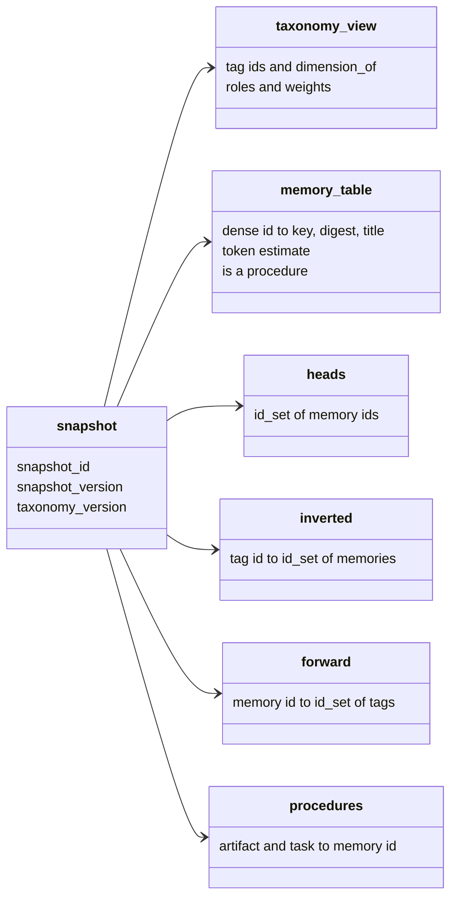
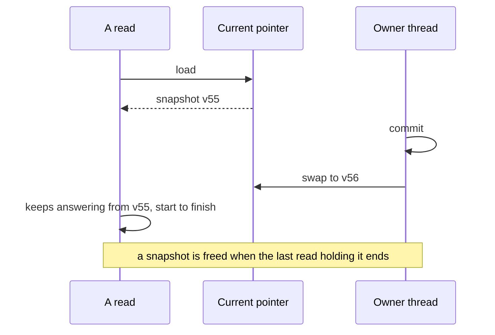
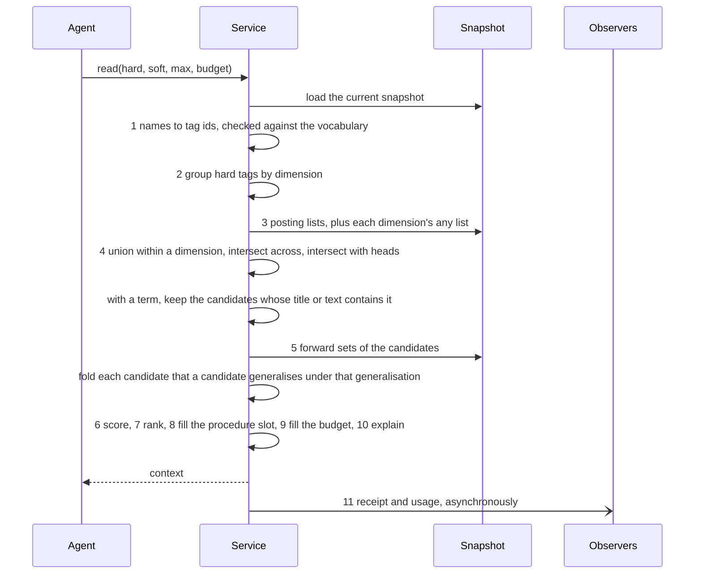
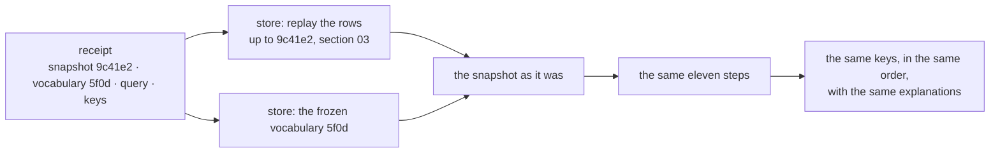

# ENACT — Technical Specification

**Section 04: Index and retrieval**
Status: draft · Owner: Debith · Last updated: 2026-09-11

The snapshot every read answers from, how a new one is published without stopping readers,
and a read from the first tag to the receipt it leaves. Section 01 fixed the types and the
arithmetic; section 03 fixed what the snapshot is built from. This section is the part the
prototype's demo and evaluation test, and it must reproduce them.

| Scenario | What it needs from this section |
|---|---|
| [0 — starting up](00a_how_a_memory_is_made.md#scenario-0-starting-up) | building the snapshot from replayed rows |
| [2.1 — no memory yet](00a_how_a_memory_is_made.md#scenario-21-no-memory-yet) | an empty candidate set, and an empty procedure slot |
| [2.2 — a similar spell](00a_how_a_memory_is_made.md#scenario-22-a-similar-spell-already-has-memories) | scoring, the tie, the procedure placed first |
| [2.3 — a variant](00a_how_a_memory_is_made.md#scenario-23-a-variant-of-a-spell) | the candidate set the no-unread-write check compares `seen` against |
| [3.1 — a neighbouring space](00a_how_a_memory_is_made.md#scenario-31-the-right-note-is-in-a-neighbouring-space) | softening a dimension, and why the procedure slot empties when it is softened |
| every scenario | the receipt, and rerunning it |

It also settles five questions left open earlier:

| Left open in | Question | Settled as |
|---|---|---|
| overview §10 | wildcard or multi-tagging for "applies to every value" | a reserved `any` value, hard dimensions only (§3.2) |
| overview §10 | scoring a soft dimension the memory does not match | neutral (§3.4) |
| 01 §11.2 | a query's hard tags: one set or per dimension | one set, grouped at query time (§3.1) |
| 01 §11.5 | what breaks a tie | the dense id (§3.5) |
| overview §10 | several procedures for one artifact and task | the earliest is placed; the others rank, and the pair is flagged (§3.6) |

---

## 1. The snapshot



| Part | What it answers | Built from |
|---|---|---|
| `taxonomy_view` | which dimension a tag answers, its weight, its default role | the taxonomy files (02) |
| `memory_table` | a dense id's key, digest, title, token estimate, whether it is a procedure | write, ingest and merge rows (03) |
| `heads` | which memories are findable | lineage in the same rows: a memory superseded or retired leaves the set |
| `inverted` | which memories carry a tag | association rows, replayed with add-wins (03 §5) |
| `forward` | which tags a memory carries | the same rows, the other way round |
| `procedures` | the head procedure for an artifact and task | memories in `heads` tagged `kind=procedure` |

Counters are not in the snapshot. They rise on every read, which no snapshot version pins, and
a ranking that depended on them could not be rerun (01 §3.1). They live with the statistics
observer and are shown, never ranked on.

### 1.1 Postings over every memory, masked by heads

| Option | Concretely | For | Against |
|---|---|---|---|
| **All memories, masked** (chosen) | `inverted[purpose=defensive] = {2, 3, 6}` still holds retired \#3; candidates are intersected with `heads` at the end | a supersede changes one word in `heads`, not every posting list the old memory was in | one more intersection per read |
| Heads only | superseding \#3 removes it from every list that holds it | nothing to mask | a supersede touches as many lists as the memory has tags, and a rerun at an older snapshot needs the lists as they were |

The masked form is also what makes a rerun cheap: the snapshot at an older head differs from
today's mostly in `heads`.

---

## 2. Publishing a snapshot

Readers never wait for a commit. The current snapshot is one `std::shared_ptr<const snapshot>`
behind a mutex that guards nothing but the pointer copy; a read takes its copy once and uses that
snapshot from its first step to its receipt, whatever is committed meanwhile. Only a commit
builds the next snapshot and swaps the pointer (principle 13). The mutex stands where
`std::atomic<std::shared_ptr>` would, because libc++ — the macOS standard library — does not
implement the atomic form; the cost is one uncontended lock per read.



**Building the next snapshot copies only what changed.** Each posting list and each memory's
tag set is held behind its own `shared_ptr<const id_set>`, and the memory table is a vector of
shared fixed-size chunks. A write that tags a new memory with nine tags copies nine posting
lists, one chunk of the table and the `heads` set, and shares everything else with the
snapshot before it.

| Option | Concretely | For | Against |
|---|---|---|---|
| **Copy what changed** (chosen) | \#56 with nine tags: nine lists copied, forty-four shared | a commit costs in proportion to what it changed | the shared structure is more code, and needs a test that it equals a full build |
| Rebuild on every commit | replay every row into a fresh snapshot | one code path, the same one startup uses | a commit costs in proportion to the whole corpus |

Startup always builds in full; every later snapshot is built incrementally and must equal the
full build of the same rows — a law checked by test (§5).

---

## 3. A read, step by step



### 3.1 Tags and dimensions — steps 1 and 2

Every name in the query is looked up; an unknown one is refused with the vocabulary's nearest
entries, and a retired one with its replacement (02 §3.3). A read must name at least one hard
tag: a query with no hard tag admits every head, which is the unrestricted retrieval the whole
design exists to avoid (G5).

Hard tags stay one `id_set`, as section 01 drafted, and are grouped by `dimension_of` at the
start of each read. Grouping costs one array lookup per hard tag — a handful per query — and
keeps one shape for everything a query holds and a receipt records. The per-dimension array
remains the fallback if a benchmark ever shows the grouping in a profile.

### 3.2 Candidates, and `any` — steps 3 and 4

For each hard dimension, the union of the query's values' posting lists; across dimensions, the
intersection; and finally the intersection with `heads`.

Some knowledge applies to every value of a hard dimension — *every reaction spell needs an
unambiguous trigger* holds whether you are designing, critiquing or balancing.

| Option | Concretely | For | Against |
|---|---|---|---|
| **A reserved `any` value** (chosen) | the memory carries `task=any`; a query for `task=balance` finds it through `inverted[task=any]` | a value added to `task` next year — `playtest` — finds it too; the explanation says *matched task=any* | an agent may reach for `any` when it means *most*; the codebook entry's `when_not` says so, and a memory included often but rarely useful shows it in the counters |
| Multi-tagging | the memory carries `task=design`, `task=critique`, `task=balance` | no special case anywhere | the day `task=playtest` is accepted, every "all tasks" memory silently stops answering it |

`any` is interned in every hard-by-default dimension when the vocabulary loads, with a generated
codebook entry. It exists for memories only: a *query* naming `any` is refused, because "must
answer this question somehow" is a different request that nobody has needed. The refusal says
what to do instead — name the value the work is — because the first field report (D-D-2024,
2026-09-15) showed an agent reaching for `task=any` when reference facts did not depend on the
task: those facts should carry `task=any`, and then any task in the query finds them.

The refusal has one exception, and it is forced: a dimension may offer nothing *but* `any`. A store
initialised from the base vocabulary has only `domain=any` and `artifact=any` until a pack lands,
and the machine's global store stays that way for good, because nothing in it is about one project
or one kind of thing. Refusing `any` there leaves the dimension unqueryable — a new store cannot be
read on two of its three hard dimensions, and the global store cannot be read on `domain` at all.
So `any` is nameable exactly when it is the only live value its dimension has, and the procedure
slot reads it the same way: `artifact=any` anchors a slot there and nowhere else. The two rules
have to agree, or a query that is accepted would return no procedure.

And `any` never
scores — in a query that softens its dimension it simply does not match — or generic memories
would outrank specific ones on every read.

### 3.3 Scores — step 6

For each candidate, the soft score is the sum of the weights of the dimensions its matched soft
tags answer, in milli-units (01 §3). With a ranker configured (06), its score arrives in
micro-units and the final score is

```text
final = soft_score × 1 000 000 + semantic_weight × semantic_score
```

in units of 10⁻⁹, with `semantic_weight` in milli-units — two integer products and a sum, no
division, no rounding. With the seed weights the smallest soft step is 500 milli-units, which is
500 000 000 in these units, while a ranker at weight 1.0 contributes at most 1 000 000 000: the
semantic score can reorder within a tier and move a memory up at most two of the smallest soft
steps. That is the prototype's rule, *the semantic stage mostly reorders within a tag tier and
can never admit a memory that failed the hard filter*, made exact.

### 3.4 A soft tag the memory does not carry

Settled as **neutral**, the overview's leaning: a missed soft tag scores zero, whether the memory
carries another value in that dimension or none. The two reasons that decided it are the ones the
overview gave — adding a tag can never lower a rank, so LEARN stays safe to run unattended (G6),
and knowledge that is silent on a question is not punished for being general. The miss is still
recorded in the explanation (`soft_missed`), so the day an evaluation shows contradiction ties
near the top, miss scoring is a change to step 6 alone.

### 3.5 The rank, and what breaks a tie — step 7

The key is 01's: negated final score, negated soft hits, dense id. The id is what breaks a tie,
and 01 §11.5 asked whether usage counters should instead. They should not, for the reason
section 01 §3.1 found: counters are not pinned by any snapshot, so a counter tie-break would make
yesterday's receipt return today's order. The dense id is assigned in replay order, so within one
snapshot it is creation order — an older memory wins a tie, which is at least a reason a reader can
see.

### 3.6 The procedure slot — step 8

| The query's hard tags | The slot |
|---|---|
| exactly one `artifact` value and one `task` value, and a head procedure exists for the pair | that procedure, placed first and removed from the ranked list |
| the pair has no procedure | empty — Scenario 2.1's cue to derive one |
| two artifact values, or `task` softened | empty, and the explanation says why: the pair is not determined |
| two head procedures for the pair — two chains, or a fork after a merge | the earlier by dense id; the other ranks normally, and a review item says the pair has two |

Two procedures for one pair is a duplicate by definition — a procedure is *the* way a thing is
done — so it is a recollection failure to be merged, not a choice for the retriever to make well.

### 3.7 The budget — step 9

The procedure goes in first, and its tokens count. Then the ranked matches in order: one that
does not fit the remaining budget is skipped and the walk continues, so a short memory further
down may still fit; the walk stops at `max_memories`. If the procedure alone exceeds the budget it
is still the context, alone, with `over_budget` set — a procedure is never cut, and the caller
learns that its budget is smaller than the domain's way of working. A memory's token estimate is
the prototype's: its content length in bytes over four, at least one.

### 3.8 Explanation, receipt, usage — steps 10 and 11

Each selected match carries the tags that admitted it, the soft tags matched and missed, and
every term of its score (G2). The rest of the candidate list is summarised rather than listed —
the field report's reads returned up to 135 skipped entries that the agent only ever counted:

| Field | What it says | What the agent does with it |
|---|---|---|
| `skipped` | how many ranked candidates were not placed, for `max` or the budget | raises `max` or the budget, or narrows the read |
| `budget_dropped` | how many of those the budget had no room for, though `max` had room | tells an empty or short context caused by the budget from one caused by an empty store — the A/B's twelve-tokens-too-big case (field report §7.4) |
| `facets` | for each tag among the candidates, how many carry it — leaving out tags every candidate carries, but always naming the query's soft tags, even at 0 | sees before reading again whether a soft tag can match at all (`pillar=combat: 0`), and which values would split the list |
| `coverage` | the documents the candidates cite and how many cite each; how many cite nothing; the inventoried documents none of them cites | when nothing placed answers the question, goes to the uncited documents instead of trying another tag combination |
| `next` | a reminder to report each memory with `learn` — `useful`, `not_needed` or `misleading` — since a read records what it *gave*, never what that was worth |
| `standing` | the `kind=preference` candidates that were ranked but not placed — key and title, not text, and no budget | reads them with `show` before advising. With no soft tags a rank is age (§3.5), so the newest preference is last and `max` cuts it: the one a reader is least likely to know already |

A write that changes a memory — `remember`, `link`, `unlink`, `retire`, a promoting `learn` —
answers with the memory's tags and whether it is a head, as the change left them, so confirming it
takes no `show`. The receipt — snapshot id, taxonomy version, the query by name, the
keys returned, the time — and one usage record per candidate admitted and per memory included
leave through the event bus to the query logger and the statistics observer, after the context has
been returned. A slow disk delays the log, never the agent.

### 3.9 Folding a generalisation's instances — between steps 5 and 6

A generalisation (overview §4.11) states the point its instances share, so placing both would
spend the budget saying one thing several times. After step 5, every candidate one of whose
`generalised_by` is also a candidate *and accepted by a person* (overview §4.11) is taken out of the list that will be scored and named
under that generalisation as `evidence` — its key and title, not its text. An instance of two
candidate generalisations is named under each. The procedure slot is never folded.

| Candidate | Placed | Named |
|---|---|---|
| a generalisation, accepted, and a candidate | ranked and budgeted like any match | its folded instances, under it |
| a generalisation waiting for acceptance | ranked and budgeted like any match | nothing — its instances are placed on their own |
| an instance whose generalisation is a candidate | not scored, not ranked, not budgeted | under that generalisation |
| an instance whose generalisation is retired, or outside this query's hard tags | ranked as usual | — |

The fold comes before scoring, so it depends on neither the ranks nor the budget: ranks run
without gaps, the evidence is included or skipped together with its generalisation, and a rerun
folds exactly as the first read did. A folded instance still counts among the `candidates` and is
admitted; `folded` says how many were named rather than placed.

### 3.10 A term — between steps 4 and 5

Tags say what kind of problem a memory answers, not what it is about: in the field report, 138
glossary rules shared the same hard tags, and "invisible", "mounted" and "Animal Handling" —
the subjects of the questions — could not be tags. A read may carry a `term`: after the hard
filter, only candidates whose title or text has it stay candidates.

A match is at the **start of a word** — the start of the text, or after a character that is neither
a letter nor a digit — and ASCII case is ignored. So a term behaves as a stem, `mount` finding
*mounted* and *mounts*, while not matching inside a longer word: plain substring matching had
`mount` return Damage Threshold, Prone and Speed, all for the word *amount* (field report §7.3).
A term of several words matches that phrase as written.

One limit follows from the rule: a stem does not reach a **prefixed** word. `visible` does not find *Invisible*, though `invisible` finds it five times. Of nine stems probed against the D-D-2024 corpus only that in-/un-/non- shape lost a match, so the answer is guidance, not a looser rule: query the word as a source writes it, not the shortest stem — which is also what avoids the *amount* false positives above (field report §7.8).

| Option | Concretely | For | Against |
|---|---|---|---|
| **A filter after the hard tags** (chosen) | `read(hard=[domain=dnd, artifact=rule, task=explain], term="invisible")` places Invisible, Hide and the senses that see through it | one read decides; the hard tags still decide what may answer, so G5 holds; content never changes, so a rerun keeps the same matches | a word the memory does not use is missed — a synonym is not a match |
| A lexical score | matches rank above non-matches | nothing is hidden | similarity to the prompt becomes a ranking signal, which the whole design exists to keep out |

The term narrows everything after it — the fold, the ranking, the budget, `facets`, `coverage` —
but not the procedure slot, which answers the artifact and the task, not the subject. `candidates`
still counts what the hard tags admit, and `term_matched` how many of those the term kept. The
term is part of the receipt.

---

## 4. Worked, end to end

Scenario 2.2's read, at snapshot v4, with a budget of 600 tokens:

```text
query   hard   domain=dnd  artifact=spell  task=design
        soft   purpose=defensive  action_economy=reaction  mechanic=damage_mitigation  tier=mid
        max 8, budget 600
```

| Step | Result |
|---|---|
| 1–2 | hard grouped as domain {dnd}, artifact {spell}, task {design} |
| 3–4 | domain ∩ artifact ∩ task = {1, 2, 3, 4}; ∩ heads = {1, 2, 3, 4} |
| 5–6 | \#2: 2000 + 1500 + 1000 + 1000 = 5500 · \#3: the same, 5500 · \#4: tier=mid 1000 · \#1: 0 |
| 7 | \#2 (−5500, −4, 2), \#3 (−5500, −4, 3), \#4 (−1000, −1, 4), \#1 (0, 0, 1) |
| 8 | one artifact, one task, and \#1 is the head procedure for (spell, design): slot = \#1, taken out of the ranking |
| 9 | \#1 180 tokens · \#2 95 · \#3 110 · \#4 240 would make 625 > 600, skipped · total 385 |
| 10–11 | context: \#1, then \#2, \#3; receipt names v4's id, the vocabulary digest, the query, and the three keys |

\#4 — the corruption note — was a candidate, because it answers every hard question, and was not
included, because it matched one soft tag and did not fit. Both facts are in the explanation, which
is what G2 asks for.

---

## 5. Rerunning a receipt



Nothing a read depends on is missing from that picture: the rows are canonical, content is
immutable — so a term matches the same memories on every rerun — the vocabulary version is
frozen, and every number is an integer. This is also how the
prototype's evaluation becomes a test — each of its queries, run once, leaves a receipt, and the
C++ implementation is correct when it reruns every receipt to the prototype's answer.

---

## 6. Laws

| Law | Statement | What breaks without it |
|---|---|---|
| Candidates are heads | no retired or superseded memory is ever a candidate | a corrected note and its correction both answer, and the reader cannot tell which is current |
| Candidate algebra | union within a dimension, then intersection across, equals 01's candidate rule | the index and the rule disagree, and only a full scan could tell |
| `any` is exact | a memory carrying `d=any` meets every hard value of `d`, and `any` never adds to a score | generic knowledge either vanishes from new values or outranks specific knowledge everywhere |
| Exact score | the final score is the integer formula of §3.3, evaluated without division | two processes rank the same candidates differently |
| One slot | the procedure slot holds at most one memory, it is the head procedure for the query's single artifact and task, and it is not repeated below | a context opens with the wrong way of working, or with two |
| Budget kept | the selected memories' tokens fit the budget, or the context is the procedure alone with `over_budget` set | a caller's budget is quietly exceeded, or its procedure quietly cut |
| A term only narrows | a read with a term places a subset of what the same read without it would admit, and its procedure slot is the same | a word in the prompt admits a memory the hard tags exclude, and retrieval by similarity is back |
| Fold before rank | a non-slot candidate is placed iff no accepted candidate generalises it, decided before scoring | a context spends its budget repeating a pattern case by case — or the fold depends on the budget, and two budgets disagree about which memories count |
| Immutable once published | a published snapshot never changes | a read sees half a commit |
| Incremental equals full | the snapshot built by copying what changed equals the one a full replay of the same rows builds — tested, since it is a property of two code paths | a long-running service slowly diverges from the one that just restarted |
| Rerun identity | rerunning a receipt returns its keys, order and explanations exactly | the reproducibility of 01 §3.1 is a claim, not a property |

---

## 7. Open decisions

### 7.1 What "admitted" records (09)

| Option | Concretely | For | Against |
|---|---|---|---|
| **One usage record per candidate** (drafted) | a read with 40 candidates writes 40 `admitted` records | the counter means exactly what G12 says | a broad read in a large corpus writes thousands of records nobody reads one by one |
| A count in the receipt, per-memory records only for those included | the receipt says *40 admitted*; 3 `included` records | observations stay proportional to what the agent saw | *times admitted* per memory must be recomputed from receipts when anyone asks |

### 7.2 Memory-to-memory edges, one hop (04, later)

| Option | Concretely | For | Against |
|---|---|---|---|
| **Not in v1** (drafted) | only `supersedes` exists; the yardstick is found because it carries the same tags as the note that relies on it | nothing enters a context except through the tag rule | a note that says *see the yardstick* cannot pull it in when the yardstick is tagged differently |
| Typed edges with one hop | \#6 `relies_on` \#2; a context with \#6 may add \#2 after the ranked matches | the knowledge graph the prototype hinted at | a second admission path beside the hard filter, which G5 exists to keep single |

### 7.3 Posting lists at scale (04, when measured)

| Option | Concretely | For | Against |
|---|---|---|---|
| **`id_set` as it is** (drafted) | a bitmap plus insertion-ordered members per tag | already built, measured, and proven in the mapping toolkit | a rare tag in a very large corpus spends a bitmap on a handful of ids |
| Compressed bitmaps for rare tags | a sorted array under some density, a bitmap above it | memory proportional to the ids held | a second representation inside every set operation; decided only when a benchmark under `benchmarks/` shows the need |
