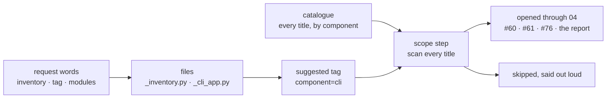
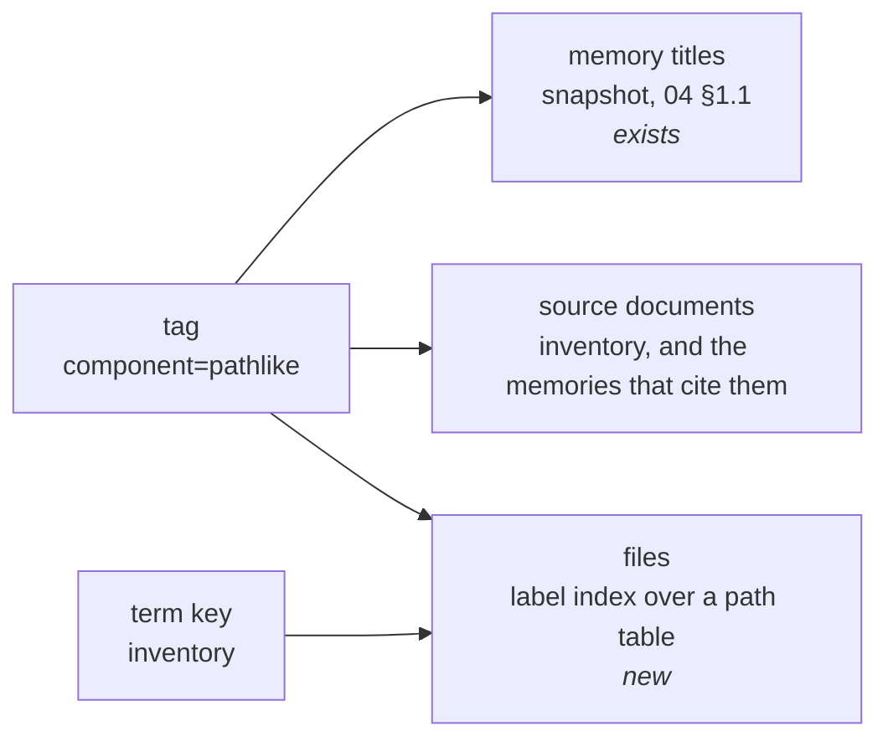
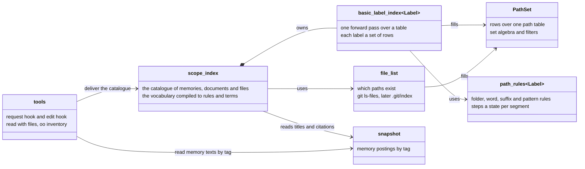

# ENACT — Technical Specification

**Section 05: The scope index — a catalogue of what the project knows, scanned before anything is read**
Status: draft · Owner: Debith · Last updated: 2026-09-25

Section 04 reads content: given hard tags, the memories that answer, ranked, explained and
receipted. This section is the layer before it. It is a **catalogue** of everything the project
knows, sorted by the vocabulary and built on the fly: every memory and source document by title,
and every file by path. A session scans the whole catalogue, then reads what bears on the request
through 04. That is progressive disclosure, as the report asks for it (report §4): titles first,
texts only when opened.

| | 04 Index and retrieval | 05 The scope index |
|---|---|---|
| Question | given hard tags, which memories answer, and in what order? | what does the project know at all, and where? |
| Holds | memory postings, in a versioned snapshot | a catalogue: memories and source documents by title, files by path, each under its tags |
| Built | from the audit log | on the fly, from the snapshot, the source inventory, the file list and the live vocabulary |
| Gives back | memory texts, ranked, with a procedure and a receipt | titles and paths only; nothing is read until the agent opens it through 04 |
| Words | a `term` filter, after the hard tags (§3.10) | term keys that find a file among thousands; memories need none, because every title is listed |
| Arithmetic | union within a dimension, intersection across (§3.2) | the same, over path rows |

One design goal has to be read more precisely, and that is the owner's call (§6.1). G5 says
nothing outside the hard problem space may enter the context. Read literally, that forbids a
catalogue of every title: the catalogue is delivered into the context, and most of its titles
lie outside any one request's hard problem space — and a catalogue of every title is what #101
decided. The recommended reading is that G5 governs
content: a memory's text enters only through a read with hard tags, while a title in the
catalogue is a pointer. Without the catalogue this section cannot find what it exists to find
(Scenario 1).

The catalogue is built on the fly from the files as they are, by C++ over PathSet, and keyed by
the vocabulary, so a file sits under the same tags as a memory. Decided on 2026-09-25 (project
memory #101, which replaced the open question #100). The direction is the report's context
selection: classify before retrieving (report §4.1, §13 step 2), without over- or
under-selecting (§15).

| Term | Meaning |
|---|---|
| request scope | Everything already known that bears on one request: the memories, source documents and files the agent opens after scanning the catalogue. |
| catalogue | Every memory and source document by title, and every file by path, each under its tags: what the project knows, before anything is read. |
| index entry | One thing the catalogue lists: a memory, a source document, or a project file. |
| index key | What an index entry is filed under: a vocabulary tag such as component=pathlike, or, for a file, a term key. |
| term key | An open word a file answers to: its stem, a word of its path, a command it defines. It finds one file among thousands; memories need none, since every title is listed. |
| label index | The PathSet extension: one pass over a path table that sorts its rows under labels, each label a set of rows. |
| tag rule | What places a file under a tag: its folder, a word of its path, its suffix, a pattern, or a tag written in the file. |
| inherited tags | The tags a row of the path table takes from its folder. |
| own tags | The tags a row's own segment adds: a path word, a suffix, a pattern that ends there. |
| scope step | The first step of every request: scan the whole catalogue, name the request's tags, open what bears, say what was opened and what was skipped. |
| delivery channel | A moment at which something reaches a session unasked, or a tool result it asked for. |

**Why it exists.** On 2026-09-25 a session answered two questions about `oo inventory` without
finding three things. The first was the proposal made about it the day before, which lived only
in a transcript. The second was the research report that sets the direction. The third was three
memories that bore on it (#60, #61, #76); they surfaced only when `remember` refused to write
until they had been read. The discovery step lived inside each procedure, and a procedure
reaches a session only when the request's words match its `asked` words. "How does oo inventory
work now?" matched no procedure's words, so no procedure — and with it, no discovery step —
arrived.

Two of those misses are for this section to fix, and they are its acceptance test (§7, iteration 3):
the three memories and the report. The third, the proposal, was never stored, so no index could
have found it. It is fixed where it happened: iteration 3 makes the design procedure record a
discussion that ends undecided.

---

## Scenario 1 — A question whose answer lies under another component

```gherkin
Given a session on pygim, and the request "Is this inventory sufficient? Should we tag the modules?"
And the catalogue in the session's context: every memory title of the project and global stores,
      and the 15 source documents, under their components — about 8 KB
When the request is submitted
Then the request's words find src/_pygim/_inventory.py, tests/unittests/test_inventory.py and the
      command `oo inventory` in src/_pygim/_cli/_cli_app.py, which suggest component=cli
And the scope step has the agent scan every title, not only those under component=cli
And the agent opens #60, #61 and #76 under component=memory, and the report they cite
And the answer says which entries it opened and which it skipped
```



What the request needed lay under a component its own words never reach. The suggested tag is
where the agent starts, not where it stops.

| | Today | Tags of the request's files only | The whole catalogue |
|---|---|---|---|
| #60, #61, #76 (component=memory) | seen only when `remember` refused to write | not listed: the files give component=cli | listed |
| the report | not opened | not listed: only component=memory memories cite it | listed as a source document |
| cost | — | ≤ 1.5 KB a request | ~8 KB once a session, and ≤ 1.5 KB a request |

The middle column is an earlier draft of this section, measured on 2026-09-25: a read with
component=cli returns nine memories, and none of #60, #61 or #76. Titles rather than texts is
measured too: the same read, with a 1,500-token budget, returned four texts in full and dropped
the other five, while the titles of all nine together take a few hundred bytes.

## Scenario 2 — A file its path does not place

```gherkin
Given src/_pygim/_inventory.py, which no folder and no path word places under a component
When the index is built
Then the file is listed under "no component": a finding, not a silence
And a tag line in the file places it:  # enact: component=cli component=memory
And the next build finds it under both, with nothing else to update
```

Measured on 2026-09-25: 79 of the 279 tracked files are in that list (tests 25, src 21,
.github 14, benchmarks 11, the root 8). They are what the practice of tagging code is for
(§6.5).

## Scenario 3 — Before an edit

```gherkin
Given the agent is about to edit src/_pygim_fast/pathlike/adapter/pathset.h
When the edit hook fires
Then the index gives the file's tags: component=pathlike (the folder of pathlike's manifest),
      layer=adapter (a path word), language=cpp (the suffix)
And the memories in that space are delivered, as triggers.yaml delivers them today,
      with no pattern written for the file
```

## Scenario 4 — The layout changes

```gherkin
Given a new extension folder src/_pygim_fast/testing/ with its manifest ext.testing.toml
And the vocabulary accepts component=testing citing that manifest (proposed by #54)
When the next request is made
Then the build places every file in the folder under component=testing
And nothing was stored that now needs updating
```

The index is derived, so it cannot rot. What stays stored, the judgements in memories, is the
open part 2 of #101.

---

## 1. What the catalogue holds

Every entry is filed under the vocabulary's tags, so memories, documents and files sort into the
same groups. Only files are new to index: memories keep the postings they have in 04's snapshot.



| index entry | Filed under | Listed in the catalogue | Built from |
|---|---|---|---|
| memory | its own tags | always, by title | the snapshot (04 §1.1) |
| source document | the tag rules, like any file, and the tags of the memories that cite it | always, by title and path | `sources/inventory.yaml` and the snapshot's citations |
| project file | the tag rules | as a count under each tag; by path when the request's words find it or the agent asks | the file list and the label index |

Memories and source documents are few enough to list whole. The titles of the project and global
stores and the 15 documents come to about 8 KB. Files are not few: 279 here, 20,000 in the testing
corpus. So the catalogue counts them under each tag, and their term keys find the ones a request
names. A source document is a file the inventory names, so it is a row of the file postings with a
mark, not a fourth kind of entry.

## 2. Where a file's tags come from

Every rule that matches contributes its tags, and the union is the file's space. That is the
rule `triggers.yaml` already states. No rule removes a tag.

| tag rule | Example | On pygim, 2026-09-25 (Python prototype, 279 files, 4.1 ms) |
|---|---|---|
| a value's own source folder | component=pathlike cites `src/_pygim_fast/pathlike/ext.pathlike.toml`, so that folder is its home | 7 components: datagen, each, memory (`enact/`), pathlike, persistence, tools, utils |
| a path word equal to a value's name | `_cli` → component=cli, `adapter` → layer=adapter, `test_pathlike.py` → artifact=test and component=pathlike | with the folder rule: component on 200, layer on 109 |
| a suffix | `.h`, `.cpp` → language=cpp | language on 237 |
| words a value declares | artifact=test goes by `tests`; component=memory by `enact` | not built; artifact on only 44 today |
| a pattern in `triggers.yaml` | exists, and keeps its delivery hints (`task=`, `term=`) | exists |
| a tag written in the file | `# enact: component=cli` | not built; for the 79 unplaced files |

The index is built from the vocabulary that is live. When a value is retired, its words stop
placing files at the next build, with nothing to migrate.

## 3. How it is built: one pass over the path table

The path table creates a row's parent before the row (anchors are their own parent), so one
forward pass sees every folder before anything inside it. Each row inherits its folder's tags and
adds its own segment's.

| row | path | inherited tags | own tags | tags |
|---|---|---|---|---|
| 3 | `src/_pygim_fast/pathlike` | — | home of component=pathlike | component=pathlike |
| 4 | `…/pathlike/adapter` | component=pathlike | word `adapter` | + layer=adapter |
| 5 | `…/pathlike/adapter/pathset.h` | component, layer | suffix `.h` | + language=cpp |

- **Rules compile once.** Folder homes and patterns become a small automaton over path
  segments, with `**` for any depth. Words become a table from segment id to tags, and suffixes
  a table from suffix to tags.
- **A row's state is a step from its parent's state.** It is memoised per (state, segment id),
  because segment names repeat: every `adapter`, every `core`, every `tests`.
- **Postings are noted during the pass.** Each is tag → `id_set` of rows, the set PathSet
  already is.
- **Cost.** One pass and no file read. The work per row is bounded by the rules that can still
  match. Term postings come from the same pass: every word of a stem, split on `_`, `-` and `.`, is a **term key** of its file, unless it
  hits more than a fixed share of files (`test`, `py`). That is decided by counting the files
  each word hits and comparing the count to the fixed share, so two builds over the same file
  list drop the same words: it is deterministic.

A query is `id_set` algebra: union within a dimension, intersection across dimensions. It is the
same arithmetic a read applies to memories (04 §3.2), so a file and a memory answer one question
the same way.

The file list is a strategy (#86). It is `git ls-files` first. A second strategy reads
`.git/index` in one read, with no walk and no subprocess. #57 proposed it; it is not yet measured.

## 4. The pieces, by behaviour



`path_rules` and `basic_label_index` are the **label index**, in pathlike's core. They are pure: a table goes in
and sets come out, with no I/O and no idea what a vocabulary is. Both are templates on the label
type (#81), and on the row type as `id_set` is. ENACT instantiates them with its tag id.
`oo inventory` can instantiate them with module names. `scope_index` belongs to ENACT's core. It
compiles the live vocabulary into rules, and it reads the snapshot for titles and citations; a
citation gives a source document the tags of the memories that cite it. Memory texts are read by
the tools through 04's read, with hard tags, and in no other way (§6.1). The file list is a
strategy, and the hooks and commands are the Python shell.

## 5. Where the catalogue arrives

The session-start output measured 8,936 bytes against `SESSION_START_LIMIT = 8900`
(`src/_pygim/_mcp/enact.py:46`): the start is already full, and the standing cards are already
trimmed to fit it. Nor can the output simply grow, because above about 13 KB the host moves the
whole output to a file with a 2 KB preview (global #21): the session then sees the preview, and
the catalogue itself sits unread in the file. So the catalogue cannot be added at the
session's start. It arrives with the session's first request instead, and
as a tool result whenever it is asked for.

| delivery channel | Carries | Size |
|---|---|---|
| session start | one line: the first request brings the catalogue, and every request begins with the scope step | ~200 bytes |
| the first request, and the first after the store changes | the catalogue: every memory title and source document under its tags, and the file counts | ~8 KB for pygim with the global store |
| every request | the scope step, and the files the request's words find, with the tags they suggest | ≤ 1.5 KB |
| `session` | the catalogue again, as a tool result, whenever the agent asks | ~8 KB |
| `read` with `files` | beside the memories, the files and source documents under the same hard tags | as large as asked |
| the edit hook | the file's tags, and the memories in that space | a few lines, as today |

The hook recognises a session's first request by the `session_id` in the host's hook input, and
remembers the store version it last delivered to that session. ENACT's hook does not read that
field yet; iteration 3 adds it.

**At a larger store the catalogue outgrows the request.** D-D-2024 has 293 memories and about
18 KB of titles, and about 21 KB with the global store. That is past the ~13 KB at which the host
moves hook output to a file. There the catalogue arrives in two levels: every tag with its counts
in the hook, and the whole list from `session`. This is designed now and built when a store crosses
the size (#80).

The **scope step** arrives with every request whatever its words, unlike a procedure, which arrives
only when its `asked` words match:

1. Scan every title in the catalogue, not only those under the tags the request suggests. Check: did you look beyond the request's own component?
2. Name the tags the request is about; the files its words found suggest some. Check: is there a hard tag for the component and for the task?
3. Open every entry that bears: memories through `read` with their tags, files by path. Check: can you say why each skipped entry does not bear?
4. Say what was opened and what was skipped. Check: is it in the answer, and reported with `learn`?

`read` gains `files` as an option rather than a new tool (#71); `scope` already names the store it reads. Beside the memories, it returns
the files and sources under the same hard tags.

## 6. Decisions needed

### 6.1 The catalogue and G5

G5 (00, goals) says nothing outside the hard problem space can enter the context. #101 decided a
catalogue of every title. The two meet here, and only the owner can decide how G5 is read.

| Option | What | For | Against |
|---|---|---|---|
| **G5 governs content** (recommended) | a memory's text enters the context only through a read with hard tags; the catalogue lists every title as a pointer | finds what lies outside the request's own tags: #60, #61, #76 and the report in Scenario 1 | about 8 KB a session for pygim; titles must state their rule (global #21) |
| G5 as written, titles included | the catalogue lists only what sits under the request's tags | 00 unchanged | reproduces the miss this section exists for: the request's files gave component=cli, and a read with it returned none of the four |
| Words find memories | titles that share a word with the request | smaller than the whole catalogue | lexical, the signal 04 §3.10 kept out of ranking; #60's title shares none of the request's content words: inventory, sufficient, tag, modules |

Recommended: G5 governs content. If that is accepted, 00's G5 row gains that sentence in the
same commit as this section (#83).

### 6.2 Where the rules live

| Option | What | For | Against |
|---|---|---|---|
| **In the vocabulary** (recommended) | a value may declare the words and folders that place a file under it: `words: [tests]` on artifact=test, `words: [enact]` on component=memory. Its own source folder is derived | one place; changed through the accept gate; the index's keys and its rules cannot disagree | renaming a folder is a vocabulary change |
| In `triggers.yaml` | extend today's patterns | exists, checked by `status --triggers` | mixes what a file is with delivery hints (`task=`, `term=`) |
| Only in the files | every file carries its tags | exact | every file edited; an untagged file is invisible |

Recommended: the vocabulary, with tags in files for what paths cannot say. `triggers.yaml` keeps
only its delivery hints.

### 6.3 Where the code lives

| Option | What | For | Against |
|---|---|---|---|
| **pathlike and enact** (recommended) | pathlike gains `path_rules` and `basic_label_index`, generic over the label; enact compiles the vocabulary into them | PathSet is extended, as decided; `oo inventory` and anything else can index without enact | two components change |
| enact only | one place | one change | PathSet is not extended, and nothing else can use the index |

### 6.4 The file list

| Option | What | For | Against |
|---|---|---|---|
| **`git ls-files` first** (recommended) | the tracked files, as `text_files` lists them today | exists; 41 ms in Python, with reads, for 261 files | a subprocess per build |
| `.git/index` in C++ | one read of git's own list (#57) | no walk, no subprocess | a binary format to parse; measure before adopting |

Both are strategies of the file list, so the second is added beside the first, not in its place.

### 6.5 The tag line in code (iteration 4)

| Option | What | For | Against |
|---|---|---|---|
| **A comment line** (recommended) | `# enact: component=cli` in Python, `// enact: layer=core` in C++ | the same in every language; read by the scanner with the imports | one more line per file |
| A field in the module docstring | `Enact: component=cli` | reads as documentation | Python only |
| A section in `ext.*.toml` | `[enact] tags = [...]` | one place per extension | extension-wide only; already derived from the folder |

## 7. Iterations

Each iteration lands working, with this document in the same commits (#83).

| # | What | Done when |
|---|---|---|
| 1 | pathlike: `path_rules` and `basic_label_index` in C++, and `PathSet.index(rules)` from Python; tests first | pygim's 279 files indexed in ≤ 10 ms after the file list; the 20k-file testing corpus measured |
| 2 | enact: the catalogue (memory titles, source documents, file counts, each under its tags) from the live vocabulary compiled to rules and terms; `session` returns it; `read(files=True)`; `oo inventory` grouped by tag | the prototype's counts reproduced; the unplaced files listed; the catalogue for pygim with the global store ≤ 9 KB |
| 3 | delivery: the catalogue with a session's first request and after the store changes, the scope step with every request, and global #23 step 6 recording undecided proposals | fresh headless sessions (global #39) on Scenario 1's request open #60, #61, #76 and the report |
| 4 | content: a C++ scanner for imports and tag lines, shared with pygim.testing's (#54); it replaces `ast` in `oo inventory` | the import scan ≤ 20 ms (190 ms today) |
| 5 | the commit moment (#101 part 2): memories' citations checked against the index | open |

## 8. Baseline and targets

Measured 2026-09-25 on this machine, best of three. The targets are targets, not measurements.

| Measure | Today | Target |
|---|---|---|
| tags for pygim's 279 files, path rules only | 4.1 ms (Python prototype) | ≤ 10 ms in C++, including the pass and the postings |
| the file list: `git ls-files` and reading 261 text files | 41 ms (Python) | unchanged in iteration 1 |
| the import scan, 118 Python files | 190 ms (`ast`) | ≤ 20 ms (iteration 4) |
| the installed-package scan | 166 ms | not in this section |
| the project map at session start | 403 ms | unchanged until iteration 4 |
| `oo inventory` | 0.46–0.61 s | ≤ 0.2 s after iteration 4 |

## 9. What the catalogue leaves out, and why

| Left out | Why | The seam kept for it |
|---|---|---|
| memory texts, until they are opened | the catalogue carries titles; a text enters only through a read with hard tags (§6.1) | `read`, as 04 defines it |
| memories found by a request's words | every title is already in the catalogue, so no word has to find one; a word match is also the lexical signal 04 §3.10 kept out of ranking | past the two-level size (§5), a request's words may point into the second level; decided when a store gets there |
| past discussions (session transcripts) | they are raw episodic evidence, and the report keeps that apart from consolidated knowledge (§6, §8.1); what a discussion settled or left open belongs in a memory, where the index finds it | iteration 3 makes the design procedure record undecided proposals; an end-of-session pass can later list what a transcript settled and no memory records, as the report's post-task analyser (§12) |
| files git does not track | they are build output, caches and local state, and the project's own ignore rules say so | the file list is a strategy (§3); another strategy can walk instead |
| what a file says in prose | a word in a comment or a docstring is not a tag; guessing tags from prose is the judgement the service never makes (00a, the cast) | tags written in the file (§6.5), which are declared, not guessed |
| the installed-package scan | it answers what the environment offers, not what the project holds; it stays in `oo inventory` | `oo inventory` can instantiate the label index with module names (§4) |

A **request scope** therefore says what it could not see. The catalogue names the file families it
did not index, just as a read names the documents nothing cites (`coverage`).

## 10. Unknowns

| Unknown | How it will be found out |
|---|---|
| whether titles alone let the agent pick what bears | fresh headless sessions (global #39) on Scenario 1's request: do they open #60, #61, #76 and the report from their titles? |
| whether a catalogue delivered once stays in use | the same sessions at their 1st, 10th and 30th request: is the catalogue still scanned, or does `session` have to bring it near again? |
| whether a request's words find the right files | replay the requests of recent sessions through the file index, and compare what it finds with what each session opened |
| how many term keys are noise | count the hits per term on pygim and on the 20k corpus; drop a term above the share |
| whether the scope step is followed | fresh headless sessions (global #39), with it and without it |
| the tag-line syntax | settled in iteration 4, by what the scanner reads cheaply in every language |

The end state (#60) is a context controller that ranks and assembles what the model sees
(report §4.2, §12.1). The catalogue is the candidate set such a controller starts from, and the
record of what was opened and what was skipped is the trajectory it would learn from.
