# Problem-Space Memory — Technical Specification

**Section 00: Overview**
Status: draft · Owner: Debith · Last updated: 2026-09-10

This series specifies a memory system for AI agents in which retrieval is driven by the
*kind of problem being solved* rather than by semantic similarity to the prompt. It is
implemented in pygim's C++ core, exposed through a thin pybind11 adapter, and consumed by
an MCP server so that any agent host (Claude Code first) can use it directly.

The behavioural reference for *retrieval* is the Python prototype in
`prototypes/problem_space_memory/`: its demo and evaluation define candidate selection, soft
scoring and context building, and the C++ implementation must reproduce them. The rest of
this specification goes beyond the prototype, which has no WRITE operation, no vocabulary
study, no sources and no procedures. Where the two differ in naming, §4.1 records the
mapping.

### The series

| Section | What it settles | State |
|---|---|---|
| **00** — this document | goals, glossary, the vocabulary and writing rules, foundations, sources, procedures | draft |
| [**00a** — how a memory is made](00a_how_a_memory_is_made.md) | the whole thing as features with Given/When/Then scenarios, drawn panel by panel | draft |
| [**01** — domain model](01_domain_model.md) | the value types, their laws, and the arithmetic every later section uses | draft |
| [**01a** — the model, scenario by scenario](01a_model_by_scenario.md) | every scenario of 00a again, as a class diagram and a sequence diagram in 01's types | draft |
| [**02** — taxonomy and sources](02_taxonomy_and_sources.md) | the vocabulary on disk, loading and checking it, growing it, the study's measures computed, sources and locators | draft |
| [**03** — store](03_store.md) | the audit log as the index, identity that survives git merges, committing under a lock, loading, the strategies | draft |
| [**04** — index and retrieval](04_index_and_retrieval.md) | the snapshot, publishing without stopping readers, a read in eleven steps, rerunning a receipt | draft |
| **05–06** — classifier, ranker | the caller-supplied default and the optional second stage | to write |
| **07** — writing, learning, curation | `remember` and its checks, LEARN, merge and retire, audit | to write |
| **08–09** — event bus, services | typed dispatch, transports, the threaded observers | to write |
| **10** — adapter and MCP | the pybind11 boundary, GIL rules, the tool surface | to write |
| **11–12** — sharing, testing | repository layout and trust; contract tests and the evaluation | to write |

---

## 1. Purpose

> Memory should help an agent retrieve knowledge relevant to the kind of problem currently
> being solved, not merely knowledge that is semantically similar to the current prompt.

The system builds a **small, deterministic, inspectable working context** for an agent from
a corpus that may be large. Tags decide *where* to search; similarity, if used at all,
only orders what was found there.

## 2. Goals

| # | Goal | Measured by |
|---|---|---|
| G1 | Deterministic retrieval | Same store state + same classification ⇒ identical context, across runs and processes |
| G2 | Inspectable retrieval | Every included memory carries the exact tag matches that admitted and ranked it |
| G3 | Mutable index, immutable content versions | Associations change through explicit operations; the content behind a content hash never changes. Correcting content produces a new version that supersedes the old (G11) |
| G4 | Compact context | Explicit maximum count and token budget; never padded to the limit |
| G5 | Resistance to irrelevant context | Nothing outside the hard problem space can enter the context |
| G6 | Learnable associations | Usefulness signals promote to associations through a reviewable path |
| G7 | Storage-agnostic knowledge | The domain model is defined without reference to any storage mechanism. Anything that can hold bytes can persist it: files, SQL, a message log, smoke signals. Every store strategy passes the same contract tests, and a plain-text form exists so knowledge can be versioned in git and merged by humans |
| G8 | Pluggable behaviour | Classifier, ranker, and event transport are strategies behind stable contracts, selectable without touching the core |
| G9 | Simplicity | The retrieval core is not itself an AI system; it is set arithmetic over an index |
| G10 | History | Every memory and every association can answer *how it came to be*: the ingestion or consolidation that produced it, the audit rows that linked it, the usage that promoted it. The index as it stood after any audit row can be rebuilt by replaying the log |
| G11 | Consolidation | Memories can be merged, split, or retired through explicit operations. The result carries a *supersedes* edge to its sources; the sources leave retrieval but stay readable as history. Measured by: after a merge, a query returns the merged memory and its explanation names the sources |
| G12 | Usage accounting | Each memory carries counters: times admitted as a candidate, times included in a context, times reported useful (LEARN), and the last time of each. Each association carries how often it admitted or ranked a memory. Learning (G6) and consolidation (G11) read these numbers; `stats` reports them. Counters are derived from the query log and can be rebuilt from it |
| G13 | Written in flow | An agent records a memory during the task that produced it, in one call, tagging it from the vocabulary it was given and stating whether it starts a chain or extends one. Nothing stands between the call and the memory being findable; the human's control is curation afterwards (§4.5) |
| G14 | Look before writing | No write starts a chain unless the writer has read the space it lands in. The service enforces the mechanical half — the candidate set under the write's hard tags, minus what the writer says it has seen, must be empty — and keeps the evidence, so a duplicate discovered later is explainable as a classification mismatch or a judgement error, never as *never looked* (§4.5, §4.7) |
| G15 | Vocabulary from evidence, under review | A base vocabulary ships with the tool; each domain's pack is the agent's analysis of the domain's documents — the only guaranteed input — run as a predeclared, sampled, twice-classified study whose numbers are reported per dimension (§4.6, §4.8). A human reviews and accepts. Every dimension and value carries a codebook entry — meaning, when, when not, example — and, where it came from a document, a locator. No tag exists without an entry and an accept on record |
| G16 | Sources are one open away | Every tag harvested from a source and every memory that leans on one carries a locator — source id, line, passage hash — so a reader goes straight to the passage instead of searching the text, and the service can say when the passage has changed since it was cited (§4.9) |
| G17 | Procedures are memories and come first | How a thing is done in this domain — the steps of creating a spell, of reviewing a feature, of adding a binding — is a memory of kind `procedure`: an ordered list of steps, each able to cite a source or another memory. When a context is built for an artifact and a task, the head procedure for that pair is placed first, before ranked knowledge, so the steps are always followed and never rediscovered. A procedure is derived from the domain's documents at first need, written the same way as any memory, superseded when the practice improves (§4.10) |

## 3. Non-goals

- A general knowledge graph or ontology. Dimensions are flat and independent.
- Vector search as the primary retrieval mechanism. Embeddings are optional and second-stage.
- A hand-authored vocabulary. Nobody sits down to invent dimensions: the base ships with the
  tool, and each domain's pack is the agent's study of the domain's documents, proposed with
  evidence and described entry by entry; the human reviews, edits and accepts. The taxonomy
  file is the reviewed result, not the starting point (§4.6, §4.8).
- A problem statement before a domain. A domain is prepared from its documents alone, once,
  before any problem is posed in it; many problems will share the pack. What one problem
  needs beyond the pack arrives as proposals while the work happens (§4.6).
- Sources as memories. A rulebook, a standard, a library's documentation is a *source*: it is
  inventoried, versioned and cited by locator, never ingested as memories. Memory is for what
  was learned — principles, decisions, examples — not for what is available verbatim (§4.9).
- Silent taxonomy growth. A write never adds a tag as a side effect. New vocabulary enters
  through a proposal that a human, or a curator the human delegated to, accepts (§4.6).
  Memories are a different matter: an agent writes those freely (§4.5).
- A gate in front of writing. There is no pending state and no approval step for a memory;
  it exists, findable under the tags that do exist, the moment it is written. Only a *new
  tag* waits for review, and the memory does not wait with it. Control over what accumulates
  is exercised afterwards, by curation and by the closed vocabulary.
- Intelligence inside the service. The service never reads prose and never judges meaning;
  every check it makes is a lookup or a set operation (§4.7). In v1 the only agent is the
  one using the memory. Agents beside the service — a consolidator reading counters, a
  curator triaging proposals — may come later, as callers of the same operations, not as
  the service growing a model.
- Untraceable change. Memories, associations, and counters *do* change while the system is in
  use (G10–G12): reads bump counters, LEARN promotes associations, consolidation replaces
  memories. None of it happens without an audit row or an event that names the cause, and
  none of it edits content in place.
- Distributed transactions across stores. One store is canonical; others are derived.
- An agent framework. The system exposes read/write/learn/curate operations and nothing else.

## 4. Glossary

| Term | Meaning |
|---|---|
| **Memory** | A unit of knowledge: title, content, content hash, creation time, lineage (§4.4), and the passages it cites. Immutable once stored; superseded rather than edited. Its tags, its head marker and its counters are index, not content (§5, principle 1). |
| **Corpus** | All memories under management in one store, whatever door they came through. Not to be confused with a *source* (§4.9): a corpus file holds memories with their tags and is ingested; a source is reference text that is cited and never ingested. The seed corpus is described in §4.3. |
| **Dimension** | One independent axis of the problem space, e.g. `purpose`. Has a closed list of values, a default role (hard or soft, §4.2), and a weight used in soft scoring. The seed dimensions are listed in §4.1. |
| **Value** | One allowed entry in a dimension, e.g. `defensive`. |
| **Tag** | A `(dimension, value)` pair. |
| **Taxonomy** | The controlled vocabulary: the set of all dimensions and their values. *Controlled* means closed: a tag whose value is not in the list is rejected by the store, the classifier, and every curation operation (`TaxonomyError` in the prototype). A value enters the list only through an accepted proposal, and the file is versioned with the corpus, so a memory repository and its vocabulary always travel together. Structured as a **base vocabulary** plus one **domain pack** per domain (§4.6); every entry is a codebook entry (§4.8) and, where harvested from a source, carries a locator (§4.9). |
| **Association** | A link `memory → tag`, with a source (`seed`, `written`, `curated`, `learned`, `proposed`) and a reason. The index is the set of all associations. |
| **Problem space** | A set of tags describing a situation in which knowledge is useful. |
| **Classification** | The problem space derived from a request, split into hard and soft tags, plus evidence and unmapped concepts. |
| **Hard tag** | A tag used as a filter: a memory must carry it (or another of the query's values in the same dimension) to be a candidate at all. |
| **Soft tag** | A tag used for ordering, not filtering. It admits nothing and excludes nothing; among the candidates, every soft tag a memory carries adds its dimension's weight to the memory's score. With the seed weights, a candidate carrying `purpose=defensive` scores 2.0 higher than one that does not; a candidate carrying `kind=principle` scores 0.5 higher. Whether *not* carrying it costs anything is open decision §10. |
| **Candidate set** | Memories carrying, for every hard dimension, at least one of the query's values. |
| **Context** | The final ordered subset of candidates handed to the agent, bounded by count and tokens. Opens with the procedure for the query's artifact and task, if one exists (§4.10). |
| **Snapshot** | An immutable, versioned in-memory view of memories and associations used by readers. |
| **Store** | A persistence backend satisfying the store contract. May be composed. |
| **Kind** | A base dimension describing the epistemic type of a memory: reference, principle, procedure, example, decision, preference. Replaces the prototype's `quality` (§4.1). `procedure` is special in retrieval (§4.10). |
| **Procedure** | A memory of kind `procedure`: the ordered steps by which something is achieved for one artifact and one task, each step able to cite a source or another memory. At most one head procedure per (artifact, task) is placed first in a context (§4.10). |
| **Unmapped concept** | Something the classifier noticed, in a request or in a memory being written, that has no tag in the taxonomy. Reported in a request; recorded as a *tag proposal* in a write. Never invented. |
| **Chain** | A memory and all of its versions, linked by *supersedes*. Only the **head** is findable; the rest is readable history. Every write starts a chain or extends one; a merge joins chains. |
| **Write decision** | What the writer states in a write: `new` (start a chain) or `supersedes <id>` (extend one). The agent makes it; the service records it and checks that it was made after reading (§4.5). |
| **Seen** | The candidates the writer read before deciding, named in the write and kept in its audit row. The evidence that makes a later duplicate explainable (§4.7). |
| **Tag proposal** | A request to extend the vocabulary — a value in an existing dimension, or a new dimension — recorded by a write that met a concept with no tag. Pending until a human accepts or rejects it (§4.6). |
| **Base vocabulary** | The dimensions that hold in every domain — `domain`, `artifact`, `task`, `kind`, `tier` — with described values. Ships with the tool as taxonomy v0; changed only through the proposal mechanism. |
| **Domain pack** | What preparing a domain produces: new dimensions with `applies_to` that domain, and domain values added to base dimensions. The `domain` dimension's values are the packs' names. |
| **Codebook entry** | The required shape of every dimension's and value's description: meaning (brief and full), when to use, when not to use, example — after MacQueen et al. 1998 (§4.8). |
| **Vocabulary study** | The predeclared, sampled, twice-classified analysis of a domain's documents that proposes its pack, reported STROBE-style with per-dimension evidence (§4.8). |
| **Source** | A document the domain rests on — a text file, a PDF, a web page: a rulebook chapter, a standard, a library's docs. Inventoried with an id, a path, a kind and a version hash; cited, never ingested. Any index or structure over it is *derived* by the agent and stored as its own artefact, bound to the document's hash (§4.9). |
| **Derived structure** | What the agent finds when it reads a domain's documents: chapters, a glossary and its terms, entries that repeat a shape. Stored with locators and bound to the documents' hashes; what the harvest reads (§4.9). |
| **Locator** | A citation into a source: the source's id, a line or section, and the hash of the passage. The path lives once, in the inventory. Carried by harvested tags and by memories; resolved by the service in one call (§4.9). |
| **Recollection failure** | Two chains that turn out to say one thing. Found at merge time; the later write's `seen` list and the earlier head's tags at that moment say whether classification or judgement failed (§4.7). |
| **Usage record** | One observation that a memory was admitted, included, or reported useful for a given tag, with a time and a reason. The raw material of G12 and of LEARN. |
| **Lineage** | Where a memory came from: the session and turn that wrote it, the corpus file and revision it was ingested from, or the consolidation that produced it and the memories it supersedes (§4.4). |
| **READ / WRITE / LEARN / CURATE** | The four operation families: retrieve; record a new memory during work (§4.5); record usefulness; explicitly link, unlink, or consolidate. |

### 4.1 The seed vocabulary

The taxonomy is data, not code. What follows is the vocabulary the prototype ships, restated
in base-plus-pack form (§4.6): five base dimensions that ship with the tool, and the dnd pack
that the study of the 2024 rulebooks proposes on top of them (§4.8; drawn in section 00a,
Scenario 1.2). The C++ implementation must load it and reproduce the prototype's retrieval
behaviour.

**Base — taxonomy v0, ships with the tool.** Three of the five carry no values until a pack
adds them: what is made and at what level are domain questions, and the domains themselves
are the packs' names.

| Dimension | Default role | Weight | Values at v0 |
|---|---|---|---|
| `domain` | hard | 1.0 | — one per pack |
| `artifact` | hard | 1.0 | — the pack says what this domain makes or examines |
| `task` | hard | 1.0 | design, critique, evaluate, troubleshoot, explain |
| `kind` | soft | 0.5 | reference, principle, procedure, example, decision, preference |
| `tier` | soft | 1.0 | — the pack says how this domain bands level or maturity |

**The dnd pack.** Five new dimensions, and values for four base ones.

| Dimension | Default role | Weight | Values |
|---|---|---|---|
| `purpose` | soft | 2.0 | offensive, defensive, control, utility, exploration, social |
| `action_economy` | soft | 1.5 | action, bonus_action, reaction, ritual |
| `mechanic` | soft | 1.0 | damage_mitigation, damage_dealing, concentration, area_of_effect, saving_throw, attack_roll, condition, healing, movement, temporary_hp |
| `resource` | soft | 1.0 | spell_slot, upcasting, tradeoff, duration, component |
| `scaling` | soft | 1.0 | damage_scaling, defensive_scaling, upcast_scaling |
| `domain` | | | += dnd |
| `artifact` | | | += spell, monster, subclass, encounter |
| `task` | | | += balance |
| `tier` | | | += cantrip, low, mid, high, epic |

Ten dimensions and fifty-three values in total — few enough that a memory's whole tag set is
one 64-bit word (01, §2.3). The three hard dimensions answer *what field, what thing, what
activity*; together they name a problem space coarsely enough that a memory tagged for it is
plausibly relevant. The soft ones describe *how* the knowledge applies and order the
candidates. Weights say how much a soft match is worth relative to the others: intent
(`purpose`) counts twice as much as a matching rules mechanism, and the epistemic kind counts
half. The corpus's three decoys belong to packs this table does not spell out — a
`programming` pack would add `artifact=code`, a `writing` pack `artifact=document`.

**Two renamings from the prototype**, both forced by the base being domain-neutral:

- `level_band` is the base `tier`. A programming memory has a maturity, not a level band.
- `quality` (principle, good_example, bad_example) is the base `kind`. This one is a
  correction as well as a rename: `quality` divided by *two* characteristics at once —
  epistemic type and valence — which the one-characteristic-of-division rule forbids
  (§4.8). Splitting it leaves `kind=principle` and `kind=example`, and leaves the good
  versus cautionary distinction without a home; whether valence deserves a facet of its own
  is open (§10).

Parity tests map the two names when they run the prototype's demo and evaluation.

### 4.2 Roles: a dimension's default versus a query's tag

Hard and soft are the same notion seen at two levels.

- A **dimension's role** is a default stored in the taxonomy. It says how the classifier
  should use tags in that dimension when nothing else is said: `domain`, `artifact`, and
  `task` become filters; the rest become ordering.
- A **query's hard and soft tags** are the roles actually applied to one retrieval. They
  start from the defaults and the caller may override them per query: soften `artifact` to
  let monster-design knowledge answer a spell question, or harden `purpose=defensive` when
  only defensive material may enter the context.

So "hard tag" means "a tag this query filters on", and "hard dimension" means "a dimension
whose tags filter unless the query says otherwise". The classification carries the split
explicitly, and the explanation of every included memory shows which tags acted as which.

```text
request:  "Design a defensive reaction spell for a 5th-level character."
defaults: domain=dnd artifact=spell task=design          (hard: filter)
          purpose~defensive action_economy~reaction tier~mid   (soft: order)
override: --soften artifact   →  artifact~spell joins the soft set; monsters may answer
```

### 4.3 The corpus

The seed corpus is `prototypes/problem_space_memory/corpus.md`: 43 memories, 40 about D&D
spell design and 3 decoys from other problem spaces (programming, writing) that a purely
semantic retriever tends to pull in. Each memory is a `## <slug>` heading, header lines
`key: value[, value...]` where every key other than `title` is a taxonomy dimension, a blank
line, and the content. This is also the plain-text form G7 asks for: a repository of
memories is plain text and git can merge it (section 03 §3), and the prototype's demo and
evaluation run against exactly this corpus. A corpus file is not a source (§4.9): its blocks *are*
memories, tagged by hand and ingested, where a source is reference text that is cited and
stays outside the corpus.

### 4.4 History, consolidation, and counters

Three kinds of record realise G10–G12. They live in the index side of the store, never in
content.

| Record | Written by | Answers |
|---|---|---|
| **Audit row** | every WRITE, CURATE and LEARN mutation, synchronously | who wrote, linked, unlinked, promoted, merged, or retired what, when, and why — and for a write, the decision and what was seen. Replaying the rows in order rebuilds the index at any point |
| **Lineage** | every WRITE, ingestion and consolidation | which session and turn wrote a memory, which corpus file and revision it was ingested from, or which memories it supersedes and by which operation. Superseded memories keep their content hash and stay readable; they leave the candidate set |
| **Usage record / counters** | every READ (asynchronously, through the event bus) and every LEARN | how often a memory was admitted, included, and reported useful, and when last. Counters are a derived view over usage records and can be rebuilt |

[Section 00a](00a_how_a_memory_is_made.md) draws all of this as features with scenarios, the
way a behaviour spec is written — adding tags, creating a new spell (no memory yet, a similar
spell, a variant), balancing a spell, bringing in a colleague's notes, two notes that say one
thing, a note that is wrong — each scenario stated as Given / When / Then and then drawn
panel by panel, with ids and texts consistent from first to last.

Consolidation is a CURATE operation: `merge(ids, new_content, reason)` creates one memory
whose lineage lists the sources, carries the union of their associations unless told
otherwise, and retires the sources; `retire(id, reason)` alone removes a memory from
retrieval. A merge of two heads that were written separately is also a *recollection
failure* on record (§4.7): the merge row points at the later write's evidence, so the miss
can be named. A consolidator beside the service (out of scope for v1) may propose merges and
retirements from the counters — low usage, high overlap — but it proposes; a human or an
explicit call commits.

### 4.5 Writing during work

Most memories are not authored; they are noticed. The moment knowledge is worth keeping is
usually the middle of a task, and a system that answers that moment with an editor, a form,
or an approval queue will simply not be used. So writing is an operation of its own family,
as ordinary as reading — and, like reading, it is the **agent** that does it. The service
never starts a step of this loop; it answers calls.

The loop runs inside a procedure, when one exists. A context opens with the head procedure
for the artifact and task at hand (§4.10), and its last step is this loop's step 3 — *sort
what outlives the task*. Where no procedure exists yet, deriving and writing one is the
first thing the agent does, and it is itself a write of the shape below (section 00a,
Scenario 2.1).

The loop, from the agent's side:

1. **File it.** The agent classifies the new text under the vocabulary it was given at
   session start — dimensions, values, descriptions, default roles — exactly the way it
   classifies a request. It is the classifier (section 05's caller-supplied strategy); the
   service has no model and wants none (G9). A concept with no tag is noted as a proposal
   (§4.6), not forced into a tag that does not fit.
2. **Look.** The agent reads the space it is about to write into — an ordinary READ over the
   tags it just chose. The candidates arrive with their content and explanations and are now
   in its context.
3. **Decide.** Three outcomes, and only something that understands the text can tell them
   apart: nothing covers it → *start a chain*; a candidate covers it but says less or says it
   wrong → *extend that chain*, the new text superseding the head (§4.4); a candidate already
   says exactly this → *write nothing* and record usefulness instead (LEARN). Updating and
   creating are the same operation seen from two sides, which is why the corpus sharpens
   instead of accumulating near-duplicates.
4. **Write.** One call, carrying the text, the tags, the reason, the decision, what was seen,
   and any proposals — spelled out below the list.
5. **Review afterwards.** Files are canonical (§5), so the memory appears as text in the
   repository with its associations, and the human meets it in a diff — retiring, merging,
   or relabelling with CURATE. Nothing was blocked waiting for that review.

The call in step 4:

```text
remember(text, reason,
         tags      = {domain: programming, artifact: code, kind: principle},
         decision  = new | supersedes #31,
         seen      = [#31, #45],
         cites     = [pygim-conventions:L80],
         proposals = ["template"])
```

And from the service's side, four checks and a commit — every check a lookup or a set
operation, and every refusal an answer in facts rather than an opinion:

| Check | Fails when | The service answers with |
|---|---|---|
| Closed vocabulary | a tag value is not in its list | `TaxonomyError`; nothing is written |
| **No unread write** | `decision = new`, yet the candidate set under the write's hard tags minus `seen` is not empty | those candidates; nothing is written until the agent has read them |
| Head only | `supersedes` names a version that is no longer the head of its chain | the current head |
| Identical content | the content hash is already a head | that id; an exact repeat is a LEARN signal, not a write |

On commit: content hashed and stored, associations from the agent's tags with source
`written`, a lineage entry naming the session and turn (and the superseded head, if any), an
audit row keeping the decision and `seen`, each proposal recorded and attached to the memory,
the snapshot swapped, an event emitted.

The **no unread write** check is what makes G14 a guarantee rather than a hope. It cannot
make the agent judge well — that is the agent's job — but it makes *never looked* impossible,
and it leaves behind exactly the evidence needed to name any miss that slips through (§4.7).

Determinism (G1) is untouched by the agent being the classifier: classification is an input
to retrieval, and the same tags always yield the same context. The rule-based classifier
remains for tests, for the prototype parity evaluation, and for hosts without a model.

The deliberate path stays open: a human can still write a corpus file by hand with the tags
spelled out, which is how a repository is seeded and how someone writes down a body of
knowledge on purpose. Ingestion of such a file is explicit — a command, or the file store
loading — and reconciles by content hash, so an edited entry becomes a new version rather
than a duplicate and a `git pull` is picked up on the next load. There is no watcher.

### 4.6 Building and growing the vocabulary

Nobody writes the vocabulary by hand. It is the **agent's analysis of the domain's
documents**, reviewed by a human — first when a domain is prepared, and again every time work
meets a concept the vocabulary lacks. Both are one mechanism: the agent proposes, described; the
service checks the shape; the human accepts, edits or rejects; the result is published to
every session.

**The base.** Five dimensions hold in every field of work, because the facet categories
(§4.8) say so: something is made or examined (`artifact`), something is done to it (`task`),
knowledge is of a kind (`kind`), it applies at a level (`tier`), and it belongs to a field
(`domain`). They ship with the tool as taxonomy v0, described, proposed by the tool's authors
and reviewed once. A fresh repository therefore never starts from nothing; it starts with the
base and an empty `domain`.

**Preparing a domain.** A domain is prepared once, from its documents alone, before any
problem is posed in it — a rulebook set, a language standard and a library's docs, a
project's conventions. Nothing else is guaranteed to exist: no index, no notes, no
questions; whatever structure the documents have, the agent derives and stores as its own
artefact (§4.9). The agent produces the domain's *pack* by running the vocabulary study
(§4.8): it inventories the documents, derives their structure, harvests the axes the
documents define themselves (with the document's definition as description and a locator to
the passage), derives the axes the domain implies but never lists — from the documents'
prose, each justified by a cited passage — walks the facet checklist so no category is
missed, predeclares thresholds, locks a sample of entries, classifies it twice, and reports
one card per dimension — role, weight, the numbers, cited examples, confused pairs, proposed
fix. The service checks the shape of the proposal (names unique, roles and weights valid,
every entry a complete codebook entry, every locator resolvable) and records it; the human
reviews — keeps, rewrites, drops — and accepts; the audit row names the proposer, the
reviewer and every edit, and the evidence sheet and report are stored with the version. That
accepted proposal *is* the pack, and the seed vocabulary (§4.1) is what it produces for spell
design.

Roles and weights start from the structure — base dimensions hard, pack dimensions soft at
1.0 — the human sets what the domain warrants on review, and use revises them later (G12).
What a particular problem needs beyond the pack arrives as proposals while the work
happens.

**During work.** A write that met a concept with no tag records a *tag proposal*: the
concept, its description, the memory that asked, who suggested it and when. Proposals for
the same concept fold into one and count the memories that would carry it. The memory is
already findable under the tags that exist; nothing waits. A human reads the pending list —
later a curator agent beside the service may make the first pass, but acceptance stays a
human act until the human delegates it on record. Accept: the taxonomy gains the value or
dimension with its reviewed description, every asking memory is linked with source
`proposed`, audit rows record both. Reject: an audit row records the reason, published with
the vocabulary so the agent stops proposing it; whether a rejection may carry a redirect is
open (§10).

**What "described" means.** A description is the only thing the agent that files a memory
next month will have, so it is the contract between sessions. Its shape is the codebook
entry (§4.8): what the value means, briefly and in full; when to use it; when not to use it —
the boundary with the nearest neighbour; one example. The service verifies that every part is
present and not merely the name repeated; adequacy is what the study measures (agreement
between two passes) and what the human reviews, and what a recollection failure tests
afterwards: a classification mismatch (§4.7) traced to two sessions reading one description
two ways is the study's κ, met in the field, and the signal to rewrite.

This is the one place a human stands in front of a change — deliberately. A tag reshapes the
problem space for every memory and every future query in the repository, which is a decision
about the vocabulary, not about one memory.

### 4.7 Who does the thinking

The service is dumb on purpose. Everything that requires understanding text happens outside
it, in the agent or in a human; everything inside it is a lookup, a set operation, a count,
or a hash. This is not a limitation to grow out of, it is what keeps retrieval deterministic
and inspectable (G1, G2, G9).

| Needs understanding — agent or human | Mechanical — the service |
|---|---|
| Classify a request or a new memory | Validate tags against the closed list |
| Read candidates and judge whether one covers the new text | Intersect the index; explain every inclusion |
| Decide `new` versus `supersedes`; decide *already said, learn instead* | Refuse a `new` write whose space holds unseen candidates; refuse a supersede of a non-head; refuse an identical hash |
| Compose merged text; notice that two heads say one thing | Count co-occurrence; write what it is given; record lineage |
| Turn a document's considerations into a procedure's steps | Place the head procedure for the query's artifact and task first in the context |
| Map a domain's documents into dimensions, and describe every value — meaning, boundary, example | Check a proposal's shape: unique names, valid roles and weights, a description on every entry that is not the name repeated |
| Accept or reject a proposal; judge whether a description is adequate | Record, fold, and publish proposals; link the asking memories on accept |
| Name why a duplicate happened | Say which kind it was: the earlier head was never in the candidate set (*classification mismatch*), or it was in `seen` (*judgement error*) — *never looked* cannot occur |

In v1 the only agent is the one using the memory, and it plays every role in the left
column. The right column is the whole of the service. Later, agents may live beside the
service — a consolidator that reads counters and proposes merges, a curator that triages
proposals, a classifier for hosts without a model — and each is a caller of the same
operations with the same checks applied to it. The service does not change when they
arrive; only the number of callers does. Whether such agents run in-process as services
(section 09) or as separate clients is an open decision (§10).

### 4.8 Foundations of the vocabulary work

Four borrowed disciplines, each doing one job. None of them is ours; the design's job is to
say where each applies and how it is narrowed.

**Facet analysis says which axes to look for.** A faceted classification describes a subject
by several independent characteristics rather than one tree — which is exactly what a
problem space is. Ranganathan's five fundamental categories are the classic checklist:
*personality* (the focal thing), *matter* (what it is made of or its properties), *energy*
(the process or activity), *space*, *time*; later work expands it to thing, kind, part,
property, material, process, operation, agent, product, and so on. Two rules matter here.
Each facet is one characteristic of division — a single question with a closed set of
answers — and facets are independent of each other. The first the human reviews; the second
the service can measure. The base vocabulary is the categories that survive in every domain;
preparing a domain walks the full list once and records an answer for each — a candidate
axis, a base dimension already covering it, or *no* with a reason.

**The codebook entry says what a description contains.** Team-based qualitative coding
solved our problem thirty years ago: several people, or several sessions, must apply one
code the same way without conferring. MacQueen, McLellan, Kay and Milstein (1998) prescribe
six parts for every code — the label, a brief definition, a full definition, when to use it,
when not to use it, an example — and establish agreement by having coders code a locked
sample independently. That is our description contract, part for part, and the reason the
service can check *presence* of each part mechanically: the shape is fixed.

**STROBE says how a proposal becomes evidence.** STROBE is a reporting guideline for
observational studies — a 22-item checklist of what a report must state (design, setting,
eligibility, variables, data sources, bias, study size, statistical methods, participant
flow, main results, limitations, generalisability) so that a reader can judge the work.
Its authors are explicit that it is not a prescription for conducting research; the D&D
project's templates turned it into a protocol → evidence sheet → report chain with a
predeclared analysis plan and data locking, and that adaptation is what we take, narrowed
once more to a *vocabulary study*:

| STROBE item | In a vocabulary study |
|---|---|
| 2–3 background, objectives | the domain named; the objective *independent axes under which knowledge about this domain is found when useful and not otherwise* |
| 4–5 design, setting | cross-sectional classification of a sample of entries; the documents and their versions |
| 6 participants, eligibility | the locked sample — entries drawn from the documents once their structure is derived — and how it was stratified |
| 7 variables | the candidate dimensions, each a codebook entry |
| 8 data sources, measurement | which document each value was harvested from or justified by (locators); two independent classification passes as the measurement |
| 9 bias | pass B runs in a fresh session with the descriptions only; the sample is locked before pass A |
| 10 study size | how many entries per dimension and why |
| 12 statistical methods | coverage, discrimination, agreement (κ), independence (Cramér's V) — with thresholds predeclared; the retrieval check only in a re-study, once memories exist |
| 13–14 participant flow, descriptive data | documents → candidates → proposed / dropped; the exclusion log |
| 16–17 main results, other analyses | one card per dimension; confused pairs; sensitivity to the sample |
| 19–21 limitations, interpretation, generalisability | what the sample did not cover; what the numbers do and do not license; which other domains the pack would carry to |

Three things this buys. The bar cannot move after the numbers are seen. The review is
spent where the evidence is weak, not spread evenly over fifty descriptions. And a later
version can be compared with an earlier one, because both were measured the same way.

**Agreement has conventions, not laws.** Cohen's κ is the agreement between two passes
beyond chance. The usual bands — Landis and Koch: 0.41–0.60 moderate, 0.61–0.80
substantial, above 0.80 almost perfect; Fleiss: above 0.75 excellent — are acknowledged to
be conventions with no evidence behind them, which is precisely why the study predeclares
its own threshold (0.70 in the seed protocol) instead of borrowing one after the fact. The
number that matters in review is not κ itself but the *confused pairs* beneath it: which two
values the passes swapped, on which entries. That points at one boundary sentence.

The four measures, once more, with what each is for:

| Measure | Computed over | Answers | Predeclared in the seed protocol |
|---|---|---|---|
| Coverage | the sample | does the axis apply to the material? | hard dimensions ≥ 0.98; soft none — absence is meaningful |
| Discrimination | the value distribution | does the axis separate anything? | largest value share ≤ 0.90 |
| Agreement | two passes | do the descriptions let two readers file alike? | κ ≥ 0.70, and the confused pairs reported |
| Independence | every pair of dimensions | are two facets really one? | Cramér's V < 0.60 |
| Retrieval check | real questions, hard-filtered | does the pack find the right note in a small set? | only in a re-study, once memories and questions exist; reported, no threshold |

### 4.9 Sources and locators

A domain rests on text nobody wrote as a memory: rulebooks, standards, a library's
documentation, the project's own conventions. Each document of that text — a file, a PDF, a
web page — is a **source**. It is inventoried — id, path, kind, version hash — and cited; it
is never ingested as memories, because memory is for what was learned and a source is
available verbatim. Nothing is assumed about a source's inside: the chapters, the glossary,
the shape its entries repeat are **derived structure**, found by the agent reading it and
stored as an artefact bound to the document's hash, so that a changed document invalidates
the structure derived from it and not the other way round.

A **locator** is the citation: `source id · line or section · hash of the passage`. It holds
no path of its own — the inventory owns the path once, so moving a document is one edit
rather than thousands.
Two things carry them. Every value harvested from a source carries the locator of its
definition, so *what does Blinded mean, exactly* is one call, not a search of 15 files. And
a memory may carry `cites`, so the reader of *Shield is the yardstick* opens Shield's entry
directly. Retrieval explanations hand locators back with the memory.

The service resolves a locator mechanically — open, seek, return the passage — and compares
the passage hash with the one recorded at citation. A mismatch is reported as *source
changed since cited*; whether the tag or memory still holds is a judgement, so it becomes a
review item for the agent or the human, never a silent update. Re-inventorying a source
after it changes is the same operation as inventorying it the first time, and a changed
source with citations into it is the usual trigger for re-running the study on that domain.

Locators are written with the thing that carries them and never edited; a memory that must
cite a different passage is a new version (§4.4).

The inventory grows the way the vocabulary does. A proposal may carry a locator into a
document the inventory does not hold — a campaign's homebrew, a library added to a project —
and accepting the proposal inventories the document with it, on the same audit row. The
domain's sources are therefore never a closed list fixed at preparation; they are what the
work has cited and a human has accepted.

### 4.10 Procedures

Some knowledge is not a fact about the domain but *how a thing is done in it*: creating a
spell has steps, and so does reviewing a homebrew feature, adding a pybind11 binding, or
calibrating a variant. Those steps must be followed every time, in order, and must not be
rediscovered from principles each session. So a procedure is a memory of kind `procedure`,
and retrieval treats that kind differently.

**What it is.** An ordered list of steps for one artifact and one task. Each step may cite a
source (*Creating a Spell*, DMG chapter 3, line 297) or another memory (the yardstick
principle). The memory discipline itself is a step — *sort what outlives the task* — so the
procedure carries the loop of §4.5 with it. A procedure is written, superseded and retired
exactly like any memory; when the practice improves, the next version supersedes the old
and the old stays readable.

**Where it comes from.** The domain's documents, at first need: the first time an agent
faces a (artifact, task) pair with no procedure, it follows the locators the pack recorded
— `task=balance` was justified by the DMG's *Creating a Spell* — turns the document's
considerations into steps, adds what the document does not know, and writes the procedure
before doing the work. Section 00a, Scenario 2.1, draws it. Nothing is seeded at
preparation, because sources are cited, not ingested (§4.9), and a procedure is knowledge
the agent has formed, not text the book contains.

**How retrieval treats it.** Candidate selection is unchanged — a procedure carries the hard
tags of its artifact and task like any memory. The context builder then places the head
procedure for the query's (artifact, task) pair *first*, outside the ranked list and outside
the token budget's ordering, and at most one. Everything else follows in rank order. A
query with `task` softened may return procedures for other tasks in the ranked list, scored
like any other memory, but none is placed first.

**How it learns.** LEARN on a procedure means *the steps held* — every step applied, none
missing — and counts like any usefulness signal. A session in which a step turned out to be
missing writes the next version. Whether usage should be recorded per step, so a step nobody
ever needs can be retired, is open (§10).

## 5. Principles

1. **Content and index are separate, and only the index moves.** A memory's title and
   content are written once, at ingestion or consolidation, and are identified by their
   hash. Everything that changes afterwards — associations, learned links, lineage edges,
   usage records, counters — lives in the index, in its own tables or files. Retrieval reads
   both halves; no READ, LEARN, or CURATE operation writes content. Fixing content means a
   new memory that supersedes the old one.
2. **Closed vocabulary, open proposals.** Every tag must exist in the taxonomy. What does not fit is reported in a request and proposed in a write; a human accepts it into the vocabulary or rejects it with a reason. A write never adds a tag. The vocabulary itself is proposed the same way — the base with the tool, each domain's pack by a vocabulary study with evidence per dimension, every entry a codebook entry, reviewed by a human (§4.6, §4.8).
3. **Deterministic first stage, exact arithmetic.** Candidate selection is exact set intersection over the index. Optional ranking may reorder candidates but can never admit new ones. Every weight and score is an integer (01, §3), so a ranking never depends on the order floating-point addition happened to take.
4. **Hard versus soft is a query property, not a taxonomy property.** The taxonomy supplies defaults; each query may override them (§4.2).
5. **Multi-valued everywhere.** A memory may carry several values in any dimension. Nothing forces exclusivity.
6. **Every inclusion is explained.** The explanation names the hard tags matched, the soft tags matched and missed, and every score component.
7. **Reads observe, writes commit.** Observations (query logs, usage records, statistics) flow asynchronously through events and may be lost. Mutations (link, unlink, promotion, consolidation) and their audit rows commit synchronously and may not.
8. **Writing belongs to the loop, review comes after.** Recording a memory happens inside
   the work that produced it, with no human in the path; the human's control is the closed
   vocabulary before the fact and curation after it. A design that interrupts the work to
   ask permission would simply stop being used, and an unused memory is worse than none.
9. **Look before writing.** A write starts a chain only after the writer has read the space
   it lands in, and the service refuses one that has not (§4.5). A duplicate chain is a
   recollection failure, and when one is found the evidence says which kind (§4.7).
10. **The service is dumb on purpose.** It checks, stores, counts, intersects and explains.
   Understanding lives outside it — in the agent using the memory, in the human governing
   the vocabulary, and later in agents beside the service that call the same operations.
11. **Every change has a cause on record.** A counter changed because of a logged query; an association exists because of an audit row; a memory exists because of a lineage entry. Nothing in the store is unexplained (G10).
12. **Files are canonical when shared.** A repository of memories is plain text: content objects named by their digest, one append-only audit log per clone, and the vocabulary and source files. Everything else — checkpoints, head views, databases — is derived and rebuilt from those (section 03).
13. **One owner per mutable thing.** Each mutable resource is owned by one thread; others communicate by message. Readers use immutable snapshots and never block.
14. **The model is the runtime.** Domain objects are used directly in memory by retrieval and by every service. Stores translate to and from the model only at load and at commit; no conversion, mapping, or serialisation runs on the read path. A store that needs a different shape keeps that shape on its own side of the contract.
15. **Strategies behind concepts.** Backends satisfy C++ concepts and live under `strategy/`. Optional third-party dependencies live in separate extension modules, never behind `#ifdef`.

## 6. System context

```mermaid
flowchart LR
    host["Agent host (Claude Code)<br/>classifies · reads · decides · writes"]
    mcp["MCP server (Python)<br/>one process per session"]
    adapter["Memory adapter (C++)<br/>converts Python to C++ at the edge"]

    host <-- "MCP over stdio<br/>read · write · learn · curate tools" --> mcp
    mcp <-- "pybind11<br/>GIL released on blocking calls" --> adapter
    adapter --> service
    human["Human<br/>vocabulary · proposals · review in git"] -- "taxonomy edits · accept / reject · CURATE" --> service
    later["agents beside the service<br/><i>later: consolidator, curator</i>"] -. "the same operations" .-> service

    subgraph service["MemoryService&lt;Store&gt;"]
        direction TB
        parts["Taxonomy · Sources · Snapshot index · Ranker · Context"]
        read["READ → snapshot only · procedure first"]
        mutate["WRITE / LEARN / CURATE → four checks → store transaction → new snapshot → event"]
    end

    service -- "store contract" --> stores
    service -- "event bus" --> observers

    subgraph stores["Store strategies"]
        direction TB
        files["files — git-shareable, canonical"]
        sql["sqlite / mssql — derived"]
        mem["in-memory — tests"]
        composite["composite — canonical + derived"]
    end

    subgraph observers["Observers: in-process services"]
        direction TB
        qlog["query logger → SQL"]
        stats["usage counters and statistics"]
        bridge["transport bridge → other processes<br/>(null · pipe · kafka)"]
    end
```



The observers are in-process services (§9 of the series) that subscribe to the bus. A
*transport* is one kind of observer: a bridge that forwards selected events to another
process or machine. The query logger and the statistics service are ordinary observers with
no transport at all.

Nothing that understands text lives inside the box — the classifier is a port the host
fills, not a part of the service (§4.7). The agent host classifies, reads, decides and
writes; the human governs the vocabulary and reviews in git; the service checks
and keeps the books (§4.7). Agents that may later live beside the service are callers of the
same operations, drawn dashed because v1 has none.

## 7. Components

| Component | Responsibility | Dispatch | Spec section |
|---|---|---|---|
| Domain model | Strong ids and the content digest; memory, lineage, association; codebook entry and tag proposal; locator, source, write request; classification, query, match, context; usage record and counters. Integer weights and scores; every law a compile-time proof | value types | [01](01_domain_model.md) |
| Taxonomy | Base vocabulary and domain packs; proposals — from a vocabulary study and from writes — checked for shape (every entry a complete codebook entry, every locator resolvable), recorded, folded, listed, accepted (publishing, linking the asking memories) or rejected; load and validate; per-dimension role and weight; `applies_to` domains; the study's measures over an evidence sheet | one implementation | 02 |
| Sources | Source inventory (id, path, version hash, structure); locator resolution with passage-hash check; *source changed since cited* reports | one implementation | 02 |
| Store | Persist memories, associations, lineage, usage, audit, query log; load a snapshot. Translates at load/commit only, never on the read path | compile-time policy (`MemoryStorePolicy`) | 03 |
| Index / Snapshot | Inverted index tag → ids, forward map id → tags; immutable, versioned, atomically swapped | one implementation | 04 |
| Retrieval | Candidate intersection, soft scoring, ranking, explanation, context building — with the head procedure for the query's (artifact, task) placed first (§4.10) | one implementation | 04 |
| Classifier | Request or new memory → tags from the taxonomy only; reports unmapped. On an LLM host the caller is the classifier: the service publishes the vocabulary and validates what comes back | runtime interface (caller-supplied is the default; rules for tests and parity; LLM via Python for hosts without one) | 05 |
| Ranker | Optional score within the candidate set | runtime interface (none, TF-IDF, embeddings) | 06 |
| Writing | `remember`: the four checks (closed vocabulary, no unread write, head only, identical content), write or supersede, record decision and `seen`, attach proposals, land the file (§4.5) | one implementation | 07 |
| Learning & curation | link, unlink, learn with promotion threshold, merge (recording the recollection failure and its kind), retire, audit | one implementation | 07 |
| Event bus | Typed in-process dispatch plus transport bridge. The `TransformerPolicy` turns a typed event into the frame a transport carries and back | compile-time policy (`TransportPolicy`, `TransformerPolicy`) | 08 |
| Services | Mailbox, service base, threading and shutdown rules; the query logger and statistics observers | generic components | 09 |
| Adapter & MCP | pybind11 boundary, GIL rules, MCP tool surface, IoC wiring | one implementation | 10 |
| Sharing | Repository layout, associations file, layering of repos, trust | conventions | 11 |
| Testing & evaluation | Contract tests per strategy, behavioural parity with the prototype, the hypothesis eval; the scenarios of section 00a are the acceptance tests and their ids, tags and texts are the fixtures | conventions | 12 |

## 8. Layering rules

Every component follows the pygim layout: `core/` holds pure C++ with no Python or format
dependencies; `strategy/<name>/` holds concrete backends satisfying a `core/` concept;
`adapter/` converts Python types to C++ at the boundary and owns all GIL handling;
`bindings.cpp` registers the module. Dependencies flow inward only: strategies depend on
core, adapters depend on both, core depends on neither.

```text
src/_pygim_fast/memory/                    core/ strategy/ adapter/ bindings.cpp ext.memory.toml
src/_pygim_fast/services/                  mailbox.h service_base.h
src/_pygim_fast/services/eventbus/         core/ (bus, transformer and transport concepts)
src/_pygim_fast/services/eventbus/strategy/null/    in-process only
src/_pygim_fast/services/eventbus/strategy/pipe/    stdio / named pipe
src/_pygim_fast/services/eventbus/strategy/kafka/   its own folder and its own extension
                                                    module (ext.eventbus_kafka.toml): the
                                                    client library is a hard dependency of
                                                    that module and of nothing else
```

## 9. Sequence of work

The sections are written and built in this order. Each is independently testable and
does not require the ones after it.

1. **Domain model, taxonomy and sources** (01, 02) — value types, validation, base vocabulary, codebook entries, proposals with the shape check, the study's measures, source inventory and locators; no I/O beyond reading a source.
2. **Event bus, in-process** (08 part 1) — typed bus and the null transport; needed by everything with observers.
3. **Store contract and in-memory strategy** (03) — pins the persistence contract with the cheapest backend.
4. **Index and retrieval** (04) — reproduces the prototype's demo and eval on the in-memory store; the procedure-first context slot.
5. **Writing, learning, curation, and history** (07) — `remember` with its four checks, mutations, audit, lineage, merge and retire with the recollection-failure verdict, snapshot versioning.
6. **Files store and sharing conventions** (03, 11) — makes git the canonical form.
7. **Services, query logger, and usage counters** (09) — first threaded observers; SQLite derived store; `stats`.
8. **Adapter and MCP** (10) — Claude Code can use it.
9. **Classifier and ranker strategies beyond the defaults** (05, 06), then **transports** (08 part 2).

## 10. Open decisions

### Settled in sections 02–04

| Question | Settled as | Where |
|---|---|---|
| Wildcard `*` for hard dimensions, or multi-tagging | a reserved `any` value, hard dimensions only, never scoring | 04 §3.2 |
| Scoring a soft dimension the memory does not match | neutral; the miss is still recorded in the explanation | 04 §3.4 |
| Several head procedures for one artifact and task | the earliest takes the slot, the others rank, the pair is flagged | 04 §3.6 |
| Which parts of a codebook entry are required | brief, when, when not and example; full optional, with a warning for dimensions | 02 §2.3 |
| Locator granularity | line and passage digest; a changed passage is reported with a suggestion of where it moved | 02 §5.3 |
| Whether a rejection may redirect | an optional `see`, which must be an existing tag, told to the agent and never applied by the service | 02 §3.2 |
| What a receipt pins, given git merges | the head row's id, not a counter | 03 §2.1 |
| What identifies a memory | the row that created it; content digests may repeat | 03 §2.2 |

### Still open

- **How wide the look-before-writing read is** (07). The write's own hard tags are exact and cheap, but a memory one task over — written under `task=design`, needed under `task=critique` — is invisible to it, which is how Scenario 5.2 of section 00a happens. Softening `task` for the look step would catch it at the cost of a longer candidate list to read.
- **Whether ingestion runs the look step on the human's behalf** (03, 11). A hand-written block is never read against the store, so an ingested duplicate is found only later (Scenario 5.1). Ingestion could report likely duplicates by hard-tag overlap before landing them; the block would still land, since the human chose its tags.
- **Whether valence — exemplary versus cautionary — is a facet of its own** or stays folded into `kind=example` (02). The prototype's `quality` divided by two characteristics at once, which §4.8's first rule forbids; splitting it left the good-versus-bad distinction without a home (§4.1).
- **Who makes the study's second pass** — a fresh agent session or the human on a subsample (02 §7.3).
- **What a session is handed** — the whole vocabulary, or the base and a pack index (02 §7.1).
- **Whether usage is recorded per procedure step**, so a step nobody needs can be retired (07).
- **Whether `seen` must be named in the write**, or the service may correlate the writer's most recent read over the same hard tags in the same session (07). Explicit is simpler to audit; implicit is one argument fewer.
- **Promotion rule for learned associations** — raw count, decay, or review-only when the store is a shared repository (07, 11) — and which counters feed it (07).
- **What "admitted" records** — one usage record per candidate, or a count in the receipt (04 §7.1).
- **Typed memory-to-memory edges beyond `supersedes`**, with one-hop expansion — drafted as not in v1 (04 §7.2).
- **Where the repository lives, and whether head views are committed** (03 §9.1, §9.2).
- **Where agents beside the service run** when they arrive: in-process as services (09) or as separate clients over the same adapter (10).
- **Frame format** produced by the transformer for cross-process transports: JSON first, binary later (08).
- **Container teardown order** for singletons that own threads (09, 10).

Section [01](01_domain_model.md) carries the domain model's own: whether `slug` belongs in the
core, whether the digest's width becomes a policy, and whether `match` is templated on the
ranker's score type.

## 11. References

- Ranganathan, S. R. — the five fundamental categories of facet analysis (PMEST); the Classification Research Group's expanded categories. Faceted classification: independent, mutually exclusive, jointly exhaustive aspects of a subject.
- MacQueen, K. M., McLellan, E., Kay, K., Milstein, B. (1998). *Codebook Development for Team-Based Qualitative Analysis.* Cultural Anthropology Methods 10(2), 31–36. The six-part code entry and agreement on a locked sample.
- von Elm, E., Altman, D. G., Egger, M., Pocock, S. J., Gøtzsche, P. C., Vandenbroucke, J. P. (2007). *The Strengthening the Reporting of Observational Studies in Epidemiology (STROBE) Statement.* PLoS Medicine 4(10): e296. The 22-item checklist; "these recommendations are not prescriptions for designing or conducting studies."
- Vandenbroucke, J. P. et al. (2007). *STROBE: Explanation and Elaboration.* PLoS Medicine 4(10): e297.
- Landis, J. R., Koch, G. G. (1977) and Fleiss, J. L. (1981) — the conventional κ bands, acknowledged as conventions.
- The D&D 2024 project's STROBE-adapted templates — protocol, evidence sheet, analysis report — the adaptation this design narrows to a vocabulary study.
