# Problem-Space Memory — Technical Specification

**Section 00a: How a memory is made — features and scenarios**
Status: draft · Owner: Debith · Last updated: 2026-09-09

Written the way a behaviour spec is written. Each **feature** is something a person does with
the system; each **scenario** is one concrete situation, stated as *Given / When / Then* and
then drawn panel by panel. The domain is the seed corpus's: D&D spell design. The ids, tags
and texts are consistent from the first scenario to the last, so they are also the fixtures
of the acceptance tests in section 12.

The rules the panels obey are stated in [the overview](00_overview.md), §4.4–§4.9 and §5.
Two words the panels lean on: a **chain** is a memory and all of its versions, linked by
*supersedes* — only the **head** is findable, the rest is readable history. Every write
either starts a chain or extends one.

---

## The cast

Every arrow into the service starts outside it. The service never begins a step, never
reads prose, never judges meaning: it checks, stores, counts, intersects and explains.

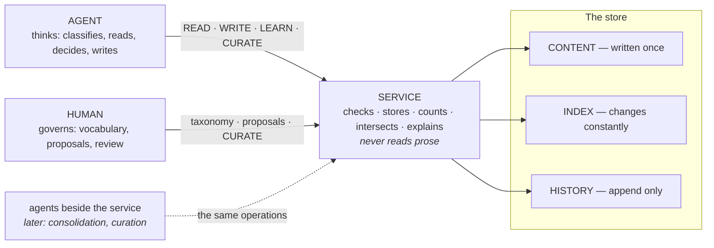

---

## Scenario 0 — Starting up

*In the model's types: [Scenario 0 in section 01a](01a_model_by_scenario.md#scenario-0-starting-up).*

Nothing in the features below can happen until the service holds a snapshot and the agent
holds the vocabulary. Startup builds both from files — and the same files always build the
same snapshot, down to its version number, so a retrieval from before the restart can still
be rerun after it.

```gherkin
Given the repository as Feature 6 left it — 54 memories, snapshot v55, taxonomy v3,
      29 documents inventoried
And, since the last session, a git pull that edited the campaign's homebrew document
When Claude Code starts and launches the memory MCP server
Then the store loads the vocabulary, the sources, the memories and the index side from files
And every memory is checked as it loads, and a file that fails is named by path and line
And the snapshot is rebuilt and published as v55 — the version the audit log last recorded
And the edited document is noticed by its digest, and the citation into it is reported for review
And the observers start, the tools are registered, and the first session receives vocabulary v3
```

**Panel 1.** The launch chain. The host starts one server per session over stdio; the server
imports the extension, and the adapter builds the service from configuration — which
repository, which store. Python's part ends here: everything after this is C++, with the GIL
released for the whole load.

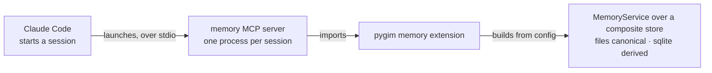

**Panel 2.** What is read. Files are canonical, so every fact comes from the repository; the
SQLite cache is only trusted where its content digests agree with the files, and rebuilt
where they do not.

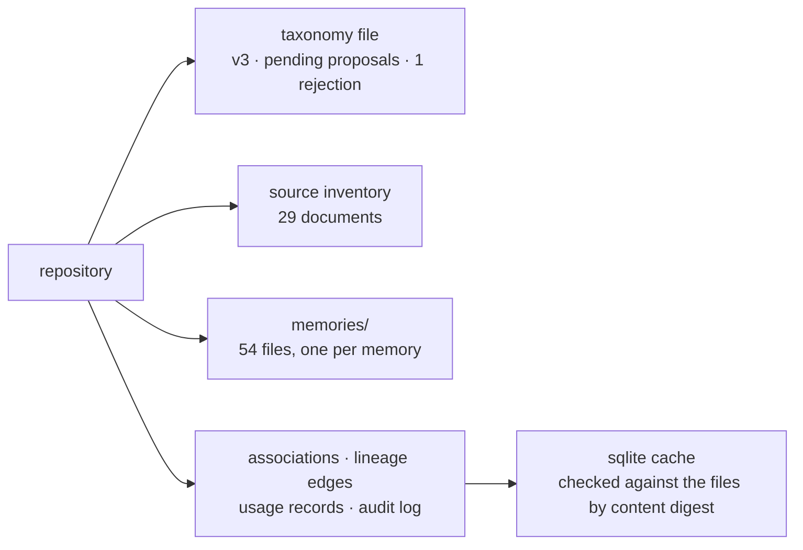

**Panel 3.** Every memory is checked as it loads — the laws of section 01, applied to what is
on disk. A file whose content no longer matches its digest was edited in place, which content
never is; it is left out of the snapshot and named, and the other memories load.

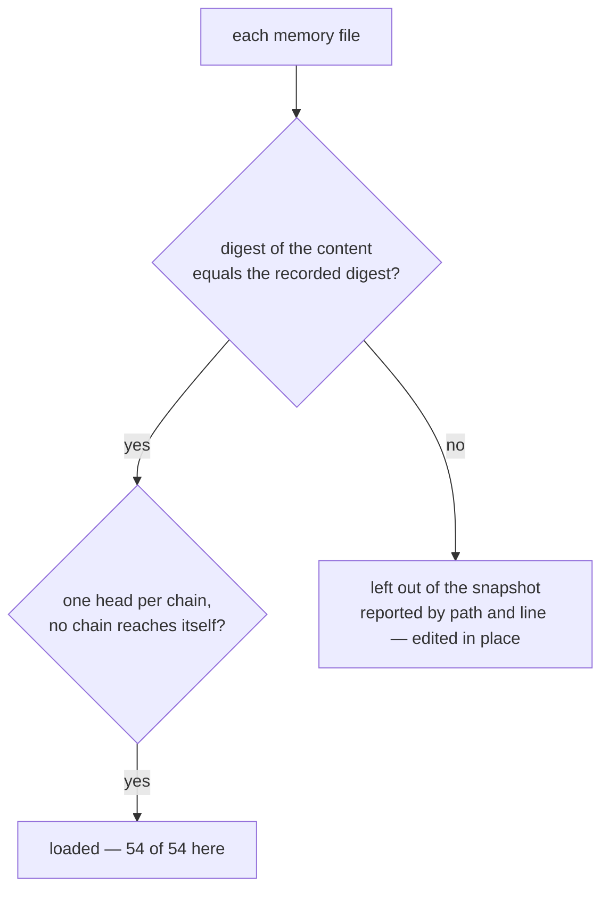

**Panel 4.** The snapshot is built from what loaded, and published under the version the audit
log last recorded. Not v1: a retrieval receipt from yesterday names v55, and a restart must
not make that name point at something else.

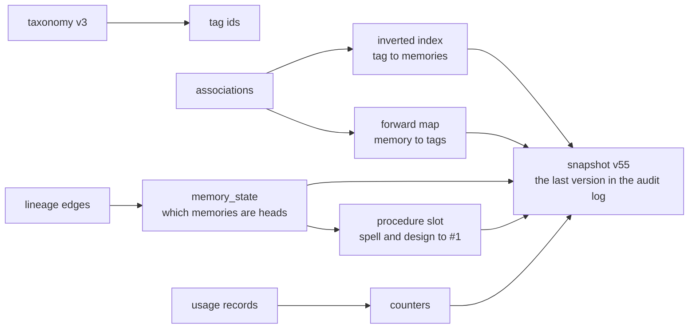

**Panel 5.** Sources are cited, not loaded, so all startup does is rehash each document whole.
One differs; the single citation into it — the passage that justified `mechanic=corruption` —
becomes a review item. The passage itself is checked when someone resolves it.

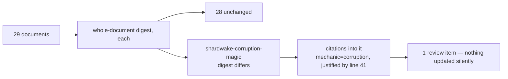

**Panel 6.** The service starts its observers, each owning its own thread and mailbox, and the
server registers the tools. The snapshot is shared read-only; nothing else is.

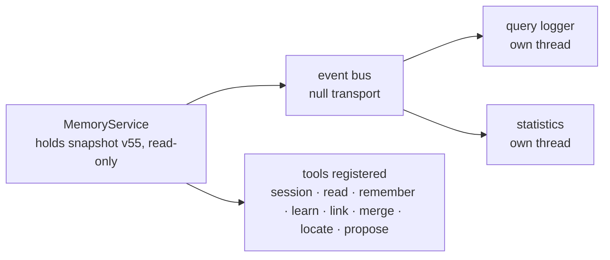

**Panel 7.** The first session. The agent is handed the coordinate system — and what changed
since it last looked.

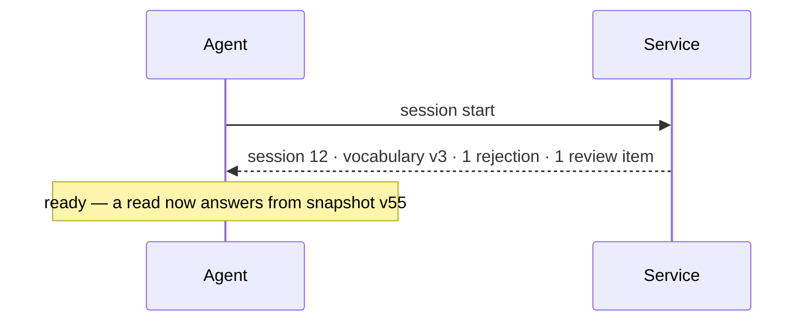

Had the pull changed a corpus file instead of a source, startup would have reconciled it
first, exactly as Feature 4 draws it: a known slug with a new digest becomes a new version of
its chain, and the snapshot is published one version later.

---

## Feature 1 — Preparing a domain

The vocabulary is the coordinate system: a memory without tags cannot be found, and the agent
cannot tag without a vocabulary, so this feature comes before every other one. Nobody writes
it by hand. Part of it ships with the tool; the rest is the **agent's analysis of the
domain's documents** — nothing else is guaranteed to exist — run as a small observational
study — predeclared, sampled, measured, reported — and reviewed by a human. A domain is
prepared once, before any problem; the problems that will live in it arrive later and extend
it one proposal at a time. The foundations it rests on are in
the overview, §4.8: the facet categories that say which axes to look for, the STROBE-adapted
method that says how to make the proposal evidence, the codebook entry that says what a
description must contain, and the source locators that let anyone go straight to the passage
a tag or a memory came from.

### Scenario 1.1 — The base vocabulary ships with the tool

*In the model's types: [Scenario 1.1 in section 01a](01a_model_by_scenario.md#scenario-11-the-base-vocabulary-ships-with-the-tool).*

```gherkin
Given a freshly created repository
When the first session starts
Then the agent is handed taxonomy v0: the base vocabulary
And v0 has five dimensions that hold in every domain — domain, artifact, task, kind, tier —
    each with described values, proposed by the tool's authors and reviewed once
And nothing domain-specific exists yet; the domain dimension has no values
```

**Panel 1.** The base follows from the facet categories, not from any domain: every field of
work has a thing being made, an activity, an epistemic kind, a level. So it is taxonomy v0 —
proposed by the tool's authors, reviewed once, and changed only through the same proposal
mechanism as everything after it.

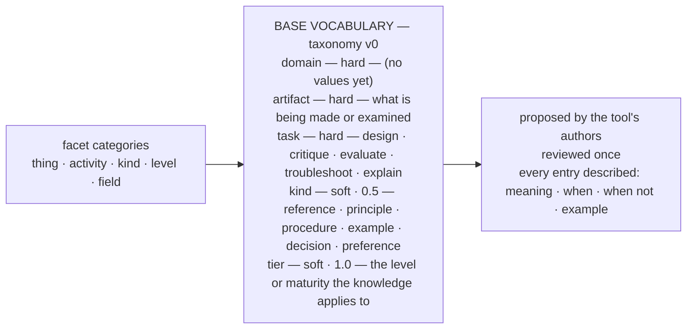

**Panel 2.** The handover. An empty `domain` is the signal that a domain pack is needed.

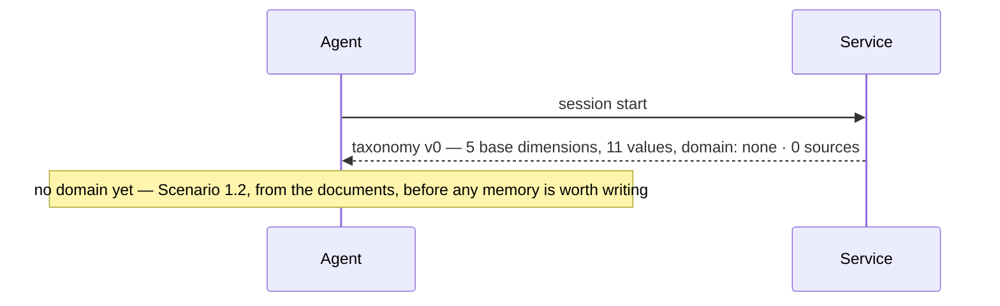

### Scenario 1.2 — The agent prepares the D&D domain

*In the model's types: [Scenario 1.2 in section 01a](01a_model_by_scenario.md#scenario-12-the-agent-prepares-the-dd-domain).*

```gherkin
Given taxonomy v0 and an empty store
And a folder of documents: the 2024 rulebooks — 28 files of text, one per chapter,
    plus a folder of stat blocks; no index, no structure, nothing derived
When the human names the domain and asks the agent to prepare it
Then the agent runs the vocabulary study over the documents alone: inventories them,
     derives their structure, harvests the axes the documents define, derives the axes the
     domain implies, walks the facet checklist, predeclares thresholds, locks a sample of
     entries, classifies it twice, and reports
And the report proposes the dnd domain pack, with evidence per dimension
And the human reviews the report — one card per dimension — and accepts it as taxonomy v1
And every value in v1 carries a codebook entry and, where it came from the documents, a locator
```

No problem statement, no notes, no questions. A domain is where many problems will live,
and the pack must serve all of them; what a particular problem needs arrives later, one
proposal at a time (Scenario 1.3). The only guaranteed input is the documents.

**Panel 1.** The protocol, before anything is read. Objectives, documents, sample and
thresholds are written down first, so the numbers cannot move the bar later.

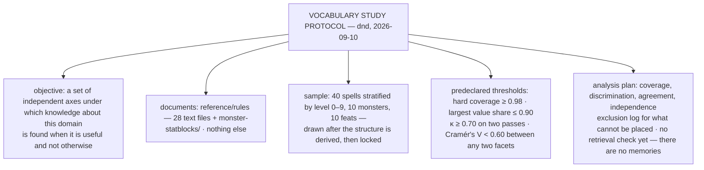

**Panel 2.** Inventory the documents. A source is a document — a text file, a PDF, a web
page — with an id, a path, a kind and a version hash. Nothing is assumed about its inside.

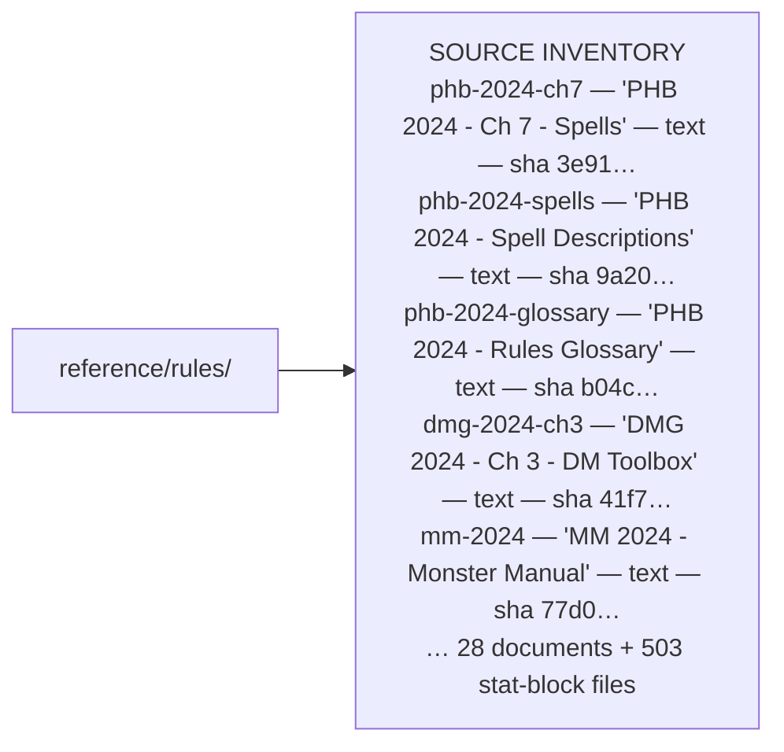

**Panel 3.** Derive the structure. The agent reads the documents and finds how they organise
themselves: chapters, a glossary that defines its terms, and entries that repeat a shape.
This derived structure is an artefact of its own — stored with locators, versioned against
the documents' hashes — and it is what the harvest reads.

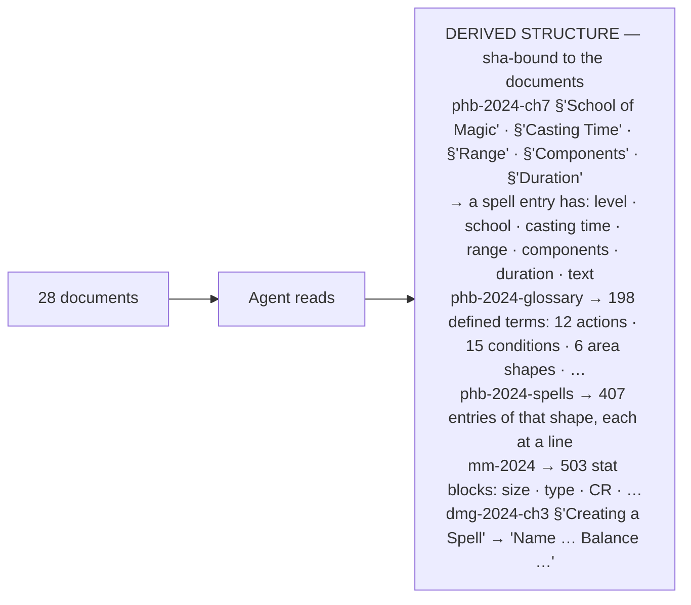

**Panel 4.** Harvest the given axes. Where the documents define their own vocabulary the
agent takes it verbatim: the document's definition is the description, and a locator points
at the passage.

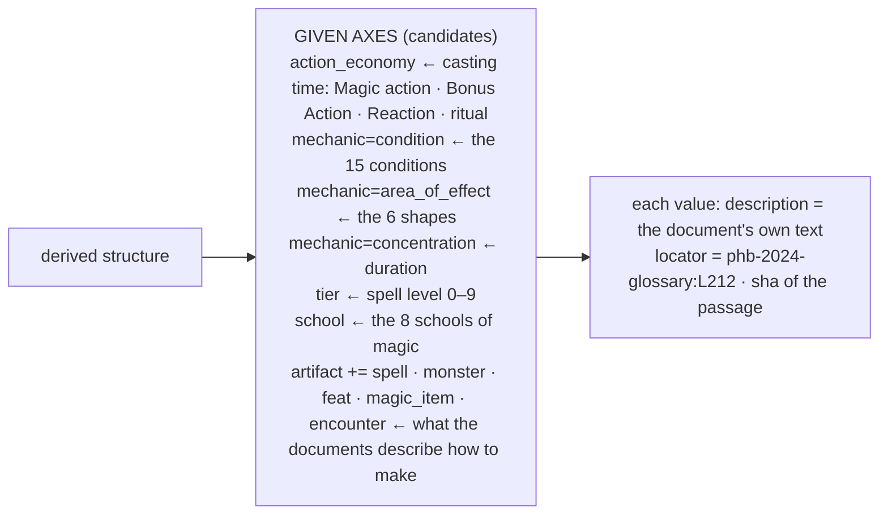

**Panel 5.** Derive the axes the domain implies but never lists. These come from the
documents' prose, not from anyone's notes: the DMG's *Creating a Spell* says what a
designer weighs; the PHB's spell texts show what spells are *for*. The agent writes these
descriptions itself, and each cites the passage that justified it.

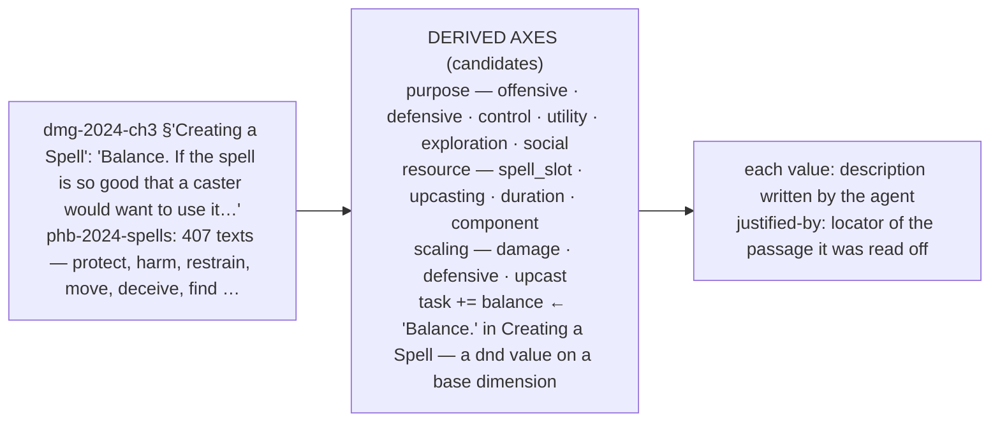

**Panel 6.** Walk the facet checklist. Every fundamental category is asked once; the answer
is a candidate axis, a base dimension already covering it, or a recorded *no*.

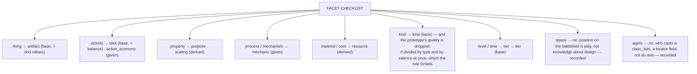

**Panel 7.** Lock the sample and classify it twice. The sample is entries from the
documents — there is nothing else yet. Pass A is this session; pass B is a fresh session
with the candidate descriptions and nothing else. The evidence sheet has one row per entry,
per dimension, per pass, and a coding dictionary that *is* the proposal.

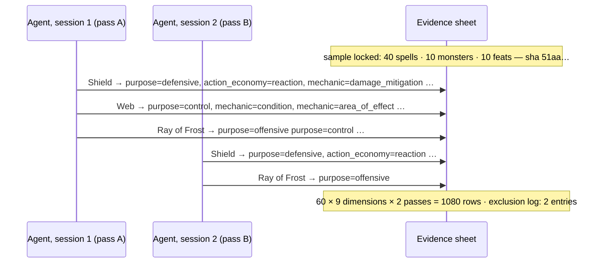

**Panel 8.** The numbers, per dimension, against the predeclared thresholds. Three findings:
one description to fix, one dimension that separates nothing, one harvested axis that turns
out not to be a facet at all.

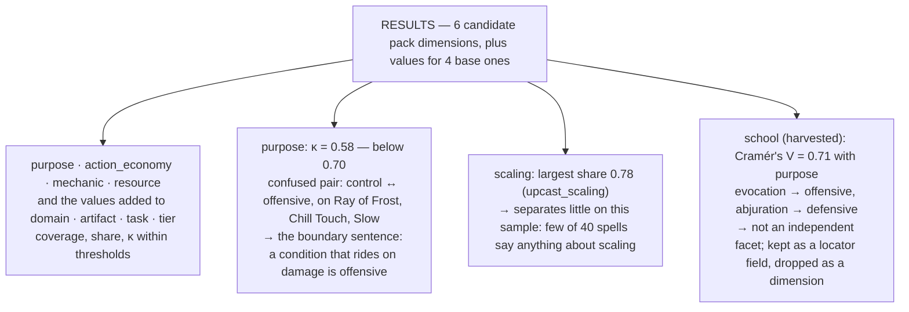

**Panel 9.** The report, and the review. One card per dimension: role, weight, the numbers,
three cited entries per value, the confused pairs, the agent's proposed fix. Roles and
weights start from the structure — base dimensions hard, pack dimensions soft at 1.0 — and
the human sets what the domain warrants; use will revise them later (G12).

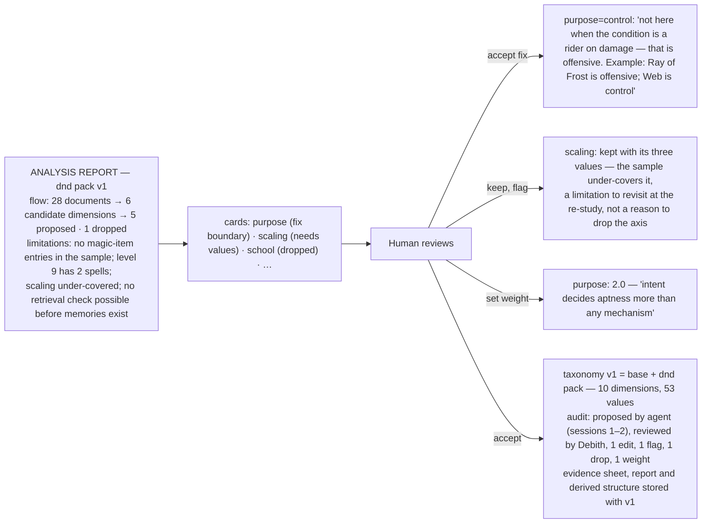

**Panel 10.** Published. From the next session on the agent classifies against v1 — and
every given value carries a locator, so *what does Blinded mean, exactly* is one open, not
a search through 28 documents.

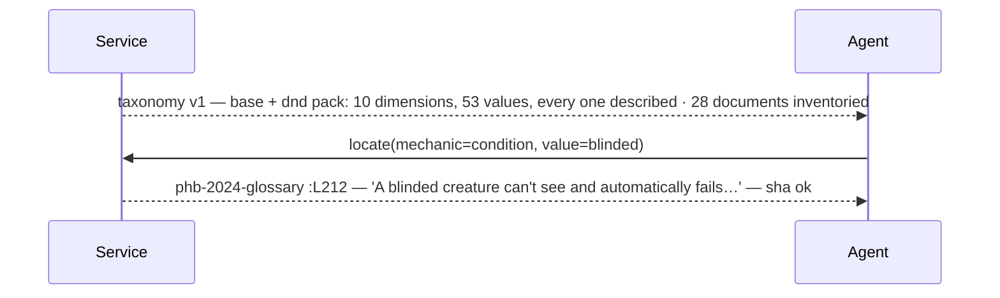

### Scenario 1.3 — A word the vocabulary lacks turns up during work

*In the model's types: [Scenario 1.3 in section 01a](01a_model_by_scenario.md#scenario-13-a-word-the-vocabulary-lacks-turns-up-during-work).*

```gherkin
Given taxonomy v1, derived from the rulebooks, which know nothing of corruption
And the procedure #1 and memories #2 and #3 from an earlier design session (Scenario 2.1)
And the campaign's homebrew document, which defines signs of corruption and the Corrupted condition
When the human asks "Design a 3rd-level spell that spreads a sign of corruption
     for the Shardwake campaign, castable as a ritual."
Then the agent files what it learned under the tags that exist
And proposes mechanic=corruption, with a locator into the homebrew document, and "ritual casting"
And the memory is findable at once, under the tags that exist
And when the human accepts the first proposal, the pack grows, the homebrew document joins
    the source inventory, and the memory is linked
```

A pack derived from the documents covers the documents' world. A proposal is what happens
when the work steps outside it — here, a homebrew mechanic the rulebooks never mention. It
is not a defect of the study; it is the work extending the domain.

**Panel 1.** The request is classified. Two concepts have no home: one is genuinely new to
the vocabulary, one is already covered by another tag — the agent cannot always tell which,
and does not have to.

```mermaid
flowchart LR
    req["'Design a 3rd-level spell that spreads a sign<br/>of corruption for the Shardwake campaign, castable as a ritual.'"] --> agent["Agent classifies<br/>against taxonomy v1"]
    agent --> space["hard: domain=dnd artifact=spell task=design<br/>soft: purpose~control action_economy~action action_economy~ritual<br/>mechanic~area_of_effect mechanic~condition mechanic~saving_throw tier~mid"]
    agent --> gap["no tag for: 'corruption', 'ritual casting'"]
```

**Panel 2.** The agent reads the space first (#1, #2 and #3 — the procedure and two notes, nothing about corruption), reads the
homebrew document for what a sign of corruption *is*, designs Spreading Blight, and
afterwards writes what outlives the task — with the two proposals attached, each a full
codebook entry. The corruption proposal cites the homebrew document, which is not yet in the
source inventory.

```mermaid
flowchart LR
    call["remember('A spell that spreads a sign of corruption should grow the sign by whole 10-foot cubes and raise its level by at most one, so the sign's own exposure rules do the work — the spell must not deal corruption on its own.',<br/>tags: domain=dnd artifact=spell task=design purpose=control mechanic=area_of_effect mechanic=condition kind=principle tier=mid,<br/>decision: new, seen: #1 #2 #3,<br/>proposals: mechanic=corruption — 'the effect creates, grows or interacts with a sign of corruption or the Corrupted condition · when: it references a corruption level or the Corrupted condition · when not: necrotic or poison damage with no sign involved · example: Awaken Contaminant · locator: shardwake-corruption-magic:L41 (not yet inventoried)',<br/>'ritual casting' — 'cast over ten minutes without a slot')"] --> check["service: values in the list — yes<br/>candidates under the hard tags — #1 #2 #3, minus seen — none<br/>proposals: each entry complete — yes; one locator points outside the inventory — noted"] --> ok["#4 written · snapshot v4"]
```

**Panel 3.** The proposals are recorded and attached. Nothing waits on them: #4 is findable
now, under the tags it has — a sign of corruption is still an area, a condition and a save.

```mermaid
flowchart LR
    w["write #4"] --> p1["PROPOSAL mechanic=corruption<br/>pending · asked for by #4 · session 2<br/>locator: shardwake-corruption-magic:L41 — document not in inventory"]
    w --> p2["PROPOSAL 'ritual casting'<br/>pending · asked for by #4 · session 2"]
    w --> findable["#4 findable under<br/>domain=dnd artifact=spell task=design purpose=control mechanic=area_of_effect mechanic=condition …"]
```

**Panel 4.** The human reviews the pending list and accepts `corruption` as a value of
`mechanic` — the same review as Scenario 1.2, one card at a time, without the study: a single
value's evidence is its codebook entry, its locator, and the memories that asked for it.
Accepting a locator into an uninventoried document inventories the document; the domain's
sources grow the same way its vocabulary does. Later, a curator agent beside the service may
do the first pass of this review.

```mermaid
flowchart LR
    list["pending proposals<br/>mechanic=corruption — 1 memory · locator into a new document<br/>'ritual casting' — 1 memory"] --> human["Human"]
    human -- "accept" --> tax["taxonomy v2 — dnd pack<br/>mechanic: … + corruption, with the agent's entry as reviewed"]
    human -- "accept" --> src["source inventory + shardwake-corruption-magic<br/>'homebrew/corruption/WIP/corruption-magic.md' — text — sha c8e2…"]
    human -- "accept" --> link["#4 → mechanic=corruption · source: proposed"]
    tax --> audit["audit: taxonomy add mechanic=corruption<br/>audit: source add shardwake-corruption-magic<br/>audit: link #4 mechanic=corruption [proposed]"]
```

**Panel 5.** Next session the agent is handed v2, and a corruption question finds #4 through
the new tag — and can open the homebrew's definition in one call.

```mermaid
sequenceDiagram
    participant Service
    participant Agent
    Service-->>Agent: taxonomy v2 — mechanic now includes corruption · 29 documents inventoried
    Agent->>Service: read(domain=dnd artifact=spell task=design, mechanic~corruption purpose~control)
    Service-->>Agent: #4 rank 1 — corruption +1.0, control +2.0
    Agent->>Service: locate(mechanic=corruption)
    Service-->>Agent: shardwake-corruption-magic :L41 — 'A sign of corruption is a region where abyssal influence…' — sha ok
```

### Scenario 1.4 — A proposal is turned down

*In the model's types: [Scenario 1.4 in section 01a](01a_model_by_scenario.md#scenario-14-a-proposal-is-turned-down).*

```gherkin
Given the pending proposal "ritual casting", asked for by #4
When the human rejects it, because action_economy=ritual already covers it
Then the rejection and its reason are published with the vocabulary
And the agent files under action_economy=ritual from then on
```

**Panel 1.** Reject, with a reason. The reason is not private: it goes out with the
vocabulary, so the same proposal does not come back next week.

```mermaid
flowchart LR
    prop["PROPOSAL 'ritual casting'"] --> reject["Human: reject<br/>reason: 'covered by action_economy=ritual'"]
    reject --> audit["audit row"]
    reject --> published["taxonomy v3 lists:<br/>not a tag: 'ritual casting' — see action_economy=ritual"]
```

**Panel 2.** Next session the agent sees the rejection alongside the vocabulary. Whether a
rejection may carry a redirect the agent is expected to follow, or only a reason, is an open
decision (overview §10).

```mermaid
sequenceDiagram
    participant Service
    participant Agent
    Service-->>Agent: taxonomy v3 — 1 rejected: 'ritual casting' → action_economy=ritual
    Note over Agent: a ritual blight is action_economy=ritual — no proposal this time
```

---

## Feature 2 — Create a new spell

The everyday feature. Three scenarios, in the order they happen to a real repository:
nothing in memory yet, a similar spell already in memory, a variant of a spell in memory.

### Scenario 2.1 — No memory yet

*In the model's types: [Scenario 2.1 in section 01a](01a_model_by_scenario.md#scenario-21-no-memory-yet).*

```gherkin
Given taxonomy v1 (base + dnd pack) and a store with no memories
When the human asks "Design a defensive reaction spell for a 5th-level character."
Then the agent reads the problem space and finds it empty — no knowledge, and no procedure
And derives the procedure for creating a spell from the DMG's own "Creating a Spell"
    and from the practice this design will follow, and writes it first
And designs Frost Ward by following the procedure's steps
And records the two things that outlive the task as new chains,
    each write naming what it read
```

**Panel 1.** The request becomes a problem space.

```mermaid
flowchart LR
    req["'Design a defensive reaction spell<br/>for a 5th-level character.'"] --> agent["Agent classifies<br/>against taxonomy v1"]
    agent --> space["hard: domain=dnd artifact=spell task=design<br/>soft: purpose~defensive action_economy~reaction tier~mid"]
```

**Panel 2.** The agent reads the space before doing anything else. It is empty — and, in
particular, there is no procedure for this task.

```mermaid
sequenceDiagram
    participant Agent
    participant Service
    Agent->>Service: read(domain=dnd artifact=spell task=design, purpose~defensive action_economy~reaction tier~mid)
    Service-->>Agent: corpus 0 → candidates 0 · procedure for (spell, design): none
    Note over Agent: no steps to follow, nothing to lean on — derive the steps first
```

**Panel 3.** The procedure comes from the domain's own document. The locator on
`task=balance` — recorded when the pack was prepared — leads straight to the DMG's
*Creating a Spell*; the agent turns its considerations into ordered steps, adds the one step
the rulebook does not know about, and writes the procedure as the store's first memory.

```mermaid
sequenceDiagram
    participant Agent
    participant Service
    Agent->>Service: locate(task=balance)
    Service-->>Agent: dmg-2024-ch3:L297 — 'Creating a Spell … Name. Balance. Identity. Spell Duration, Range, and Area. Utility. Spell Damage table' — sha ok
    Agent->>Service: remember('Creating a spell: 1 read the space — the procedure and what is known for this artifact and task · 2 name and identity — unique, fits who casts it · 3 effect and yardstick — the existing spell it is measured against · 4 cost — level, action, duration, range, area — damage from the Spell Damage table · 5 balance and utility — would a caster use it all the time? is it too narrow to bother learning? · 6 sort what outlives the task — already said, still true, new', tags: domain=dnd artifact=spell task=design kind=procedure, decision: new, seen: none, cites: dmg-2024-ch3:L297)
    Service->>Service: candidates under domain=dnd artifact=spell task=design — none, so seen: none holds · hash unknown
    Service-->>Agent: #1 written · kind=procedure · snapshot v1
```

**Panel 4.** The work, step by step. The spell itself is the deliverable and goes to the
human; the steps are what make it repeatable.

```mermaid
flowchart TB
    s2["2 name and identity — Frost Ward, abjuration; sorcerer and wizard"]
    s3["3 effect and yardstick — reaction when you take damage: resistance to that type until the start of your next turn; if cold, temp HP equal to your level · measured against Shield"]
    s4["4 cost — 2nd level, reaction, 1 round, self · no damage, so no table"]
    s5["5 balance and utility — weaker than Shield against weapons, stronger against breath and spells: a niche, not an always-cast · any typed damage, not too narrow"]
    s2 --> s3 --> s4 --> s5 --> out["Frost Ward — to the human"]
```

**Panel 5.** Step 6: the sorting. Two things learned along the way outlive the task; the
stat block does not.

```mermaid
flowchart TB
    work["Frost Ward, done"]
    work --> keep1["outlives the task: the yardstick it was measured against — Shield"]
    work --> keep2["outlives the task: the decision — typed resistance instead of flat AC, and why"]
    work --> drop["does not: the stat block — that is the deliverable, it goes to the human"]
```

**Panel 6.** The yardstick. `seen: #1` names the procedure — it is in the candidate set,
and the agent wrote it a minute ago. `cites` is a locator into the source inventory, so the
next reader opens Shield's entry directly instead of searching the books.

```mermaid
flowchart LR
    call["remember('Shield (1st, reaction, +5 AC for a full round) is the yardstick: a defensive reaction earns its slot only if it prevents more expected damage per slot than +5 AC does against what the party faces at that level.',<br/>tags: domain=dnd artifact=spell task=design task=balance purpose=defensive action_economy=reaction mechanic=damage_mitigation resource=spell_slot kind=principle tier=low tier=mid,<br/>decision: new, seen: #1,<br/>cites: phb-2024-spells:L4459 — Shield)"] --> check["service: values in the list — yes<br/>candidates under the hard tags — #1, minus seen — none<br/>hash unknown — yes"] --> ok["#2 written · source: written · snapshot v2"]
```

**Panel 7.** The decision, a minute later. The space now holds #1 and #2, and the write
says so.

```mermaid
flowchart LR
    call["remember('Frost Ward (2nd, reaction when you take damage): resistance to that type until the start of your next turn — if cold, also temp HP equal to your level. Weaker than Shield against weapons, stronger against breath and spells: a niche, not an upgrade.',<br/>tags: domain=dnd artifact=spell task=design purpose=defensive action_economy=reaction mechanic=damage_mitigation mechanic=temporary_hp kind=example tier=mid,<br/>decision: new, seen: #1 #2)"] --> check["service: candidates under the hard tags — #1 #2<br/>minus seen — none"] --> ok["#3 written · snapshot v3"]
    note["seen: #1 #2 — the procedure and the yardstick,<br/>neither is this decision"] -.-> call
```

**Panel 8.** Files are canonical, so the three memories are now three text files and
twenty-two association rows in the repository. The human meets them in a diff, later, and
leaves them.

```mermaid
flowchart LR
    s["store"] --> f0["memories/creating-a-spell.md — #1 · procedure"]
    s --> f1["memories/compare-defensive-reactions-to-shield.md — #2"]
    s --> f2["memories/frost-ward-typed-resistance.md — #3"]
    s --> a["associations.jsonl — 22 rows · source: written"]
    f0 --> diff["git diff, later — the human reads all three, and leaves them"]
    f1 --> diff
    f2 --> diff
```

### Scenario 2.2 — A similar spell already has memories

*In the model's types: [Scenario 2.2 in section 01a](01a_model_by_scenario.md#scenario-22-a-similar-spell-already-has-memories).*

```gherkin
Given #1 (the procedure), #2 (compare to Shield) and #3 (Frost Ward: typed resistance) in the store
When the human asks "Design a reaction spell that protects a 7th-level druid against fire."
Then the agent reads the space and gets the procedure first, then both notes with explanations
And designs Ember Shell using them
And afterwards sorts what it learned into three piles:
    already said → learn · still true → untouched · new → a new chain
```

**Panel 1.** The read. Both memories come back with the exact tags that admitted and ranked
them, and their content lands in the agent's context.

```mermaid
sequenceDiagram
    participant Agent
    participant Service
    Agent->>Service: read(domain=dnd artifact=spell task=design, purpose~defensive action_economy~reaction mechanic~damage_mitigation tier~mid)
    Service-->>Agent: procedure: #1 — Creating a spell, 6 steps — placed first
    Service-->>Agent: #2 rank 1 — soft 5.5 (defensive +2.0, reaction +1.5, mitigation +1.0, mid +1.0)
    Note over Agent: #2 carries cites: phb-2024-spells:L4459 — Shield's text is one open away
    Service-->>Agent: #3 rank 2 — soft 5.5, tie broken by id
    Note over Agent: both in context, content and all
```

**Panel 2.** The work, built on both — and walked through #1's steps, which is why the
yardstick question gets asked at all.

```mermaid
flowchart TB
    work["Ember Shell — 3rd-level abjuration, reaction when you take fire damage:<br/>fire resistance until the start of your next turn, and the next creature that hits you<br/>in melee before then takes fire damage equal to half of what you absorbed, at most 10"]
    work --> used1["#2 set the bar: does it beat +5 AC per slot against fire-heavy encounters? yes, at 3rd"]
    work --> used2["#3 set the niche: typed, not flat — Ember Shell stays in the family"]
```

**Panel 3.** The sorting. Only something that has read the candidates and understood the
text can do this — which is why it is the agent's step, not the service's.

```mermaid
flowchart TB
    q["what did this session teach that outlives it?"]
    q --> a["'measure against Shield' — #2 says exactly this<br/>→ already said: learn(#2), write nothing"]
    q --> p["the procedure held: every step applied, none missing<br/>→ learn(#1), write nothing"]
    q --> b["'typed niche, not upgrade' — #3 says it about Frost Ward, still true<br/>→ untouched"]
    q --> c["'a rider that scales with damage absorbed must be capped' — nowhere<br/>→ new chain"]
```

**Panel 4.** Two calls. The learn is counters only, because #2 already carries every tag of
this space. The write names both candidates as seen, and the service confirms nothing is left.

```mermaid
flowchart LR
    l["learn(#2, task=design, 'applied as the yardstick for Ember Shell')"] --> lc["usage record · audit row<br/>#2 already carries task=design — counters only"]
    w["remember('A rider that grows with the damage absorbed rewards being hit. Cap it (Ember Shell: at most 10) or tie it to the slot.',<br/>tags: domain=dnd artifact=spell task=design purpose=defensive mechanic=damage_dealing resource=tradeoff kind=principle tier=mid,<br/>decision: new, seen: #1 #2 #3)"] --> wc["service: candidates under the hard tags — #1 #2 #3<br/>minus seen — none"] --> ok["#5 written · snapshot v5"]
```

**Panel 5.** What the session left behind.

```mermaid
flowchart LR
    m0["#1 — procedure · included 2 · useful 1"]
    m1["#2 — included 2 · useful 1"]
    m2["#3 — included 2 · untouched"]
    m4["#5 — new head · source: written"]
```

### Scenario 2.3 — A variant of a spell

*In the model's types: [Scenario 2.3 in section 01a](01a_model_by_scenario.md#scenario-23-a-variant-of-a-spell).*

```gherkin
Given #1, #2, #3 and #5 in the store
When the human asks "Make a fire variant of Frost Ward for a 9th-level character."
Then the agent reads the Frost Ward chain and designs Ember Ward
And its first write, sent without naming what it read, is refused and handed the candidates
And it extends the Frost Ward chain into a family note instead of writing a near-duplicate
And records the one genuinely new insight as a new chain
```

**Panel 1.** The read. Everything under the hard tags comes back, ordered by the soft ones —
including the corruption note, at the bottom, because a hard match is a hard match.

```mermaid
sequenceDiagram
    participant Agent
    participant Service
    Agent->>Service: read(domain=dnd artifact=spell task=design, purpose~defensive action_economy~reaction mechanic~damage_mitigation tier~mid)
    Service-->>Agent: procedure: #1 — Creating a spell — placed first
    Service-->>Agent: #2 rank 1 and #3 rank 2 (5.5 each), #5 rank 3 (3.0), #4 rank 4 (1.0 — mid only)
    Note over Agent: the Frost Ward note is the one to build on
```

**Panel 2.** The work. A variant keeps the shape and changes one thing.

```mermaid
flowchart TB
    work["Ember Ward — 3rd-level abjuration, reaction when you take damage:<br/>resistance to that type until the start of your next turn —<br/>if the damage was fire, also temporary hit points equal to twice your level"]
    work --> same["same shape as Frost Ward: typed resistance, a rider on one type"]
    work --> changed["what changed: one level higher, the rider doubled — the slot pays for it"]
```

**Panel 3.** The eager write. The agent forgets to say what it read, and the service —
without understanding a word — hands the space back.

```mermaid
sequenceDiagram
    participant Agent
    participant Service
    Agent->>Service: remember('Ember Ward trades flat AC for fire resistance …', tags: …, decision: new, seen: none)
    Service->>Service: candidates under domain=dnd artifact=spell task=design — #1 #2 #3 #4 #5 · minus seen — #1 #2 #3 #4 #5
    Service-->>Agent: not written — you have not said you read #1 #2 #3 #4 #5
    Note over Agent: I did read them. And #3 is this note, one spell short.
```

**Panel 4.** The right write: not a second note about the same idea, but the next version of
#3, now covering the family. The service checks that #3 is still the head of its chain.

```mermaid
flowchart LR
    call["remember('The Ward family — Frost Ward (2nd, cold, temp HP = level) and Ember Ward (3rd, fire, temp HP = twice level) — trades Shield's flat +5 AC for typed resistance until the end of your next turn. Weaker against weapons, stronger against breath and spells: a niche, not an upgrade. The rider doubles with the slot.',<br/>tags: domain=dnd artifact=spell task=design purpose=defensive action_economy=reaction mechanic=damage_mitigation mechanic=temporary_hp scaling=upcast_scaling kind=example tier=mid,<br/>decision: supersedes #3, seen: #1 #2 #3 #4 #5)"] --> check["service: #3 is the head of its chain — yes<br/>values in the list — yes"] --> ok["#6 written · supersedes #3 · #3 retired · snapshot v6"]
```

**Panel 5.** The new insight is a new chain. Note `seen` now lists #6 as well — the agent
wrote it a moment ago, and the service would hand it back otherwise. And this write holds
`kind=principle`, not `procedure`: a procedure is *how*, a principle is *why*.

```mermaid
flowchart LR
    call["remember('Typed resistance loses value above 10th level: monsters deal mixed damage, so a high-band Ward needs a second type or a bigger rider.',<br/>tags: domain=dnd artifact=spell task=design purpose=defensive mechanic=damage_mitigation scaling=defensive_scaling kind=principle tier=high,<br/>decision: new, seen: #1 #2 #3 #4 #5 #6)"] --> check["service: candidates under the hard tags — #1 #2 #4 #5 #6<br/>minus seen — none"] --> ok["#7 written · snapshot v7"]
```

**Panel 6.** The chain, and the file. The file keeps its slug and now holds #6; git history
and the store's history both hold #3.

```mermaid
flowchart LR
    subgraph chain["the Frost Ward chain"]
        direction LR
        m2["#3 retired"] -- "superseded by" --> m5["#6 head — 'The Ward family'"]
    end
    m6["#7 head — its own chain"]
    m5 --> file["memories/frost-ward-typed-resistance.md — now holds #6<br/>git history holds #3"]
    m6 --> file2["memories/typed-resistance-high-tier.md"]
```

---

## Feature 3 — Balance an existing spell

Recall is the point of the whole system, and most sessions write nothing. This feature shows
what a session that writes nothing still leaves behind.

### Scenario 3.1 — The right note is in a neighbouring space

*In the model's types: [Scenario 3.1 in section 01a](01a_model_by_scenario.md#scenario-31-the-right-note-is-in-a-neighbouring-space).*

```gherkin
Given #2, #4, #5, #6 and #7 in the store, #6 carrying task=design only
When the human asks "Is Frost Ward still worth a 2nd-level slot at 9th level?"
Then the read under task=balance returns #2 only
And the agent softens task, finds #6, and answers from it
And writes nothing — the verdict is the deliverable — but reports that #6 was needed
And after three such reports, #6 carries task=balance on its own
```

**Panel 1.** The read, as classified. Balance is a hard dimension, and only #2 carries it.

```mermaid
sequenceDiagram
    participant Agent
    participant Service
    Agent->>Service: read(domain=dnd artifact=spell task=balance, purpose~defensive action_economy~reaction tier~mid)
    Service-->>Agent: #2 rank 1 — the only memory carrying task=balance
    Note over Agent: the Ward family note is missing — it was written under task=design
```

**Panel 2.** The agent softens `task` — a query property, not a taxonomy one — and reads
again. Now the family note is there, and the answer follows from it.

```mermaid
sequenceDiagram
    participant Agent
    participant Service
    Agent->>Service: read(domain=dnd artifact=spell, task~balance purpose~defensive action_economy~reaction tier~mid)
    Service-->>Agent: #2 rank 1 (5.5), #6 rank 2 (4.5), #5 rank 3 (3.0), #7 rank 4 (2.0), #4 rank 5 (1.0), #1 rank 6 (0 — the design procedure — no balance procedure exists yet)
    Note over Agent: yes — the rider is 9 temp HP at 9th, and #7 says the trouble only starts above 10th
```

**Panel 3.** The sorting, with a different answer this time: nothing outlives the task, but a
memory was needed that its space did not offer. That is exactly what LEARN records.

```mermaid
flowchart TB
    q1{"learned something about designing<br/>that outlives this task?"} -- "no — the verdict goes to the human, that is the deliverable" --> nowrite["no write"]
    q2{"needed a memory the space did not offer?"} -- "yes — #6, found only after softening task" --> learn["learn(#6, task=balance, 'needed to balance Frost Ward at 9th')"]
```

**Panel 4.** Three balance sessions later the count crosses the threshold, and #6 carries
`task=balance` on its own. Its content hash never moved.

```mermaid
flowchart LR
    s5["session 5 — usage 1"] --> s8["session 8 — usage 2"] --> s11["session 11 — usage 3"] --> promote["threshold reached<br/>link #6 → task=balance · source: learned<br/>reason: promoted after 3 useful uses"]
    promote --> next["from now on a balance read finds #6 without softening"]
    hash["#6 hash 7d3a… — unchanged throughout"] -.-> promote
```

### Scenario 3.2 — The human links a tag directly

*In the model's types: [Scenario 3.2 in section 01a](01a_model_by_scenario.md#scenario-32-the-human-links-a-tag-directly).*

```gherkin
Given #7 (typed resistance above 10th level) carrying task=design
When the human decides that high-tier balancing always needs it
Then they link #7 → task=balance with a reason, and no count is needed
```

**Panel 1.** Same shelf as a promotion, different source, and a reason in the human's words.

```mermaid
flowchart LR
    human["Human: link #7 task=balance<br/>--reason 'high-tier balancing always needs this'"] --> assoc["#7 → task=balance · source: curated"] --> audit["audit: link #7 task=balance [curated]"]
```

---

## Feature 4 — Bring in a colleague's notes

*In the model's types: [Feature 4 in section 01a](01a_model_by_scenario.md#feature-4-bring-in-a-colleagues-notes).*

The other door. A body of knowledge written by hand, tags and all, is how a repository is
seeded and how someone deliberately writes down what they know.

```gherkin
Given a colleague's spell-design notes as a corpus file — 43 blocks, tags spelled out by hand
When you run memory ingest on it
Then every block is validated against the vocabulary,
     and a bad one is refused by file and line while the others land
And each accepted block becomes a chain, source seed, without a read —
    this door has no look step
And when the colleague later edits an entry and you pull, the edited entry
    becomes a new version of its chain
```

**Panel 1.** The file. Each block is a slug, a title, header lines whose keys are dimensions,
and the text.

```mermaid
flowchart LR
    colleague["Colleague"] -- "shares" --> file["notes/spells.md — 43 blocks<br/>## shield-baseline<br/>title: Shield is the benchmark for reaction mitigation<br/>domain: dnd · artifact: spell · task: design, balance<br/>purpose: defensive · action_economy: reaction · …<br/><br/>Shield (1st level, reaction, +5 AC until the start of your next turn …) is the reference point …"]
```

**Panel 2.** Ingestion is explicit — a command, or the file store loading at startup. Each
block is validated on its own; one bad value does not hold the other forty-two hostage.

```mermaid
flowchart LR
    cmd["memory ingest notes/spells.md"] --> each["for each block: keys are dimensions? values in their lists?"]
    each -- "42 blocks" --> ok["chains #8–#49 · source: seed<br/>seen: none — this door has no look step"]
    each -- "1 block" --> bad["refused, naming file and line:<br/>notes/spells.md:118 tier=tier2 is not a value<br/>the other 42 are unaffected"]
```

**Panel 3.** What this door cannot do. A hand-written block was never read against the
store, so if one says what an existing chain says, that is found later (Feature 5), and the
verdict will read *ingested — no read expected*, not *the agent failed*.

```mermaid
flowchart LR
    ingested["#8 shield-baseline — 'Shield … is the reference point for any reaction that reduces incoming harm'"] -. "says what #2 says" .- mine["#2 — 'Shield … is the yardstick'"]
    ingested --> later["two chains, one point — Scenario 5.1"]
```

**Panel 4.** The colleague edits an entry; you pull; the next load sees a different hash for
a known slug and makes a new version rather than a duplicate.

```mermaid
flowchart LR
    edit["colleague edits shield-baseline — adds the tier-3 caveat"] --> pull["git pull"] --> load["next load: the block's hash differs from #8's"] --> version["#50 supersedes #8 — same slug, new version<br/>audit: ingest, reason 'notes/spells.md changed'"]
```

---

## Feature 5 — Two notes turn out to say one thing

Feature 2 exists so that this feature is rare. When it happens anyway, the merge is not a
cleanup: it is evidence that recollection failed once, and the evidence is kept and named.

### Scenario 5.1 — An ingested note duplicates a chain

*In the model's types: [Scenario 5.1 in section 01a](01a_model_by_scenario.md#scenario-51-an-ingested-note-duplicates-a-chain).*

```gherkin
Given #2 (my Shield yardstick) and #50 (the colleague's shield-baseline) in the store
When a balance read returns them back to back
Then whoever notices merges them, keeping the colleague's wording and my per-slot framing
And the verdict reads: ingested — no read expected
```

**Panel 1.** Noticed in the ordinary way: two heads, one point, side by side in a context.

```mermaid
sequenceDiagram
    participant Agent
    participant Service
    Agent->>Service: read(domain=dnd artifact=spell task=balance, purpose~defensive action_economy~reaction)
    Service-->>Agent: #2 rank 1, #50 rank 2 — both carry task=balance, both say Shield is the bar
    Note over Agent: one point, two chains — and #50 has the tier-3 caveat mine lacks
```

**Panel 2.** The merge. The caller writes the merged text; the service writes what it is
given, joins the chains, and carries the union of the tags.

```mermaid
sequenceDiagram
    participant Agent
    participant Service
    Agent->>Service: merge(#2 #50, 'Shield (1st, reaction, +5 AC until the start of your next turn) is the yardstick … it prevents proportionally less by tier 3 …', 'ingested note and first chain say one thing')
    Service->>Service: write #51 · lineage: supersedes #2, #50 · tags: the union
    Service-->>Agent: #51 head · #2 and #50 retired · snapshot v52
```

**Panel 3.** The verdict, from the records alone. #50 came through the hand-written door,
which has no look step — so no read was expected, and nobody misjudged.

```mermaid
flowchart TB
    later["#50's row: ingested from notes/spells.md — seen: none, none expected"]
    verdict["verdict: ingested — the cost of the hand-written door, not a failure"]
    later --> verdict
    verdict --> fix1["done: #51 carries both texts' tags"]
    verdict --> fix2["to decide: should ingestion run the look step on the human's behalf<br/>and report likely duplicates, instead of landing them silently? (overview §10)"]
```

### Scenario 5.2 — A critique session writes the same point under another task

*In the model's types: [Scenario 5.2 in section 01a](01a_model_by_scenario.md#scenario-52-a-critique-session-writes-the-same-point-under-another-task).*

```gherkin
Given #5 (cap the rider — task=design), written in Scenario 2.2
When, a week later, a critique session writes the same point under task=critique
Then the write passes every check, because #5 was never in its candidate set
And when the two are read together, whoever notices merges them
And the verdict reads: classification mismatch — with the evidence
```

**Panel 1.** The critique session. Its space is `task=critique`, and #5 does not carry that
tag, so the read cannot show it and the write passes.

```mermaid
flowchart LR
    req["'Critique Ember Shell's damage rider.'"] --> space["hard: domain=dnd artifact=spell task=critique<br/>soft: purpose~defensive mechanic~damage_dealing"]
    space --> read["read → six of the colleague's notes carry task=critique: #10 #15 #22 #28 #34 #41<br/>#5 does not — it is not in the set"]
    read --> write["remember('A rider that grows with the damage taken rewards being hit — cap it.',<br/>tags: domain=dnd artifact=spell task=critique purpose=defensive mechanic=damage_dealing kind=principle,<br/>decision: new, seen: #10 #15 #22 #28 #34 #41)"]
    write --> check["service: candidates under task=critique, minus seen — none<br/>→ #52 written"]
```

**Panel 2.** Noticed later, in a design session that softened `task` — or by the counters,
once the two start co-occurring.

```mermaid
flowchart LR
    later["a design read with task softened returns #5 and #52 side by side"] --> notice["Agent: these are one point"]
    counters["counters: #5 and #52 co-occur in every context that holds either"] --> notice
```

**Panel 3.** The merge, with the union — so from now on the point is found under both
tasks.

```mermaid
sequenceDiagram
    participant Agent
    participant Service
    Agent->>Service: merge(#5 #52, 'A rider that grows with the damage absorbed rewards being hit. Cap it or tie it to the slot.', 'one point written twice')
    Service->>Service: write #53 · lineage: supersedes #5, #52 · tags: task=design and task=critique, the rest merged
    Service-->>Agent: #53 head · #5 and #52 retired · snapshot v54
```

**Panel 4.** The verdict, and what it points at. The later write's row says what was
searched and seen; the earlier head's tags at that moment are in history. The service can
name the kind of failure without understanding either text.

```mermaid
flowchart TB
    later["#52's row: searched task=critique · seen #10 #15 #22 #28 #34 #41"]
    earlier["#5 at that moment: task=design only"]
    verdict["#5 was never in #52's candidate set<br/>→ classification mismatch — not a judgement error, and not never-looked"]
    later --> verdict
    earlier --> verdict
    verdict --> fix1["done: #53 carries both task values"]
    verdict --> fix2["to decide: should the look step widen beyond the write's own hard tags —<br/>soften task, say — so neighbouring spaces are seen before writing? (overview §10)"]
    verdict --> fix3["to review: is the description of task=critique adequate?<br/>a mismatch is the downstream test of a description — the study's κ, measured in the field"]
```

---

## Feature 6 — A note turns out to be wrong

*In the model's types: [Feature 6 in section 01a](01a_model_by_scenario.md#feature-6-a-note-turns-out-to-be-wrong).*

There is no edit operation. A correction is a birth plus a retirement, whichever door the
memory came through — and it is the same `remember` call as Feature 2, with the same checks.

```gherkin
Given #6, the Ward family note, which says the resistance lasts until the end of your next turn
When the human, reading it in a diff, points out that both spells say "start"
Then the agent writes the corrected text as the next version of #6's chain
And #6 leaves retrieval but still answers "what did we believe, and when"
```

**Panel 1.** The finding. It could just as well be the agent noticing mid-task; the path is
the same.

```mermaid
flowchart LR
    diff["Human, reading memories/frost-ward-typed-resistance.md in a diff:<br/>'it says until the end of your next turn — both spells say start'"] --> agent["Agent"]
```

**Panel 2.** The correction is a write that supersedes.

```mermaid
flowchart LR
    call["remember('The Ward family — … trades Shield's flat +5 AC for typed resistance until the start of your next turn. …',<br/>tags: as #6,<br/>decision: supersedes #6, seen: #6, reason: 'duration was wrong')"] --> check["service: #6 is the head of its chain — yes"] --> ok["#54 written · supersedes #6 · #6 retired · snapshot v55"]
```

**Panel 3.** The old version keeps answering one question.

```mermaid
flowchart LR
    ask["show #6"] --> ans["#6 — retired 2026-09-09 · hash 7d3a… unchanged<br/>superseded by #54, reason 'duration was wrong'<br/>was in 23 contexts before it was corrected"]
```

---

## The whole thing in two frames

A memory:

```mermaid
stateDiagram-v2
    [*] --> Head: WRITE, decision new — the agent, mid-task (Feature 2) — a procedure is written the same way
    [*] --> Head: ingestion of a hand-written file (Feature 4)
    [*] --> Head: merge (Feature 5)
    Head --> Head: link · unlink · learn · promote (Feature 3)
    Head --> Head: counters rise on every read
    Head --> Retired: superseded (Features 2, 5, 6) or retired
    Retired --> [*]: still readable, never deleted
```

A tag:

```mermaid
stateDiagram-v2
    [*] --> Accepted: the base ships with the tool (Scenario 1.1)
    [*] --> Proposed: the vocabulary study proposes a domain pack (Scenario 1.2)
    [*] --> Proposed: a write names a concept with no tag (Scenario 1.3)
    Proposed --> Accepted: human — or a delegated curator — accepts
    Proposed --> Rejected: with a reason, published with the vocabulary (Scenario 1.4)
    Accepted --> [*]: in the taxonomy, the asking memories linked
    Rejected --> [*]
```

Three doors in for a memory, one door out, and the way out is not a delete. One door in for
a tag — the agent's analysis, whether of a whole domain's documents or of one concept — and a
human stands at it. Every arrow in both frames leaves an audit row, which is
what makes the history goal (G10) hold: the state of the index at any past moment is the log
replayed up to that row.
