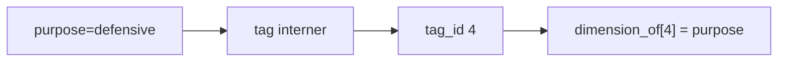
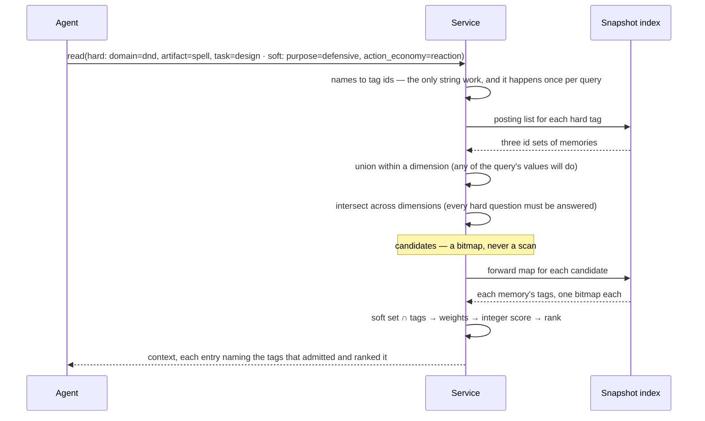
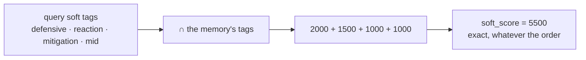
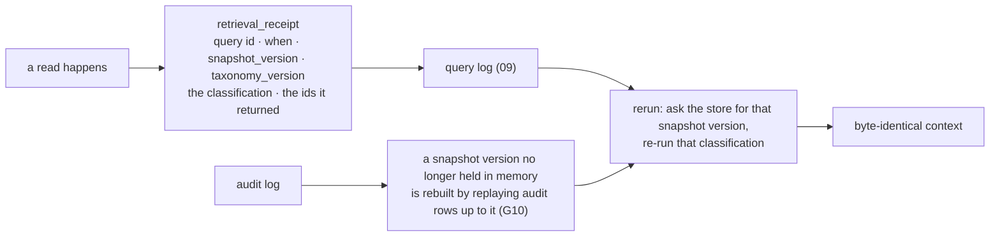
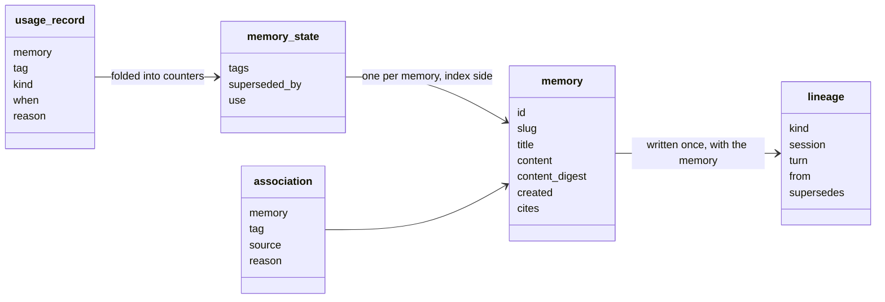
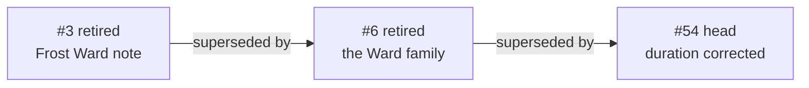
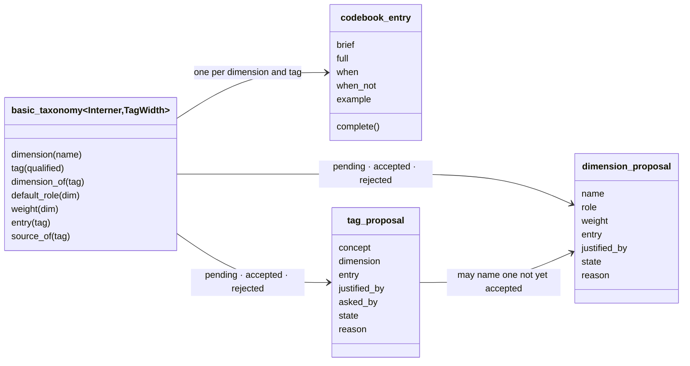
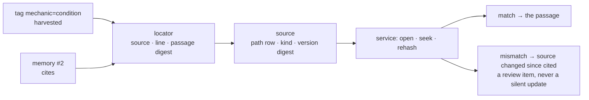
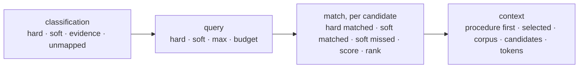

# Problem-Space Memory — Technical Specification

**Section 01: Domain model**
Status: draft · Owner: Debith · Last updated: 2026-09-10

The value types every later section is written against, and the laws that hold between them.
Pybind-free, `constexpr`, no I/O: what [the overview](00_overview.md) states as prose in §4,
this states as structure. Nothing here is exposed to Python — the adapter (10) converts at
the boundary and nowhere else.

The rule for the whole series is pygim's: the general thing, templated over its id, word,
interner or storage type, with a default alias for the common case, even while one
instantiation exists.

[Section 01a](01a_model_by_scenario.md) shows these types at work: every scenario of section
00a as a class diagram of the types it touches and a sequence diagram of the calls.

---

## 1. Built from what pygim already has

Almost none of the machinery is new. The memory core is a small set of value types over the
mapping toolkit; where an existing component fits, it is used rather than restated.

| From | Used here for | Why it fits |
|---|---|---|
| `mapping::basic_hashed_interner<Id>` | dimension names, qualified tag names | every distinct string once, dense ids in insertion order, append-only so an id never moves — exactly what a closed vocabulary needs |
| `mapping::basic_id_set<Id, Word>` | candidate sets, a memory's tags, a query's hard and soft sets, `seen` | the retrieval core is set arithmetic over an index (G9); this *is* the set arithmetic, with popcount counting that answers a size without building the set |
| `pathlike::basic_path_table<Interner>` | the source inventory's paths | hash-consed paths, one row per distinct path, a 32-bit row id a source record can hold |
| `utils/hash.h` — `fnv1a`, `mix64`, `combine` | content digests, tag hashing | one definition of every hash the tables share |

### 1.1 The types at a glance

| Term | What it is |
|---|---|
| `basic_id` | a strong id: one template, a phantom tag per kind, so ids of different kinds never mix |
| `digest` | the 128-bit hash of a memory's content — its identity |
| `dimension` | one question about a piece of knowledge whose answers form a closed list |
| `value` | one allowed answer to a dimension's question |
| `tag` | a dimension and one of its values, together — held as a single dense `tag_id` |
| `taxonomy` | the whole controlled vocabulary: dimensions, tags, their codebook entries and proposals |
| `codebook_entry` | the six-part description every dimension and value must carry |
| `tag_proposal` | a concept with no tag yet, pending a human's accept or reject |
| `dimension_proposal` | a whole new question — a dimension with its role, weight and entry — pending the same review |
| `memory` | the content record: title, text, digest, when, lineage, citations — written once |
| `memory_state` | the index side of a memory: its tags, whether it has been superseded, its counters |
| `lineage` | where a memory came from: written, ingested, merged or corrected |
| `association` | one link from a memory to a tag, with a source and a reason |
| `usage_record` | one observation that a memory was admitted, included, useful, or its steps held |
| `counters` | the folded view of usage records for one memory |
| `locator` | a citation into a source: which source, which line, and the hash of the passage |
| `source` | an inventoried document the domain rests on — cited, never ingested |
| `write_request` | everything a write carries: tags, decision, what was seen, proposals, citations |
| `classification` | a request turned into hard and soft tags, with evidence and unmapped concepts |
| `query` | the tags a retrieval filters and orders by, plus its limits |
| `match` | one candidate with the tags that admitted and ranked it, and its score |
| `context` | what the agent receives: a procedure first, then ranked matches within a budget |
| `retrieval_receipt` | what a retrieval depended on, so it can be rerun later and give the same answer |

---

## 2. What a dimension is, in practice

A **dimension** is one question you could ask about a piece of knowledge, whose answers form
a closed list. That is all it is. A **value** is one allowed answer; a **tag** is the question
and the answer together.

| Dimension | The question it asks | Allowed answers |
|---|---|---|
| `domain` | what field is this knowledge about? | dnd · programming · writing |
| `artifact` | what kind of thing is it about? | spell · monster · subclass · encounter |
| `task` | what activity is it for? | design · critique · balance · troubleshoot · explain |
| `purpose` | what is the thing *for*? | offensive · defensive · control · utility · exploration · social |
| `action_economy` | what does it cost to use? | action · bonus_action · reaction · ritual |
| `kind` | what sort of knowledge is this? | reference · principle · procedure · example · decision · preference |

A memory answers as many of these questions as apply, and may give **several answers to one**:
a spell note that is both offensive and defensive carries `purpose=offensive` and
`purpose=defensive`. A memory that says nothing about cost carries no `action_economy` value
at all, and that silence is meaningful — it is knowledge that applies whatever the cost.

Three consequences shape everything below.

- **Hard means the question filters.** If a query asks `task=design` and a memory never
  answers the `task` question with `design`, it cannot be a candidate — no score can rescue
  it. That is what makes the context small (G5).
- **Soft means the question orders.** A soft answer that matches adds its dimension's weight;
  one that does not match costs nothing. Nothing is admitted or excluded by a soft tag.
- **Questions are independent.** `purpose` and `action_economy` are separate axes, not a
  hierarchy: knowing one tells you nothing about the other. That independence is what the
  vocabulary study measures (overview §4.8) and what keeps the answer set a flat product
  rather than a tree.

### 2.1 Strong ids

One template, several phantom tags, so a `tag_id` cannot be passed where a `memory_id`
belongs and the compiler says so.

```cpp
template <class Tag, std::unsigned_integral T = std::uint32_t> class basic_id;
```

| Alias | Width | Why that width |
|---|---|---|
| `memory_id` | 32 bits | a corpus outgrows a human's attention long before it outgrows this |
| `tag_id` | 16 bits | the seed vocabulary has 53 values; a whole tag set stays inside one or two words |
| `dimension_id` | 8 bits | ten dimensions, and facet analysis does not reward many more |
| `source_id` | 32 bits | one per inventoried document |
| `session_id` | 64 bits | lineage names the session that wrote a memory |

Each is default-constructed to an invalid sentinel, is trivially copyable, and orders with
`<=>`, so ids sort and hash without a helper.

### 2.2 The content digest

A memory's identity is the hash of its content: it is what "identical content is already a
head" compares (overview §4.5), and what a derived store rebuilds from files by (principle
12). `basic_digest<Bits>` is `Bits / 64` lanes of `mix64`; `digest` is the 128-bit default.

**Decision 2.2 — 128 bits, not 64 and not SHA-256.** Sixty-four bits gives a birthday
collision near 1e-10 for a corpus of 100 000 — small, but the failure mode is a *silently
dropped write*, so the second lane is cheap insurance. SHA-256 would add a dependency for a
boundary this is not: a repository's trust model is git's, and an adversary who can rewrite
the associations file does not need a hash collision. If §11 gives a repository a trust
boundary of its own, the digest becomes a policy — hence the template parameter.

### 2.3 A tag is one id

**Decision 2.3.** A facet is one characteristic of division (overview §4.8), so a value
belongs to exactly one dimension. The taxonomy therefore interns the *qualified* name —
`purpose=defensive`, not `defensive` — into a dense `tag_id`, and keeps one flat array
beside it saying which dimension each tag answers.



The alternative is a tag as a `(dimension, value)` pair. That costs a two-level lookup on
every single index access, and makes a memory's tag set a set of pairs rather than a bitmap.
One id instead buys three things at once: a posting list can be keyed by a plain integer, a
memory's tags are a bitmap over a small dense range, and `dimension_of` answers "which
question does this tag answer" with an array index.

### 2.4 Why the index is kept in both directions

A retrieval asks two different questions, and no single table answers both.

- *Which memories carry `purpose=defensive`?* — the **inverted index**, `tag_id → id_set<memory_id>`.
  Without it, finding candidates means scanning every memory in the corpus and testing its
  tags. With it, the work is proportional to the *answer*, not the corpus: candidate selection
  on a 100 000-memory store touches only the few thousand ids that carry the query's tags.
  This is what makes retrieval "set arithmetic over an index" (G9) rather than a search.
- *What does memory #2 carry?* — the **forward map**, `memory_id → id_set<tag_id>`. Scoring
  and explanation need this one: a score is the query's soft set intersected with the
  memory's tags, and an explanation names the tags matched and missed. The inverted index
  could answer it only by visiting every tag.

Both are `id_set`s, so both questions are answered with bitmap algebra rather than lookups.
The snapshot (04) owns them; this section only fixes the shapes.

Here is a whole read, and why each step is the step it is:



Union within a dimension and intersection across them is the candidate rule of the overview's
§4 stated as algebra: *for every hard dimension, at least one of the query's values*. Written
with `id_set`, it is a handful of word-at-a-time operations, and the counting variants answer
*how many* candidates there would be without building the set at all.

---

## 3. Weights and scores are integers

**Decision 3.** No floating point on the ranking path.

| Type | Unit | Range |
|---|---|---|
| `weight_t` | milli-units — 2.0 is 2000, 0.5 is 500 | a dimension's weight |
| `score_t` | a sum of weights | exact, order-independent |
| semantic score | micro-units | `[0, 1'000'000]`, so the ranker (06) cannot smuggle a float in |

Determinism (G1) says the same store state and classification give an identical context
across runs and processes. A score built by summing `float` weights breaks that quietly:
`a + b + c` and `c + b + a` can differ in the last bit, that bit changes one comparison in the
ranking key, and the context reorders. Integers remove the class of bug rather than making it
unlikely.



The ranking key is a total order over distinct memories — negated score, then negated count
of soft hits, then the id, which always terminates the comparison.

### 3.1 Reproducing a retrieval later

Exact arithmetic is only half of determinism. The store is alive: writes land, LEARN promotes
associations, counters rise, the vocabulary grows. "Same store state" is therefore a
*version*, not a wish, and reproducing yesterday's context means pinning the three things a
retrieval actually depended on.

| Pinned | Type | Why it moves |
|---|---|---|
| the index | `snapshot_version` — monotonic, bumped by every commit | every WRITE, LEARN promotion and CURATE publishes a new snapshot |
| the vocabulary | `taxonomy_version` | an accepted proposal adds a tag; weights and roles can be revised |
| the question | the `classification` itself | the agent classifies, and a later agent may classify differently |

So every retrieval leaves a receipt, and the receipt is what a rerun consumes:



The version survives restarts. At startup the store reads the last version back from the
audit log and publishes the rebuilt snapshot under it, so a receipt written before a restart
still names a version the store can rebuild (section 00a, Scenario 0).

Two properties make the rerun exact rather than approximate. Content never changes, so a
memory that was in the context still says what it said (principle 1). And the ranking is
integer arithmetic over the snapshot's bitmaps, so no part of the result depends on machine,
build or iteration order.

**This constrains a decision the overview leans toward.** Open decision §10 there suggests
breaking rank ties with usage counters once they exist, instead of the memory id. Counters
rise on *reads*, which are asynchronous observations that no snapshot version pins. Adopting
that tie-break would make a retrieval depend on state that reruns cannot reproduce — unless
counters are folded into the snapshot version, which would mean publishing a snapshot on
every read. The reproducible options are: keep the id tie-break, or version the counters at
a coarse interval and pin that version in the receipt. Section 04 decides; the receipt is
what makes the cost visible.

---

## 4. Knowledge



| Type | Field | What it is |
|---|---|---|
| `memory` | `slug` | the file's name, stable across a chain's versions |
| | `content_digest` | the identity (§2.2) |
| | `created`, `title`, `content` | written once, never edited |
| | `cites` | the passages it leans on (§6) |
| | `origin_of` | its `lineage` |
| `lineage` | `kind` | `seed`, `written`, `merged`, `corrected` |
| | `session`, `turn` | which session wrote it |
| | `corpus`, `revision` | which corpus file it was ingested from — a path row and the file's digest, since a corpus file is not a source (overview §4.3) |
| | `supersedes` | the memories this one replaces |
| `memory_state` | `tags` | the associations, forward-mapped into an `id_set` |
| | `superseded_by` | empty means this is the head of its chain |
| | `use` | counters: admitted, included, useful, and when last |
| `association` | `source` | `seed`, `written`, `curated`, `learned`, `proposed` |
| `usage_record` | `kind` | `admitted`, `included`, `useful`, `steps_held` |

**Decision 4.1 — the content record has no mutable field.** Principle 1 says content is
written once and everything that moves lives in the index, so a memory's tags, its head
marker and its counters are not fields of `memory`: they are `memory_state`, which the
snapshot materialises from the associations and lineage edges the index holds. Two things
follow. A store persists `memory` and never rewrites a stored one — the files store can treat
a memory file as append-only, and a derived store can rebuild every byte of it from the
canonical file by content hash. And *only the head is findable* stays a single comparison at
read time rather than a walk, without that convenience costing content its immutability.

A chain is the `supersedes` edges read forwards:



**Decision 4.2 — a procedure is not a type.** A procedure (overview §4.10) is a memory whose
`kind` tag is `procedure` and whose content is its ordered steps. The first-slot lookup needs
only *which artifact and task it is for*, and those are already tags, so retrieval (04) keeps
an `(artifact, task) → memory_id` map over heads with that kind. `steps_held` is a
`usage_kind` for the same reason: a procedure is a memory like any other, and the store
contract should not grow a case for it.

---

## 5. Vocabulary



`codebook_entry` is the six-part shape of overview §4.8; `complete()` is what the service
checks — every part present, none of them the name repeated. A `tag_proposal` names a concept
that has no id yet, which is why it carries a string where everything else carries a `tag_id`.

A write meets one missing value at a time; a vocabulary study (overview §4.8) proposes whole
*questions* — `purpose`, with its role, its weight and its codebook entry. That is a
`dimension_proposal`, reviewed by the same human in the same way, and a `tag_proposal` may name
a dimension that is itself still pending, so a pack is accepted as one reviewed set rather than
dimension by dimension in the right order.

The taxonomy is append-only, like the interner beneath it: accepting a proposal adds a tag and
nothing ever removes one, so an id in a memory written last year still resolves. A value
withdrawn from use is marked, not deleted — the same reason a memory is superseded rather
than edited.

---

## 6. Provenance



A `locator` is trivially copyable and holds no path of its own — the inventory owns the path
once, so moving a document is one edit rather than thousands. A `source` holds a
`path_table::row`, its kind, and the digest of the whole document when it was inventoried.

The write is a value type too, because the service's four checks (overview §4.5) are written
against it:

| `write_request` | What it carries | Which check reads it |
|---|---|---|
| `tags` | the agent's classification | closed vocabulary |
| `decision` | `new`, or `supersedes <id>` | no unread write · head only |
| `seen` | the candidates the writer read | no unread write |
| `content` | the text | identical content |
| `proposals` | concepts with no tag, each a codebook entry | shape check |
| `cites` | locators into sources | resolvable check |
| `session`, `turn`, `reason` | what the audit row keeps | — |

---

## 7. Retrieval



`soft_missed` is carried because every inclusion must be explainable (G2), and because the
open decision on miss-versus-neutral scoring (overview §10) changes how a miss is *scored*,
not whether it is *recorded*. `context::procedure` is the first slot of overview §4.10 —
outside the ranked list, at most one.

Every retrieval also leaves a `retrieval_receipt` — query id, when, `snapshot_version`,
`taxonomy_version`, the classification, and the ids returned. It is what §3.1's rerun
consumes, and it is the only part of retrieval that is written rather than read.

---

## 8. Laws

Each is a `static_assert` in `tests/static/memory_proofs.cpp`, compiled into the extension so
a build that breaks one does not link — and proven over more than one instantiation (both
interner engines, 16- and 32-bit tag widths). A law is only worth stating if something real
breaks without it, so the third column says what.

| Law | Statement | What breaks without it |
|---|---|---|
| Tag bijection | `tax.tag(d, v)` is injective, and `dimension_of(tag(d, v)) == d` | two values share an id: a query for `purpose=defensive` returns memories tagged `kind=decision`, and no explanation can tell you why |
| Tag stability | interning a new value never changes an existing `tag_id` | accepting a proposal silently re-labels every memory written before it — the corpus rots on vocabulary growth |
| Candidate membership | a memory is a candidate iff every hard dimension of the query is answered by one of its values | either irrelevant memories enter the context (G5 gone) or relevant ones are dropped, and both are invisible without a full scan to compare against |
| Score exactness | `soft_score` is the sum of the matched tags' dimension weights, whatever the order | two processes rank the same candidates differently; a rerun of yesterday's query returns a different context (§3.1) |
| Score monotonicity | adding a tag never lowers a memory's score | LEARN becomes unsafe to run unattended: promoting a true association could push a memory *out* of the context it was useful in (G6) |
| Rank total order | the ranking key has no ties between distinct memories | the context's order depends on the sort algorithm's stability — reproducible on one machine, not on another |
| Head uniqueness | at most one memory in a chain has an empty `superseded_by` | a corrected memory and its correction both answer the same query, and the reader cannot tell which is current |
| Chain acyclicity | `supersedes` edges form a forest | "show me the history of this memory" never terminates |
| Digest identity | `content_digest` is the digest of `content` | the duplicate check passes on content that differs, and a derived store rebuilt from files disagrees with the canonical one |
| Entry completeness | a `tag_id` exists only if its codebook entry is complete | a tag with no boundary sentence: two sessions file the same memory two ways, which is the classification mismatch of overview §4.7 |
| Proposal exclusivity | a proposal is accepted once, and then its tag exists | the same concept enters the vocabulary twice under two ids, splitting every memory that used it |

Proving these at compile time rather than testing them is the pygim rule (definition of
done): a law stated in a comment drifts, a law stated as a `static_assert` cannot.

---

## 9. Layout

```text
src/_pygim_fast/memory/
  core/
    ids.h            basic_id, basic_digest, weight_t, score_t, rank_key
    taxonomy.h       basic_taxonomy, codebook_entry, role, tag_proposal, dimension_proposal
    knowledge.h      memory, memory_state, lineage, association, usage_record, counters
    provenance.h     locator, source, write_decision, write_request
    retrieval.h      classification, query, match, context, retrieval_receipt
  ext.memory.toml    adds tests/static/memory_proofs.cpp to the extension's sources
tests/static/
  memory_proofs.cpp  the laws above
```

Namespace `pygim::memory` for `core/`, `pygim::memory::strategy::<name>` for backends (03),
`pygim::memory::adapter` for the boundary (10). Dependencies flow inward only; no core header
includes pybind11, and none does I/O — `locator` describes where a passage is, and the store
is what opens it.

---

## 10. Worked example

The seed vocabulary, two memories, one query — all integers.

```text
tag ids, in insertion order
  0 domain=dnd        3 task=balance          6 action_economy=reaction     9 tier=mid
  1 artifact=spell    4 purpose=defensive     7 mechanic=damage_mitigation  10 kind=principle
  2 task=design       5 purpose=offensive     8 mechanic=temporary_hp       11 kind=example

memories
  #2  "Shield is the yardstick"   tags {0,1,2,3,4,6,7,9,10}
  #3  "Frost Ward: typed niche"   tags {0,1,2,4,6,7,8,9,11}

query   hard {0,1,2}   soft {4,6,7,9}
```

Candidates: `dimension_of` splits `hard` into `domain{0}`, `artifact{1}`, `task{2}`; each
memory meets all three, so both are candidates — one intersection per dimension over the
inverted index, no strings.

| | soft hits | arithmetic | score | rank key |
|---|---|---|---|---|
| #2 | defensive, reaction, mitigation, mid | 2000 + 1500 + 1000 + 1000 | 5500 | (−5500, −4, 2) |
| #3 | defensive, reaction, mitigation, mid | 2000 + 1500 + 1000 + 1000 | 5500 | (−5500, −4, 3) |

Both carry every soft tag of the query, so the tie falls to the id and `#2` comes first — the
same result the prototype gives with `5.5`, without a float ever existing. Had the query also
carried `kind~principle`, `#2` would score 6000 and the order would come from the arithmetic
rather than the tie-break.

---

## 11. Open decisions

Each with the options as they would actually look, so the choice can be made on the
concrete rather than the abstract.

### 11.1 Does `slug` belong in the core? (03, 11)

| Option | Concretely | For | Against |
|---|---|---|---|
| **In the model** (drafted) | `memory{ slug = "compare-defensive-reactions-to-shield" }`, and the files store writes `memories/compare-defensive-reactions-to-shield.md` | one obvious place; a chain keeps its filename across versions, so a git diff shows a correction as an edit to the file that already existed | the model knows a filename, which no in-memory or SQL store needs; G7 says the domain model is defined without reference to any storage mechanism |
| **In the store** | the files store keeps `memory_id → slug` beside the corpus | the model stays storage-free | every store that shares files needs the same side table, and two stores can disagree about a memory's name |

### 11.2 A query's hard tags: one set, or per dimension? (04)

| Option | Concretely | For | Against |
|---|---|---|---|
| **One `id_set`** (drafted) | `hard = {0, 1, 2}`; the fold calls `dimension_of` on each to group them | one shape for hard, soft and `seen`; a query is one bitmap to log and compare | grouping happens per query, and `dimension_of` is an extra indirection in the hottest loop |
| **Array of small sets** | `hard = [ domain:{0}, artifact:{1}, task:{2} ]` | the candidate fold is a plain loop over dimensions, no lookup; "soften `artifact`" is moving one entry | a second shape to serialise, log and compare; empty dimensions must be represented |

### 11.3 The digest's width (§2.2, 11)

| Option | Concretely | For | Against |
|---|---|---|---|
| **128-bit `mix64` lanes** (drafted) | `content_digest = 8f3a…c201`, 32 hex characters in the file header | no dependency; fast; collision risk negligible at any corpus a human curates | not a cryptographic guarantee, so a shared repository trusts git rather than the hash |
| **A policy parameter** | `basic_memory<Digest = digest128>`; a shared repository instantiates with SHA-256 | the trust decision moves to section 11 where it belongs | two repositories with different digests cannot exchange files without rehashing |

### 11.4 Does `match` carry a semantic score when no ranker runs? (06)

| Option | Concretely | For | Against |
|---|---|---|---|
| **Always present, zero when unused** (drafted) | `match{ soft_score = 5500, semantic_score = 0, final_score = 5500 }` | one type everywhere; the explanation always has the same shape | a field that is always zero in the default configuration, and an explanation line that says nothing |
| **Templated on the ranker** | `basic_match<Ranker>`; the no-ranker instantiation has no such field | nothing unused is stored or explained | the context type becomes templated too, and it reaches the adapter, where the Python surface must stay one type |

### 11.5 What ties a rank when scores are equal? (04, and §3.1)

| Option | Concretely | For | Against |
|---|---|---|---|
| **Memory id** (drafted) | `#2` before `#3` at 5500 each | reproducible forever; a rerun of any past query gives the same order | arbitrary — an older memory wins for no reason a reader can see |
| **Usage counters** | the memory included more often wins the tie | the tie-break carries information, and the overview leans this way | counters rise on reads, which no snapshot version pins, so a rerun cannot reproduce the order unless counters are versioned too (§3.1) |
