# Problem-Space Memory — Technical Specification

**Section 01a: The model, scenario by scenario**
Status: draft · Owner: Debith · Last updated: 2026-09-13

Every scenario of [section 00a](00a_how_a_memory_is_made.md) again, this time in the types of
[section 01](01_domain_model.md). For each one, two small pictures: a **class diagram** of the
types the scenario touches — only the fields it reads or writes, with its concrete values —
and a **sequence diagram** of who calls whom, in order. Ids, versions and texts are the ones
00a uses, so a panel there and a diagram here describe the same moment.

The actors are always the same four: the **Agent** thinks, the **Service** checks and keeps the
books, the **Index** is the snapshot the service reads, the **Store** is where commits land, and
the **Human** governs the vocabulary and reviews in git.

---

## Scenario 0 — Starting up

Startup reads every record type from files and builds the one thing retrieval reads: the
snapshot, with a `memory_state` per memory. The snapshot itself belongs to section 04; its
version is read back from the audit log, not counted from one.

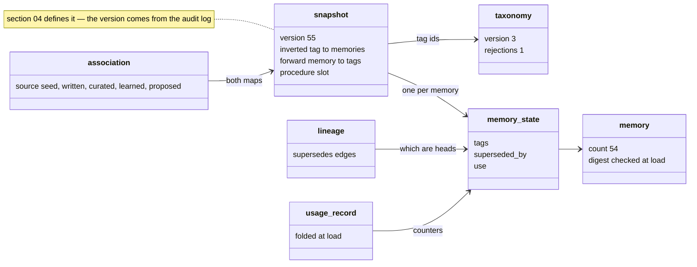

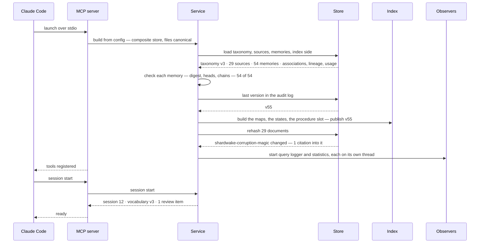

---

## Feature 1 — Preparing a domain

### Scenario 1.1 — The base vocabulary ships with the tool

A fresh repository holds one thing: taxonomy v0, five dimensions, every entry described.

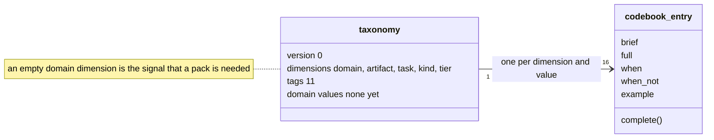

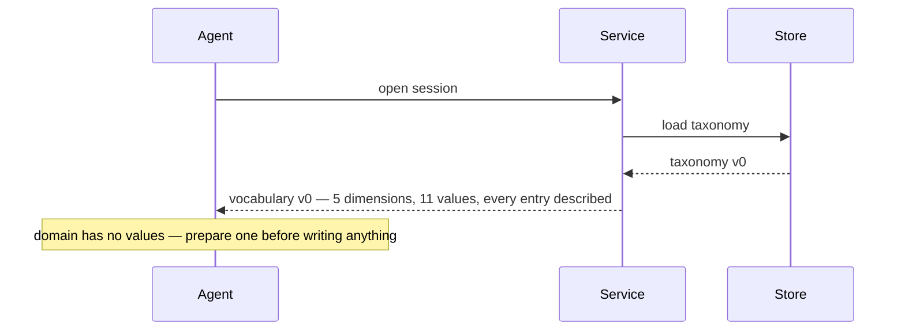

### Scenario 1.2 — The agent prepares the D&D domain

The study's output is a set of proposals — whole dimensions and single values — each carrying
a codebook entry and, where it was read off a document, a locator.

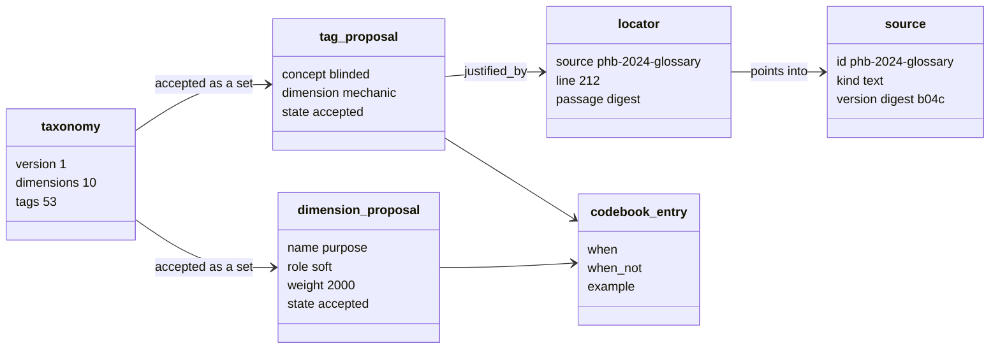

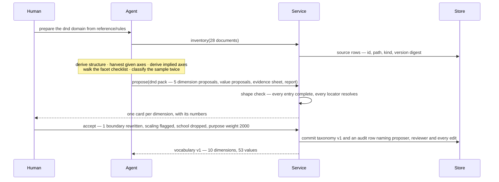

### Scenario 1.3 — A word the vocabulary lacks turns up during work

The write lands at once under the tags that exist; the proposal rides along, pending, and
points into a document the inventory does not hold yet.

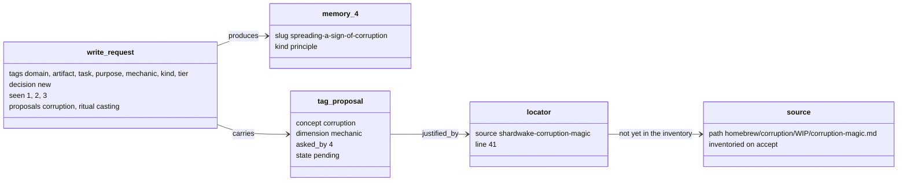

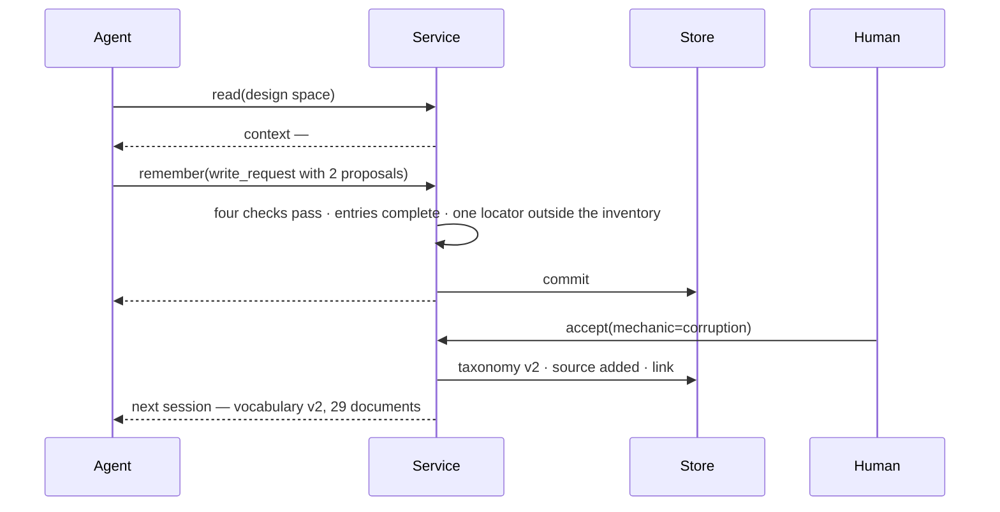

### Scenario 1.4 — A proposal is turned down

A rejection is data too: it is published with the vocabulary so it is not proposed again.

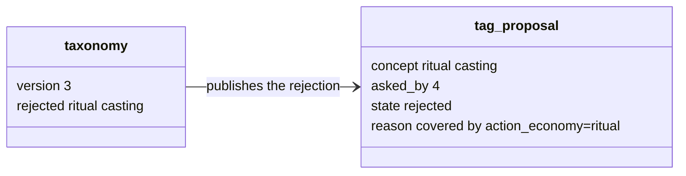

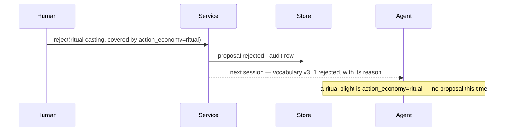

---

## Feature 2 — Create a new spell

### Scenario 2.1 — No memory yet

Three writes in one session, each a `write_request` that becomes a `memory`. The first is the
procedure, found through the locator the study left on `task=balance`.

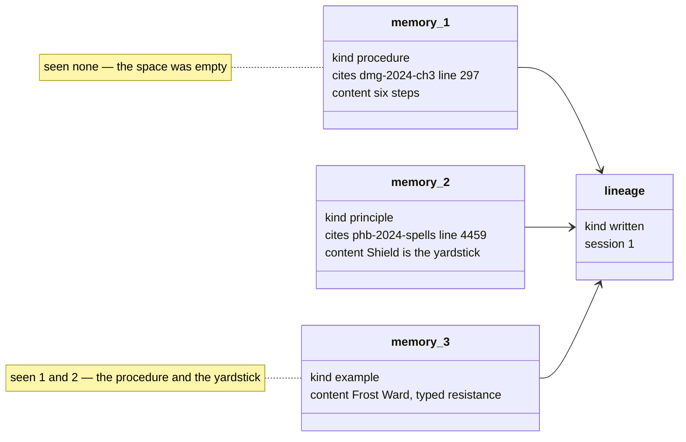

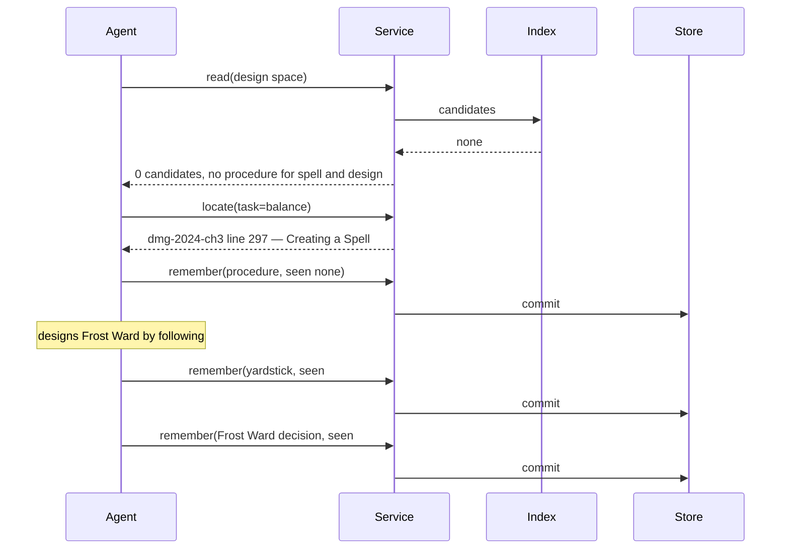

### Scenario 2.2 — A similar spell already has memories

The read returns a `context` with the procedure in the first slot and ranked `match`es after
it; the session ends in two usage records and one new chain.

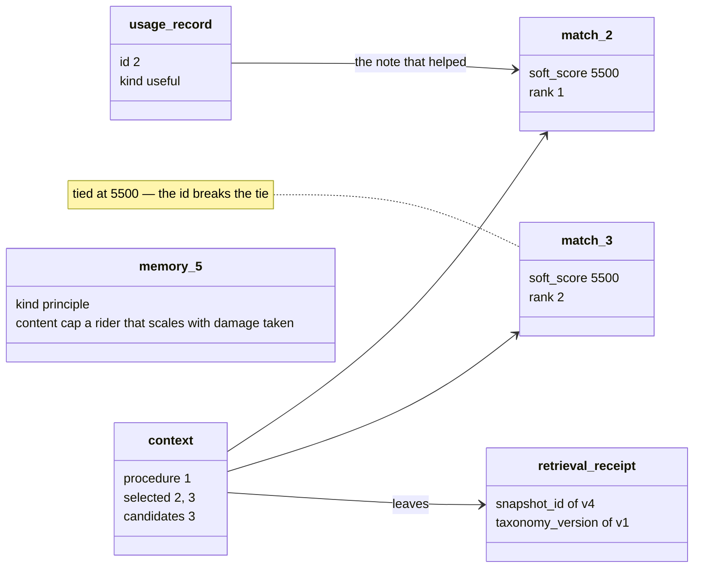

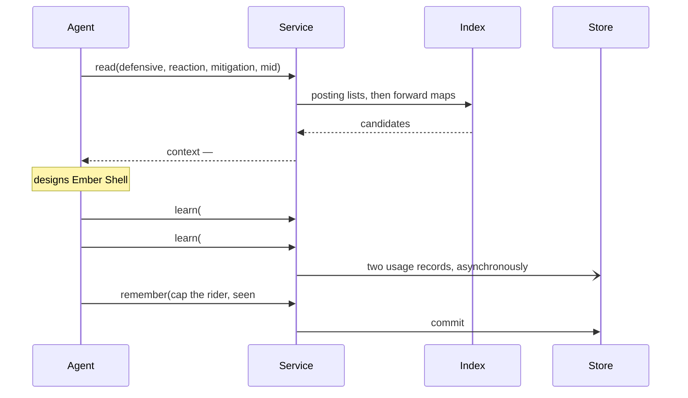

### Scenario 2.3 — A variant of a spell

The one scenario where a check refuses. The refused write and the accepted one differ in two
fields: `decision` and `seen`.

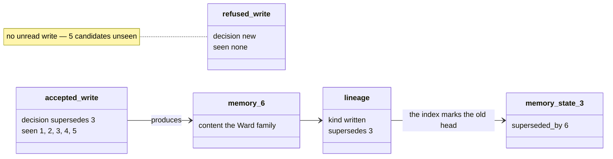

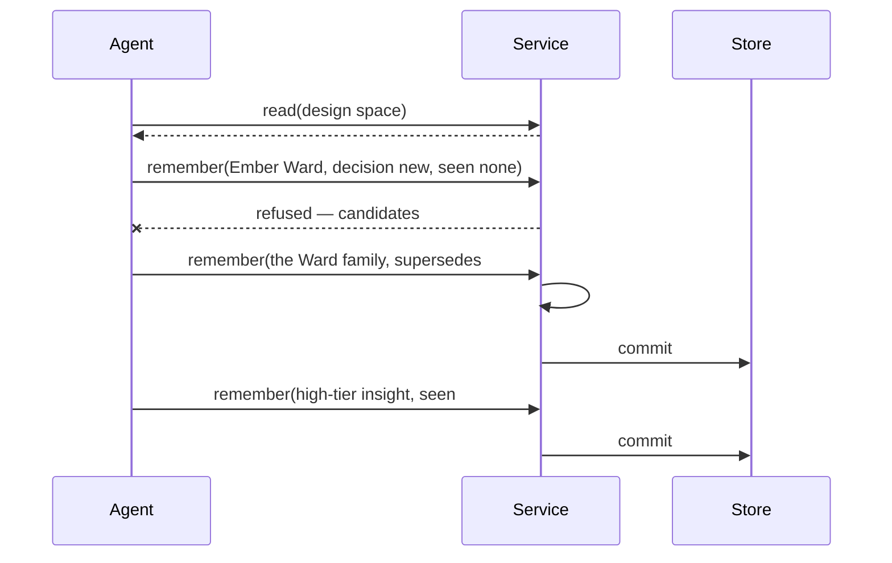

---

## Feature 3 — Balance an existing spell

### Scenario 3.1 — The right note is in a neighbouring space

Nothing is written. Three usage records in three sessions become one learned `association`.

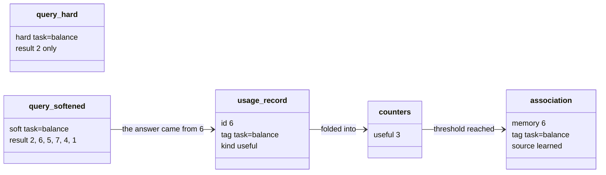

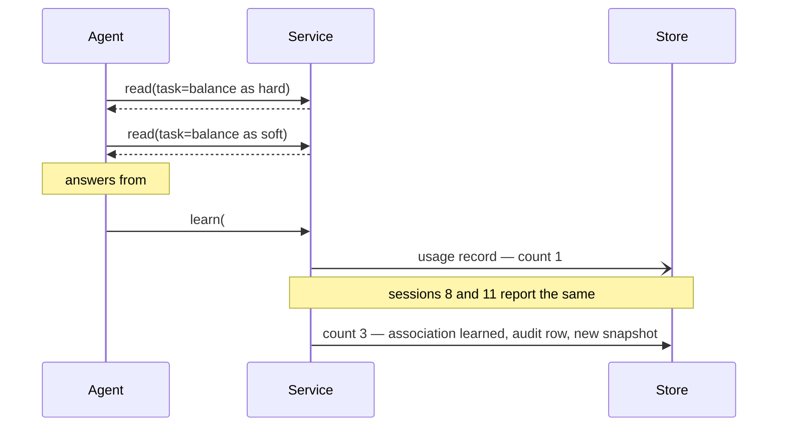

### Scenario 3.2 — The human links a tag directly

The same `association` as a promotion, reached in one step, with a reason in the human's words.

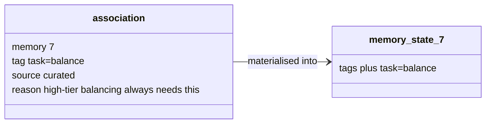

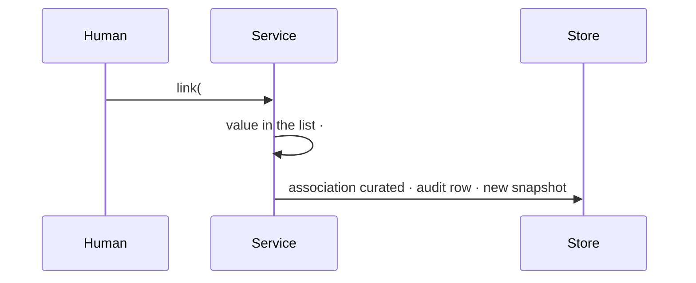

---

## Feature 4 — Bring in a colleague's notes

Ingested memories carry a `lineage` of kind `seed` that names the corpus file — not a source,
because its blocks are memories, not reference text.

```mermaid
classDiagram
    direction LR
    class lineage {
        kind seed
        corpus notes/spells.md
        revision digest
    }
    class memory_8 {
        slug shield-baseline
    }
    class memory_50 {
        slug shield-baseline
    }
    class association {
        source seed
    }
    memory_8 --> lineage
    memory_50 --> memory_8 : supersedes, after the pull
    association --> memory_8
    note for memory_50 "same slug, new content digest"
```

```mermaid
sequenceDiagram
    participant H as Human
    participant S as Service
    participant St as Store
    H->>S: ingest(notes/spells.md)
    S->>S: validate each block against the taxonomy
    S-->>H: line 118 refused — level_band=tier2 is not a value
    S->>St: 42 memories #8 to #49, lineage seed, no look step
    Note over H,St: later — the colleague edits shield-baseline, git pull
    S->>S: next load — known slug, different digest
    S->>St: #50 supersedes #8
```

---

## Feature 5 — Two notes turn out to say one thing

### Scenario 5.1 — An ingested note duplicates a chain

A merge makes one `memory` whose `lineage` supersedes both. The verdict is read from the
lineage of the two sources, not judged.

```mermaid
classDiagram
    direction LR
    class memory_2 {
        lineage written
    }
    class memory_50 {
        lineage seed
    }
    class memory_51 {
        lineage merged
        tags the union
    }
    memory_51 --> memory_2 : supersedes
    memory_51 --> memory_50 : supersedes
    note for memory_50 "seed lineage — no look step was ever expected"
```

```mermaid
sequenceDiagram
    participant A as Agent
    participant S as Service
    participant St as Store
    A->>S: read(balance space)
    S-->>A: #2 and #50, back to back
    Note over A: one point, two chains
    A->>S: merge(#2 #50, merged text, reason)
    S->>St: commit #51, supersedes #2 and #50, union of tags, snapshot v52
    S->>S: verdict — #50 came through ingestion
    S-->>A: #51 · ingested, no read expected
```

### Scenario 5.2 — A critique session writes the same point under another task

The verdict comes from two records: what the later write saw, and what the earlier head
carried at that moment.

```mermaid
classDiagram
    direction LR
    class write_52 {
        tags task=critique
        decision new
        seen 10, 15, 22, 28, 34, 41
    }
    class memory_state_5 {
        tags task=design only
    }
    class memory_53 {
        lineage merged
        tags task=design and task=critique
    }
    memory_53 --> memory_state_5 : supersedes 5
    memory_53 --> write_52 : supersedes 52
    note for write_52 "5 was never in this candidate set — classification mismatch"
```

```mermaid
sequenceDiagram
    participant A as Agent
    participant S as Service
    participant St as Store
    A->>S: read(critique space)
    S-->>A: six of the colleague's notes
    A->>S: remember(cap it, seen those six)
    S->>St: commit #52 — every check passes
    Note over A,St: later, a softened read shows #5 and #52 side by side
    A->>S: merge(#5 #52, merged text, reason)
    S->>St: commit #53, tags from both tasks, snapshot v54
    S->>S: verdict — #5 was not in #52's candidate set
    S-->>A: #53 · classification mismatch · review task=critique's description
```

---

## Feature 6 — A note turns out to be wrong

A correction is a write whose `decision` supersedes the note it corrects; the old record keeps
its digest and its history.

```mermaid
classDiagram
    direction LR
    class write_request {
        decision supersedes 6
        seen 6
        reason duration was wrong
    }
    class memory_54 {
        lineage corrected
    }
    class memory_state_6 {
        superseded_by 54
    }
    class memory_6 {
        content digest unchanged
    }
    write_request --> memory_54 : produces
    memory_54 --> memory_6 : supersedes
    memory_state_6 --> memory_6 : index side
```

```mermaid
sequenceDiagram
    participant H as Human
    participant A as Agent
    participant S as Service
    participant St as Store
    H->>A: #6 says end of your next turn — both spells say start
    A->>S: remember(corrected text, supersedes #6, seen #6)
    S->>S: #6 is the head — yes
    S->>St: commit #54, lineage corrected, #6 superseded, snapshot v55
    A->>S: show #6
    S-->>A: retired · digest unchanged · superseded by #54 · in 23 contexts before
```

## Feature 7 — Close a session

A generalisation is a write whose request names the memories it is drawn from. The service
checks that they are heads and that the generalisation covers them; nothing on the instances
changes except the edge that points back.

### Scenario 7.1 — Three new reactions make one point

```mermaid
classDiagram
    direction LR
    class write_request {
        decision new
        generalises 54 55 56 57
        seen 2 7 54 55 56 57
    }
    class memory_58 {
        lineage written
        kind principle
    }
    class memory_state_55 {
        superseded_by empty
        generalised_by 58
    }
    class memory_55 {
        content digest unchanged
    }
    write_request --> memory_58 : produces
    memory_58 --> memory_55 : generalises
    memory_state_55 --> memory_55 : index side
```

```mermaid
sequenceDiagram
    participant A as Agent
    participant S as Service
    participant St as Store
    A->>S: review(session 13)
    S-->>A: #55 #56 #57 with their tags
    A->>S: read(domain=dnd artifact=spell task=design, purpose~defensive)
    S-->>A: #2 #54 #55 #56 #57 #7
    A->>S: remember(principle, generalises #54 to #57, seen #2 #7 #54 to #57)
    S->>S: #54 to #57 are heads — yes
    S->>S: covers them on every hard dimension — yes
    S->>St: commit #58, generalises #54 to #57, nothing superseded, snapshot v59
```

### Scenario 7.2 — A wider suspicion waits for its case

```mermaid
classDiagram
    direction LR
    class coverage_check {
        for each hard dimension
        every instance value is a generalisation value
        or the generalisation answers any
    }
    class memory_58 {
        artifact spell
        task design
    }
    class instances_54_to_57 {
        artifact spell
        task design
    }
    coverage_check --> memory_58 : reads tags
    coverage_check --> instances_54_to_57 : reads tags
```

```mermaid
sequenceDiagram
    participant A as Agent
    participant S as Service
    participant H as Human
    Note over A: suspects magic items behave the same — no case, so no tag, and nothing is written
    Note over S: had #58 answered artifact=any, coverage would still pass
    H->>H: the diff would show four spells claiming every artifact — review catches it
```
