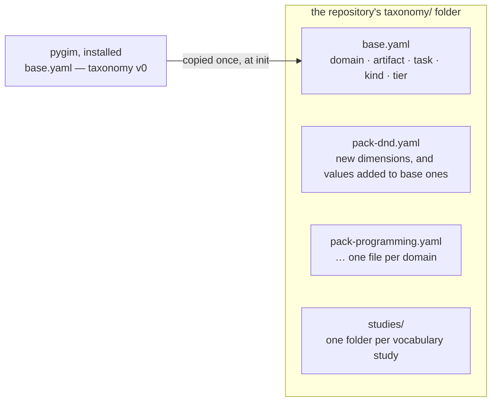
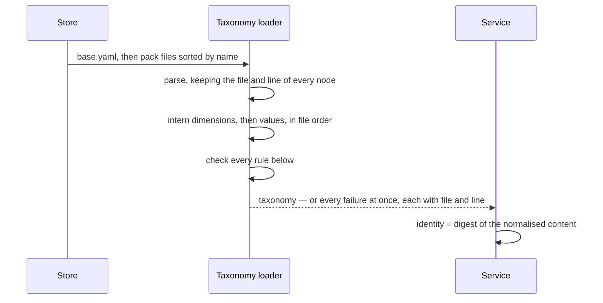
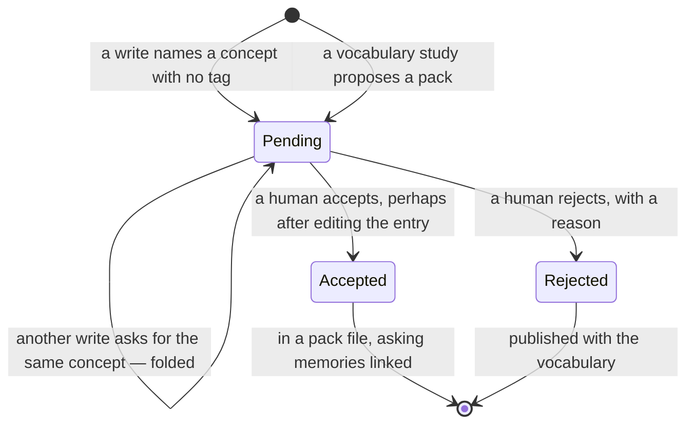
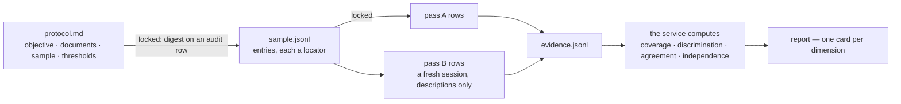
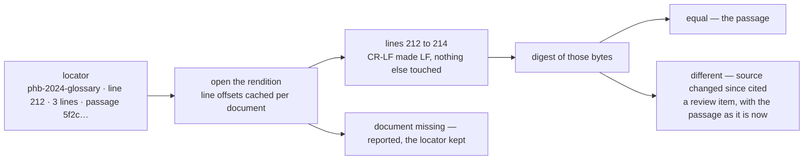

# Problem-Space Memory — Technical Specification

**Section 02: Taxonomy and sources**
Status: draft · Owner: Debith · Last updated: 2026-09-15

How the vocabulary lives on disk, how it is loaded and checked, how it grows, how the
vocabulary study's numbers are computed, and how sources are inventoried and cited. The
types are [section 01](01_domain_model.md)'s; the reasons are [the overview](00_overview.md)'s
§4.6–§4.9. This section adds the mechanics — and, as everywhere, the service only ever does
the mechanical part: it parses, checks, counts and hashes, and never judges a description.

| Scenario | What it needs from this section |
|---|---|
| [0 — starting up](00a_how_a_memory_is_made.md#scenario-0-starting-up) | load and validate the vocabulary; rehash every source |
| [1.1 — the base ships](00a_how_a_memory_is_made.md#scenario-11-the-base-vocabulary-ships-with-the-tool) | the base file, copied into a new repository |
| [1.2 — preparing a domain](00a_how_a_memory_is_made.md#scenario-12-the-agent-prepares-the-dd-domain) | the inventory, the protocol lock, the evidence sheet, the four measures, accepting a pack |
| [1.3 — a word the vocabulary lacks](00a_how_a_memory_is_made.md#scenario-13-a-word-the-vocabulary-lacks-turns-up-during-work) | proposals, folding, accepting one value, growing the inventory |
| [1.4 — a proposal turned down](00a_how_a_memory_is_made.md#scenario-14-a-proposal-is-turned-down) | rejection and its publication |
| [2.1 — no memory yet](00a_how_a_memory_is_made.md#scenario-21-no-memory-yet) | resolving a locator |

---

## 1. The vocabulary on disk

### 1.1 One file for the base, one per pack



The base is **copied** into a repository when it is created, not read from the installed
tool. A newer pygim that ships a revised base therefore changes nobody's vocabulary behind
their back: upgrading is a set of proposals like any other, reviewed and accepted in that
repository (overview §4.6). One file per pack keeps two people growing two domains out of
each other's diffs.

### 1.2 YAML, because the file is mostly prose

A taxonomy file is five parts of prose per entry and a handful of numbers. It is read by the
agent at every session and reviewed by a human in every diff.

| Option | The `kind=procedure` entry, concretely | For | Against |
|---|---|---|---|
| **YAML** (chosen) | `when_not: A single rule, however important — that is a principle.` on its own line; `full: >` folds a paragraph | prose reads as prose; comments allowed; line-oriented diffs; `rapidyaml` is already vendored by pathlike | indentation matters; a stray tab is an error — which the loader reports by file and line |
| JSON | `"when_not": "A single rule, however important — that is a principle."` | the prototype's format; no indentation rules | no comments; every paragraph is one escaped line, so a one-word edit is a whole-line diff |
| TOML | `[dimensions.kind.values.procedure.entry]` then `when_not = "…"` | unambiguous; `tomlplusplus` is vendored too | the nesting that a taxonomy *is* becomes header after header |

What one entry looks like, in full:

```yaml
dimensions:
  kind:
    role: soft
    weight: 0.5
    entry:
      brief: What sort of knowledge this is.
      full: >
        The epistemic type of a memory: a fact, a rule of thumb, a way of doing
        something, an instance, a choice made, or a taste. Two memories about the
        same thing can differ only in kind.
      when: Every memory answers this question.
      when_not: Never to say how good the knowledge is — valence is not kind.
      example: '"Shield is the yardstick" is a principle; "Frost Ward" is an example.'
    values:
      procedure:
        entry:
          brief: Ordered steps by which something is achieved.
          full: >
            How a thing is done in this domain, step by step, for one artifact and
            one task. Placed first in every context for that pair.
          when: The text is a sequence the reader should follow in order.
          when_not: A single rule, however important — that is a principle.
          example: 'Creating a spell: read the space, name it, find its yardstick, …'
```

A value read off a document carries where it was read, as a locator (§5):

```yaml
      condition:
        entry: { brief: …, when: …, when_not: …, example: … }
        source: { doc: phb-2024-glossary, line: 212, lines: 3, passage: 5f2c9e0a1b7d3c44d1e8a0b2c3f47e19 }
```

### 1.3 Names on disk, ids in memory

**Decision 1.3.** Every persisted record names a tag by its qualified name —
`purpose=defensive` — and never by its `tag_id`. Ids are assigned when the vocabulary is
loaded, live in one snapshot, and are never written down.

That one rule removes three problems at once. A file stays readable in a diff. Two
repositories that grew their packs in a different order can exchange memories. And accepting
a proposal can never renumber anything on disk, because nothing on disk has a number. Inside
a process, ids are still stable in the way 01's *tag stability* law requires: loading is
deterministic (§2.1), and interning a new value only ever appends.

### 1.4 Weights are parsed, never converted

The file says `weight: 1.5` because a human writes it. The loader turns that into `1500`
milli-units by reading the digits — `"1.5"` is one, point, five — and never through a
floating-point number. A weight with more than three decimals is refused, naming the file
and line: it cannot be represented exactly, and 01's Decision 3 is that nothing on the
ranking path is approximate, including how it got there.

---

## 2. Loading and checking

### 2.1 Order, and why it matters



Base first, packs by file name, entries in file order: the same files always intern to the
same ids in the same process, which is what makes a snapshot rebuilt from the same files
equal to the one before it. All failures are collected and reported together — a human
fixing a taxonomy by hand should not meet them one restart at a time.

### 2.2 What is checked

| Rule | A failure reads |
|---|---|
| dimension names unique across base and packs | `taxonomy/pack-dnd.yaml:12: dimension "kind" already defined in taxonomy/base.yaml:30` |
| value names unique within a dimension | `taxonomy/pack-dnd.yaml:88: mechanic has "condition" twice (first at line 71)` |
| role is `hard` or `soft` | `taxonomy/pack-dnd.yaml:14: purpose: role "filter" is not hard or soft` |
| weight above zero, at most three decimals | `taxonomy/pack-dnd.yaml:15: purpose: weight 2.0005 has more than three decimals` |
| every entry complete (§2.3) | `taxonomy/pack-dnd.yaml:41: tier: entry has no when_not` |
| a pack's file name names its domain | `taxonomy/pack-dnd.yaml: pack "dnd" adds domain=dnd` — checked, then implied |
| every locator names an inventoried source | `taxonomy/pack-dnd.yaml:73: condition: source "phb-2024-glosary" is not in the inventory` |
| a retired value names what replaced it, if anything did | `taxonomy/pack-dnd.yaml:102: scaling=upcast_scaling retired without a reason` |

### 2.3 What "complete" means, mechanically

The overview left open which parts of a codebook entry the service refuses without. The
service can only check form, so the rule is about form:

| Option | Concretely | For | Against |
|---|---|---|---|
| **brief, when, when_not, example required; full optional** (chosen) | `defensive` may have no `full` — "protects the caster or allies from harm" says it | the boundary sentence is required, and it is the part that fails in the field (overview §4.7) | a dimension could ship without its long explanation — so dimensions get a warning when `full` is missing |
| all five required | every value writes a paragraph | uniform | the paragraph for `tier=mid` restates the brief, and a restated brief teaches nothing |
| brief only | — | cheap | the study's agreement numbers would be measuring guesswork |

A part that is empty, equal to the entry's own name, or equal to another part of the same
entry is refused. Nothing else about a description is judged here; its adequacy is what the
study measures (§4) and what the human reviews.

### 2.4 Identity, and hand edits

`taxonomy_version` is the **digest of the vocabulary's normalised content** — every
dimension, value, role, weight, entry and locator, in load order, with comments and
formatting dropped. Two repositories with the same vocabulary have the same version, a
reformatted file keeps its version, and a merge of two branches that grew different packs
gets a version of its own without either side having to count. The "v3" a person sees is
the number of accepted changes in the audit log; the digest is what a retrieval receipt pins.

A human may edit a taxonomy file by hand — rewording a boundary after a classification
mismatch is exactly the edit the overview hopes for. At startup the loader compares the
digest with the one the last audit row recorded. If they differ and no accept explains it,
the loader appends a row saying so — *vocabulary edited by hand in taxonomy/pack-dnd.yaml* —
so the change has a cause on record (principle 11) without the service standing between the
human and their own file.

---

## 3. Growing the vocabulary

### 3.1 The life of a proposal



**Folding.** Two proposals are the same proposal when their concept names match after
lowercasing and turning spaces into underscores, and they name the same dimension — or both
name none. `Corruption` proposed as a value of `mechanic` by #4 and again by a later write
becomes one pending proposal asked for by both. `corruption` proposed as a new *dimension*
is a different proposal: it is a different question.

**Accepting** one proposal is one commit: the entry — as the human left it after editing —
is written into the pack file, every memory in `asked_by` is linked with source `proposed`,
and the audit row names the proposer, the reviewer and the edits. A proposal whose locator
points outside the inventory inventories that document in the same commit (overview §4.9).

**Accepting a pack** is the same commit over a set: every `dimension_proposal` and
`tag_proposal` the study produced, reviewed together, written into a new pack file at once.
A value proposal may name a dimension that is itself only proposed; the set is accepted or
edited as a whole, so nothing has to be accepted in the right order.

### 3.2 Rejecting, and what the agent is told

A rejection is kept, not deleted, and published with the vocabulary so the agent stops
proposing it. The overview left open whether a rejection may point somewhere.

| Option | Concretely | For | Against |
|---|---|---|---|
| **An optional `see`, which must be an existing tag** (chosen) | `rejected: [{ concept: ritual casting, reason: covered by the existing value, see: action_economy=ritual }]` | the agent learns where the concept *does* live, and a later write files under it without a round trip | the agent might file under `see` where it does not fit; so the service never applies `see` itself — it is advice in the vocabulary, not a rule |
| reason only | `reason: covered by action_economy=ritual` | nothing structured to get wrong | the agent must parse prose to find the redirect, and will sometimes propose again |

### 3.3 Retiring a value

A value that should no longer be used is **retired**, never removed: memories written under
it still carry it, and ids never move. A retired value is left out of the vocabulary handed
to the agent; a write that uses it is refused with `retired, see <replacement>` when the
retirement named one. Removing a value would mean rewriting every association that names it,
which is an edit to history rather than a change to the vocabulary.

---

## 4. The vocabulary study, mechanically

The agent does the study; the service keeps it honest. It locks the protocol before the
first classification, stores the evidence, and computes every number — so the numbers a human
reviews are never the agent's own report of its own work.



**The lock.** The protocol's digest, then the sample's, go on audit rows before the first
evidence row may be stored. An evidence row arriving for a study whose protocol changed after
its lock is refused. That is what "predeclared" means when nobody is watching: the thresholds
cannot move after the numbers are seen, because the service will not compute numbers against
a protocol newer than its evidence.

**One evidence row** is `{ entry: <locator>, pass: A | B, dimension, values: [...] }`. A study's
files live under `taxonomy/studies/<pack>-<date>/` and are kept with the vocabulary version
they produced, so a later re-study can be compared with this one.

### 4.1 The four measures, exactly

Dimensions are multi-valued — a spell can be offensive *and* control — so the textbook
single-label formulas are adapted. Each is computed in a fixed order and reported to three
decimals; these are reporting numbers, not ranking ones, so they may be floating point.

| Measure | For dimension *d*, over *n* sampled entries |
|---|---|
| Coverage | entries with at least one value in *d* in pass A, divided by *n* |
| Discrimination | the largest share any single value of *d* takes among the entries that have one |
| Agreement | for each value *v*, Cohen's κ of the yes/no judgement "carries *v*" between pass A and pass B; the dimension's κ is the mean over values that either pass used at least once. The per-value κ and the entries behind each disagreement are reported, because they point at one boundary sentence |
| Independence | for dimensions *d* and *e*, Cramér's V over a contingency table in which each entry contributes a total weight of 1, split evenly across its (value of *d*, value of *e*) pairs |

### 4.2 Worked, on six spells

Pass A and pass B for `purpose`:

| Spell | Pass A | Pass B |
|---|---|---|
| Shield | defensive | defensive |
| Web | control | control |
| Ray of Frost | offensive, control | offensive |
| Chill Touch | offensive, control | offensive |
| Fireball | offensive | offensive |
| Misty Step | utility | utility |

Coverage is 6 / 6 = 1.000. The largest share is `offensive`, carried by 3 of 6 in pass A:
0.500, well under 0.90.

Agreement, value by value. For `control` pass A says yes on Web, Ray of Frost and Chill
Touch; pass B only on Web. They agree on 4 of 6 entries, so observed agreement is 0.667;
chance agreement is 0.5 × 1/6 + 0.5 × 5/6 = 0.500; κ = (0.667 − 0.500) / (1 − 0.500) = 0.333.
`offensive`, `defensive` and `utility` agree everywhere, κ = 1.000 each; `exploration` and
`social` were never used and are left out. Purpose's κ is (1 + 0.333 + 1 + 1) / 4 = 0.833.

The number the human reads is not 0.833, it is the one below it: both disagreements are
entries where pass A added `control` *beside* `offensive` and pass B did not. That is a
boundary question — does a condition that rides on damage make a spell control? — and the
fix is one `when_not` sentence (00a, Scenario 1.2, Panel 9).

Independence, `school` against `purpose`, six other spells:

| | offensive | defensive |
|---|---|---|
| evocation | 3 (Fireball, Ray of Frost, Magic Missile) | 0 |
| abjuration | 0.5 (Absorb Elements, half) | 2.5 (Shield, Mage Armor, Absorb Elements, half) |

With row totals 3 and 3, column totals 3.5 and 2.5, the expected cells are 1.75, 1.25, 1.75
and 1.25; χ² = 4.286 and V = √(4.286 / (6 × 1)) = 0.845. Above the predeclared 0.60: knowing
the school almost tells you the purpose, so `school` is not an independent facet — it becomes
a field a locator can carry, not a dimension (00a, Scenario 1.2, Panel 8).

---

## 5. Sources

### 5.1 A source is a text rendition

A locator addresses lines, and a PDF or a web page has no stable lines. So what the inventory
holds for every source is a **text rendition**: a text file is its own rendition; a PDF or a
web page is converted once, when it is inventoried, and the rendition is stored in the
repository beside the record of where it came from.

| Kind | What is inventoried | Its digest covers |
|---|---|---|
| text, markdown | the file itself, by path | the file |
| pdf | `sources/<id>.txt`, extracted when inventoried; the original's path kept | the rendition, and the original separately |
| web | `sources/<id>.txt`, fetched and extracted once; the URL and the fetch time kept | the rendition |

A web page that changes after it was inventoried therefore changes nothing a locator points
at. Re-fetching is re-inventorying: a new rendition, a new digest, and every locator into the
old one reported for review.

### 5.2 The inventory record

```yaml
# sources/inventory.yaml
phb-2024-glossary:
  kind: text
  path: reference/rules/PHB 2024 - Rules Glossary - 5.5E
  version: b04c7d19e2a355f0c8e1d24b9a6f3170
  inventoried: 2026-09-10T08:12:44Z
shardwake-corruption-magic:
  kind: markdown
  path: homebrew/corruption/WIP/corruption-magic.md
  version: c8e2a17b04d9f3e65a1c2b8d7e4f9012
  inventoried: 2026-09-10T15:02:03Z
```

A path is relative to the project's root, and resolved through a `path_table` row (01, §6),
so a hundred locators into one document share one path. Not relative to the inventory file: a store
may live outside the checkout — on its own branch, or in a user directory (03 §9.1) — and every
worktree of the project must resolve the same document from the same path.

### 5.3 Resolving a locator



The passage digest covers exactly the cited lines, with CR-LF turned into LF so a Windows
checkout and a Linux one agree, and nothing else normalised: a changed word *is* a changed
passage. Line offsets are computed once per document and kept for its digest, so resolving is
a seek and a hash.

**When a passage has changed**, the overview's rule is to report and never update silently.
One cheap help goes with the report:

| Option | Concretely | For | Against |
|---|---|---|---|
| **Suggest where it went** (chosen) | the rendition is scanned for a window of 3 lines whose digest equals the old passage: *moved to line 230* | an insertion above a passage — the commonest edit — becomes a one-click review | a suggestion only; nothing moves until someone accepts it |
| report only | *changed since cited* | nothing to get wrong | every inserted paragraph costs a human a search |

### 5.4 At startup, and when a source grows

Startup rehashes each rendition whole (00a, Scenario 0). A changed document is listed with
every citation into it — tag locators, memories' `cites`, pending proposals — and each becomes
a review item; passages themselves are checked only when someone resolves them. The inventory
grows the way the vocabulary does: a proposal or a write whose locator names an uninventoried
document is accepted together with an inventory record for it (§3.1).

### 5.5 Derived structure

What the agent finds when it reads a document — its chapters, a glossary and its terms,
entries that repeat a shape — is stored as `sources/<id>.structure.json`, every item carrying
a line, and bound to the rendition's digest. When the digest changes the structure is marked
stale rather than trusted: it was read off text that no longer exists. The service stores it
and checks the binding; building it is the agent's work (overview §4.9).

---

## 6. Laws

| Law | Statement | What breaks without it |
|---|---|---|
| Deterministic load | the same taxonomy files intern to the same ids, in the same process order | a snapshot rebuilt from unchanged files differs from the one before it, and a rerun of yesterday's query ranks differently |
| Names persisted, ids never | no file holds a `tag_id` | accepting one proposal renumbers every association on disk, and two repositories cannot exchange a memory |
| Exact weights | a weight's milli-units equal its decimal text, with no conversion in between | `0.1 + 0.2` enters the ranking path through the parser, and 01's integer guarantee is void from the first line |
| Content identity of the vocabulary | `taxonomy_version` is a function of the normalised content only | reformatting a file changes the version, and every receipt pinned to it stops being rerunnable |
| Retire, never remove | a value once accepted stays in its file, marked if withdrawn | memories written under it stop resolving; history is edited instead of extended |
| Locked before measured | no evidence row is accepted for a protocol changed after its lock | thresholds move after the numbers are seen, and the study measures nothing but the wish to pass |
| Passage exactness | a locator resolves to equal only when the cited bytes are equal, line endings aside | a reworded rule still reads as the rule that was cited |

---

## 7. Open decisions

### 7.1 What a session is handed (10)

| Option | Concretely | For | Against |
|---|---|---|---|
| **Everything, every session** (drafted) | base and every pack, every entry in full — about 12 kB of YAML for the seed | the agent can classify anything without a second call | grows with every pack; a repository with ten domains spends context on nine it will not touch |
| Base plus a pack index | dimension names and briefs for every pack, full entries only for the base; `vocabulary(pack=dnd)` for the rest | small by default; the domain is usually known from the first request | one more round trip, and a request that spans two domains needs two |

### 7.2 Which agreement statistic (02, this section)

| Option | Concretely | For | Against |
|---|---|---|---|
| **Per-value Cohen's κ, averaged** (drafted) | purpose κ = 0.833, with control at 0.333 shown beneath it | every number points at one value, and so at one entry to rewrite | an average over values treats a rare value as heavily as a common one |
| Krippendorff's α with Jaccard distance | one α for purpose over the set-valued judgements | built for set-valued codes; one principled number | the number no longer points at a value, so the review still needs the per-value table |

### 7.3 Who makes pass B (02)

| Option | Concretely | For | Against |
|---|---|---|---|
| **A fresh agent session** (drafted) | session 2 gets the descriptions and the locked sample, and nothing from session 1 | cheap; repeatable; measures exactly whether the descriptions carry the meaning | two sessions of one model may share its blind spots |
| The human, on a subsample | 15 of the 60 entries, for hard dimensions and weights of 1.5 and above | the stronger measurement: a second kind of reader | costs the human an hour per pack, and a smaller sample widens the uncertainty |

---

## Appendix — taxonomy v0, as shipped

The base every repository starts from. Values marked — are added by packs.

| Dimension | Role | Weight | Brief | Values, and the boundary each one draws |
|---|---|---|---|---|
| `domain` | hard | 1.0 | The field the knowledge belongs to. | — one per pack |
| `artifact` | hard | 1.0 | What is being made or examined. | — the pack says what this domain makes |
| `task` | hard | 1.0 | What the knowledge is for doing. | **design** — making something new, not judging it · **critique** — judging a thing that exists, not changing it · **evaluate** — measuring against a standard, not an opinion · **troubleshoot** — finding why a thing fails, not improving a working one · **explain** — making a thing understood, not changing it |
| `kind` | soft | 0.5 | What sort of knowledge this is. | **reference** — a fact that can be looked up · **principle** — a rule of thumb, not a sequence · **procedure** — ordered steps, not a single rule · **example** — one instance, not a generalisation · **decision** — a choice made and why, not a rule for all cases · **preference** — a taste, not a correctness claim |
| `tier` | soft | 1.0 | The level or maturity the knowledge applies to. | — the pack says how this domain bands level |
