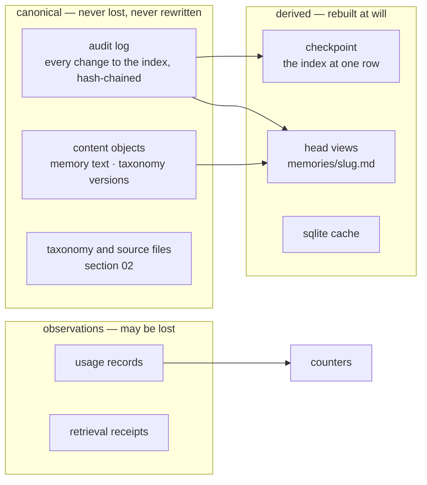
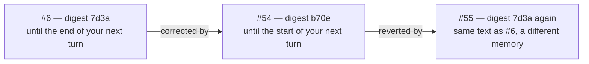
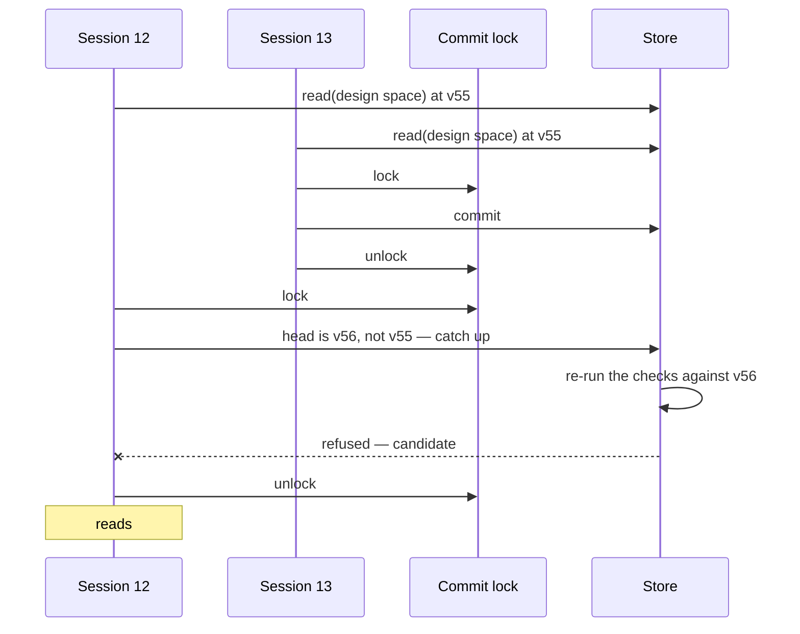
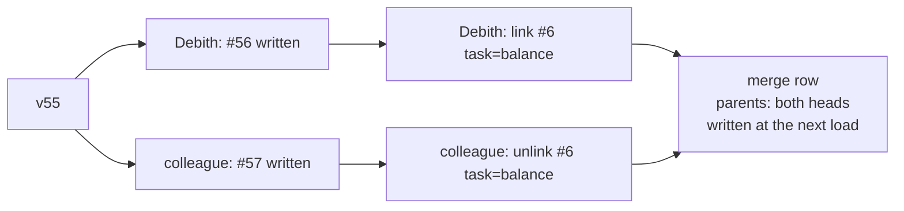
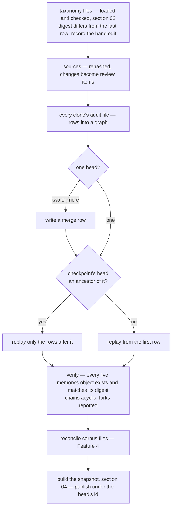
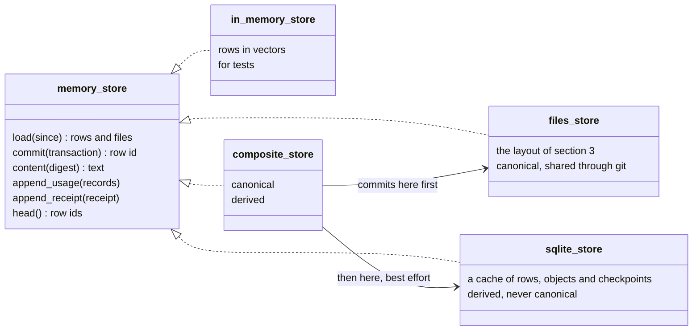

# Problem-Space Memory — Technical Specification

**Section 03: Store**
Status: draft · Owner: Debith · Last updated: 2026-09-15

What is written down, in what form, and how it survives the three things that happen to a
memory repository in real use: a process dying mid-commit, two sessions writing at once, and
two people's copies being merged by git. The types are [section 01](01_domain_model.md)'s;
the vocabulary's files are [section 02](02_taxonomy_and_sources.md)'s; this section is
everything else on disk.

| Scenario | What it needs from this section |
|---|---|
| [0 — starting up](00a_how_a_memory_is_made.md#scenario-0-starting-up) | the load: replay, checks, checkpoint, the version that survives restarts |
| [2.1–2.3 — writing](00a_how_a_memory_is_made.md#feature-2-create-a-new-spell) | the commit: its point of no return, and the checks re-run under the lock |
| [3.1 — learning](00a_how_a_memory_is_made.md#scenario-31-the-right-note-is-in-a-neighbouring-space) | usage records that may be lost, and a promotion that may not |
| [4 — a colleague's notes](00a_how_a_memory_is_made.md#feature-4-bring-in-a-colleagues-notes) | ingestion, reconciled by slug and digest |
| [5.1, 5.2 — two notes, one point](00a_how_a_memory_is_made.md#feature-5-two-notes-turn-out-to-say-one-thing) | merges — of memories, and of whole histories |
| [6 — a wrong note](00a_how_a_memory_is_made.md#feature-6-a-note-turns-out-to-be-wrong) | a correction that leaves the old text readable |

---

## 1. What is written down

Three kinds of record, and they are treated differently because they fail differently.



**Decision 1 — the audit log is the index.** Every change to the index side — a write, a
link, an unlink, a promotion, a merge, a retirement, a proposal's state, an inventory change,
a hand edit noticed at startup — is one audit row, and the index at any moment is the rows up
to that moment, replayed. Nothing else about the index is canonical. The overview's G10 asked
that the index as it stood after any audit row can be rebuilt; making the log the only record
makes that a definition rather than a feature.

What is *not* in the log is content: a memory's text is written once into a content object
and the row carries its digest. Rows stay small, and the log stays readable in a diff.

---

## 2. Identity

### 2.1 A row's id is the hash of the row

```text
row = { parents: [row ids], clone, seq, time, op, payload }
id  = digest(parents, clone, seq, time, op, payload)
```

Each row names the row or rows its writer had seen as the head — normally one. Rows therefore
form a chain, and a chain of hashes is tamper-evident and, more usefully here, **mergeable**:
two copies of a repository that each grew their own rows can be joined, and the join has an
identity of its own (§5).

| Name | Is | Seen as |
|---|---|---|
| `row_id` | a row's 128-bit digest | `7f3a91c2…` |
| `snapshot_id` | the `row_id` of the head the snapshot was built at | what a retrieval receipt pins |
| `snapshot_version` | how many rows the head's history holds | the "v55" a person reads |

This refines section 01, where `snapshot_version` alone was what a receipt pinned. A counter
names a moment only inside one copy of a repository: two people who both commit after v55
both reach "v56". The head's digest names the moment everywhere.

### 2.2 A memory is identified by the row that made it

01 took a memory's identity from its content digest. That breaks on one real case — a
correction that is later reverted:



\#55's text is byte-for-byte \#6's, but it is a different memory: different lineage, different
time, different reason, and \#6 must stay retired while \#55 is findable. So:

**Decision 2.2.** A memory's persistent identity is its `key` — the `row_id` of the row that
created it (a write, an ingestion, a merge, a correction). The content digest keeps the two
jobs it is good at: integrity, and the identical-content check, which only ever compares
against current heads. The dense `memory_id` of section 01 is still what a snapshot uses
inside; it is assigned in replay order, lives in one snapshot, and is never written down —
the same rule section 02 gave tag ids. The "#6" a person reads is that dense id.

---

## 3. On disk: the files store

### 3.1 Layout

```text
.memory/
  taxonomy/        base.yaml, pack-*.yaml, studies/          section 02
  sources/         inventory.yaml, renditions, structure     section 02
  objects/7d/3a…   content, addressed by its digest — memory text and frozen taxonomy versions
  audit/<clone>.jsonl        this copy's rows, append-only, hash-chained
  usage/<clone>/<day>.jsonl  observations, append-only
  receipts/<clone>/<day>.jsonl
  memories/<slug>.md         one head view per chain, regenerated
  reviews/session-<n>.md     a session's lessons-learnt report, regenerated
  corpus/                    hand-written memory files for ingestion (Feature 4)
  local/                     never committed: clone id, commit lock, checkpoint, sqlite cache
```

**One audit file per clone.** A clone is one copy of the repository — one person's checkout
on one machine — and it gets a random id when it first opens the repository, kept in
`local/`. Every session on that machine appends to that clone's file, under a lock (§4).
Another person appends to theirs. Two people therefore never append to the same file, and
`git merge` never has a conflicting line to resolve; `*.jsonl merge=union` in
`.gitattributes` is there for the rare hand-copied file, not for normal work.

**Content objects** are the memory text, named by the digest of the text and written by
temp-file-and-rename, so writing one twice is a no-op and a torn write is never visible.
Every distinct taxonomy version is frozen the same way when it is first seen, so a receipt
pinned to an old vocabulary can still be rerun after the files have moved on.

### 3.2 A row, concretely

The write that created \#6 in Scenario 2.3:

```json
{"id":"9c41e2…","parents":["51b0a7…"],"clone":"c-4f1d","seq":212,"time":"2026-09-09T14:03:11Z",
 "op":"write","payload":{"slug":"frost-ward-typed-resistance","title":"The Ward family",
 "content":"7d3a1f…","supersedes":["3c1e88…"],"session":7,"turn":12,
 "tags":["domain=dnd","artifact=spell","task=design","purpose=defensive","kind=example","tier=mid"],
 "seen":["a0e3…","5f21…","3c1e88…","e91c…","b2d7…"],"reason":"the rule was narrower than the preference"}}
```

Tags by name, memories by key, content by digest: nothing in it depends on the order another
copy of the repository happened to load things in.

### 3.3 Head views

`memories/<slug>.md` holds the current head of each chain as a human reads it — a short YAML
header with its key, title, tags and citations, then the text. It is **generated**: rewritten
when the head changes, and the reason it is committed is the diff. A correction appears in
review as an edit to a file that already existed, which is how a person expects to see it
(overview §4.5, step 5).

Because it is generated, a view is never read back as truth. A view whose text no longer
matches its head's content digest was edited by hand — and that is treated as the human's
correction (§3.4).

### 3.4 When a human edits a view

| Option | Concretely | For | Against |
|---|---|---|---|
| **Take it as a correction** (drafted) | at startup, `memories/frost-ward-typed-resistance.md` differs from \#54's text; the store commits a `corrected` write, author *human, file edit*, superseding \#54, reason *edited in memories/frost-ward-typed-resistance.md* | editing the file you are reading is the most natural correction there is, and it gets a cause on record without a tool | the no-unread-write check does not apply — but a supersede of the current head never needed it |
| Report only | a review item: *view edited by hand*, the view regenerated from \#54 on next write | nothing changes without an operation | the human's edit is overwritten the next time the chain moves, which will feel like data loss |

---

## 4. Committing

### 4.1 The row is the point of no return

A commit writes everything a row refers to first — the content object, a new taxonomy file
— and appends the row last. A process that dies before the append leaves an orphan object,
which is harmless: nothing names it, and a later collection may remove it. A process that dies
after the append has committed, completely. There is no state in between that any reader can
see.

### 4.2 Two sessions, one repository

One MCP server runs per session (overview §6), so two open sessions on one machine are two
processes writing to one clone. The commit is serialised by an operating-system lock on
`local/commit.lock`, and — this is the part that matters — the four checks of overview §4.5
are **re-run under the lock** if anything was committed since the snapshot they were checked
against:



Without the re-check, session 12's *seen* list would be true of the snapshot it read and false
of the repository it wrote into, and the no-unread-write guarantee (G14) would hold only for
one session at a time. With it, the guarantee holds for every session sharing a clone.

Another process notices new rows by the size of the audit files, checked before each read —
a `stat` per file — and replays only what it has not seen.

### 4.3 What is synchronous and what is not

| Record | When it is written | If the process dies first |
|---|---|---|
| audit row — write, link, unlink, promotion, merge, retire, accept, reject, inventory | inside the commit, before the call returns | the change did not happen, and the caller was not told it did |
| usage record | by the statistics observer, batched | a few observations are lost; counters are slightly low |
| retrieval receipt | by the query logger, batched | that read cannot be rerun from its receipt |

A promotion (Scenario 3.1) is the one place the two meet: three usage records reach the
threshold, and the association they justify is committed as an audit row carrying the
evidence it was promoted on. Replay applies the row; it never recounts usage, so a lost usage
record can delay a promotion but never undo one.

---

## 5. When git merges two histories

Two people work in their own clones, then one pulls the other's. The files merge cleanly —
separate audit files, content addressed by digest — and the store is left with two heads:



The next load finds two heads and writes a **merge row** whose parents are both of them. Its id
is the digest of the sorted parents, so whoever merges first — and in whichever direction —
produces the same row: merging A into B and B into A gives the same snapshot.

Replay walks the rows in topological order, breaking ties by row id. Two things need a rule
because two people can disagree about them concurrently:

| Concurrent pair | Rule | In the example above |
|---|---|---|
| a link and an unlink of the same association | **add wins**: an unlink removes only the links it had seen; a link it had not seen survives | the colleague's unlink had not seen Debith's link, so \#6 keeps `task=balance` |
| two supersedes of the same head | **both survive, and the chain is marked forked** | two corrections of \#6 are two heads; both are findable and a review item says the chain forked |

A forked chain is a recollection failure between people rather than between sessions, and it
is resolved the way Feature 5 resolves any other: someone reads both and merges them. The store
shows both rather than choosing, because choosing would mean discarding one person's work on a
rule neither of them saw. Section 01's head-uniqueness law is therefore amended: it holds along
any single line of history, and a fork created by a merge is reported, never silently resolved.

What a merge cannot do is run the no-unread-write check across people who had not seen each
other's rows. That is inherent — nobody can read what does not exist yet — and it is exactly the
duplicate Feature 5 finds and names.

---

## 6. Loading

Scenario 0, as the store runs it:



**The checkpoint** is the index as it stood at one row — associations, heads, the dense id map
— kept in `local/`. It is trusted only when its row is an ancestor of the current head, and then
only the rows after it are replayed. Deleting it costs one full replay and changes nothing else.

**Content is loaded lazily.** The snapshot keeps each memory's digest, title and token estimate;
the text is read from its object when a context is actually built. A corpus of a hundred
thousand one-kilobyte memories is a hundred megabytes nobody needs in memory to answer a query.

**Ingestion** of hand-written corpus files reconciles by slug and digest, as Feature 4 draws: an
unknown slug is an ingestion row, a known slug with a new digest is a supersede, and an unchanged
block is nothing at all. A block that fails the vocabulary is named by file and line, and the
others land.

---

## 7. The contract, and its strategies



`memory_store` is a C++ concept, as `BackendPolicy` is for the persistence module, and the
service is `MemoryService<Store>`: the strategy is chosen at compile time and a new one is a new
type under `strategy/`, not a flag. The composite commits to the canonical store — the commit
point — and then to the derived one; a derived store that falls behind is noticed at load by its
head and rebuilt. An MSSQL strategy, for a team that wants its history in a database it already
runs, would be another derived store over the same rows, built on the persistence module.

---

## 8. Laws

| Law | Statement | What breaks without it |
|---|---|---|
| Commit point | a change is visible if and only if its row is durable, and everything the row names was written before it | a crash leaves a row pointing at text that does not exist, and the next load cannot build a snapshot |
| Replay determinism | the same set of rows replays to the same snapshot, whatever order the files were read in | two machines holding the same repository disagree about what a query returns |
| Merge symmetry | merging A into B and B into A produce the same merge row and the same snapshot | the snapshot a receipt names depends on who pulled first |
| Add wins | an unlink removes only associations its row had seen | a colleague's cleanup silently erases a link they never knew existed |
| Forks are shown | a chain with two heads after a merge keeps both findable and is reported | one person's correction disappears on a rule neither person saw |
| Checked where committed | the four checks run against the head the row will follow, not the one the caller read | two sessions on one machine write the duplicate the no-unread-write check exists to prevent |
| Derived is disposable | deleting `local/` and the cache and loading again yields the same `snapshot_id` | a stale cache is quietly believed, and the index is whatever it last remembered |
| Loss tolerance | deleting every usage and receipt file never changes a `snapshot_id` | an observation, which may be lost by design, turns out to have been load-bearing |

---

## 9. Open decisions

### 9.1 Where the repository lives — settled

Anywhere, and found the same way from every worktree. A project may keep its store in three
places, and every command and the MCP server find it in one order: an explicit `--root`;
`$PYGIM_MEMORY_ROOT`; `git config pygim.memory`; a `.memory` directory above the working
directory.

| Where | Concretely | For | Against |
|---|---|---|---|
| **An orphan `memory` branch** | a worktree of its own beside the project, `pygim-memory/`, named by `git config pygim.memory` | shared through the project's own remote; independent of code branches, so every worktree on any branch sees one memory; still reviewed in diffs | a second branch to push and pull |
| **A user-level directory** | `~/.local/share/pygim/memory/pygim/` (the platform's user data directory) | nothing in the project's git at all | stays on one machine unless copied |
| Inside the project | `pygim/.memory/`, committed | memories branch with the code they are about | only the branch that carries it has a memory — a project with several worktrees on several branches has several, or none |

`git config` is what makes a store global to a project: git keeps it in the clone's shared
configuration, so one `oo memory setup` points every worktree at the same store. The server is
registered once, at user scope and without a root, and finds each project's store from the
directory the host starts it in. A consequence for sources (02 §5.2): a store outside the checkout
cannot hold paths relative to itself, so an inventory path is relative to the project's root.

### 9.2 Whether head views are committed (11)

| Option | Concretely | For | Against |
|---|---|---|---|
| **Committed** (drafted) | `memories/frost-ward-typed-resistance.md` changes in the same commit as the row that superseded it | the review happens where people already review — the diff | two people superseding one chain conflict in the view file; either side can be taken, since the next load regenerates it, but git still stops to ask |
| Generated into `local/` only | nothing under `memories/` in git | no generated file ever conflicts | the diff shows JSON rows and object hashes, which no one reviews |

### 9.3 When orphan objects are collected (03)

| Option | Concretely | For | Against |
|---|---|---|---|
| **Never automatically** (drafted) | `memory gc` lists objects no row names and removes them on request | nothing is deleted by surprise; orphans are rare — only a crash between object and row makes one | a repository that crashes often keeps a few kilobytes it does not need |
| At every load | objects no row names are removed before the snapshot is built | always tidy | an object written by another session that has not yet appended its row would be deleted under it |
