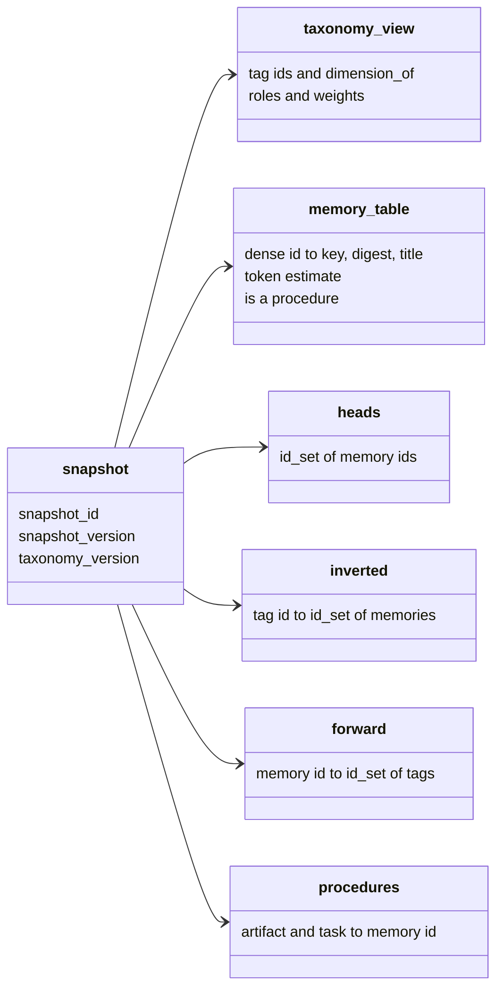
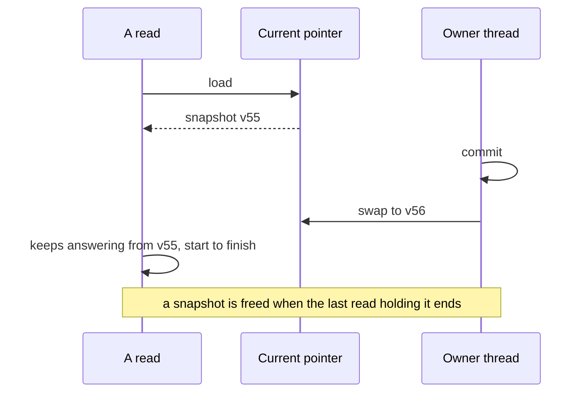
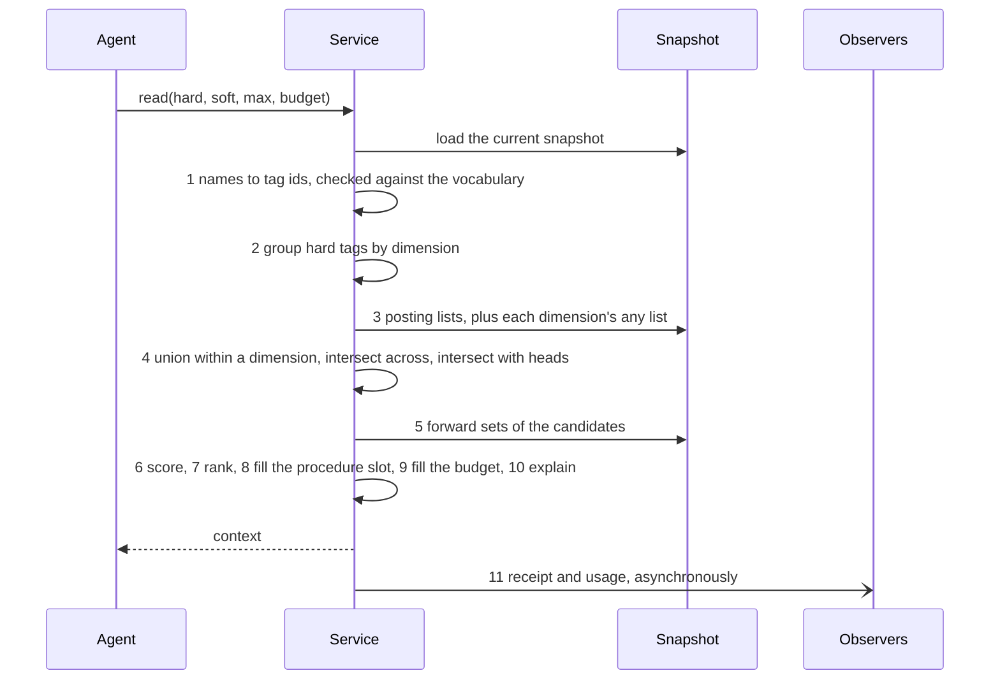
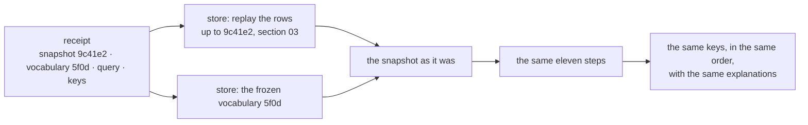

# Problem-Space Memory — Technical Specification

**Section 04: Index and retrieval**
Status: draft · Owner: Debith · Last updated: 2026-09-11

The snapshot every read answers from, how a new one is published without stopping readers,
and a read from the first tag to the receipt it leaves. Section 01 fixed the types and the
arithmetic; section 03 fixed what the snapshot is built from. This section is the part the
prototype's demo and evaluation test, and it must reproduce them.

| Scenario | What it needs from this section |
|---|---|
| [0 — starting up](00a_how_a_memory_is_made.md#scenario-0-starting-up) | building the snapshot from replayed rows |
| [2.1 — no memory yet](00a_how_a_memory_is_made.md#scenario-21-no-memory-yet) | an empty candidate set, and an empty procedure slot |
| [2.2 — a similar spell](00a_how_a_memory_is_made.md#scenario-22-a-similar-spell-already-has-memories) | scoring, the tie, the procedure placed first |
| [2.3 — a variant](00a_how_a_memory_is_made.md#scenario-23-a-variant-of-a-spell) | the candidate set the no-unread-write check compares `seen` against |
| [3.1 — a neighbouring space](00a_how_a_memory_is_made.md#scenario-31-the-right-note-is-in-a-neighbouring-space) | softening a dimension, and why the procedure slot empties when it is softened |
| every scenario | the receipt, and rerunning it |

It also settles five questions left open earlier:

| Left open in | Question | Settled as |
|---|---|---|
| overview §10 | wildcard or multi-tagging for "applies to every value" | a reserved `any` value, hard dimensions only (§3.2) |
| overview §10 | scoring a soft dimension the memory does not match | neutral (§3.4) |
| 01 §11.2 | a query's hard tags: one set or per dimension | one set, grouped at query time (§3.1) |
| 01 §11.5 | what breaks a tie | the dense id (§3.5) |
| overview §10 | several procedures for one artifact and task | the earliest is placed; the others rank, and the pair is flagged (§3.6) |

---

## 1. The snapshot



| Part | What it answers | Built from |
|---|---|---|
| `taxonomy_view` | which dimension a tag answers, its weight, its default role | the taxonomy files (02) |
| `memory_table` | a dense id's key, digest, title, token estimate, whether it is a procedure | write, ingest and merge rows (03) |
| `heads` | which memories are findable | lineage in the same rows: a memory superseded or retired leaves the set |
| `inverted` | which memories carry a tag | association rows, replayed with add-wins (03 §5) |
| `forward` | which tags a memory carries | the same rows, the other way round |
| `procedures` | the head procedure for an artifact and task | memories in `heads` tagged `kind=procedure` |

Counters are not in the snapshot. They rise on every read, which no snapshot version pins, and
a ranking that depended on them could not be rerun (01 §3.1). They live with the statistics
observer and are shown, never ranked on.

### 1.1 Postings over every memory, masked by heads

| Option | Concretely | For | Against |
|---|---|---|---|
| **All memories, masked** (chosen) | `inverted[purpose=defensive] = {2, 3, 6}` still holds retired \#3; candidates are intersected with `heads` at the end | a supersede changes one word in `heads`, not every posting list the old memory was in | one more intersection per read |
| Heads only | superseding \#3 removes it from every list that holds it | nothing to mask | a supersede touches as many lists as the memory has tags, and a rerun at an older snapshot needs the lists as they were |

The masked form is also what makes a rerun cheap: the snapshot at an older head differs from
today's mostly in `heads`.

---

## 2. Publishing a snapshot

Readers never wait. The current snapshot sits behind one `std::atomic<std::shared_ptr<const snapshot>>`;
a read loads it once and uses that snapshot from its first step to its receipt, whatever is
committed meanwhile. The service's owner thread is the only writer: it builds the next snapshot
and swaps the pointer (principle 13).



**Building the next snapshot copies only what changed.** Each posting list and each memory's
tag set is held behind its own `shared_ptr<const id_set>`, and the memory table is a vector of
shared fixed-size chunks. A write that tags a new memory with nine tags copies nine posting
lists, one chunk of the table and the `heads` set, and shares everything else with the
snapshot before it.

| Option | Concretely | For | Against |
|---|---|---|---|
| **Copy what changed** (chosen) | \#56 with nine tags: nine lists copied, forty-four shared | a commit costs in proportion to what it changed | the shared structure is more code, and needs a test that it equals a full build |
| Rebuild on every commit | replay every row into a fresh snapshot | one code path, the same one startup uses | a commit costs in proportion to the whole corpus |

Startup always builds in full; every later snapshot is built incrementally and must equal the
full build of the same rows — a law checked by test (§5).

---

## 3. A read, step by step



### 3.1 Tags and dimensions — steps 1 and 2

Every name in the query is looked up; an unknown one is refused with the vocabulary's nearest
entries, and a retired one with its replacement (02 §3.3). A read must name at least one hard
tag: a query with no hard tag admits every head, which is the unrestricted retrieval the whole
design exists to avoid (G5).

Hard tags stay one `id_set`, as section 01 drafted, and are grouped by `dimension_of` at the
start of each read. Grouping costs one array lookup per hard tag — a handful per query — and
keeps one shape for everything a query holds and a receipt records. The per-dimension array
remains the fallback if a benchmark ever shows the grouping in a profile.

### 3.2 Candidates, and `any` — steps 3 and 4

For each hard dimension, the union of the query's values' posting lists; across dimensions, the
intersection; and finally the intersection with `heads`.

Some knowledge applies to every value of a hard dimension — *every reaction spell needs an
unambiguous trigger* holds whether you are designing, critiquing or balancing.

| Option | Concretely | For | Against |
|---|---|---|---|
| **A reserved `any` value** (chosen) | the memory carries `task=any`; a query for `task=balance` finds it through `inverted[task=any]` | a value added to `task` next year — `playtest` — finds it too; the explanation says *matched task=any* | an agent may reach for `any` when it means *most*; the codebook entry's `when_not` says so, and a memory included often but rarely useful shows it in the counters |
| Multi-tagging | the memory carries `task=design`, `task=critique`, `task=balance` | no special case anywhere | the day `task=playtest` is accepted, every "all tasks" memory silently stops answering it |

`any` is interned in every hard-by-default dimension when the vocabulary loads, with a generated
codebook entry. It exists for memories only: a *query* naming `any` is refused, because "must
answer this question somehow" is a different request that nobody has needed. And `any` never
scores — in a query that softens its dimension it simply does not match — or generic memories
would outrank specific ones on every read.

### 3.3 Scores — step 6

For each candidate, the soft score is the sum of the weights of the dimensions its matched soft
tags answer, in milli-units (01 §3). With a ranker configured (06), its score arrives in
micro-units and the final score is

```text
final = soft_score × 1 000 000 + semantic_weight × semantic_score
```

in units of 10⁻⁹, with `semantic_weight` in milli-units — two integer products and a sum, no
division, no rounding. With the seed weights the smallest soft step is 500 milli-units, which is
500 000 000 in these units, while a ranker at weight 1.0 contributes at most 1 000 000 000: the
semantic score can reorder within a tier and move a memory up at most two of the smallest soft
steps. That is the prototype's rule, *the semantic stage mostly reorders within a tag tier and
can never admit a memory that failed the hard filter*, made exact.

### 3.4 A soft tag the memory does not carry

Settled as **neutral**, the overview's leaning: a missed soft tag scores zero, whether the memory
carries another value in that dimension or none. The two reasons that decided it are the ones the
overview gave — adding a tag can never lower a rank, so LEARN stays safe to run unattended (G6),
and knowledge that is silent on a question is not punished for being general. The miss is still
recorded in the explanation (`soft_missed`), so the day an evaluation shows contradiction ties
near the top, miss scoring is a change to step 6 alone.

### 3.5 The rank, and what breaks a tie — step 7

The key is 01's: negated final score, negated soft hits, dense id. The id is what breaks a tie,
and 01 §11.5 asked whether usage counters should instead. They should not, for the reason
section 01 §3.1 found: counters are not pinned by any snapshot, so a counter tie-break would make
yesterday's receipt return today's order. The dense id is assigned in replay order, so within one
snapshot it is creation order — an older memory wins a tie, which is at least a reason a reader can
see.

### 3.6 The procedure slot — step 8

| The query's hard tags | The slot |
|---|---|
| exactly one `artifact` value and one `task` value, and a head procedure exists for the pair | that procedure, placed first and removed from the ranked list |
| the pair has no procedure | empty — Scenario 2.1's cue to derive one |
| two artifact values, or `task` softened | empty, and the explanation says why: the pair is not determined |
| two head procedures for the pair — two chains, or a fork after a merge | the earlier by dense id; the other ranks normally, and a review item says the pair has two |

Two procedures for one pair is a duplicate by definition — a procedure is *the* way a thing is
done — so it is a recollection failure to be merged, not a choice for the retriever to make well.

### 3.7 The budget — step 9

The procedure goes in first, and its tokens count. Then the ranked matches in order: one that
does not fit the remaining budget is skipped and the walk continues, so a short memory further
down may still fit; the walk stops at `max_memories`. If the procedure alone exceeds the budget it
is still the context, alone, with `over_budget` set — a procedure is never cut, and the caller
learns that its budget is smaller than the domain's way of working. A memory's token estimate is
the prototype's: its content length in bytes over four, at least one.

### 3.8 Explanation, receipt, usage — steps 10 and 11

Each selected match carries the tags that admitted it, the soft tags matched and missed, and
every term of its score (G2). The receipt — snapshot id, taxonomy version, the query by name, the
keys returned, the time — and one usage record per candidate admitted and per memory included
leave through the event bus to the query logger and the statistics observer, after the context has
been returned. A slow disk delays the log, never the agent.

---

## 4. Worked, end to end

Scenario 2.2's read, at snapshot v4, with a budget of 600 tokens:

```text
query   hard   domain=dnd  artifact=spell  task=design
        soft   purpose=defensive  action_economy=reaction  mechanic=damage_mitigation  tier=mid
        max 8, budget 600
```

| Step | Result |
|---|---|
| 1–2 | hard grouped as domain {dnd}, artifact {spell}, task {design} |
| 3–4 | domain ∩ artifact ∩ task = {1, 2, 3, 4}; ∩ heads = {1, 2, 3, 4} |
| 5–6 | \#2: 2000 + 1500 + 1000 + 1000 = 5500 · \#3: the same, 5500 · \#4: tier=mid 1000 · \#1: 0 |
| 7 | \#2 (−5500, −4, 2), \#3 (−5500, −4, 3), \#4 (−1000, −1, 4), \#1 (0, 0, 1) |
| 8 | one artifact, one task, and \#1 is the head procedure for (spell, design): slot = \#1, taken out of the ranking |
| 9 | \#1 180 tokens · \#2 95 · \#3 110 · \#4 240 would make 625 > 600, skipped · total 385 |
| 10–11 | context: \#1, then \#2, \#3; receipt names v4's id, the vocabulary digest, the query, and the three keys |

\#4 — the corruption note — was a candidate, because it answers every hard question, and was not
included, because it matched one soft tag and did not fit. Both facts are in the explanation, which
is what G2 asks for.

---

## 5. Rerunning a receipt



Nothing a read depends on is missing from that picture: the rows are canonical, content is
immutable, the vocabulary version is frozen, and every number is an integer. This is also how the
prototype's evaluation becomes a test — each of its queries, run once, leaves a receipt, and the
C++ implementation is correct when it reruns every receipt to the prototype's answer.

---

## 6. Laws

| Law | Statement | What breaks without it |
|---|---|---|
| Candidates are heads | no retired or superseded memory is ever a candidate | a corrected note and its correction both answer, and the reader cannot tell which is current |
| Candidate algebra | union within a dimension, then intersection across, equals 01's candidate rule | the index and the rule disagree, and only a full scan could tell |
| `any` is exact | a memory carrying `d=any` meets every hard value of `d`, and `any` never adds to a score | generic knowledge either vanishes from new values or outranks specific knowledge everywhere |
| Exact score | the final score is the integer formula of §3.3, evaluated without division | two processes rank the same candidates differently |
| One slot | the procedure slot holds at most one memory, it is the head procedure for the query's single artifact and task, and it is not repeated below | a context opens with the wrong way of working, or with two |
| Budget kept | the selected memories' tokens fit the budget, or the context is the procedure alone with `over_budget` set | a caller's budget is quietly exceeded, or its procedure quietly cut |
| Immutable once published | a published snapshot never changes | a read sees half a commit |
| Incremental equals full | the snapshot built by copying what changed equals the one a full replay of the same rows builds — tested, since it is a property of two code paths | a long-running service slowly diverges from the one that just restarted |
| Rerun identity | rerunning a receipt returns its keys, order and explanations exactly | the reproducibility of 01 §3.1 is a claim, not a property |

---

## 7. Open decisions

### 7.1 What "admitted" records (09)

| Option | Concretely | For | Against |
|---|---|---|---|
| **One usage record per candidate** (drafted) | a read with 40 candidates writes 40 `admitted` records | the counter means exactly what G12 says | a broad read in a large corpus writes thousands of records nobody reads one by one |
| A count in the receipt, per-memory records only for those included | the receipt says *40 admitted*; 3 `included` records | observations stay proportional to what the agent saw | *times admitted* per memory must be recomputed from receipts when anyone asks |

### 7.2 Memory-to-memory edges, one hop (04, later)

| Option | Concretely | For | Against |
|---|---|---|---|
| **Not in v1** (drafted) | only `supersedes` exists; the yardstick is found because it carries the same tags as the note that relies on it | nothing enters a context except through the tag rule | a note that says *see the yardstick* cannot pull it in when the yardstick is tagged differently |
| Typed edges with one hop | \#6 `relies_on` \#2; a context with \#6 may add \#2 after the ranked matches | the knowledge graph the prototype hinted at | a second admission path beside the hard filter, which G5 exists to keep single |

### 7.3 Posting lists at scale (04, when measured)

| Option | Concretely | For | Against |
|---|---|---|---|
| **`id_set` as it is** (drafted) | a bitmap plus insertion-ordered members per tag | already built, measured, and proven in the mapping toolkit | a rare tag in a very large corpus spends a bitmap on a handful of ids |
| Compressed bitmaps for rare tags | a sorted array under some density, a bitmap above it | memory proportional to the ids held | a second representation inside every set operation; decided only when a benchmark under `benchmarks/` shows the need |
