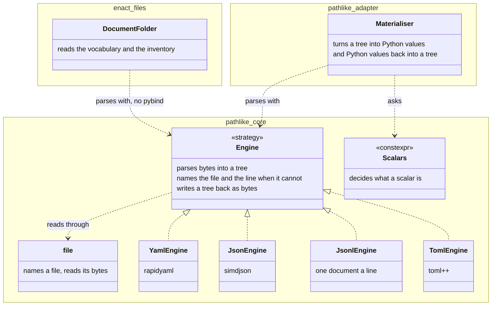

# pathlike: the open engine registry

How `pygim.path(...)` knows which decoder handles a file, why that set of
decoders is open, and what the build proves about it on every compile.

## The rule

**Adding a file format is adding one file.** A format is a header in
`src/_pygim_fast/pathlike/adapter/engines/`, and nothing else is edited: not a
table, not an enum, not a switch, not the Python bindings, not the tests that
sweep the registry.

```
adapter/engines/csv.h              <- the whole contribution
```

```cpp
namespace pygim::pathlike::engines {
struct csv {                                            // struct name == file stem
    static constexpr std::array<std::string_view, 1> exts{".csv"};
    static constexpr std::array<std::string_view, 0> aliases{};
    static constexpr engine_info info{
        .name = "csv", .label = "fast-csv",
        .doc = "CSV via fast-csv: rows as lists, header row as keys.",
        .exts = exts, .aliases = aliases,
    };
    static py::object load(const file& f, detail::KeyCache& keys);   // pybind + parser live here
    static void write(const file& f, py::handle obj);
};
}
```

After the next build: `pygim.path("x.csv")` is a `pathlike.csvpath`,
`.engine == "fast-csv"`, `engine="csv"` and `engine="fast-csv"` both select it,
the error text `unknown engine: 'xml' (known: csv/fast-csv, json/simdjson, ...)`
lists it, the module docstrings describe it, `pathlike.ENGINES` reports it, and
the parametrised tests in `tests/unittests/test_pathlike.py` exercise it.
`pygim stubs` then refreshes the generated block of `pathlike.pyi` (a test
fails until it is run).

## The path value: an RFC 3986 URI behind a pathlib-shaped API

`file` holds a `uri` (`uri.h`): scheme, authority, root flag, and a list of
decoded segments — RFC 3986 decomposed as in Appendix B, recomposed as in
§5.3, normalised as in §6.2 only when asked. A **strategy** policy maps native
path text onto that value and back, the way pathlib's `PurePosixPath` and
`PureWindowsPath` do (pathlib calls this a *flavour*; here it is a strategy): `posix_strategy` ("/" separates, "//" is a preserved
root), `windows_strategy` (both separators; a drive is the first segment as in
`file:///C:/x`, a UNC host is the authority as in `file://srv/share/x`).
`file` is `basic_file<native_strategy>`. Both strategies are stateless policy
types: nothing in them depends on the host, so a build on any platform can
instantiate `windows_strategy` and run its rules in the compile-time proofs —
the Windows rules are provable without a Windows machine.

Consequences that are visible from Python:

- `str()` / `os.fspath()` return pathlib's normalised spelling (`a//b/` ->
  `a/b`, `./x` -> `x`, `""` -> `.`); equality and hashing compare the value.
- `pygim.path()` accepts `file://` URIs (decoded like `Path.from_uri`:
  `file:///abs/x`, `file://localhost/abs/x`; `file://host/share/x` is a UNC
  path on Windows and a ValueError on POSIX, as in pathlib 3.14); a relative
  file URI or any other `scheme://` raises ValueError.
- `.uri` renders an absolute path per RFC 3986 with percent-encoding of every
  non-pchar byte (`file:///a%20b`, `file://host/share/x`); a relative path
  keeps the `file://<path>` spelling.
- `with_name` / `with_suffix` validate their arguments like pathlib.
- `relative_to` / `is_relative_to` follow pathlib's lexical rule: the same
  anchor, and the base's segments a prefix of the path's (`..` is a segment like
  any other), so `/ab/c` is not relative to `/a`. They compare as `==` does, so
  on Windows letter case is not folded where `PureWindowsPath` folds it.
  `PathSet.relative_to` applies the rule to every member, as a set over the same
  table in member order, and raises naming the first member outside the base.
  The parity proofs check both strategies against pathlib at compile time.

Where the RFC and pathlib disagree, pathlib wins for the path algebra and the
RFC governs only the text form. Parsing a *path* collapses empty segments and
keeps `..`, as pathlib does; the RFC's `remove_dot_segments` is not applied
there — it runs only as the explicit `uri::normalized()`. `join` appends
segments, as pathlib does; the RFC's reference resolution would instead
replace the last one. And percent-encoding applies only when rendering or
parsing a URI.

The whole algebra — `name`, `stem`, `suffix`, `suffixes`, `parts`, `parent`,
`parents`, `joined`, `with_*`, `is_absolute`, `as_uri`, `repr`, `ext_key` —
is `constexpr`; only the filesystem half (`exists`, `read_bytes`, `glob`,
`mkdir`, `absolute`, `resolve`, ...) touches `std::filesystem`, at the OS
boundary. `tests/static/pathlike_parity_proofs.cpp` is **generated from
pathlib** (`gen_pathlike_parity_proofs.py`): the generator runs `PurePosixPath`
and `PureWindowsPath` over the corpus and writes one `static_assert` per fact
they report. Compiling that file replays every fact against both strategies,
so each build re-proves the parity at compile time. A separate test asserts
that the committed file still matches what the interpreter's pathlib reports.
`pathlike_core_proofs.cpp` pins the RFC parser/renderer/normaliser and the
URI mapping rules.

**Compiler note.** The libstdc++ of GCC 13 and 14 cannot constant-evaluate a
short `std::string` that escapes a function into the assertion expression,
nor a string-holding struct returned by value straight into a member, nor
vector comparisons of temporaries. The code therefore builds values in place
(`parse_into`, `join_into`) and every proof helper returns a `bool` computed
inside a `consteval` function on a local object. With that discipline the
same proofs pass on GCC 13.4, GCC 14.3 and GCC 16 (verified).

## Core and adapter: the engine parses, the adapter materialises — settled 2026-09-23, not built yet

**Scenario.** ENACT's store reads two YAML files in C++: its vocabulary and its source
inventory. A store's core may not include pybind11. pathlike ships a rapidyaml engine, but that
engine cannot serve such a core: an engine is `load(file) -> py::object`, so parsing, and turning
the result into Python, sit in one function, in a header that includes pybind11 (the example
above says so: `pybind + parser live here`). So ENACT wrote its own wrapper — `yaml_detail` in
`enact/strategy/files/yaml_taxonomy.h`, with a second copy of `ensure_throwing_callbacks` — and
three of its files include `pathlike/adapter/third_party/` for the library itself.

The two halves are already separate inside every engine: `load_yaml` parses into a `ryml::Tree`
and only then walks it into Python, and `load_json` parses into a simdjson DOM first. pathlike
already splits them for scalars, too: `scalars.h` decides in core, proven at compile time, what a
scalar is, and `adapter/materialize.h` only turns that decision into a Python value. Whole
documents are the one place the split was not made, and nothing in this document gives a reason.

Settled: an engine is a core strategy that parses bytes into a tree and writes a tree back as
bytes; the adapter's one materialiser turns a tree into Python values and back. The arrows follow
[the relationship pattern](plantuml_relationship_pattern.md), with the legend in
[ENACT 03 §7](enact/03_store.md#7-the-service-and-its-strategies-redrawn-2026-09-23).



**The rule still holds: adding a format is adding one file.** The file moves from
`adapter/engines/` to a core directory and includes no pybind11. The materialiser is written once,
so a new engine adds no adapter code. Until this is built, the rule's example above and the
table under *Mechanism* describe today's code.

Still open — what a core engine hands back:

| Option | What it is | Trade-off |
|---|---|---|
| **A** (recommended) | the library's own tree (rapidyaml's, simdjson's, toml++'s) behind one small node concept: is it a map, its children, its key, its scalar | no copy; ENACT's vocabulary loader keeps walking rapidyaml as it does today; each engine implements the concept for its tree, and the materialiser is generic over it |
| B | one tree type of pygim's own, which every engine fills | one type for every format; every document is copied once more, and the tree type is ours to keep |

## Mechanism

| Layer | File | Role |
|---|---|---|
| vocabulary | `pathlike/uri.h`, `pathlike/core.h` | pybind-free: the RFC 3986 `uri` value; `engine_info` (name, label, doc, extensions, aliases), `sv_list`; the strategies and `basic_file<Strategy>` (pins `const engine_info*`) |
| registry | `pathlike/engine_list.h` | pybind-free: `EngineMeta` concept, `engine_list<Es...>` (the extension and selector tables as `StaticRegistryCore` over `flat_storage`, inventories, `visit`/`for_each`, `resolve`, the proofs, `conflict_report`) |
| discovery | `setup.py::_apply_typelist` + `[extension.typelist]` in `ext.pathlike.toml` | globs `adapter/engines/*.h` (sorted by stem) into `build/gen/pathlike/pathlike_engines.gen.h`: the includes and `using Engines = engine_list<engines::json, ...>` |
| dispatch | `adapter/adapter.h` | `Engine` concept (adds `load`/`write`), `load()`, `write()`, `wrap()`, `bind_typed()`, `engines_record()` — every one a fold over the pack |
| bindings | `adapter/bindings.cpp` | includes the generated header; docstrings, error inventories, typed classes and `ENGINES` are derived; asserts the proofs on the real pack |
| proofs | `tests/static/pathlike_core_proofs.cpp` | the same predicates on synthetic packs, positive and negative |
| Python | `pygim/_stubs.py`, `pygim stubs` | renders the stub's generated block from `pathlike.ENGINES`; a test keeps it current |

An engine's identity is the address of its `static constexpr engine_info info`:
as a C++17 inline variable it exists exactly once per program, so one engine is
one address. A `file` records which engine handles it by pinning that pointer.
Dispatch is then two steps: `engine_list::index_of` turns the pinned pointer
into the engine's index in the pack, and `visit(i, f)` calls that descriptor's
static function. Reading, writing, wrapping and binding all go through this
one primitive.

## What every build proves

`static_assert(Engines::holds())` in `bindings.cpp` sweeps the real pack:

- names are `[a-z][a-z0-9_]*` (they become Python class names), labels and
  aliases are lower-case with no blanks, every engine has a doc sentence and at
  least one extension;
- extensions are lower-case with one leading dot — exactly the form
  `ext_key()` can produce, so a table entry spelled any other way could never
  be matched by a lookup — and each belongs to exactly one engine;
- every `engine=` selector (name, label, alias) belongs to exactly one engine;
- every extension and every selector resolves back to its owner;
- the case-fold chain is exact and the near-misses stay unknown — generated
  from the table (`.YAML`, `yaml`, `.yaml `, `YAML`, `.yaml`), not hand-listed.

`all_implemented(Engines{})` instantiates the `Engine` concept per descriptor,
so a header with the wrong `load`/`write` signature fails naming that engine.

With reflection (GCC 16, `-freflection`) two more proofs run:
`std::is_same_v<Engines, reflected_engines_t<engine_list>>` (the generated
list is exactly the set of engine structs the compiler sees) and
`names_match_identifiers(Engines{})` (every `info.name` is its struct's
identifier).

Under C++26 the assertion's message is `Engines::conflict_report()`, e.g.
`'.json' is claimed by both 'json' and 'csv'` — the one C++26 feature in use
(P2741, gated on `__cpp_static_assert >= 202306L`). CI builds that degrade to
C++23 get a fixed message and the same proof.

`tests/static/pathlike_core_proofs.cpp` proves the predicates themselves: a
good synthetic pack passes and answers every lookup correctly, and each broken
pack (duplicate extension, upper-case extension, two-dot extension, selector
clash, bad name, self-alias, missing doc, ...) fails exactly the predicate that
should catch it, with the expected report text.

## Why this shape

- **Why a generated header, and what reflection adds.** The glob is the
  portable source of the pack. C++ has no directory include, so some file must
  spell out the `#include` of every engine header; the generated file is that
  file. And it is needed regardless of reflection: CI degrades the `c++26`
  flag to `c++23` on GCC 13 and Apple clang, so the build cannot rely on
  reflection to enumerate the engines. P2996 static
  reflection (GCC 16 with `-freflection`, which `setup.py` passes whenever the
  compiler accepts it — `flags_if_supported` in the manifest) is used for what
  it is uniquely good at: an independent enumeration. Under
  `PYGIM_PATHLIKE_REFLECTION` (GCC 16 predefines `__cpp_impl_reflection`, the
  standard spelling is `__cpp_reflection`; both are honoured), `engine_list.h` defines
  `reflected_engines_t<engine_list>` (every class type in namespace
  `engines`, sorted by identifier) and `names_match_identifiers()`, and
  `bindings.cpp` asserts that the generated list equals the compiler's view
  and that each engine's `info.name` is its struct name. A stray engine struct
  missing from the list, or a misnamed one, fails to build with a named
  assertion. Compilers without reflection build the same code without those
  two proofs.
  `-freflection` is passed through the manifest's `flags_if_supported`. The
  probe tests it together with the extension's `-std=`, because GCC 16 accepts
  the flag only under `c++26` — probed alone it would be rejected. This is the
  same spirit as the existing `-std=` degradation: the code that ships is
  identical either way, only the proof set grows.
- **Compiler reality.** The conda gcc 14.3 has none of reflection, pack
  indexing, `#embed` or `= delete("reason")`. The system `/usr/bin/g++-16`
  (a GCC 16 trunk snapshot) has all of them, and reflection behind
  `-freflection`; build with `CXX=/usr/bin/g++-16 CC=/usr/bin/gcc-16` to get
  the reflection proofs. Pack indexing, expansion statements, `#embed` and
  `= delete("reason")` were evaluated and not adopted: none removes a line
  that C++23 folds do not already handle, so gating them would be decoration.
- **How `RegistryCore` IS used.** `wiring/registry/core.h` is written against
  the mapping toolkit's `storage` concept, so one core serves both phases:
  over `hash_storage` it is the run-time registry `Registry` and `Factory`
  use; over `flat_storage` (`StaticRegistryCore`) it is a literal type built in
  one constant evaluation. pathlike's extension and selector tables are such
  static registries, built from the engine pack. When a second engine claims a
  key already taken, the insert throws; the table is built in a constant
  evaluation, where a throw cannot be evaluated — so the duplicate fails the
  compile, a build error. What was rejected is the
  *self-registering* use of a runtime registry: each engine's translation
  unit, otherwise unreferenced, carries a static initialiser that adds the
  engine to a shared map when the module is imported. That shape fails twice.
  First, every cross-engine invariant the compiler now checks would instead be
  checked at import time. Second, it relies on dynamic initialisation the
  standard permits to be deferred, so an unreferenced translation unit's
  registration may not have run by the time the map is read.
  Population stays asymmetric by nature: a compile-time registry must receive
  its complete set in one expression; only a run-time one can accumulate.
- **Why not a TOML manifest as the source of truth.** It would need a header
  *and* a manifest line, a generator that writes into tracked files under
  `src/`, and a Python-side re-statement of the C++ invariants. The directory
  is a better manifest: a separate manifest can disagree with the headers it
  lists, but the directory *is* the set of headers — there is no second
  statement to fall out of step.
- **Why `sv_list` instead of `std::span`.** A three-member borrowed view that
  is trivially usable in constant expressions on every compiler in the matrix.
  `std::span` would be the standard choice, but MSVC's support for `std::span`
  in constant expressions has a history of defects — that history is why a
  small view of pygim's own is used instead.

## Adding an engine — checklist

1. Create `adapter/engines/<name>.h` with the descriptor above (the struct
   name must equal the file stem). When the struct's name matches a namespace
   the implementation must refer to, the struct's own name shadows that
   namespace inside it, and the namespace can no longer be named there — keep
   the implementation in `detail`, outside the struct, as `toml.h` does.
2. Rebuild. A duplicate extension or selector, a malformed name, or a missing
   `load`/`write` is a compile error naming the engine.
3. Run `pygim stubs` and commit `pathlike.pyi` with the header.
4. Add format-specific behaviour tests and a `docs/examples/pathlike/` example
   if the repo's norms call for them; the registry sweep tests need nothing.
