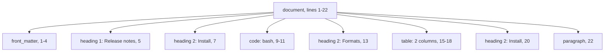
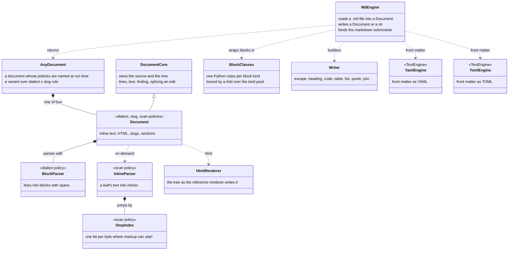
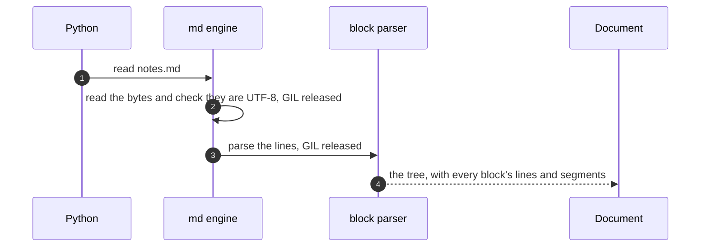
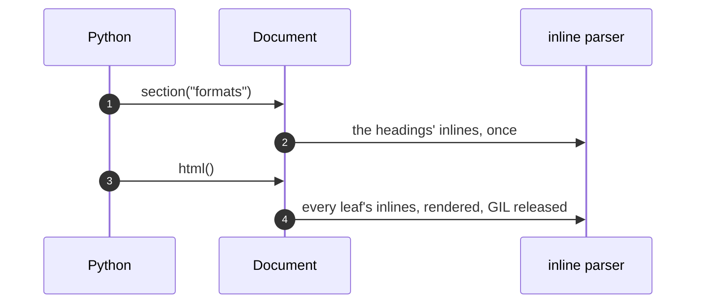

# pathlike: markdown documents

Status: built 2026-10-02, revised 2026-10-05 after the PR #37 review · Owner: Debith

`pygim.path("notes.md").read()` returns a `pathlike.markdown.Document`. A Document holds the
file's exact text and the block tree parsed from it. Every block knows the lines it covers, and
every heading knows its anchor. Code that used to find things in markdown with regular expressions
asks the tree instead, and an edit through the tree changes only the bytes it targets. The same
module also builds markdown text: tables, code blocks and headings whose output parses back as
what was built.

The project handles markdown in about twenty places in `src/` and in about forty study scripts.
None of them share code. Front matter is written by hand in two places and split in two more;
headings are found by five different rules, none of which skips fenced code; there are three slug
algorithms; and line endings are normalised in six places. This module is the one place all of
that can live.

## Words used here

| Word | Meaning |
|---|---|
| block | a structural unit of the document: heading, paragraph, code, table, list, item, quote, HTML, thematic break, link definition, front matter |
| segment | one line of a block's content: a byte range of the source, with the container's prefix (`> `, list indentation) and the block's markers already stripped |
| span | where a block sits in the text: its whole lines, from the first line's start to just past the last line ending |
| section | a top-level heading and everything up to the next top-level heading of the same or a higher level |
| slug | a heading's anchor (`usage`, `usage-1`), unique within the document |
| stop | a byte at which inline markup can begin (`` ` ``, `*`, `[`, a newline ...); text between stops is plain |
| dialect | which syntax counts: `commonmark` (the spec) or `gfm` (the spec plus tables, strikethrough and task items) |

## Scenarios

All the scenarios use one file, `notes.md` (from `docs/examples/pathlike/example_13_markdown.py`):

```text
 1  ---
 2  title: Release notes
 3  version: 2
 4  ---
 5  # Release notes
 6
 7  ## Install
 8
 9  ```bash
10  pip install pygim
11  ```
12
13  ## Formats
14
15  | Format | Engine |
16  | :----- | :----- |
17  | YAML   | rapidyaml |
18  | JSON   | simdjson |
19
20  ## Install
21
22  A second heading with the same title gets its own anchor.
```

### Feature: read a document and find what is in it

**Scenario: a section by its anchor.**
Given `notes.md`.
When `doc = path("notes.md").read()` and `doc.section("formats")` are called,
then the section covers lines 13–19: the heading, the table, and the blank line before line 20.
Its `blocks` are `[table]`.

**Scenario: a `#` inside code is not a heading.**
Given a file with `# not a heading` on a line inside a fenced code block,
when `doc.find(markdown.Heading)` is called,
then the result is empty. The line is content of the code block, because the block parser
opened the fence before it ever looks for headings.

**Scenario: two headings with the same title.**
Given the two `## Install` headings (lines 7 and 20),
when their slugs are read,
then they are `install` and `install-1` (GitHub's rule). With `slugs="toc"` they would be
`install` and `install_1` (Python-Markdown's, which `oo docs serve` uses today).

The tree for `notes.md`. Lines 6, 8, 12, 14, 19 and 21 are blank, and blank lines belong to no
block:



### Feature: edit one section, leave every other byte

**Scenario: replace a section.**
Given `doc` and the Formats section (lines 13–19),
when `doc.replace(doc.section("formats"), new_text)` is called,
then the result is a new Document. Its text is `doc.text[:start] + new_text + separator +
doc.text[end:]`, where `separator` is the line ending and blank lines that ended the old section.
`new_text`'s own trailing blank lines are dropped first. So the replaced section stays separated
from `## Install` exactly as before, and every byte outside lines 13–19 is unchanged.

| Target | Region replaced | Separator kept |
|---|---|---|
| a top-level block | its whole lines | its last line ending |
| a section | its heading up to the next section's heading | the line ending and the blank lines before that heading |
| empty `new_text` | the region and its separator | none: a deletion |

Only top-level blocks and sections can be replaced. A paragraph inside a quote sits on lines that
also carry the quote's `>` markers, and splicing it would drop them. So `replace` refuses it with
a `ValueError` that names the block and its container.

**Scenario: change the front matter.**
When `doc.with_front_matter({"title": "Release notes", "version": 3})` is called,
then the YAML engine writes the new front matter (`---` stays YAML; `engine="toml"` writes `+++`),
and lines 5–22 are unchanged. `None` removes the front matter.

### Feature: write markdown that parses back

**Scenario: a table whose cells hold pipes and line breaks.**
Given rows `[["a|b", 1], ["multi\nline", "`x|y`"]]`,
when `markdown.table(["Key", "Value"], rows)` is called,
then each `|` in a cell is escaped, a line break (LF, CRLF or a lone CR) becomes `<br>`, a value
becomes its `str()`, and every column is padded to its widest cell. Read back, the table has the
same rows and columns, and each cell's plain text is what a reader sees: `a|b`, `1`, `multiline`
(the `<br>` is HTML, which plain text leaves out) and `x|y` (the code span's text). A row wider
than the header is refused, because a reader drops the cells past the header's.

**Scenario: code that contains a fence.**
Given code holding a line of four backticks,
when `markdown.code(code, lang="md")` is called,
then the fence is five backticks: one longer than any run in the code, so no line of the code can
close it.

The builders share one rule: what they are given *is* markdown. A table cell may hold `**bold**`.
`escape()` turns plain text into markdown that reads back as exactly that text:
`heading(2, escape("Totals for *all* | 2026"))` has the title `Totals for *all* | 2026`. Besides
backslash-escaping what could start markup, it writes the whitespace a paragraph would strip or
read as indentation — spaces and tabs at a line's start or end — and carriage returns as character
references, so `" > q"` stays text instead of becoming a quote and `"    code"` stays text instead
of becoming code.

## How it is built



| Layer | Files | What it does |
|---|---|---|
| core | `pathlike/markdown/*.h` | pybind-free and constexpr: `basic_block_parser<Dialect>` (blocks.h), `basic_inline_parser<Dialect, Scan>` (inlines.h), `basic_stop_index<Scan>` (scan.h), `basic_html_renderer` (render.h), `document_core` and `basic_document<Dialect, Slug, Scan>` (document.h), `any_document` choosing the policies by name (any_document.h), the writer (writer.h), the link grammars (syntax.h), Unicode and entity lookups (unicode.h over the generated tables.h) |
| adapter | `adapter/markdown.h` | Python objects only: `Document`, `Section`, and one class per block kind from the kind pack; the front matter formats over the YAML and TOML engines; the builders. Probes for tests and benchmarks only in a `PYGIM_MARKDOWN_PROBES=1` build |
| engine | `adapter/engines/md.h` | `.md`/`.markdown` → `mdpath`; `read()` builds a Document; `write()` writes its text; `bind` adds `pathlike.markdown` |
| proofs | `tests/static/pathlike_markdown_proofs.cpp` | every line classifier, the link grammars, entities, both slug policies, the scalar scan, the writer, and whole parses under both dialects, evaluated at compile time in every build |
| tables | `tests/static/gen_markdown_tables.py` | generates `tables.h` from Python: Unicode punctuation and whitespace, case folding, lower-casing with the Cased and Case_Ignorable properties its final-sigma rule reads, NFKD-to-ASCII folding, the 2,125 HTML5 entities |

Reading a file:



| Step | What happens | Cost on the corpus below |
|---|---|---|
| 1 | `mdpath.read()` dispatches to the md engine | — |
| 2 | the file is read and checked as UTF-8 (simdjson's validator) without the GIL | 41.9 µs per file with step 3; `Path.read_text` takes 39.1 µs |
| 3 | the block parser walks the lines once, with no inline parsing | 11.1 ms for all 442 files |
| 4 | the Document owns the source and the tree; Python holds it by a shared pointer | — |

Asking it something:



| Step | What happens | Cost on the corpus below |
|---|---|---|
| 1 | `section()`, like `find(Heading)` and `sections`, needs the headings | — |
| 2 | only the headings' inlines are parsed, and the slugs made unique, once per document | — |
| 3 | `html()` renders the whole document | — |
| 4 | every leaf's inlines are parsed and rendered without the GIL | 106.2 ms for all 442 files |

## Measured

From `benchmarks/markdown_parse.py`, recorded in `benchmarks/results/markdown_parse.jsonl` (the
2026-10-05 run). The corpus is the 442 markdown files of the pygim checkout (19.60 MB, a stop
every 26 bytes), read through pygim's PathSet as exact bytes, on a Ryzen 7 5800X, best of 5:

| Work | Time | Throughput | Against Python-Markdown |
|---|---|---|---|
| `Document(text)`: the blocks | 11.1 ms | 1,761 MB/s | 745× |
| `Document(text).plain`: every inline resolved | 79.2 ms | 248 MB/s | 105× |
| `Document(text).html()` | 106.2 ms | 185 MB/s | 78× |
| Python-Markdown with `fenced_code` and `tables` | 8,289 ms | 2.4 MB/s | 1× |
| stop scan, scalar table | 13.96 ms | 1,404 MB/s | — |
| stop scan, SSE2 (this build's policy) | 6.36 ms | 3,084 MB/s | 2.2× the scalar scan |

Python-Markdown is not a CommonMark implementation, so this row compares cost, not output.
The parser's output is checked against the spec's own examples instead (next section).

The same run times the hostile shapes, each at one size:

| Shape | Input | Time |
|---|---|---|
| 30,000 link definitions, then `html()` | 518 KB | 11.4 ms |
| 4,000 duplicate headings, then `sections` | 40 KB | 2.4 ms |
| one 80 KB line of nested list markers | 80 KB | 2.4 ms |
| 500 unmatched backtick runs of 64 or more | 157 KB | 0.2 ms |
| 50,000 nested quotes, then `plain` | 50 KB | 1.7 ms |
| 20,000 nested emphasis pairs, then `html()` | 260 KB | 10.9 ms |

Past a few hundred kilobytes in one paragraph, inline parsing slows about 2.5× per doubling for
every shape, nested or flat: an inline node is about 120 bytes, so the tree outgrows the CPU
caches before the input does. That is memory, not the algorithm (Open, below).

## Conformance

`tests/unittests/test_pathlike_markdown.py` renders every example of the CommonMark 0.31.2 spec
(652) under the `commonmark` dialect, and the GFM spec's table, strikethrough and task-item
examples (12) under `gfm`. It compares each with the spec's expected HTML through the spec's own
normaliser (vendored in `tests/unittests/data/markdown/`). It also renders all 652 CommonMark
examples under `gfm`, to show the extensions break nothing. All pass.

CommonMark's pathological inputs, and the shapes the PR #37 review found, run in linear time.
`tests/unittests/test_pathlike_markdown_hostile.py` times each at two sizes about 16× apart and
fails when time grows more than 3× faster than the input; it also runs every public operation over
inputs that once crashed the process, in a child process on a 1 MB thread stack. These rules keep
them linear:

- every tree walk is iterative, so nesting depth cannot overflow the stack;
- a bare link destination nests at most 32 parentheses, a limit the spec allows;
- a search for the end of raw HTML that failed is remembered for the rest of the paragraph;
- an opener deactivated by one link is not visited again by the next;
- a thematic-break check that failed on a line records where it was decided, and no check
  starting before that point runs again (cmark's `thematic_break_kill_pos`);
- every backtick run of a paragraph is indexed once by (length, start), so a code span's closer
  is one binary search, for runs of any length;
- unique slugs are handed out through a hashed table, not a search of the slugs so far.

## Decisions

**read() returns a Document.** The other engines return data (dicts and lists) through one shared
materialiser. Markdown is a document, and every caller found in the project wants structure with
positions: a heading's line, a section's extent, a code block's language. A tree of dicts (mdast,
the unified/remark format) was rejected. It would turn the 2.3 MB results file into hundreds of
thousands of Python objects before anyone asks for one, and it has no positions an edit could
splice. A `(front matter, body)` pair was rejected because it would fix two of the twenty call
sites and leave the rest on regular expressions.

**pygim's own parser, a port of the reference algorithm.** cmark-gfm was rejected. It means
dozens of C files whose headers CMake normally generates, a per-source compiler flag split in
`setup.py` (Apple clang refuses `-std=c++26` on a `.c` file), and a renderer that reformats the
whole document. md4c was rejected because its callbacks carry no block positions: a `---` or an
empty fence has no offset, so neither spans nor lossless edits could be built on it. The port
follows commonmark.js's structure, so the spec's appendix explains the code, and the spec's
examples are its acceptance test.

**Lossless edits, and builders for new text.** Re-rendering the whole tree after an edit was
rejected. It would reformat hand-written documents (bullet characters, table padding) and give
noisy diffs. It would also change the block digests that `oo docs serve` uses to mark what a
reader has already seen.

**Policies, chosen by argument.** The dialect (`commonmark`, `gfm`), the slug rule (`github`,
`toc`) and the scan (`scalar_scan`, `sse2_scan`, `neon_scan`) are template parameters (#81). The
scan is chosen per platform at compile time. A caller names the other two, so the core's
`any_document` turns the names into positions in two policy packs and holds a `std::variant`
over their product, built through a table of constructors at that position. Adding a dialect is
adding a type to its pack: there is no if-chain to grow. What does not depend on the policies —
the source, the tree, lines, finding, the edits — is `document_core`, a non-template base, so it
is compiled once rather than four times, and reached without a visit.

**A block's class is its kind.** A Block is an instance of its kind's class — `Heading`, `Code`,
`Table`, ... — and each class holds only its kind's properties, so no property tests which kind
it is on. A property receives a block of its own class (pybind refuses another), and the core's
kind-specific lookups refuse a block of another kind, so not even `__class__` reassignment reads
past a table. The classes are a pack of
descriptors folded into bindings, the idiom of [the engine registry](pathlike_engine_registry.md):
a descriptor is its kind's tag, docstring and properties; its class name comes from the kind's
name; a table indexed by the kind wraps a block in its class. Every build proves the pack covers
every kind exactly once (`covers_every_kind`, which tests/static proves refuses a gap, a repeat
and the document); with C++26 reflection (GCC 16) it also proves the kind names spell the
enumerators of `kind`, in order. `Document.find` takes the class.

**No test hooks in a release.** The SIMD scan is checked through public behaviour: every stop
byte, at every offset across two 64-byte words, must change the parse as markup does — a stop the
scan missed would leave the markup as text. The scalar-against-SIMD comparison the benchmark
needs (`_stops`, `_scan`) is compiled in only by the opt-in build flag `PYGIM_MARKDOWN_PROBES=1`,
as `PYGIM_BCP_PROFILING` is for persistence; a release has neither.

**SIMD at the baseline width, 64 bytes a word.** SSE2 is present on every x86-64 CPU and NEON on
every AArch64 CPU, so no wheel needs a run-time CPU check. AVX2 was rejected: it would need that
check, and a probe found it no faster at 32 bytes a word than SSE2 at 64 (ENACT #130). C++26
`std::simd` was rejected for now: only GCC 16 ships `<simd>`, and CI's GCC 13, Apple clang and
MSVC would all fall back to scalar. The scan is a policy, so either can replace a kernel later
without touching the parser. The `#if` that picks the kernel chooses by architecture, not by
availability (which the definition of done forbids): no x86-64 or AArch64 build can lack its
baseline, and every other architecture runs `scalar_scan`, the specification itself.

**Front matter through the YAML and TOML engines.** Their text half (`loads`/`dumps`, the
`TextEngine` concept, [the engine registry](pathlike_engine_registry.md)) parses and writes it, so
markdown front matter follows exactly the same YAML rules as a `.yaml` file. A fence starts at
column 0 (spaces may follow it, never precede it), so an indented `---` inside a YAML block scalar
is the scalar's text. Writing must read back: TOML embeds strings on one escaped line
(`dumps_embedded`), and the writer refuses a body line that would read as the closing fence.
New fences use the document's own line ending. A parse error names the file and the file's line.

**Keyed stores are registries.** Link definitions are looked up by label in a
`StaticRegistryCore` (the flat engine). It is filled once, at the end of the parse, in label
order, so every insert appends and the build stays O(n log n): the benchmark's 30,000 definitions
parse and render in 11.4 ms. `register_value` keeps the entry already there, which is
CommonMark's rule that the first definition of a label wins. The Python class of each block kind
maps to its kind through a `DynamicRegistryCore` (what `find` looks up). A document's slugs are
made unique through a RegistryCore over `mapping/open_storage.h`, the open-addressing engine this
work added: hashed, so N headings cost N lookups, and constexpr, so the proofs run it — the flat
engine shifts its array on every out-of-order insert, and the hashed one is not constexpr. Three
tables are not registries, for reasons ENACT #131 records:
- the dialect, slug rule, alignment and front matter engine names are a handful of entries each,
  which #131 exempts;
- a heading's index by block id is a dense array indexed by the id (constexpr, O(1));
- the generated Unicode and entity tables are sorted constexpr arrays: a registry that outlives
  constant evaluation (#131's missing static engine) is what they need, and they move when it exists.

**Each slug rule de-duplicates as its reference does.** A repeated slug is not merely given a
suffix: github-slugger keeps a counter per original slug (`a`, `a-1`, `a-2`, and an explicit
`a-1` is skipped over), and Python-Markdown's `unique()` turns `x_N` into `x_(N+1)` and an empty
id into `_1`. Each policy owns an `anchors` type that hands out ids exactly so; the toc rule's
walk records where it ended, so N repeats cost N steps where Python-Markdown's own loop costs N².
`tests/static` proves both against sequences checked with the real Python-Markdown.

**GitHub slugs lower-case as JavaScript does.** github-slugger calls `toLowerCase`: the full
Unicode lower-case mapping, with a word-final `Σ` as `ς` — not case folding, which would turn
`µ` into `μ` and `ſ` into `s`. The generator reads the mapping, and the Cased and Case_Ignorable
properties the final-sigma rule needs, off Python's `str.lower`, which applies the same rule.

**A wrong kind is a TypeError naming the engine.** Writing a set, a non-str key, or a list as a
TOML document raises `TypeError` (`yaml write: cannot write a value of type set`), and a str that
UTF-8 cannot hold raises `ValueError` naming the call — the definition of done's split between
a wrong kind and a bad value, applied to the engines this work extended.

**Spans in characters.** The core counts bytes. Python slices `Document.text` by characters, so
the core also answers in code points (`document_core::code_points`), through a per-line table
built on first use. `doc.text[a:b] == block.text`
holds for every block, and the tests check it with non-ASCII text before the blocks.

## Rules to keep

- A block's span is whole physical lines. Blank lines between blocks belong to no block, so a
  splice keeps them — and a list's looseness is read from those gaps.
- Every walk over blocks or inlines is iterative.
- No input crashes the process or runs away: a new shape that does goes into the hostile tests
  first.
- Every parse keeps the invariants in `tests/unittests/_markdown_invariants.py` — the text kept,
  spans and lines that slice it, nesting, walk and find, identity edits, determinism, sections,
  unique slugs, CRLF read as LF, the dialects agreeing without GFM syntax, no NUL out, no markup
  the renderer did not write — checked over generated documents and mutated spec examples by
  `test_pathlike_markdown_adversarial.py` (`PYGIM_MARKDOWN_FUZZ=50000` for a deeper run, 15 s).
- Every scan policy finds every stop: `test_the_stop_scan_finds_every_stop_at_every_offset` checks
  it through public behaviour on every platform CI runs (its macOS runners are the only machines
  that run the NEON policy); a `PYGIM_MARKDOWN_PROBES=1` build compares the policies bit for bit.
- A property belongs to its kind's class; a new kind is a descriptor in `block_kinds`, and the
  build refuses a kind without one.
- No test or benchmark hook in a release: probes only behind `PYGIM_MARKDOWN_PROBES=1`.
- Builders take markdown; `escape()` makes plain text safe, and what it writes reads back exactly.
- The stub and the module agree: `test_the_stub_matches_the_module` compares every name, kind and
  parameter.
- A change to the parser keeps every spec example passing; the test names any that fail.
- `tables.h` is generated; regenerate it with `tests/static/gen_markdown_tables.py` when Python's
  Unicode version changes. It records the generator's sha256 and its own body's, so a test knows
  in a millisecond that it is current and was not edited by hand.

## Open

- **Callers.** These live on `core/memory` and move once both branches are on main:
  - ENACT's memory views: front matter written and split by hand (`store.h`), which is also why an
    edit to only a view's front matter is silently overwritten;
  - the corpus parser, which splits on `## ` and starts a new memory at a `## ` inside a fence (`corpus.h`);
  - docs serve's heading, table and block scanners, none of which skips fenced code, and its
    anchor function, which disagrees with Python-Markdown's on non-ASCII text;
  - the inventory's README title;
  - a computed `structure.json` for ENACT's sources;
  - the study scripts' table writers.
- **Rendering for docs serve.** `html()` is 75× faster than Python-Markdown, but docs serve also
  needs heading ids (a slug rule is ready), `md_in_html` and its block marks. That is the next
  step, not part of this one.
- **GFM autolinks and the tag filter.** Not implemented, so their 12 GFM examples are not run.
- **Inlines in Python.** The core has an inline tree; Python sees only plain text and HTML. An
  inline API (links with their positions) and an mdast export are the direction.
- **Nested edits.** Replacing a block inside a quote or a list needs its container's prefixes
  re-applied to the new text.
- **A safe mode for untrusted input.** `html()` renders as CommonMark's reference renderer does:
  raw HTML passes through and a `javascript:` link stays a link, so HTML from someone untrusted
  needs a sanitizer after it (`test_html_is_not_a_sanitizer` states it). cmark's own default is
  the opposite — raw HTML omitted, dangerous schemes emptied — and `html(safe=True)` would bring
  that here; whether it should be the default is a decision for the owner.
- **Table width.** Columns are padded by code points, so wide East Asian characters misalign.
- **The inline node's size.** About 120 bytes, with two strings only links use; moving those to a
  side table and literals to offsets into the subject would keep large paragraphs in the CPU caches.
