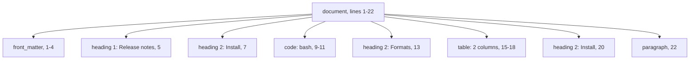
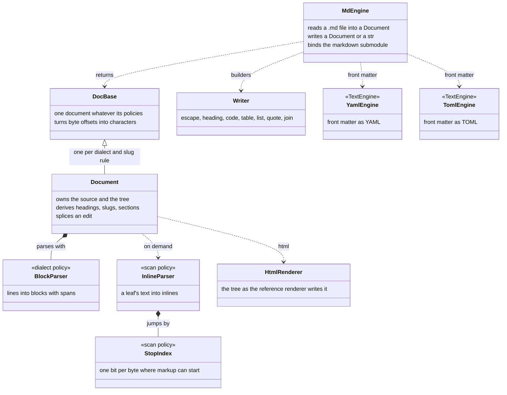
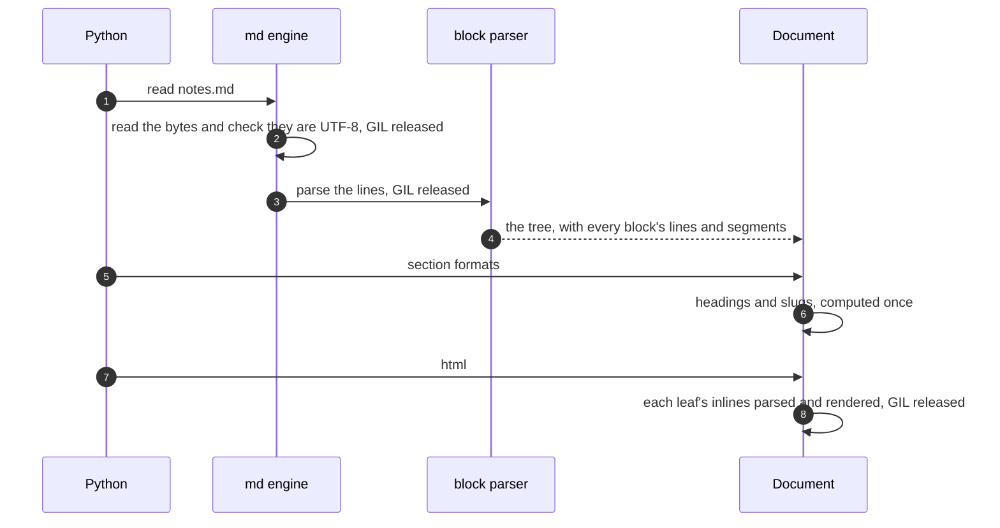

# pathlike: markdown documents

Status: built 2026-10-02 · Owner: Debith

`pygim.path("notes.md").read()` returns a `pathlike.markdown.Document`. A Document holds the
file's exact text and the block tree parsed from it. Every block knows the lines it covers, and
every heading knows its anchor. Code that used to find things in markdown with regular expressions
asks the tree instead, and an edit through the tree changes only the bytes it targets. The same
module also builds markdown text: tables, code blocks and headings whose output parses back as
what was built.

The project handles markdown in about twenty places in `src/` and in about forty study scripts.
None of them share code. Front matter is written by hand in two places and split in two more;
headings are found by five different rules, none of which skips fenced code; there are three slug
algorithms; and line endings are normalised in six places. This module is the one place all of
that can live.

## Words used here

| Word | Meaning |
|---|---|
| block | a structural unit of the document: heading, paragraph, code, table, list, item, quote, HTML, thematic break, link definition, front matter |
| segment | one line of a block's content: a byte range of the source, with the container's prefix (`> `, list indentation) and the block's markers already stripped |
| span | where a block sits in the text: its whole lines, from the first line's start to just past the last line ending |
| section | a top-level heading and everything up to the next top-level heading of the same or a higher level |
| slug | a heading's anchor (`usage`, `usage-1`), unique within the document |
| stop | a byte at which inline markup can begin (`` ` ``, `*`, `[`, a newline ...); text between stops is plain |
| dialect | which syntax counts: `commonmark` (the spec) or `gfm` (the spec plus tables, strikethrough and task items) |

## Scenarios

All the scenarios use one file, `notes.md` (from `docs/examples/pathlike/example_13_markdown.py`):

```text
 1  ---
 2  title: Release notes
 3  version: 2
 4  ---
 5  # Release notes
 6
 7  ## Install
 8
 9  ```bash
10  pip install pygim
11  ```
12
13  ## Formats
14
15  | Format | Engine |
16  | :----- | :----- |
17  | YAML   | rapidyaml |
18  | JSON   | simdjson |
19
20  ## Install
21
22  A second heading with the same title gets its own anchor.
```

### Feature: read a document and find what is in it

**Scenario: a section by its anchor.**
Given `notes.md`.
When `doc = path("notes.md").read()` and `doc.section("formats")` are called,
then the section covers lines 13–19: the heading, the table, and the blank line before line 20.
Its `blocks` are `[table]`.

**Scenario: a `#` inside code is not a heading.**
Given a file with `# not a heading` on a line inside a fenced code block,
when `doc.find("heading")` is called,
then the result is empty. The line is content of the code block, because the block parser
opened the fence before it ever looks for headings.

**Scenario: two headings with the same title.**
Given the two `## Install` headings (lines 7 and 20),
when their slugs are read,
then they are `install` and `install-1` (GitHub's rule). With `slugs="toc"` they would be
`install` and `install_1` (Python-Markdown's, which `oo docs serve` uses today).

The tree for `notes.md`. Lines 6, 8, 12, 14, 19 and 21 are blank, and blank lines belong to no
block:



### Feature: edit one section, leave every other byte

**Scenario: replace a section.**
Given `doc` and the Formats section (lines 13–19),
when `doc.replace(doc.section("formats"), new_text)` is called,
then the result is a new Document. Its text is `doc.text[:start] + new_text + separator +
doc.text[end:]`, where `separator` is the line ending and blank lines that ended the old section.
`new_text`'s own trailing blank lines are dropped first. So the replaced section stays separated
from `## Install` exactly as before, and every byte outside lines 13–19 is unchanged.

| Target | Region replaced | Separator kept |
|---|---|---|
| a top-level block | its whole lines | its last line ending |
| a section | its heading up to the next section's heading | the line ending and the blank lines before that heading |
| empty `new_text` | the region and its separator | none: a deletion |

Only top-level blocks and sections can be replaced. A paragraph inside a quote sits on lines that
also carry the quote's `>` markers, and splicing it would drop them. So `replace` refuses it with
a `ValueError` that names the block and its container.

**Scenario: change the front matter.**
When `doc.with_front_matter({"title": "Release notes", "version": 3})` is called,
then the YAML engine writes the new front matter (`---` stays YAML; `engine="toml"` writes `+++`),
and lines 5–22 are unchanged. `None` removes the front matter.

### Feature: write markdown that parses back

**Scenario: a table whose cells hold pipes and line breaks.**
Given rows `[["a|b", 1], ["multi\nline", "`x|y`"]]`,
when `markdown.table(["Key", "Value"], rows)` is called,
then each `|` in a cell is escaped, a line break becomes `<br>`, and every column is padded to its
widest cell. Parsing the output back gives the same cells.

**Scenario: code that contains a fence.**
Given code holding a line of four backticks,
when `markdown.code(code, lang="md")` is called,
then the fence is five backticks: one longer than any run in the code, so no line of the code can
close it.

The builders share one rule: what they are given *is* markdown. A table cell may hold `**bold**`.
`escape()` turns plain text into markdown that reads back as that text:
`heading(2, escape("Totals for *all* | 2026"))` has the title `Totals for *all* | 2026`.

## How it is built



| Layer | Files | What it does |
|---|---|---|
| core | `pathlike/markdown/*.h` | pybind-free and constexpr: `basic_block_parser<Dialect>` (blocks.h), `basic_inline_parser<Dialect, Scan>` (inlines.h), `basic_stop_index<Scan>` (scan.h), `basic_html_renderer` (render.h), `basic_document<Dialect, Slug, Scan>` (document.h), the writer (writer.h), the link grammars (syntax.h), Unicode and entity lookups (unicode.h over the generated tables.h) |
| adapter | `adapter/markdown.h` | `Document`, `Block` and `Section` for Python; the four dialect × slug instantiations behind one virtual `doc_base`; character offsets; the builders |
| engine | `adapter/engines/md.h` | `.md`/`.markdown` → `mdpath`; `read()` builds a Document; `write()` writes its text; `bind` adds `pathlike.markdown` |
| proofs | `tests/static/pathlike_markdown_proofs.cpp` | every line classifier, the link grammars, entities, both slug policies, the scalar scan, the writer, and whole parses under both dialects, evaluated at compile time in every build |
| tables | `tests/static/gen_markdown_tables.py` | generates `tables.h` from Python: Unicode punctuation and whitespace, case folding, NFKD-to-ASCII folding, the 2,125 HTML5 entities |

One read, step by step:



| Step | What happens | Cost on the 19.5 MB corpus below |
|---|---|---|
| 1 | `mdpath.read()` dispatches to the md engine | — |
| 2 | the file is read and checked as UTF-8 (simdjson's validator) without the GIL | 41 µs per file with step 3; `Path.read_text` takes 29 µs |
| 3 | the block parser walks the lines once, with no inline parsing | 13.0 ms in all (1.5 GB/s) |
| 4 | the Document owns the source and the tree, and Python holds it by a shared pointer | — |
| 5 | `section()` and `find("heading")` parse only the headings' inlines, once | — |
| 6 | `html()` parses every leaf's inlines and renders them without the GIL | 104 ms in all |

## Measured

From `benchmarks/markdown_parse.py`, recorded in `benchmarks/results/markdown_parse.jsonl`. The
corpus is the 437 markdown files of the pygim checkout (19.52 MB, a stop every 26 bytes), on a
Ryzen 7 5800X, best of 5:

| Work | Time | Throughput | Against Python-Markdown |
|---|---|---|---|
| `Document(text)`: the blocks | 13.0 ms | 1,506 MB/s | 600× |
| `Document(text).plain`: every inline resolved | 77.4 ms | 252 MB/s | 100× |
| `Document(text).html()` | 104.1 ms | 188 MB/s | 75× |
| Python-Markdown with `fenced_code` and `tables` | 7,771 ms | 2.5 MB/s | 1× |
| stop scan, scalar table | 14.18 ms | 1,376 MB/s | — |
| stop scan, SSE2 (this build's policy) | 6.36 ms | 3,069 MB/s | 2.2× the scalar scan |

Python-Markdown is not a CommonMark implementation, so this row compares cost, not output.
The parser's output is checked against the spec's own examples instead (next section).

## Conformance

`tests/unittests/test_pathlike_markdown.py` renders every example of the CommonMark 0.31.2 spec
(652) under the `commonmark` dialect, and the GFM spec's table, strikethrough and task-item
examples (12) under `gfm`. It compares each with the spec's expected HTML through the spec's own
normaliser (vendored in `tests/unittests/data/markdown/`). It also renders all 652 CommonMark
examples under `gfm`, to show the extensions break nothing. All pass.

CommonMark's pathological inputs run in linear time: 20,000 levels of nested emphasis, unclosed
links, comments and brackets, and `` repeated. Four rules keep them linear:

- every tree walk is iterative, so nesting depth cannot overflow the stack;
- a bare link destination nests at most 32 parentheses, a limit the spec allows;
- a search for the end of raw HTML that failed is remembered for the rest of the paragraph;
- an opener deactivated by one link is not visited again by the next.

## Decisions

**read() returns a Document.** The other engines return data (dicts and lists) through one shared
materialiser. Markdown is a document, and every caller found in the project wants structure with
positions: a heading's line, a section's extent, a code block's language. A tree of dicts (mdast,
the unified/remark format) was rejected. It would turn the 2.3 MB results file into hundreds of
thousands of Python objects before anyone asks for one, and it has no positions an edit could
splice. A `(front matter, body)` pair was rejected because it would fix two of the twenty call
sites and leave the rest on regular expressions.

**pygim's own parser, a port of the reference algorithm.** cmark-gfm was rejected. It means
dozens of C files whose headers CMake normally generates, a per-source compiler flag split in
`setup.py` (Apple clang refuses `-std=c++26` on a `.c` file), and a renderer that reformats the
whole document. md4c was rejected because its callbacks carry no block positions: a `---` or an
empty fence has no offset, so neither spans nor lossless edits could be built on it. The port
follows commonmark.js's structure, so the spec's appendix explains the code, and the spec's
examples are its acceptance test.

**Lossless edits, and builders for new text.** Re-rendering the whole tree after an edit was
rejected. It would reformat hand-written documents (bullet characters, table padding) and give
noisy diffs. It would also change the block digests that `oo docs serve` uses to mark what a
reader has already seen.

**Policies, chosen by argument.** The dialect (`commonmark`, `gfm`), the slug rule (`github`,
`toc`) and the scan (`scalar_scan`, `sse2_scan`, `neon_scan`) are template parameters (#81). Python
chooses the first two by argument, and the adapter type-erases the four instantiations behind
`doc_base`. The scan is chosen per platform at compile time.

**SIMD at the baseline width, 64 bytes a word.** SSE2 is present on every x86-64 CPU and NEON on
every AArch64 CPU, so no wheel needs a run-time CPU check. AVX2 was rejected: it would need that
check, and a probe found it no faster at 32 bytes a word than SSE2 at 64 (ENACT #130). C++26
`std::simd` was rejected for now: only GCC 16 ships `<simd>`, and CI's GCC 13, Apple clang and
MSVC would all fall back to scalar. The scan is a policy, so either can replace a kernel later
without touching the parser.

**Front matter through the YAML and TOML engines.** Their text half (`loads`/`dumps`, the
`TextEngine` concept, [the engine registry](pathlike_engine_registry.md)) parses and writes it, so
markdown front matter follows exactly the same YAML rules as a `.yaml` file. A parse error names
the front matter's lines and the file.

**Spans in characters.** The core counts bytes. Python slices `Document.text` by characters, so
the adapter translates through a per-line table built on first use. `doc.text[a:b] == block.text`
holds for every block, and the tests check it with non-ASCII text before the blocks.

## Rules to keep

- A block's span is whole physical lines. Blank lines between blocks belong to no block, so a
  splice keeps them.
- Every walk over blocks or inlines is iterative.
- Every scan policy produces the scalar policy's stop bits; `test_simd_stop_scan_equals_the_scalar_reference`
  fuzzes this, and CI's macOS runners are the only machines that run the NEON policy.
- Builders take markdown; `escape()` makes plain text safe.
- A change to the parser keeps every spec example passing; the test names any that fail.
- `tables.h` is generated; regenerate it with `tests/static/gen_markdown_tables.py` when Python's
  Unicode version changes (a test compares it under the version it records).

## Open

- **Callers.** These live on `core/memory` and move once both branches are on main:
  - ENACT's memory views: front matter written and split by hand (`store.h`), which is also why an
    edit to only a view's front matter is silently overwritten;
  - the corpus parser, which splits on `## ` and starts a new memory at a `## ` inside a fence (`corpus.h`);
  - docs serve's heading, table and block scanners, none of which skips fenced code, and its
    anchor function, which disagrees with Python-Markdown's on non-ASCII text;
  - the inventory's README title;
  - a computed `structure.json` for ENACT's sources;
  - the study scripts' table writers.
- **Rendering for docs serve.** `html()` is 75× faster than Python-Markdown, but docs serve also
  needs heading ids (a slug rule is ready), `md_in_html` and its block marks. That is the next
  step, not part of this one.
- **GFM autolinks and the tag filter.** Not implemented, so their 12 GFM examples are not run.
- **Inlines in Python.** The core has an inline tree; Python sees only plain text and HTML. An
  inline API (links with their positions) and an mdast export are the direction.
- **Nested edits.** Replacing a block inside a quote or a list needs its container's prefixes
  re-applied to the new text.
- **Table width.** Columns are padded by code points, so wide East Asian characters misalign.
