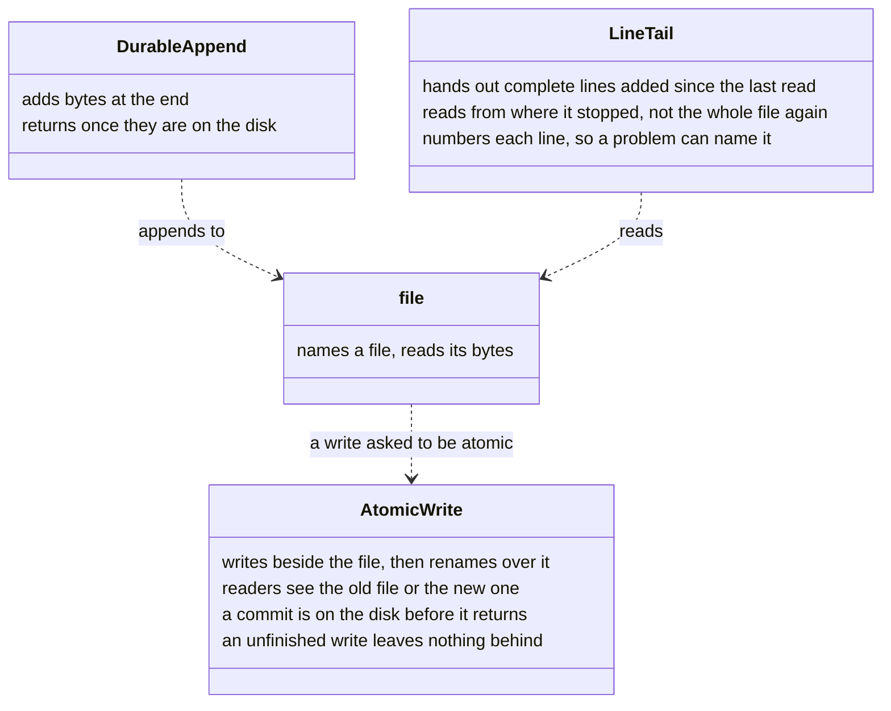
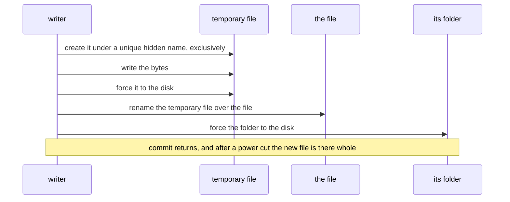

# pathlike: writes that survive

Status: settled 2026-09-23, not built yet · Owner: Debith

How pathlike replaces a file so that a reader never sees half of it and a power cut never leaves a
record pointing at nothing, how an append knows its bytes reached the disk, and how a reader takes
only the complete lines of a file another process is still appending to. ENACT's files store is
the first caller: its folder kinds write through these and nothing else
([ENACT 03 §3.1.1](enact/03_store.md)).

## Scenarios

| Scenario | What must hold |
|---|---|
| A reader opens `memories/x.md` while it is being rewritten | it reads the old text or the new, never a mix |
| The power goes out just after the store appended a row | the content object the row names is on the disk, whole |
| Two processes write one file at once, neither holding a lock | each writes its own temporary file; the file ends as one of them, whole |
| A write throws halfway | the old file is untouched, and no temporary file is left behind |
| A session reads a log another process is appending to | it gets complete lines only, numbered; a half-written last line is held back, and a later read returns it once it is complete |

## The classes

Each class says what it is responsible for; the arrows follow
[the relationship pattern](plantuml_relationship_pattern.md), with the legend in
[ENACT 03 §7](enact/03_store.md#7-the-service-and-its-strategies-redrawn-2026-09-23).

A caller does not reach for `AtomicWrite` by name: it asks `file` for an atomic write, and
`file` hands the bytes to an `AtomicWrite` (see *In Python* for why it is an option, not a
method). `AtomicWrite` is a class of its own because it owns something `file` does not: a
temporary file, from its creation to its rename or its removal.

`LineTail` replaces two readers in ENACT's store that differ for no reason: `new_rows` keeps an
offset per audit file but still reads each file whole, and `lines_under` reads every usage,
receipt and mailbox file whole on every call and drops a line it cannot parse without a word.

## One write, step by step

| Step | What goes wrong without it |
|---|---|
| a unique name, created exclusively | two writers share one temporary file and interleave |
| force the file before the rename | the rename can reach the disk before the bytes do: a file that exists and is empty |
| the rename | a reader sees a half-written file |
| force the folder | the rename itself can be lost, and the old file comes back |
| remove the temporary file when the write does not commit | a throw leaves `*.tmp` in a folder that git commits |

## Today

ENACT's store has its own two helpers in `src/_pygim_fast/enact/strategy/files/lock.h`, at two
levels of safety with no comment saying why:

| Helper | What it does | What it does not |
|---|---|---|
| `append_durably` | appends and forces the bytes to the disk | — |
| `write_atomically` | writes `<file>.tmp`, then renames it over the file | forces neither the file nor the folder; the temporary name is fixed, so two unlocked writers would share one temporary file — it is safe only under the commit lock, and the store's constructor writes without taking that lock; nothing removes a leftover |

What that means for a commit is in [ENACT 03 §4.1](enact/03_store.md). No leftover has ever been
committed: on 2026-09-23, `git log` for `*.tmp` in the four stores on this machine found none.

pathlike's own `file::write_bytes` truncates and writes in place, as pathlib's does. It stays, for
parity; the new methods sit beside it.

## Making it the only way the store writes

1. **One primitive, asked for by an option.** `f.write_bytes(bytes, write_mode::atomic)`: an enum
   rather than a `bool`, so the call site says what it asks for. Behind it is `AtomicWrite`, which
   C++ may also use directly to write in pieces — `AtomicWrite w(f); w.write(part); w.commit();`
   — and which removes its temporary file when destroyed without `commit()`. Appends go through
   `DurableAppend`.
2. **The store holds pathlike files.** ENACT's folder kinds hold a pathlike `file`, never a
   `std::filesystem::path`, so the writes they can reach are these.
3. **A check, not a convention.** A ratchet test counts raw writes under
   `src/_pygim_fast/enact/` — `std::ofstream`, `fopen`, `std::filesystem::rename`, and any write
   not asked to be atomic (`write_mode::in_place`) — and fails when the count rises, as
   `WALKS_BY_HAND` in
   `tests/unittests/test_layering.py` does for hand-written directory walks. A rule that cannot
   be seen at the call site needs a check (global memory #20).
4. **Tests that state the guarantees.** Each row of the scenario table is a test. The power cut
   cannot be caused in a unit test, but the order that survives one can be checked: how bytes
   are forced to the disk is a policy (a template parameter), and a recording policy in tests
   writes down each write, force and rename. The test for ENACT's commit (03 §4.1) asserts that
   an object's temporary file is forced, renamed and its folder forced before the row's append is
   forced; today's helpers fail it at the first step — `write_atomically` never forces the
   temporary file.

## In Python

`path.write(obj, atomic=True)` and `path.write_bytes(data, atomic=True)`: an option on the two
writes `pygim.path` already has, not new methods (Debith, 2026-09-23, on the first draft's
`write_atomically`: "why not just path.write(ensure_atomic=True)?"). It is the same operation with
a stronger guarantee, and a name per guarantee would split one job across methods — the reason
pygim prefers an option to a near-duplicate command. The option also reaches `write`, which
serialises a value through an engine and is where most of pygim's own writes belong: a store's
`policy.yaml`, a vocabulary pack, the source inventory. The first draft listed byte methods only
and left it out.

The option is keyword-only and off by default, as pathlib's writes are in place. An atomic write
makes a new file and renames it over the old one, and the difference is visible:

| | In place — the default, as pathlib | `atomic=True` |
|---|---|---|
| a symbolic link at the path | written through, to its target | replaced by a regular file |
| a second hard link to the file | sees the new contents | keeps the old file |
| the file's permissions and owner | kept | the new file's, unless copied over |
| permission needed | to write the file | to write its folder |
| a FIFO or a device, such as `/dev/stdout` | written | cannot be renamed over |

Its docstring states the whole guarantee: a reader sees the old contents or the new, and after a
power cut one of them is there whole.

Two things are not in Python yet, and their absence is sequencing rather than a decision against
them. A way to write in pieces is not there because `pygim.path` has no `open()` and every caller
so far writes a whole value — the C++ `AtomicWrite` already streams. A durable append is not
there because nothing in Python appends. When a caller needs either, it takes the same shape: an
option on a write, not a new name. The name `replace` is never used for this: pathlib's
`Path.replace(target)` means rename, `pygim.path` keeps pathlib's meanings, and an atomic write
under that name would give it a second one.

The first Python callers write in place today: `_pygim/_mcp/_stores.py` writes a store's
`policy.yaml` as formatted text, where `path.write(policy, atomic=True)` would write the value
through the YAML engine; and `pygim/_stubs.py` writes the stub file.

## Open

| Question | How it will be found out |
|---|---|
| On Windows a file another process has open cannot be replaced, the rename call to use differs (`MoveFileExW` or `ReplaceFileW`), and a folder is not forced to disk the same way | a run on Windows, in CI |
| Who removes a temporary file that a killed process left, since a kill runs no destructor | decided with the first implementation: the names are recognisable, so opening a store can remove old ones |
| Whether the commit lock belongs in pathlike | it stays in the store (`LocalState`) until a second caller needs one |
| The option's name: `atomic`, or `ensure_atomic` as the comment wrote it | Debith's call; `atomic` is recommended, since a keyword names the property it asks for, as `parents` and `exist_ok` do on `mkdir` |
| Whether an atomic write carries the old file's permission bits over, and writes through a symbolic link to its target rather than replacing the link | decided with the first implementation; each would remove one surprise from the difference table above — the permissions row, the symbolic-link row — and even then the owner cannot be carried over without privileges |
