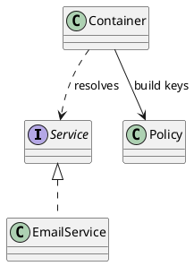

# PlantUML Relationship Pattern

Use this pattern when drawing class or architecture diagrams in this repository.
The goal is not to force one rigid layout, but to keep relationship semantics
visually consistent across diagrams.

## 1. Core Rule

Reserve upward-pointing inheritance or realization arrows for true type hierarchy:

- child to parent inheritance should point upward
- implementation or realization should point upward toward the interface or contract
- plain usage, dependency, ownership, and data-flow arrows may route in any direction

This keeps "is-a" relationships visually distinct from "uses" relationships.

## 2. Relationship Semantics

### Inheritance / Generalization

Use when one type is a specialization of another.

```plantuml
Child -up-|> Parent
```

Or equivalently:

```plantuml
Parent <|-- Child
```

Preferred reading: the child points to the parent.

### Realization / Interface Implementation

Use when a concrete type implements an interface, protocol, or abstract contract.

```plantuml
Implementation ..up|> Interface
```

### Usage / Dependency

Use when one type calls, references, validates, builds, or otherwise depends on another.
These arrows do not imply hierarchy, so route them however best clarifies the picture.

```plantuml
Container --> InterfaceKeyPolicy : build keys
Container ..> Helpers : validate boundary
```

### Ownership / Composition

Use composition or aggregation to show stored lifetime relationships. Direction may be
chosen for layout clarity; the semantic payload is the diamond, not an upward orientation.

```plantuml
Container *-down-> Core : owns m_core
```

## 3. Practical Layout Guidance

- do not use upward routing for ordinary usage arrows just because it looks tidy
- if an arrow points upward, readers should be able to suspect hierarchy first
- if a relationship is not hierarchy, prefer a plain directional arrow suited to layout
- when a diagram mixes hierarchy and usage heavily, add a legend row stating the convention

## 4. Minimal Example



Interpretation:

- `EmailService` is a `Service`, so the arrow points upward
- `Container` merely uses `Policy` and `Service`, so those arrows are free to route by layout

## 5. Review Checklist

Before finalizing a diagram, check:

- does every upward hierarchy arrow represent inheritance or realization?
- are usage arrows free of accidental hierarchy semantics?
- are composition and dependency arrows chosen for meaning first, layout second?
- does the legend explain the rule if the diagram is dense?
