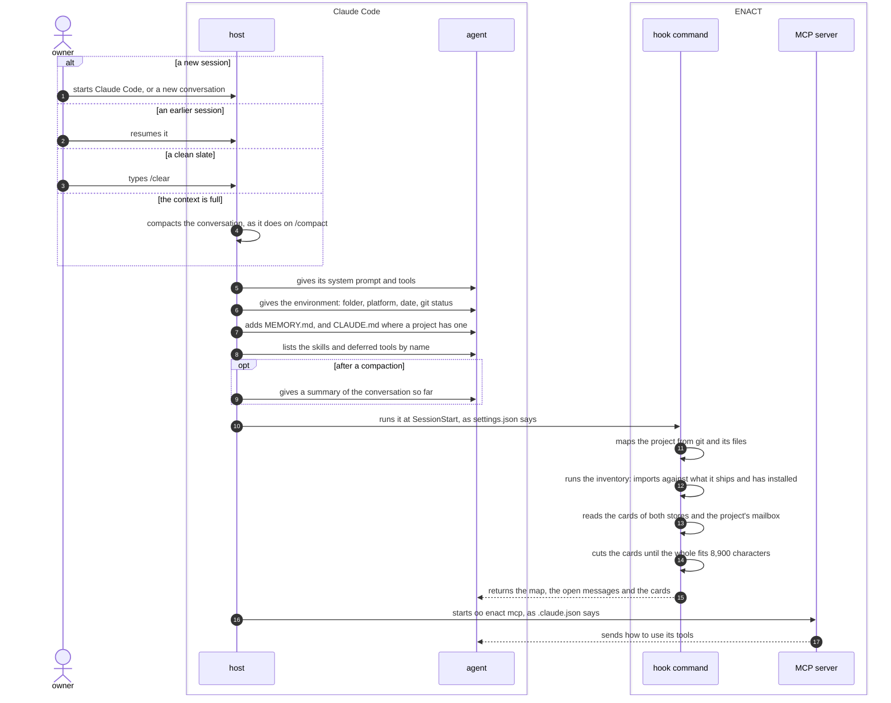
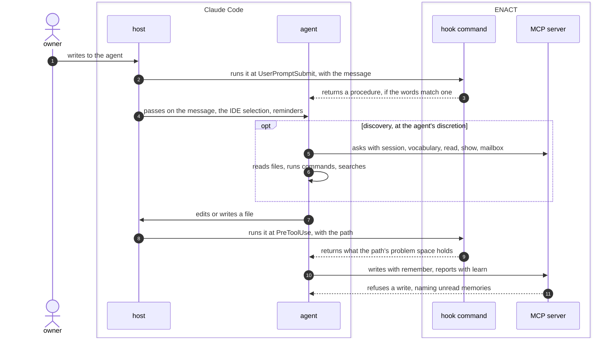

# Starting a task — Overview

**Section 00: The sequence as it runs today**
Status: draft · Owner: Debith · Last updated: 2026-09-25

What happens between *a task is given to an agent* and *the agent starts the work*, in any
project. This section describes only the sequence that exists on 2026-09-25, measured on this
machine, and where it failed during the week. It proposes nothing: the process it should become
is the next section's subject, and it is designed from this one.

ENACT is one part of this sequence, not the whole of it: the host (Claude Code), its hooks, the
project's own files and the agent's judgement each supply part of what the agent knows when it
starts. ENACT's own design is in [../enact/00_overview.md](../enact/00_overview.md).

| Term | Meaning |
|---|---|
| task | What an agent is asked to do: a question, a review, a design, a change. Most often the owner's message; also a comment left on a served page, a message in a store's mailbox, or an event the host raises (§1). |
| problem space | Everything already known that bears on a task: the owner's preferences, memories, procedures, the design it belongs to, source documents, the code and what the project ships, earlier discussions, the environment it runs in. |
| moment | A point at which something reaches the agent without being asked: session start, the request, a file about to be written. |
| hook | A command the host runs at one of its named events — `SessionStart`, `UserPromptSubmit`, `PreToolUse` (§2). What it prints is added to the agent's context. |
| delivered | Put in front of the agent by the host at a moment, whatever the agent does. |
| looked up | Found only because the agent chose to ask for it. |
| discovery | The agent's own work, between the request and the first change, of finding the problem space. |

---

## Scenario — "How does oo inventory work now?"

Session `ab2dbe2e`, 2026-09-25, on pygim. The owner's first message was the question above.

```gherkin
Given pygim, with both ENACT stores, the three hooks configured, and ENACT's MCP server connected
When the owner asks "how does oo inventory work now?"
Then the session-start delivery had already given the project map and 17 standing cards
And `UserPromptSubmit` delivered nothing: no procedure's words match a question about how something works
And the agent read the code, ran the command, and answered from what it saw
And it did not call `session`, and its first read of the project store used term "inventory"
And the answer missed three things that bore on it:
      a proposal about the inventory made the day before, which existed only in a transcript;
      the owner's report that sets the direction, which only one memory cites;
      three memories on delivery and the end state (#60, #61, #76), tagged under another component
And the owner had to ask "Did you consider previous discussion on this and research you made?"
```

| What bore on the question | Where it was | How it could have arrived | Did it |
|---|---|---|---|
| the code and the command | the repository | discovery | yes |
| the previous day's proposal (later #99) | a transcript only | nothing reaches transcripts | no |
| the report | `docs/reports/`, cited by #60 alone | a read that returns #60; #60 cites the report, and following that citation opens it | no |
| #60, #61, #76 | the project store, `component=memory` | a read with the right tags, or scanning every title | no — found only when `remember` refused to write until they were read |

---

## 1. Where a task comes from

| Source | How it reaches the agent | Runs `UserPromptSubmit` |
|---|---|---|
| the owner's message | as the next turn | yes |
| a comment the owner left on a served page | stored in the served root's `__notes__/site-comments.jsonl`; the agent learns of it only when a message says so ("I left comments") | the message announcing it does |
| a message in a store's mailbox, from another session, an agent or a person | listed at session start, one line each; nothing arrives mid-session | no |
| a background task finishing, a scheduled wake-up | a notification turn the host raises | no: the command skips `<task-notification>` and `[SYSTEM NOTIFICATION` |
| the conversation so far, after a compaction | a summary the host writes, then session start again | — |

## 2. Who takes part

You type into **Claude Code**, and in these diagrams Claude Code is two parts: the **host**, the
program that shows the conversation, runs tools, hooks and servers, and the **agent**, the model
that reads and answers. Your message reaches the agent through the host, so the host sits between
the two. **ENACT** also takes part in two ways, as the same code over the same stores started two
ways:

| Part | What it is | Lives for | Configured in |
|---|---|---|---|
| host | Claude Code's program | the session | — |
| agent | the model Claude Code runs | the session | — |
| hook command | `oo enact hook`, started by the host at an event; it reads the event, prints, and exits | one event | `~/.claude/settings.json`, the `hooks` section |
| MCP server | `oo enact mcp`, started by the host; it gives the agent ENACT's tools — `session`, `read`, `remember` — and a short text on how to use them | from Claude Code's start to its exit | `~/.claude.json`, the `mcpServers` section |

**Hooks.** An event is a point at which the host lets a configured command run and add text to
the agent's context — a *hook point*. Claude Code's documentation lists about thirty of them; this
machine attaches one command, `oo enact hook`, to three. The table is those three, and what the
command prints at each by the fixed rules in its code, not by judgement; the host adds what it
prints to the agent's context, where the agent reads it as it reads the conversation.

| Hook point | When the host raises it | What the host sends | What the command prints |
|---|---|---|---|
| `SessionStart` | a new session, a resumed one, a `/clear`, after a compaction | the event's name, the **working folder**, and which of those four it was | the project map for that folder, which runs the inventory; the open mailbox messages; then the standing cards, cut to fit (§3) |
| `UserPromptSubmit` | each message you send, before the agent sees it | the event's name, the **working folder**, the **message's text** | the procedure whose `asked` words the message uses most, two on a tie — or nothing |
| `PreToolUse`, for `Edit` and `Write` | each time the agent is about to edit or write a file with those tools | the event's name, the **working folder**, the tool's name and its input, which holds the **file's path** | what the store's `triggers.yaml` gives for the path — or nothing |

What the command reads is in bold; the fields every hook receives are listed after §2.1.

Who set this up: the three hooks were added to `~/.claude/settings.json` by hand, in agent
sessions on 2026-09-22 and 23 (the backups beside the file are theirs). No command installs them;
`oo enact setup` registers only the MCP server, through `claude mcp add`. They are set for the
user, not for a project, so they run in every project on this machine and in none on another.

### 2.1 Every hook point, in the order a chat meets them

Claude Code offers 33 hook points. The list is from its hooks reference
(<https://code.claude.com/docs/en/hooks.md>), read 2026-09-26; *observed* means seen on this
machine. A hook point with a matcher runs a hook only when the matcher fits — a tool's name, how a
session started, a file's name.

| Stage | Hook point | Fires | Matcher | Adds text the agent sees | Can stop it | Used here |
|---|---|---|---|---|---|---|
| start | `Setup` | Claude Code started with `--init-only`, or `--init` / `--maintenance` in `-p` mode | the flag | no | no | — |
| start | `SessionStart` | a session begins or resumes | `startup`, `resume`, `clear`, `compact`, `fork` | yes, observed | no | **yes** |
| start | `InstructionsLoaded` | a `CLAUDE.md` or `.claude/rules/*.md` is loaded, at start or later | the load reason | not established | no | — |
| request | `UserPromptSubmit` | you send a message, before the agent sees it | — | yes, observed | yes | **yes** |
| request | `UserPromptExpansion` | a command you typed expands into a prompt | the command's name | yes, documented | yes | — |
| tools | `PreToolUse` | before a tool runs | the tool's name | yes, observed (global #17) | yes | **yes**, `Edit` and `Write` |
| tools | `PermissionRequest` | a tool call needs a permission decision | the tool's name | no | through a decision, not an exit code | — |
| tools | `PermissionDenied` | auto mode denies a tool call | the tool's name | no | no | — |
| tools | `PostToolUse` | after a tool succeeds | the tool's name | not established | no | — |
| tools | `PostToolUseFailure` | after a tool fails | the tool's name | not established | no | — |
| tools | `PostToolBatch` | after a batch of parallel tool calls, before the next model call | — | not established | no | — |
| agents | `SubagentStart` | a subagent is started | the agent's type | not established | no | — |
| agents | `SubagentStop` | a subagent finishes | the agent's type | not established | no | — |
| agents | `TaskCreated` | a task is created with `TaskCreate` | — | no | no | — |
| agents | `TaskCompleted` | a task is marked completed | — | no | no | — |
| agents | `TeammateIdle` | a teammate in an agent team is about to go idle | — | no | no | — |
| turn end | `Stop` | the agent has finished answering | — | not established | yes: it can make the agent continue | — |
| turn end | `StopFailure` | a turn ends on an API error | the error's type | no | no | — |
| turn end | `MessageDisplay` | while the agent's text is displayed | — | no | no | — |
| turn end | `Notification` | Claude Code sends a notification | the notification's type | no | no | — |
| context | `PreCompact` | before a compaction | `manual`, `auto` | no | no | — |
| context | `PostCompact` | after a compaction | `manual`, `auto` | not established | no | — |
| surroundings | `CwdChanged` | the working folder changes, as on a `cd` | — | not established | no | — |
| surroundings | `DirectoryAdded` | a folder is added with `/add-dir` | how it was added | no | no | — |
| surroundings | `FileChanged` | a watched file changes on disk | the file names to watch | not established | no | — |
| surroundings | `ConfigChange` | a settings file changes during the session | which settings | no | no | — |
| surroundings | `WorktreeCreate` | a worktree is being created | — | no | yes | — |
| surroundings | `WorktreeRemove` | a worktree is being removed | — | no | yes | — |
| surroundings | `PreModelSwitch` | before a model switch | the model's name | no | yes | — |
| surroundings | `PostModelSwitch` | after the model changes | the model's name | yes, documented | no | — |
| MCP | `Elicitation` | an MCP server asks you for input during a tool call | the server's name | no | no | — |
| MCP | `ElicitationResult` | after you answer it, before the answer goes back | the server's name | no | no | — |
| end | `SessionEnd` | the session ends | why it ended | no | no | — |

*Adds text the agent sees*: the reference says plainly that printed text becomes context for four
hook points only — `SessionStart`, `UserPromptSubmit`, `UserPromptExpansion`, `PostModelSwitch`.
Others may accept an `additionalContext` field in their JSON answer, as `PreToolUse` does here,
contrary to what an earlier reading of the documentation suggested (global #17); the reference
was too long to read whole on 2026-09-26, so where neither the page nor this machine settles it
the table says *not established* rather than guess.

Every hook point receives the same common fields as JSON: a session id, a prompt id, the path of
the session's transcript, the working folder, the scratchpad folder, the permission mode, the
effort level, the event's name, and a subagent's id and type inside a subagent. The message
arrives as `prompt` (documented, and what the command reads).

## 3. Session start



The four ways in (1–4) are one sequence with four triggers. The host does not document the order in which it assembles 5 to 17,
so their order is the reading order, not a claim about the host. Inside the hook command, 11 to
15 run in the order shown.

| # | What happens | Who decides | Measured 2026-09-26 |
|---|---|---|---|
| 1 | you start Claude Code, or a new conversation in it | you | — |
| 2 | you resume an earlier session | you | — |
| 3 | you type `/clear` | you | — |
| 4 | the host compacts the conversation, when its context is full or when you type `/compact` | the host, or you | — |
| 5 | the host's system prompt and the descriptions of its tools | the host | not measured |
| 6 | the environment: working folder, platform, date, the git branch and status at that instant | the host | — |
| 7 | `MEMORY.md`, the auto-memory index, which here only points to ENACT; `CLAUDE.md` where a project has one — pygim has none | the host, from the user's files | 425 characters |
| 8 | the skills and deferred tools the session can load, by name only | the host | — |
| 9 | after a compaction only: a summary of the conversation, written by the host | the host | — |
| 10 | the host runs the command `settings.json` names for `SessionStart`, `oo enact hook`, and sends it the working folder | the host, as configured | 20 s timeout; the run took 0.57 s |
| 11 | the command maps the project: the files `git ls-files` lists, the README, the build files at the root, `pyproject.toml`'s commands, the last three commits, and the environments on this machine that install the checkout editable. Outside a git checkout it maps nothing and goes on to 13 | the command's rules | 11 and 12 together: 0.41 s |
| 12 | it runs the inventory — the code behind `oo inventory` — over every Python file. The inventory reads what the code imports, and joins that against two lists: the modules the project ships, and the packages installed where the command itself runs (`dnd` here; for another project, not necessarily its own). The map keeps two lines of the result: one for the modules the project ships, marking those its own work never imports as idle, and one for the third-party packages the code reaches for | the command's rules | 0.40 s of the 0.41; of the 2 KB report, the map keeps 255 characters |
| 13 | it reads every preference and procedure, from the global store and then the project's, and up to ten open messages from the project's mailbox | what the stores hold | 18 preferences, 13 procedures, 4 messages; 2 ms |
| 14 | it cuts the cards, never the map or the messages. Two limits apply, one after the other: first it cuts the cards until they alone fit 7,500 characters (`STANDING_BUDGET`); then, while the whole text — the map, the messages and the cards together — is still over 8,900 (`SESSION_START_LIMIT`), it keeps cutting the cards by the amount the text is over. Each cut gives up fields one card at a time, in the order of §3.1's levels | the command's rules | 3 passes; 17 of the 18 preferences keep their `when` (before the fix of §6: none) |
| 15 | it prints the text of §3.1; the host adds it to the agent's context | the command's rules (§2) | 8,748 of 8,900 characters (before the fix: 5,349); above about 13 KB the host would move it to a file. In a git checkout with no store: the map and the global cards, 7,121 |
| 16 | the host starts ENACT's MCP server, as `~/.claude.json` says; it keeps running across `/clear` and a compaction | the host, as configured | — |
| 17 | the server's instructions, which the host places with its own: call `session` first, then `vocabulary`; `read` before working | the server; the agent, whether to follow them | 1,453 characters |

### 3.1 What the agent receives from the hook

The text of step 15, part by part, in the order it arrives. To see it as a session would, from
the project's folder:

```
printf '{"hook_event_name":"SessionStart","cwd":"%s"}' "$PWD" | oo enact hook
```

| Part | What it holds | From step | 2026-09-26, pygim |
|---|---|---|---|
| project map | nine lines inside `<project-map root="…">`, listed below | 11, 12 | 974 characters |
| note | how to read what follows: every card applies to every task, advice included; where a global and a project preference disagree, the project's wins | fixed text | 229 |
| mailbox | "Waiting in the mailbox (n)", then one line per open message: its id, kind, addressee, author and first 100 characters | 13 | 4 messages, 633 |
| what was cut | "To fit, the cards below leave out: …" — the fields every card gave up, then those only some did, with how many; absent when nothing is cut | 14 | "not, do, why, procedure when, when on 1 of 18 preferences", 152 |
| preferences | one card each, global first: number, store, title, then the fields it keeps | 13, 14 | 18 cards, 3,853 |
| procedures | one card each: number, store, title, how many steps, and, until the last level, the words that ask for it; the steps themselves arrive with a request (§4) | 13, 14 | 13 cards, 2,907 |

The map's lines, each only when there is something to say:

| Line | What it says | Read from | pygim, 2026-09-26 |
|---|---|---|---|
| title | the README's first heading and its first sentence | README | pygim — Python Gimmicks (pygim) |
| layout | the top folders by file count, with their role where the name tells it | `git ls-files` | src/ (code, 154 files) · docs/ · tests/ · benchmarks/ |
| built by | the build files at the root | the root folder | pyproject.toml, setup.py |
| languages | files per language, the five largest | `git ls-files`, by suffix | C++ 110 · Python 105 · Markdown 36 · … |
| runs in | the environment that installs this checkout editable, its Python, and the full path to use, because a session's shell activates nothing | the machine's conda environments and virtual environments | conda env `dnd`, Python 3.12 |
| ships | the modules the project ships, and those its own work never imports, with the command that shows the rest | the inventory (12) | pygim (12 modules); 9 idle |
| reaches for | the first eight third-party packages the code imports | the inventory (12) | pytest, click, pyodbc, polars, … |
| run as | the commands the project installs | `pyproject.toml` | oo, pygim |
| recent | the last three commits, one line each | `git log` | 4bd2b22 gimdict: … |

Step 14's levels, from fullest to barest. The cut moves field by field: a field is given up on
one card at a time, the longest card first, and the cutting stops the moment the text fits. So
when it stops partway through a field, some cards have given the field up and the rest still keep
it: the cards stop between two levels rather than all falling to the next. The sizes in the last
column are the whole level — what all 31 cards come to when every card keeps exactly that level's
fields.

| Level | A preference card keeps | A procedure card keeps | All 31 cards, 2026-09-26 |
|---|---|---|---|
| 1 | when, not, do, why | when, the words that ask for it | 16,502 characters |
| 2 | when, not, why | the words that ask for it | 11,210 |
| 3 | when, why | the words that ask for it | 9,328 |
| 4 | when | the words that ask for it | 6,830 |
| 5 | the title | the title and its step count | 3,262 |

## 4. A request, from the message to the work



| # | What happens | Who decides | Measured 2026-09-25 |
|---|---|---|---|
| 1 | you send a message; it goes to the agent through the host | you | — |
| 2 | before the agent sees it, the host runs the command `settings.json` names for `UserPromptSubmit`, with the message's text; the command answers nothing for a notification turn (§1) | the host, as configured | 20 s timeout |
| 3 | what the command prints: the one procedure whose `asked` words the message uses most, two on a tie, with its steps in full — or nothing | the command's rule: word matching over 13 procedures | about 1.5–2.4 KB when one matches; nothing for most messages |
| 4 | the agent receives the message, with the editor's current selection and any reminders the host raises: a date change, a file changed on disk | the host | — |
| 5 | discovery through ENACT's tools: `session`, `vocabulary`, `read` with the tags the agent chooses, `show`, `mailbox` | the agent alone | unrecorded unless `learn` is called |
| 6 | discovery by other means: reading files, running commands, searching | the agent alone | unrecorded |
| 7 | the agent edits or writes a file with the host's `Edit` or `Write` tool | the agent | — |
| 8 | before the tool runs, the host runs the command `settings.json` names for `PreToolUse`, with the path; a file changed any other way, through a shell command or a script, raises no event | the host, as configured: `Edit` and `Write` only | 20 s timeout |
| 9 | what the command prints: the standing knowledge for the path's problem space, from the store's `triggers.yaml` | the command's rule: the pattern the path matches, 10 in pygim's store | a few lines; nothing for most paths |
| 10 | the agent writes what outlives the task (`remember`) or reports what a memory was worth (`learn`) | the agent | — |
| 11 | a refusal, when a write's problem space holds memories the agent did not read; it names them | the MCP server | — |

---

## 5. What each part of the problem space depends on

| Part of the problem space | Delivered at a moment | Otherwise |
|---|---|---|
| the owner's preferences | yes, as standing cards at session start, cut to fit — on 2026-09-26 to their titles (§6) | `show` one |
| the procedure for the task | only when the message's words match its `asked` words | its title is in the standing list; `show` it |
| memories that bear on the task | no | a `read` with the right tags. The tags filter: a memory that does not carry a tag the read asks for is left out of the answer, and so is one whose text does not contain the read's `term` — and the answer does not say that anything was left out |
| every memory, as a title | no — 88 memories, 7,132 characters of titles | not offered as one list anywhere |
| the design the task belongs to | no | found by the agent, or through a memory that cites it — 3 of 60 project memories cite anything |
| source documents, such as the owner's report | no | through a memory that cites it — the read returns the memory, and the memory's citation names the document — or through `coverage` in a read's answer |
| the code, and what the project ships | the project map's `ships` and `reaches for` lines, from the inventory run at session start | `oo inventory`, named in the map |
| the environment it runs in | the project map's "runs in" line | — |
| earlier discussions | no | never: transcripts are read by nothing; what a discussion settled reaches later sessions only if someone wrote it as a memory |
| undecided proposals | no | only if written as a memory; the design procedure recorded decisions, not open proposals, until 2026-09-25 |
| messages left by other sessions | at session start, one line each | the `mailbox` tool |

---

## 6. Where it failed this week

| Date | Task | What was missed | Why, in the terms of the gap procedure |
|---|---|---|---|
| 2026-09-23 | three reviews of `_config.py`, two models | pygim ships what the file hand-writes (`pathlike`, a YAML engine, `ioc`) | far from the moment: the rule was a memory nobody queried; fixed by the project map and the review procedure's discovery step |
| 2026-09-23 | a review, headless | the conda environment the project runs in | never there; fixed by the map's "runs in" line |
| 2026-09-25 | "how does oo inventory work now?" | the proposal, the report, #60, #61, #76 (the scenario above) | the moment did not resemble it: no procedure matched a question, and the reads the agent did make carried a term and tags the memories did not match, so the reads filtered them out |
| 2026-09-25 | writing ENACT section 05 | the overview, which had already assigned section 05 and states the principle 05 reversed | never there: no step says to read the design a document joins; added to the design procedure the same day (global #45) |
| 2026-09-25 | reviewing that section 05 | the same overview | never there; added to the review procedure (global #46) |
| 2026-09-23 to 25 | seven requests | a procedure delivered that did not fit: "how much", "create", "added" twice, "approach", "fix", "gaps" | the matching is by words, and common words match tasks they do not mean |
| 2026-09-26 | every session start in pygim | what each of the 18 preferences is for: they arrived as titles only (§3.1) | there, and cut on the way. At the `when` level the cards alone fit their own 7,500 characters; with the map and four messages the whole text came to 8,944 characters, 44 over the 8,900 limit. Before the fix a field was given up on every card at once, so those 44 characters pushed every card down a whole level, and the next level down was bare titles. That cut left 3,551 of the 8,900 characters unused. Nothing reports it but the "leave out" line the agent reads. Fixed the same day: every field now goes one card at a time; caught by a sweep over every budget and by the hook run with 0 to 10 waiting messages (`TestTheCardsFillTheRoomTheyAreGiven`, `TestTheSessionStartFillsItsRoom`) |

---

## 7. What the sequence leaves undefined

Named here as questions for the next section, not answered:

- **The request must always deliver a procedure** (Debith, 2026-09-26: "This must always deliver a
  procedure. No matter what. With the procedure we can at least tell to begin discovery."), and
  ideally discovery results with it. What the next section has to work within, measured
  2026-09-26: the request hook takes 0.09 s per message; `oo inventory` takes 0.46–0.57 s and 2 KB,
  but it need not run per request — its result is already condensed into the session-start map
  (what the project ships and leaves idle, what it reaches for), refreshed on resume, `/clear` and
  compaction, and static enough for one discussion; 46
  of the 249 messages in one long session were six words or fewer and most of them were tasks
  ("Added comments", "yes, commit"), so no rule can tell a task from a remark; a full procedure
  is 1.5–2.4 KB and would arrive with every message; every memory's title is 7.1 KB; and results
  chosen for *this* task first need the request classified; ENACT's design gives that
  classification to the agent, not to a fixed rule (its 00 §4.7), and the hook is a fixed
  rule, so the hook cannot choose them.

- **When is discovery done?** Nothing says what must have been looked at before the work starts,
  so "the problem space is empty" and "the agent did not look" read the same.
- **Who names the problem space?** The agent classifies the request, as ENACT's design says
  (its 00 §4.7), but nothing checks the tags it chose. Tags filter: a tag narrower than what
  the memories carry filters every one of them out, the read returns an empty answer, and
  nothing says why it is empty.
- **What does discovery cover?** Memories, the design, sources, code, the environment,
  earlier discussions, open proposals and messages sit behind different tools, and nothing
  lists them as one checklist.
- **What arrives for a task no procedure matches?** A question, an explanation, a
  short request — the common case — brings nothing at the request.
- **What is recorded?** What was opened and what was skipped is kept nowhere, so a later
  session cannot tell a considered omission from a missed one.
- **What survives the session?** A discussion's open proposals are lost unless someone writes
  them down, and the transcript is read by nothing.
