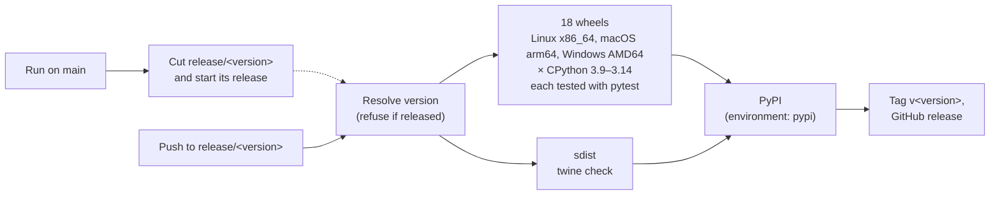

# Releasing

Nothing is released from `main`. A release of pygim runs on its branch,
`release/<version>`, cut from `main`. The
[release workflow](../.github/workflows/release.yml) builds a wheel for every
supported platform and Python and runs the whole test suite against each
installed wheel. Only if every wheel passes does it publish to PyPI as
`python-gimmicks`, tag the commit `v<version>` and create the GitHub release.

## Cutting a release

From GitHub's Actions tab (*Release* → *Run workflow* on `main`), or from a
terminal:

```bash
gh workflow run release.yml -f bump=patch          # latest release 0.0.9 -> release/0.0.10
gh workflow run release.yml -f bump=minor          # -> release/0.1.0
gh workflow run release.yml -f version=0.1.0rc1    # an explicit version
gh run list --workflow release.yml                 # the cut, then the release it started
```

Run on `main`, the workflow only cuts: it picks the version (the latest `v*`
tag bumped, or the one given), creates `release/<version>` from `main`, and
starts the release on that branch. That second run is the release. Run on any
other branch, the workflow refuses.

You can also cut a branch yourself. The push starts its release:

```bash
git push origin origin/main:refs/heads/release/0.1.0
```

A release that fails stays on its branch. Push the fix there, which runs the
release again, and merge the branch back into `main`. To rerun a branch's
release without a new commit, use `gh workflow run release.yml --ref release/0.1.0`.

## What decides the version

- The branch name is the version, spelled as canonical PEP 440: `0.1.0`,
  `0.1.0rc1`, `1.0.0.post1`. `release/v0.1.0` and `release/0.1.0-rc1` are
  refused, and the refusal names the right spelling.
- A version is released once. If its tag already exists, or PyPI already
  holds it, the run stops before building anything. A fix to a released
  version is a new version: cut `release/0.1.1` from `release/0.1.0` plus the
  fix.
- A pre-release version (`rc`, `b`, `a`) becomes a GitHub pre-release. A
  patch or minor bump ignores pre-release tags.

The logic is in `.github/scripts/release_version.py` and is tested by
`tests/unittests/test_release_version.py`.

## What a run does



- **The version reaches the build as `SETUPTOOLS_SCM_PRETEND_VERSION`.** The
  tag is created only after publishing, so setuptools_scm cannot read it from
  git during the build.
- **pyarrow is pinned in the wheel metadata** to the `major.minor` release
  the wheel was built against (`setup.py::_pin_arrow_abi`). The extensions
  link Arrow's versioned shared libraries, so no other pyarrow can load them.
  Arrow's libraries are excluded when the wheel is repaired and are loaded
  from the pinned pyarrow instead.
- **Tests run against the repaired wheel** in a clean environment
  (`pytest {project}/tests`), not against a source build. What is tested is
  what PyPI serves.
- **macOS builds its own unixODBC** (`.github/scripts/build_unixodbc_macos.sh`)
  for the wheels' deployment target, 13.3. Homebrew's bottle targets a newer
  macOS, which delocate rejects.

A pull request that changes the workflow or its scripts runs all of this as
a dry run (version `<next patch>.dev0`, nothing published).

## When a run fails

| Failed at | Nothing was published. Do this |
|---|---|
| Resolve version, or the cut | Read the error: it names the problem and the fix. |
| A wheel or the sdist | Push the fix to the release branch; the push runs the release again. |
| Publish | Usually PyPI configuration (see below). Fix it, then *Re-run failed jobs*. |

| Failed at | The release **is** on PyPI. Do this |
|---|---|
| Tag and GitHub release | *Re-run failed jobs*. That reruns only this job; publishing is not repeated. |

## One-time setup

The workflow publishes with PyPI trusted publishing, so no API token is
stored in the repository. It needs:

1. **A trusted publisher on PyPI.** `python-gimmicks` is not on PyPI yet, so
   add a *pending* publisher at <https://pypi.org/manage/account/publishing/>:
   PyPI project `python-gimmicks`, owner `Debith`, repository `pygim`,
   workflow `release.yml`, environment `pypi`.
2. **The `pypi` environment on GitHub** (*Settings* → *Environments*). A
   first run creates it, but configure it before then:
   - *Deployment branches and tags*: *Selected branches and tags*, with the
     single rule `release/*`. PyPI uploads can then only come from a release
     branch.
   - *Required reviewers* (optional): you approve every upload to PyPI before
     it happens. Everything before the upload has already passed by then.

Start with a pre-release (`-f version=0.1.0rc1`) to prove the setup
end to end.
