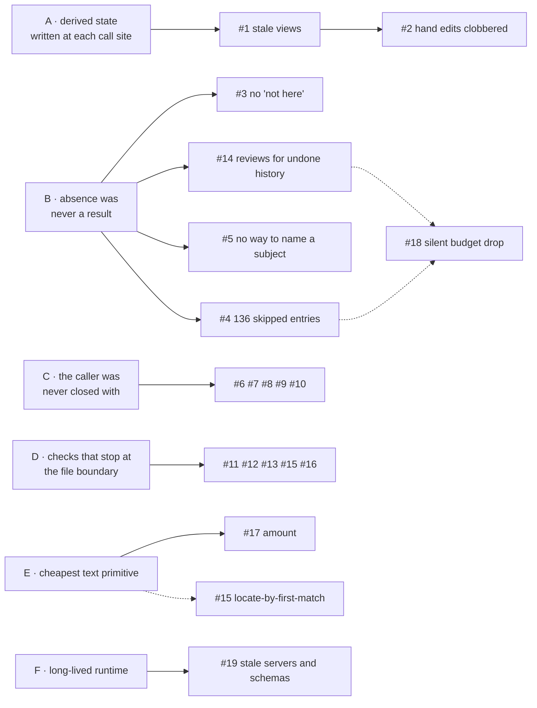

# Root cause analysis — the memory defects of 2026-09-15/16

Nineteen defects were found in the problem-space memory within two days of its first real use.
This report asks why each existed, and finds that they are not nineteen independent mistakes:
six recurring causes account for all of them, and two of the causes produced *new* defects in the
very commits that fixed their earlier instances.

| Term | Meaning |
|---|---|
| **Field report** | `__notes__/2026-09-15-memory-field-report-dnd-seeding.md` — an agent session's account of seeding the D&D 2024 glossary into a store and then asking it three rules questions, with the tool calls counted. Its §7 is an A/B rerun after the first round of fixes. |
| **Head view** | `memories/<slug>.md` — a generated file showing the current version of one memory, so a person can read and diff the store in git. |
| **Candidate** | A memory that a read's hard tags admit — counted before ranking orders the candidates, before the budget cuts them, and before any term narrows them. |
| **The fold** | What a read does with an accepted generalisation: rather than placing each of its instances in the context separately, the read lists the instances under the generalisation as evidence. |
| **Locator** | `<document>:L<line>` — where a vocabulary value or a memory says its text comes from. |

Sources: the field report §0–§7; this session's own defect (head views) and its fix; commits
`0f3b5ed`, `442d26b`, `63af1c2`.

---

## 1. The defects, and what each was really an instance of

| # | Defect | Immediate cause | Root cause | Fixed by |
|---|---|---|---|---|
| 1 | `link` / `unlink` left a memory's head view showing its old tags | views were written by `remember` and removed by `retire`, nowhere else | [A](#a-derived-state-written-at-each-call-site) | `0f3b5ed` |
| 2 | The fix for #1 would have overwritten a view a person had edited by hand | "regenerate when the content differs" treats an edit as staleness | [A](#a-derived-state-written-at-each-call-site) | `442d26b` |
| 3 | A read that found nothing relevant could not say the answer was not in the store | the response described what was found, never what was absent | [B](#b-absence-was-never-a-result) | `442d26b` |
| 4 | Every read returned every other candidate — up to 136 entries the agent only counted | explanation (G2) was specified without a volume budget | [B](#b-absence-was-never-a-result) | `442d26b` |
| 5 | The subject of a question ("invisible", "mounted") could not narrow a read | tags answer *what kind of problem*, and all 138 rules shared the same tags | [B](#b-absence-was-never-a-result) | `442d26b` |
| 6 | `link`, `unlink` and `retire` did not say what the memory now carried | a mutation returned the audit row's echo — "linked" | [C](#c-the-caller-was-never-closed-with) | `442d26b` |
| 7 | An accepted vocabulary pack was invisible until the agent polled `session` | a change made outside the agent's calls had no channel back to it | [C](#c-the-caller-was-never-closed-with) | `442d26b` |
| 8 | `task=any` in a query was refused without saying what to do instead | the refusal named the failed check, not the caller's intent | [C](#c-the-caller-was-never-closed-with) | `442d26b` |
| 9 | The same text with different tags was refused with "report it useful instead" | as #8: the check that fired was *identical content*, so that is what was said | [C](#c-the-caller-was-never-closed-with) | `442d26b` |
| 10 | `learn` was never called in six sessions; every usefulness counter read 0 | nothing in a read response asked for it | [C](#c-the-caller-was-never-closed-with) | `442d26b` |
| 11 | `ingest` could not carry citations, so seeding bypassed MCP for Python | the corpus header parser knew tags and title, and citations were not a tag | [D](#d-checks-and-data-that-stop-at-the-file-boundary) | `442d26b` |
| 12 | Seeding paid a quadratic `seen` cost — up to 154 keys per write | the unread check has one exemption (`origin=seed`) and `remember` could not ask for it | [D](#d-checks-and-data-that-stop-at-the-file-boundary) | `442d26b` |
| 13 | Replacing a pack silently orphaned tags memories still carried | the loader validates one file; which memories carry a value lives in another | [D](#d-checks-and-data-that-stop-at-the-file-boundary) | `442d26b` |
| 14 | Replay raised "unknown tag" reviews for history that was already undone | the review was raised per row, not per memory-still-carrying-it | [B](#b-absence-was-never-a-result) | `442d26b` |
| 15 | `check_pack` passed a locator pointing at the wrong line | the check reads the pack; verifying a locator means reading the document | [D](#d-checks-and-data-that-stop-at-the-file-boundary) | `442d26b` |
| 16 | `cite` and the inventory gave one document two different ids | the id was derived in two places instead of owned by one | [D](#d-checks-and-data-that-stop-at-the-file-boundary) | `442d26b` |
| 17 | `term="mount"` returned three rules about the word "amount" | substring matching, the cheapest primitive, with no word boundary | [E](#e-text-matched-with-the-cheapest-primitive) | `63af1c2` |
| 18 | A budget could empty a context without saying a budget had done it | the skipped *list* became a count, and the cause went with it | [B](#b-absence-was-never-a-result) | `63af1c2` |
| 19 | Eight stale MCP servers ran code from before the rebuild; a ninth held a cached tool schema | the runtime outlives the code it loaded, and nothing negotiates versions | [F](#f-a-long-lived-runtime-over-changing-code) | documented; processes killed |

Defects #2 and #18 were *introduced by the fixes* in this series — #2 by the fix for #1, #18 by the
fix for #4 — and each is a fresh instance of the same root cause as the defect it came from. That
is the strongest evidence in this report that these are causes and not coincidences: a coincidence
has no reason to reappear inside its own fix, while a cause that is still operating does, because
it shapes the fix as it shaped the defect.



---

## 2. The root causes

### A. Derived state written at each call site

**What it is.** A head view is derived from the index. It was written by the two operations whose
author had it in mind — a write, a retirement — and every operation added later (`link`, `unlink`,
a promoted tag, an accepted proposal, rows caught up from another process) simply did not think of
it. There was no single place where "the index changed" arrives.

**Why it happened.** The feature entered the code where the need appeared: `remember` produces a
file a person can read. That is the natural place to write it, and it is wrong, because the file
does not depend on the *operation* but on the *state after* it. Each subsequent operation was
written against the same model, and the design document (03 §3.3) described the view as "rewritten
when the head changes" — true, but narrower than the file's actual dependency: the file shows the
memory's tags as well as its head, and `link` changes the tags without changing the head, so a
view can go stale through changes that sentence never names.

**Why the second instance happened.** The fix moved the write to the one place every change passes
through, which is right, and then defined staleness as "the file differs from what it should be".
For a *generated* file that is correct; for a file a person is invited to read and diff in git, it
is a silent overwrite of their edit — a loss the design had already argued about (03 §3.4). The
code carried no trace of that argument, so the fix's author had to re-derive it from the document
rather than read it off the code.

**Fixed.** Views now follow every published snapshot in one function, and a view whose text is no
version of its chain is kept and reported instead of rewritten. Worked through with data in
[§6.1](#61-cause-a-the-file-that-stopped-following-the-store) and
[§6.2](#62-cause-a-again-the-fix-that-would-have-eaten-an-edit).

**What would have caught it earlier.** A test per operation — "after `link`, the view shows the new
tag" — would have caught #1 but not #2, and would need writing again for each future operation.
Testing *chains* is what generalises: run a sequence of operations and assert one invariant after
every step, so an operation nobody thought about still has to keep it. The invariant is the
structural rule — derived artefacts have exactly one producer, fed by state and not by operations,
and that producer never destroys content it cannot account for.
[§6.6](#66-the-test-that-generalises-a-chain-with-one-invariant) writes that test out.

### B. Absence was never a result

**What it is.** Five defects are one shape: the system reported what it had and stayed silent about
what it lacked or withheld.

| Instance | What was silent |
|---|---|
| #3 | the store holds nothing about this question; these documents were never seeded |
| #4 | 136 candidates ranked below the cut — returned in full, which is a different failure of the same kind: the response could not say "a lot", only show it |
| #5 | no way to say "about mounts", so a read could not narrow and then report emptiness meaningfully |
| #14 | a tag that no longer exists — reported for rows whose memory had already dropped it, so the true absence was buried in noise |
| #18 | one memory, twelve tokens over the budget, dropped without a word |

**Why it happened.** Everything that defines a read — the worked example in 04 §4, the scenarios in
00a, the whole test suite — walks the path where memories *are* found. G2 requires that every
included memory explain itself, and the implementation satisfied it. Nothing required the response
to explain the memories it did *not* include, or the question it could not answer. With stores of
three to five memories in tests, every response is small, whether the store could answer or not —
so an unanswerable read was indistinguishable from an ordinary read of a small store.

**Fixed.** `coverage` (cited documents, uncited candidates, inventoried documents nothing cites),
`facets` (what the candidates carry, including a soft tag at 0), `term`, `budget_dropped`, and
unknown-tag reviews raised only for a head still carrying the tag.

**What would have caught it earlier.** A read test whose expected answer is *nothing useful here*,
against a corpus large enough for a wrong answer to look plausible. There was no such test, and the
first one run in anger was the field report's mounted-combat question.

### C. The caller was never closed with

**What it is.** Five defects in how the tools talk back: a mutation said what it did (`"linked"`)
rather than what now stands; a change made by a person had no way to reach the agent; refusals named
the check that fired instead of the remedy; and nothing ever asked the agent for the one input the
system needs from it (`learn`).

**Why it happened.** Tool results were shaped after the audit row — the model's centre of gravity is
the log, and a row is exactly "what happened". For an agent, though, a result is not a receipt; it is
the next input — whatever the result leaves unsaid, the agent's next call has to go and fetch. The
gap showed up as cost: of the ~21 tool calls in the seeding session, four were
`show` calls confirming a mutation, about five were `session` polls waiting for a human to accept a
pack, and one was a refusal whose advice was wrong for what the agent wanted.

**Fixed.** Mutations return the memory's tags and head status; a vocabulary change is announced in
the next result; the `any` and identical-text refusals name the remedy (`link`/`unlink`, name the
value your work is); a read that returns memories asks for `learn`.

**What would have caught it earlier.** Counting calls by *cause* — which is precisely what the field
report did, and what no test does. A suite asserts that a call returns the right answer; only a
transcript shows that three calls were needed to learn one fact.

### D. Checks and data that stop at the file boundary

**What it is.** The vocabulary loader validates what is inside the file it is reading. Every check
that needs a second file was either unimplemented, or implemented where the second file happened to
be open, or duplicated on both sides.

- 02 §2.2 states the law *every locator names an inventoried source* — written in the design,
  never implemented, because the loader does not read the inventory (#15).
- `cite` derived a document id from a path while the inventory carried its own (#16): two producers
  of one identifier, so they disagreed the moment either was hand-written.
- Replacing a pack checks the new file's shape but not the memories that carry values it drops
  (#13) — those live in the audit log, not the YAML.
- The corpus parser accepted the headers it knew (#11), and `remember` could not ask for the seed
  exemption the ingest path already had (#12): the same capability existed on one side of a
  boundary and not the other.

**Why it happened.** Each component was built with a clear, narrow input. That is good design, and
it is exactly why the cross-file obligations fell between components: a check that needs a second
file belongs to no component whose input is one file, so none of them performed it. Nobody owned
"the store is consistent with the project's documents".

**Fixed.** `check_pack` and `accept --pack` resolve every locator a pack adds against its document
(not inventoried, missing, wrong passage, text repeated elsewhere); accepting a replacement is
refused while a head carries a removed value; `cite` takes the inventory's id when it has one;
`ingest` reads `cites:`; `remember` takes `origin=seed`.

**What would have caught it earlier.** Treating a law written in a design document as unfinished
work until a test asserts it. 02 §2.2's locator law had been true on paper for weeks.

### E. Text matched with the cheapest primitive

**What it is.** Two defects, one habit. `check_pack`'s original locator was found by taking the
first line equal to the text (#15, the "Attack" case), and `term` matched a substring anywhere
(#17, `mount` inside `amount`). Both are the simplest thing that works on the happy path and have
no notion of a word, a boundary, or uniqueness.

**Why it happened.** Text matching feels like plumbing rather than design, so it is written inline
and reviewed lightly. Its failures need an adversarial corpus to appear: in a 5-memory test store no
word hides inside another.

**Fixed.** A term matches only at the start of a word — keeping stem queries working — and
`check_pack` warns when cited text occurs on more than one line.
[§6.5](#65-cause-e-a-rule-about-amounts-answering-a-question-about-mounts) has the data, and
[§7](#7-avoiding-cause-e-next-time-declare-the-matching-contract) answers the question this raises:
if substring matching is wanted, should the term grow wildcards?

### F. A long-lived runtime over changing code

**What it is.** Nine MCP server processes were running against this project, eight of them started
before the build they were meant to serve; the ninth held a tool schema cached from before `term`
existed. Passing the new argument happened to work, but only because the host forwarded an
argument its cached schema did not list — behaviour nothing guarantees, which is why it is luck.

**Why it happened.** The server is started by the editor per session and never asked to exit, while
the extension it imports is rebuilt underneath it. Nothing in the protocol handshake pins a version,
and the store's own version negotiation (vocabulary digests, receipts) covers data, not code.

**Fixed since (2026-09-17).** A result says `server_stale` once when the files on disk have moved
on, and `oo memory reload` asks each server to re-exec itself between messages — an exec replaces
the code the process runs while keeping its open pipes to the host, so the session survives, and
the session number travels with it. The reloaded process
sends `tools/list_changed`, for hosts that re-fetch schemas on it. What remains is the host's half:
a client that ignores that notification still holds the schemas it cached at connect time.

---

## 3. Why the tests did not find any of this

All nineteen defects were found by using the system: 15 in one seeding session, two in the A/B
rerun, one by reading a design document during a fix, one by listing processes. The suite was
green throughout, and still is.

| Blind spot | Consequence |
|---|---|
| Test stores hold 3–5 memories | scale-dependent failures (#4's 136 entries) cannot appear, and a wrong answer cannot look plausible enough to be noticed (#3) |
| Tests assert what a call returns, never how many calls a job took | the four confirmation calls and five polls of cause [C](#c-the-caller-was-never-closed-with) were invisible |
| Every read test expects a hit | absence, cause [B](#b-absence-was-never-a-result), had no assertions at all |
| Fixtures write their own vocabulary and cite nothing | locators, the inventory and pack replacement (cause [D](#d-checks-and-data-that-stop-at-the-file-boundary)) were exercised only where they were implemented |
| Text is synthetic and short | no word hides inside another (#17) |
| Design laws live in Markdown, not in tests | 02 §2.2's locator law was unimplemented and nothing said so |

---

## 4. What to change, beyond the fixes

| | Change | Cause it closes | Cost |
|---|---|---|---|
| 1 | A fixture store of ~150 cited memories from one document, with read tests whose expected answer is *not here* — asserting `coverage.not_cited`, `facets` zeros, `budget_dropped`, and a response size ceiling | B, and the scale blind spot | half a day |
| 2 | An adversarial-words fixture (`mount`/`amount`, repeated lines) for every text match in the codebase | E | an hour |
| 3 | A rule, in 03 and in review: one producer per derived artefact, fed by state; it never destroys content it cannot account for — with the chain test of [§6.6](#66-the-test-that-generalises-a-chain-with-one-invariant) holding it | A | an hour; the invariant is ~15 lines |
| 4 | A law in 04 — *a response says what it withheld and why* — and a check that each withholding path (`max`, budget, fold, term, retired) has a field naming it | B | an hour, mostly writing |
| 5 | Move 02 §2.2's locator law from the design into the loader as warnings at open, not only in `check_pack` | D | half a day |
| 6 | Compare `serverInfo.version` with the installed package on each call and say so once, or advertise `tools/list_changed` | F | small; needs a host that honours it |
| 7 | Repeat the field report on a corpus seeded more than one document deep | all of them | a session |
| 8 | Declare the matching contract ([§7](#7-avoiding-cause-e-next-time-declare-the-matching-contract)) for every text match: unit, case, boundary, and who may widen it — in the tool description, not only in the code | E | an hour |

The counting method the field report used — every tool call, grouped by *why it was made* — found
more in one session than the test suite has in its existence. It is worth keeping as a practice,
not just as an incident.

---

## 5. What this says about the design

None of the six causes is a coding mistake. Each is the shadow of a decision that was right:

- the audit log as the centre of the model gave reproducibility, and shaped tool results into
  receipts ([C](#c-the-caller-was-never-closed-with));
- components with narrow inputs gave a loader that reports every failure by file and line, and left
  the cross-file obligations unowned ([D](#d-checks-and-data-that-stop-at-the-file-boundary));
- generated views gave a store a person can read in git, and made a person's edit look like drift
  ([A](#a-derived-state-written-at-each-call-site));
- explaining every included memory (G2) gave checkable retrieval, and said nothing about the
  excluded ([B](#b-absence-was-never-a-result)).

The pattern to carry forward: a design that specifies what the system *does* should be read a second
time for what it should say when it *cannot* — and for who owns the things nobody's component
mentions.

---

## 6. Worked examples

One per cause, each with the smallest store that shows it. Every example is *context, what is done,
what comes back* — before the fix and after — so the failure can be recognised rather than
described.

### 6.1 Cause A: the file that stopped following the store

**Context.** A store holding one memory, `#1`. Two things represent it: the index, which answers
reads, and `memories/shield-is-the-yardstick.md`, the file a person reads and diffs in git.

```text
memories/shield-is-the-yardstick.md
---
memory: 5f2daeb106534990d37b26a9a4e5462d
title: "Shield is the yardstick"
tags: ["domain=dnd","artifact=spell","task=design","kind=principle"]
---
A defensive reaction earns its slot only if it beats Shield per slot.
```

**What is done.** One call: `link #1 task=balance` — "this principle is needed when balancing too".

**Before `0f3b5ed`.** The index takes the tag, and everything that reads the index agrees:

```text
show #1        → tags: [... "task=design", "task=balance", "kind=principle"]
read task=balance → finds #1
memories/shield-is-the-yardstick.md   → unchanged; git diff is empty
```

The file now states something false, and nothing says so. In the real store this had been running
for weeks: repairing it (`b5d468b`) rewrote six view files, one of which had been showing a tag
value renamed two vocabulary versions earlier.

**After.** The same call rewrites the file, and `git diff` shows exactly the one line that changed:

```diff
-tags: ["domain=dnd","artifact=spell","task=design","kind=principle"]
+tags: ["domain=dnd","artifact=spell","task=design","task=balance","kind=principle"]
```

**The point.** The file does not depend on *which operation ran*; it depends on *the state after
it*. The old code wrote it inside `remember`, so it tracked "a memory was written". Every operation
added later — `link`, `unlink`, a promoted tag, an accepted proposal, rows another process wrote —
changed the state without passing that line of code. The fix moved the write to the one place every
new state passes through, so an operation invented next year is covered without knowing about views.

### 6.2 Cause A again: the fix that would have eaten an edit

**Context.** The same file, after a person fixes it by hand while reading the branch — a sharper
sentence, no tool involved:

```diff
-A defensive reaction earns its slot only if it beats Shield per slot.
+A defensive reaction earns its slot only if it beats Shield per slot, at every tier.
```

**What is done.** Anything at all: `link #1 task=balance`, or merely opening the store, which now
checks every view.

**With the first version of the fix** (never released). "The file differs from what it should be"
meant stale, so it was regenerated. The person's sentence vanished, with no row, no review, and no
diff to notice — the store's only record of the edit was gone.

**After.** The file is left exactly as the person wrote it, and the store says why it is no longer
following:

```text
session() → reviews: [{"kind": "view edited",
  "text": "memories/shield-is-the-yardstick.md was edited by hand: its text is no version of
           #1 5f2daeb1 Shield is the yardstick. It is kept as it is; to take the edit, remember it
           superseding the head, and the view follows."}]
```

Writing that sentence as a memory superseding `#1` makes the file match a version again, and it
resumes following automatically.

**The point.** A generated file may be overwritten; a file people are invited to edit may not. The
rule that covers both: **a producer may overwrite only content it can account for** — content it
generated, or that an earlier version of the same chain generated. Anything else is someone's work.

### 6.3 Cause B: a read that could not say "not here"

**Context.** A store seeded from one document only, and an inventory that knows of two:

```text
#0 "Speed"  tags: domain=dnd artifact=rule task=explain   cites: phb-2024-glossary:L1200
#1 "Prone"  tags: domain=dnd artifact=rule task=explain   cites: phb-2024-glossary:L1000
sources/inventory.yaml: phb-2024-glossary, phb-2024-ch1     (ch1 was never seeded)
```

**What is done.** The question is "how does mounted combat work?", so: a read on
`hard=[domain=dnd, artifact=rule, task=explain]`.

**Before.** Both memories come back, each scoring on a soft tag, neither about mounts. The response
is indistinguishable from one that answered the question badly. The agent only learned the rule was
absent by searching the books, and found it at `phb-2024-ch1:L875`.

**After**, with the subject named:

```json
{"candidates": 2, "term_matched": 0, "memories": [],
 "coverage": {"cited": {"phb-2024-glossary": 2}, "uncited": 0, "not_cited": ["phb-2024-ch1"]}}
```

Three facts in one call: two memories could have answered this kind of question; none of them
mentions mounts; and `phb-2024-ch1` is a document the store rests on nothing from — look there.

**The point.** The store knew all three things all along. It had never been asked to say them,
because every example, scenario and test described a read that finds something.

### 6.4 Cause B: the budget that dropped the answer without a word

**Context.** One procedure and one rule, and a caller with a small budget:

```text
#0 "Answering a rules question"  kind=procedure      20 tokens
#1 "Influence [Action]"          mentions Animal Handling   412 tokens
read(..., term="Animal Handling", budget=400)
```

**Before `63af1c2`.** `{"procedure": {...}, "memories": [], "skipped": 1}` — and `skipped: 1` does
not say whether the memory lost to `max` or to the budget. The agent sees an empty context and
cannot tell "the store has no such rule" from "one rule, twelve tokens too big".

**After.** `{"procedure": {...}, "memories": [], "skipped": 1, "budget_dropped": 1}` — raise the
budget by twelve tokens and the answer is there.

**The point.** This defect was *created* by the fix for the 136-entry responses: replacing a list
with a count also removed the reason each entry was not placed. When an aggregate replaces a
structure, the causes have to be carried over deliberately.

### 6.5 Cause E: a rule about amounts answering a question about mounts

**Context.** Two memories, one of which contains the letters of the query inside a different word:

```text
#0 "Damage Threshold"  text: "Only damage above the amount breaks the object."
#1 "Speed"             text: "Your Speed is how far you move on your turn."
```

**What is done.** `read(..., term="mount")` — the shortest stem, as the guidance asks for, so that
"mounted" and "mounts" both match.

**Before `63af1c2`.** `term_matched: 1` → Damage Threshold, on "a**mount**". In this corpus it was
harmless noise; in a larger store, three such matches are indistinguishable from three real ones
until the agent reads them.

**After.** `term_matched: 0` — and had `#1` said "A **mounted** creature moves at its mount's
Speed", the same query would have matched it, because the match begins at the start of a word.

```text
term="mount"   matches "mounted", "mounts", "re-mount", "mount."     not "amount", "paramount"
term="ount"    matches nothing
```

A match begins at the start of the text or after a character that is neither a letter nor a digit.

### 6.6 The test that generalises: a chain with one invariant

A test per operation ("after `link`, the view shows the tag") fails to protect the next operation
somebody adds, which is exactly how #1 happened. What generalises is a **chain of operations with
one invariant asserted after every step** — including the steps nobody has written yet, since the
chain is data.

**Context.** A store, a scripted sequence, and one hand-edited file placed deliberately:

```text
steps:  write A  →  write B (seen A)  →  link B task=balance  →  learn ×3 (promotes a tag)
        →  edit B's view by hand  →  unlink B task=balance  →  supersede B with B'  →  retire A
        →  accept a proposal (a vocabulary file changes)  →  reopen the store
```

**Asserted after every step**, not only at the end:

1. every head has a view whose front matter and text equal what the store would generate now;
2. no chain without a head has a view;
3. the hand-edited file is byte-identical to what the test wrote, and `session()` reports it.

**What it catches.** Any future operation that changes the index without going through the one
producer breaks assertion 1 at its own step, and names itself in the failure. Any future attempt to
"just regenerate everything" breaks assertion 3. Neither assertion mentions `link`, `unlink` or
`accept`, so neither needs updating when the next operation arrives — only the step list grows.

**Cost.** The invariant is about fifteen lines, because the store can already generate a view; the
chain is a list of calls. This is recommendation 3 in [§4](#4-what-to-change-beyond-the-fixes).

---

## 7. Avoiding cause E next time: declare the matching contract

> *"How can we avoid these? In coding, each situation must be considered individually. If we want to
> support substring search, maybe we then should support wildcards."* — comment on §2E

The individual consideration is the right instinct, and the failure was not that substring matching
was chosen. It is that **nothing was chosen**: the semantics were an artefact of `find()` being the
easiest call to write, so they were never stated, never disagreed with, and never tested. A term
that matches inside words is a defensible design — it is what `grep` does — but it has to be a
decision somebody can argue with.

**The contract, four questions, answered before the code is written.** For `term` today:

| Question | Answer now | Where it is visible |
|---|---|---|
| Unit — what counts as an occurrence? | a match beginning at the start of a word | 04 §3.10, the `read` tool description |
| Case and normalisation? | ASCII case ignored; no stemming, no synonyms | the tool description says "query the shortest stem" |
| Boundary — what ends a word? | any character that is neither a letter nor a digit, so `_` and `-` are boundaries | 04 §3.10 |
| Who may widen it? | nobody yet — one behaviour, no options | — |

Adversarial fixtures then pin each answer: a word inside a word (`mount`/`amount`), a stem
(`mount`/`mounted`), a phrase (`Animal Handling`), a boundary character (`basic_id_set` found by
`id_set`).

**On wildcards, specifically.**

| Option | Concretely | For | Against |
|---|---|---|---|
| **Word-start only, no wildcards** (now) | `term="mount"` | one behaviour to describe and test; a stem query already does what `mount*` would | a word that only ever appears inside a longer one cannot be found |
| An explicit mode | `term="mount", term_mode="substring"` | the caller states intent; each mode is testable; the default stays safe | three behaviours to explain, and an agent that picks the loosest by habit |
| Wildcards | `term="*mount"` | expressive, familiar | a grammar, escaping rules, and the same boundary questions again inside it; invites regex expectations the filter will not meet; `mount*` duplicates the default |

Not now — but with a concrete case that would change it, because it is likelier to come from pygim
than from D&D. `id_set` finds `basic_id_set` today, since `_` is a boundary; `PathSet` does **not**
find `BasicPathSet`, since the match there begins mid-word. A memory store over a camel-cased
codebase meets that on its first read. If that case turns up, the smallest honest answer is one
explicit mode with one meaning — interior matching, stated in the tool description and pinned by
the same adversarial fixtures — and not a wildcard grammar.
