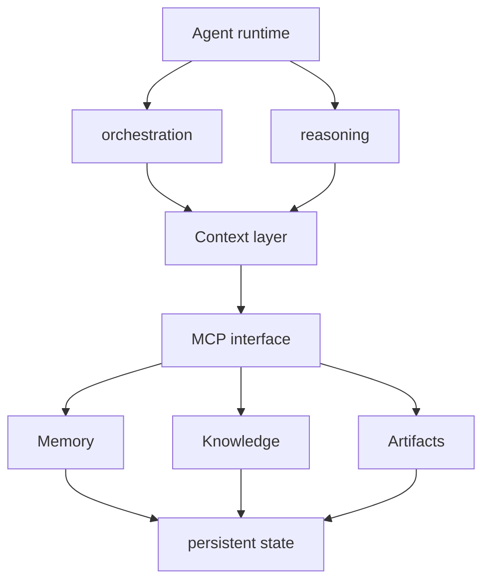
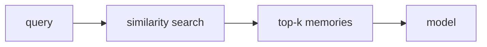
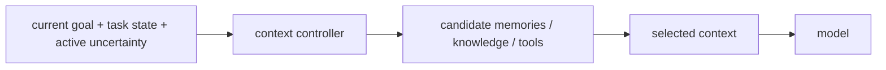
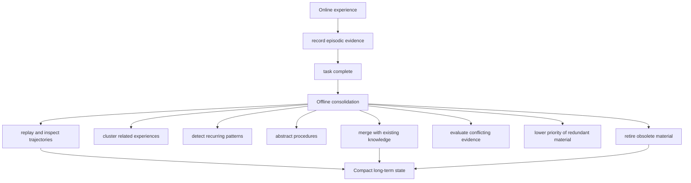
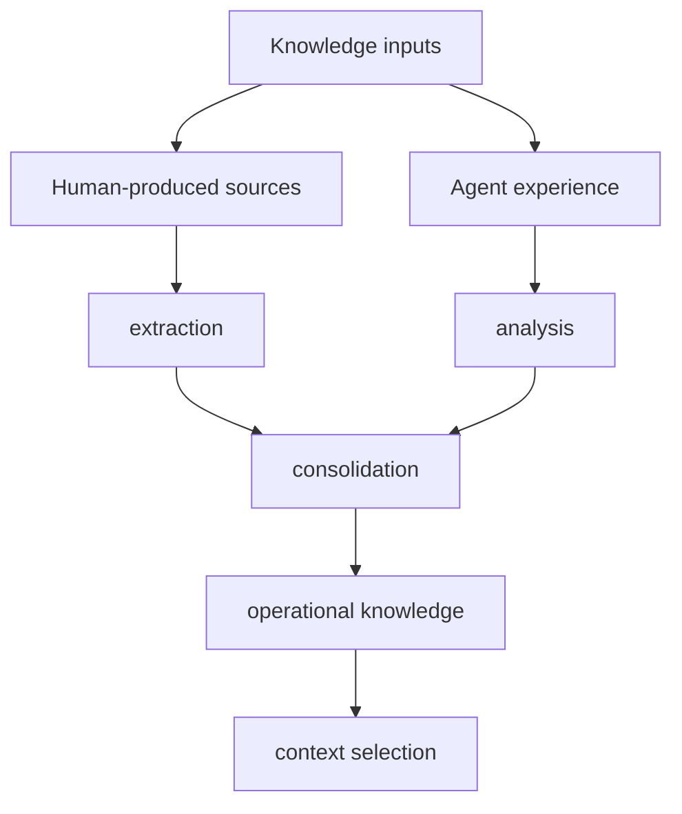
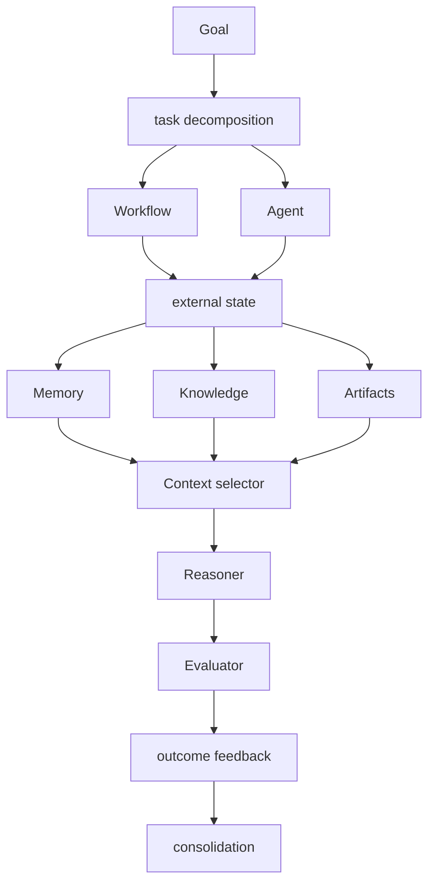
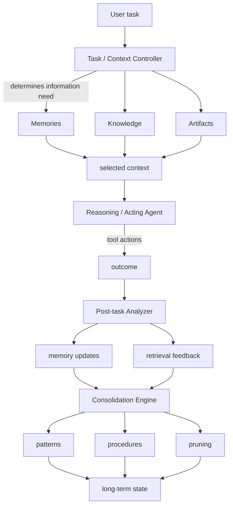
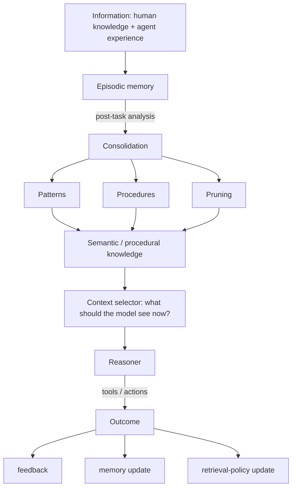

# Evolving Memory & Context Systems for Agentic AI

A technical synthesis of the discussion on MCP, memory, context selection, multi-agent systems,
consolidation, learned skills, and agent-system architectures. Prepared for agent-framework
development. Literature sweep current to 20 September 2026.

> **Standing of this document.** Debith's own synthesis, and the direction pygim's memory is
> designed toward (2026-09-21): "This above report is very important discussion of mine on the
> topic and sets the direction we go... I am not planning this for current state but to the end
> state, whatever the report is pointing us to." It is a source, cited by memories and by the
> design (00 §4.13). Transcribed from the original; tables rebuilt and the box diagrams redrawn as
> Mermaid, wording unchanged. The cited 2026 papers have not been independently verified.

**Purpose.** Capture the technical ideas developed in the conversation and place them alongside
current research, with particular attention to an MCP-backed external memory/state layer and a
post-task consolidation process. The report is descriptive and separates established observations,
research findings, and proposed design directions.

---

## 1. Executive summary

The discussion converged on a system-level view of agentic AI in which the underlying language
model is only one component. The practical objective is not simply to add tools or more agents, but
to control what information reaches the model at each reasoning step, maintain external state
across tasks, learn from task outcomes, and continuously convert raw experience into more compact
and reusable knowledge.

A central observation from the development work is that the composition of model context has a
strong effect on whether the model produces the desired result. Current research increasingly
treats this as a distinct engineering discipline: context engineering. Anthropic describes context
engineering as managing the full state available to a model at inference time, including
instructions, tool definitions, external information, retrieved material, conversation history,
and persistent state. The emphasis is on selecting the right information for the current step
rather than maximizing context volume. [1]

A second key idea is to separate fast, online experience capture from slower, offline
consolidation. During a task, agents can write raw episodic memories through MCP. After task
completion, a separate process can inspect trajectories, determine which retrieved memories and
actions helped or hindered, merge repeated experiences into broader patterns, remove redundancy,
and update retrieval behaviour. Recent work such as Auto-Dreamer, ReMe, Nemori, Memory-R1, Fine-Mem,
and MemSkill demonstrates closely related approaches. [2-7]

A third idea is to avoid treating learned knowledge as a static skill file. Current skill systems
often externalize reusable procedures as text, which makes them auditable and portable, but
research such as SkillOpt and Memento-Skills is beginning to treat such external artifacts as
optimizable state. The broader design direction discussed here is different: the fundamental
learned representation should be richer than a prompt, allowing facts, relationships, procedures,
exceptions, evidence, outcomes, and retrieval policies to evolve independently. [8-9]

The resulting architecture can be viewed as an external cognitive-state layer around the model:
episodic memory records experience; semantic knowledge captures generalized facts and patterns;
procedural knowledge records reusable ways of acting; outcomes provide feedback; and a context
selector learns what should be retrieved for a given situation. MCP is well suited to expose this
state and its operations because MCP standardizes tools, resources, and prompts between hosts,
clients, servers, and language models. [10-11]

## 2. Core conclusions from the discussion

| Observation | Why it matters | Architectural implication |
|---|---|---|
| Context composition is a major performance variable | The same model can behave differently depending on what is made salient at a particular step. | Treat context selection as a first-class subsystem, not merely prompt construction. |
| Memory should not be an append-only archive | Large memory stores create retrieval noise and make old, duplicated, or misleading memories increasingly costly. | Introduce consolidation, utility tracking, pruning, and abstraction. |
| Task completion provides learning signals | The trajectory contains evidence about useful retrievals, bad retrievals, successful strategies, failures, and missing information. | Analyse completed sessions retrospectively and feed the result back into memory and retrieval policy. |
| Experience can become reusable knowledge | Repeated experiences can be compressed into patterns, procedures, exceptions, and schemas. | Separate episodic evidence from generalized knowledge and procedural knowledge. |
| Skills need not be the fundamental representation | Textual skill artifacts are useful but can collapse complex, contextual behaviour into a prompt-like object. | Represent learned state as structured, relational, evidence-backed data, with text as one possible projection. |
| More agents are not universally better | Research shows coordination helps when work can be parallelized, but can hurt on sequential tasks and can amplify errors. | Choose architecture from task properties rather than agent count. |
| MCP can be the interoperability/state boundary | MCP standardizes context, tools, and resource exchange without defining the whole agent architecture. | Keep orchestration and learning logic above MCP; use MCP as the external capability/state interface. |

## 3. MCP as the external capability and state interface

The Model Context Protocol (MCP) is an open protocol for standardizing how applications provide
context and capabilities to language models. The current protocol architecture uses a
host-client-server relationship. Servers expose tools, resources, and prompts; clients manage
server sessions; and the host coordinates the overall interaction and permissions. Servers can be
local processes or remote services. [10-11]

The three core MCP primitives are:

- **Tools:** executable functions the model can invoke to retrieve information or take actions.
- **Resources:** structured or addressable content that can provide context.
- **Prompts:** reusable templates or instructions intended to guide interactions.

For the system under discussion, MCP is most useful when treated as a boundary rather than as the
complete agent architecture. The server can expose persistent state and operations without
dictating how the agent plans, schedules, evaluates, or learns.

A useful conceptual placement is:



### 3.1 Implication for a session-scoped VS Code MCP server

A server launched by VS Code for the duration of a local session is a useful development
configuration, but it is not automatically reachable by a separate hosted client. A future
architecture can preserve a local development transport while adding a remotely reachable transport
for clients that need network access. The important design decision is to define the server's role
first; deployment and transport can then follow from that role.

## 4. Context engineering: deciding what the model should see now

The conversation identified context selection as a key contributor to desired model behaviour.
Anthropic's current guidance makes a similar point: agent quality depends heavily on the context
supplied at each inference step, and context should be treated as a scarce resource rather than a
container into which every available fact is placed. Their guidance includes progressive
disclosure, compaction, note-taking, and selective retrieval. [1]

The important shift is from query-only retrieval to state-dependent retrieval. Instead of asking
only whether a memory is semantically similar to the user's words, a context controller can
consider the current goal, task category, intermediate state, prior tool results, unresolved
questions, and previous decisions.





### 4.1 Current architecture already described in the discussion

The current agent workflow includes a categorization step that determines what the issue is and
what information it may need to retrieve from the MCP server. This is already a form of context
control: classification and requirement discovery happen before retrieval.

A natural extension is to make this step explicit and measurable. The controller should not only
decide which information to request; it should also retain evidence about the retrieval decision so
that the completed task can later be analysed.

### 4.2 The small-controller hypothesis

A research hypothesis raised in the discussion is whether a smaller, specialized model or
controller can choose the context needed by a larger reasoning model more efficiently than simply
supplying the full available context. This does not require the controller to solve the task. Its
narrower objective is to estimate which information is likely to change the next decision or
improve downstream performance.

This should be treated as an empirical architecture question rather than an established result.
Research on model routing and adaptive context supports the general principle of allocating
computation and context selectively, while current memory research is increasingly learning the
retrieval and memory-management policy itself. [4,8-10]

## 5. Multi-agent systems and communication topologies

The discussion also explored whether multiple agents can communicate directly to complete work more
efficiently. Current research includes several distinct coordination patterns.

| Pattern | Structure | Observed/claimed use |
|---|---|---|
| Orchestrator-worker | Lead agent decomposes work and delegates to parallel specialists; specialists return distilled findings. | Used by Anthropic's multi-agent research system for breadth-first research. [12] |
| Independent parallel agents | Several agents work with little or no communication, followed by aggregation. | Can provide parallelism but risks inconsistent assumptions and error amplification. [13] |
| Decentralized / peer communication | Agents communicate or debate through a topology rather than a single manager. | Research has explored sparse communication to reduce overhead while retaining collaborative benefits. |
| Blackboard | Agents share requests and findings through a common workspace; agents contribute when capable. | Google Research reported gains on data-discovery tasks over RAG and master-slave baselines. [14] |
| Chain of agents | One agent processes a segment and passes a compact representation to the next. | Designed for long-context tasks that exceed a single model's effective context. [15] |
| Hybrid | Orchestrator control is combined with directed peer communication. | Recent controlled evaluation suggests architecture should match task decomposability and dependency structure. [13] |

The strongest current message is not that multi-agent systems are universally superior. Google
Research's 2026 controlled evaluation of 180 agent configurations found large gains on
parallelizable tasks but substantial degradation on sequential tasks; it also found that
coordination and tool-use costs increase with system complexity. The study therefore argues for
choosing an architecture based on task properties rather than assuming that adding agents will
improve performance. [13]

## 6. Memory: from storage to a learning substrate

The discussion moved beyond conventional RAG-style memory. An append-only memory bank can preserve
experience, but as the number of memories grows it becomes harder to retrieve the right items,
maintain consistency, and distinguish evidence from reusable knowledge.

A useful separation is:

| Layer | Question it answers | Typical content |
|---|---|---|
| Episodic memory | What happened? | Task events, observations, retrieved items, decisions, outcomes, provenance. |
| Semantic knowledge | What appears to be true or generally useful? | Facts, patterns, relationships, abstractions distilled from multiple experiences. |
| Procedural knowledge | How should this type of problem be approached? | Reusable procedures, conditional strategies, heuristics, exceptions. |
| Outcome/evaluation state | Did it actually help? | Success/failure, evaluator scores, corrections, evidence usage, downstream impact. |
| Retrieval policy | What should I retrieve next time? | Associations between situation characteristics and useful memories/knowledge/tools. |

This separation is important because a memory can be correct yet not useful in a particular
context; a retrieval can be relevant but introduce distracting information; and a successful task
can still contain steps or memories that were unnecessary.

## 7. Learning from successful and unsuccessful retrieval

The discussion proposed analysing the full session after a task has completed, using the trajectory
as evidence about what worked and what did not. This is closely related to current work on
memory-management reinforcement learning and fine-grained credit assignment.

Memory-R1 trains separate memory-management and answering components with outcome-driven
reinforcement learning, including explicit operations such as add, update, delete, and no-op. [4]
Fine-Mem addresses a key limitation of using only final task success as reward: the final reward is
too sparse to reveal which individual memory operations were beneficial. It introduces step-level
rewards and evidence-anchored attribution to link outcomes back to memory operations. [6]

Example trajectory analysis:

```text
retrieve M17 -> inspect
retrieve M42 -> ignore
retrieve M91 -> use
action A -> partial failure
retrieve M108 -> use
action B -> success

Post-task evidence:
M17: related but misleading
M42: unnecessary
M91: useful
M108: critical
Policy: prefer M91/M108 for this task state; avoid M17 unless condition X.
```

This converts the session history into more than a record of the final answer. It creates training
evidence for the memory manager, context selector, or retrieval policy.

### 7.1 The second-order learning signal

A particularly important distinction is between learning which memory is useful and learning which
retrieval strategy is useful. The latter is a policy-level signal. A system might learn, for
example, that in a particular task family it is more productive to retrieve an architectural
decision before searching implementation memories, or to inspect an unresolved failure before
consulting general examples.

This means that completed trajectories can update both the memory store and the mechanism that
selects context. In system terms, the memory layer becomes part of a closed feedback loop rather
than a passive database.

## 8. Offline memory consolidation and the sleep analogy

The conversation proposed a separate post-task or offline process that reviews accumulated
memories, removes clutter, identifies recurring patterns, and creates more general representations.
The analogy to human sleep is conceptually useful. Neuroscience research supports sleep-dependent
memory processing that can be selective, integrate new memories with existing knowledge, and
extract generalized or gist-like representations. The literature also makes clear that offline
processing is not identical to one simple 'sleep equals cleanup' mechanism, and some replay and
consolidation-related processes occur during wake as well. [16-18]

The most relevant engineering parallel is the separation between fast online acquisition and slower
consolidation. Auto-Dreamer explicitly implements a learned offline consolidator that operates
across sessions, uses provenance-linked trajectories as evidence, abstracts recurring procedures,
and replaces larger memory regions with compact representations. The paper reports improved
performance with substantially smaller active memory and transfer to other environments. [2]

ReMe takes a related lifecycle view: distill success patterns, identify failure triggers and
comparative insights, adapt retrieved knowledge to the current scenario, and prune outdated or
low-utility memories. [3]



### 8.1 Why consolidation should be separated

- Online execution should prioritize speed, correctness, and low interruption. It can store
  relatively raw evidence.
- Offline processing can spend more compute comparing many episodes, tracing provenance, checking
  conflicts, and searching for patterns.
- The two processes have different optimization targets: acquisition captures evidence;
  consolidation decides what the system should continue to carry forward.
- Keeping raw evidence separate from the consolidated representation makes rollback, auditing, and
  re-consolidation possible.

## 9. Existing human knowledge as a second learning stream

A major extension discussed was that the agent should not have to learn all useful behaviour
through its own task execution. Existing research, documentation, code repositories, technical
articles, and established practices already contain large amounts of domain knowledge.

This suggests two acquisition streams:



The target is not simply summarization. The useful output is operational knowledge: compact
representations of concepts, relationships, procedures, conditions, exceptions, and failure modes
that can influence future actions.

This approach changes the learning economics. A system can arrive with an initial body of distilled
operational knowledge before it has accumulated a large number of its own trajectories, then refine
that knowledge using actual outcomes.

## 10. Why static skill files are a limited abstraction

The discussion questioned the increasingly common pattern in which reusable agent behaviour is
stored as Markdown skill files such as SKILL.md. These artifacts are useful because they are
readable, portable, auditable, and easy to load progressively. However, they remain fundamentally
textual representations of procedures.

Recent systems show that skills can be made dynamic without modifying model weights. SkillOpt
treats a skill file as an externally trainable parameter and uses trajectory feedback plus
validation to improve it. [8] MemSkill treats memory routines as learnable and evolvable skills,
with a controller selecting skills and a designer revising them based on hard cases. [9]
Memento-Skills similarly maintains externalized, stateful skill artifacts through continual
learning. [10]

The distinction is therefore not 'static versus dynamic' alone. A dynamic Markdown skill can still
be a relatively narrow representation. A richer system can keep the underlying learned state in
structured form and generate textual instructions only when a human or model needs them.

| Representation | Strength | Limitation |
|---|---|---|
| Textual skill / prompt | Readable; easy to inspect; easy to inject into context. | Can compress complex, conditional knowledge into prose and may become brittle or verbose. |
| Structured memory | Preserves facts, metadata, provenance, utility, timestamps, and relationships. | Requires more system design and retrieval logic. |
| Graph / relational state | Represents relationships, dependencies, supporting evidence, conflicts, and reuse paths. | Can be harder to maintain and query well. |
| Learned retrieval/context policy | Learns what information should be surfaced for a state. | Needs evaluation and outcome signals; policy errors can hide useful knowledge. |

## 11. Beyond 'agents': toward compound and cognitive systems

The discussion used 'beyond agents' to describe systems where intelligence is distributed across
models, memory, retrieval, tools, workflows, evaluators, and persistent state. An agent is then a
reasoning/acting component inside a larger system rather than the complete architecture.



This is better understood as a cognitive-system architecture than as a collection of independent
agents. The practical goal is to design the interfaces between components so that state, evidence,
context, and learning signals can flow through the system.

### 11.1 Relation to AGI

The existence of these components does not, by itself, establish AGI. Google DeepMind's framework
separates AGI by performance, generality, and autonomy and emphasizes that progress toward AGI
requires evidence across breadth and depth of capabilities. [19] A system can have persistent
memory, planning, tool use, multi-agent coordination, and adaptive retrieval without demonstrating
general human-level competence across a broad range of tasks.

The relevance of the architecture to AGI research is that it addresses capabilities often
associated with longer-horizon autonomous systems: persistent state, adaptation from experience,
external tool interaction, and increasingly general task decomposition. Whether those ingredients
are sufficient for AGI remains an open research question.

## 12. Candidate architecture for the MCP-backed system

The following architecture is a synthesis of the discussion rather than a claim about any one
published system. It is intended as a framework for experimentation.



### 12.1 Suggested conceptual MCP surface

The exact MCP tool/resource names are an implementation choice. Conceptually, the server could
expose capabilities in the following groups:

| Area | Example operation | Purpose |
|---|---|---|
| Memory | remember / recall / update / retire | Maintain episodic evidence and utility metadata. |
| Knowledge | search / relate / retrieve | Expose consolidated facts, patterns, and relationships. |
| Task state | get_state / update_state / dependencies | Persist intermediate state and unresolved work. |
| Outcome | record_outcome / link_evidence | Capture whether actions and retrieved items contributed to success. |
| Consolidation | start_consolidation / inspect_candidate / commit | Run or manage offline abstraction and cleanup. |
| Context | get_candidates / rank / assemble | Support state-aware context construction. |
| Artifacts | create / read / update | Persist durable notes, plans, reports, or learned procedures. |

A key design principle is that the MCP server should not necessarily return the whole knowledge
state. The client can request candidates, summaries, or targeted projections, while a higher-level
context controller decides what should enter the model's active context.

## 13. End-to-end learning lifecycle

1. Initialize the task with a compact current state: goal, task category, constraints, active
   decisions, and relevant prior state.
2. Determine information needs before broad retrieval. Use state-aware retrieval to obtain
   candidate memories, knowledge, and artifacts.
3. Execute the task while recording retrievals, tool actions, important observations, decisions,
   and evidence links.
4. Complete the task and capture an outcome signal. The outcome can include success, partial
   success, correction, evaluator feedback, latency, cost, and human intervention.
5. Run retrospective analysis over the trajectory. Identify useful, irrelevant, misleading,
   missing, redundant, and contradictory information.
6. Update episodic memory and evidence metadata without immediately destroying raw provenance.
7. Run offline consolidation across multiple tasks. Discover recurring patterns, integrate them
   with existing knowledge, create or refine procedures, and prune low-utility or obsolete
   material.
8. Update context-selection or retrieval policy from accumulated evidence.
9. Evaluate the new memory state on held-out tasks before allowing the changes to become the
   default state.

The separation between 'proposed' and 'committed' knowledge is important. A consolidation process
should be able to generate candidate abstractions without automatically making them authoritative.

## 14. Experimental programme

The architecture should be evaluated as a set of measurable hypotheses. The following experiments
are directly motivated by the discussion and current literature.

| Experiment | Compare | Primary metrics | Question |
|---|---|---|---|
| Context selection | Full context vs heuristic retrieval vs learned controller | Success, tokens, latency, retrieval count | Can selective context improve outcome quality while reducing context? |
| Retrieval feedback | No trajectory learning vs post-task retrieval analysis | Success, repeated errors, useful-retrieval rate | Does learning from successful/unsuccessful retrieval improve future tasks? |
| Consolidation | Append-only memory vs offline consolidation | Active memory size, success, retrieval noise | Can memory become smaller and more useful simultaneously? |
| Abstraction | Raw memories vs generalized patterns/procedures | Transfer, success on unseen task variants | Does abstraction improve transfer rather than merely replaying old cases? |
| External knowledge bootstrapping | Experience-only vs distilled corpus + experience | Time-to-competence, success, correction rate | Can existing human knowledge accelerate agent learning? |
| Dynamic policy | Fixed retrieval rules vs learned retrieval policy | Success, cost, robustness | Can the system learn how to search memory instead of only what to store? |
| Skill representation | Text skill vs structured knowledge + generated guidance | Robustness, editability, transfer | Does richer state outperform prompt-like skill artifacts? |

## 15. Technical risks and failure modes

- **Memory poisoning or incorrect consolidation:** a wrong inference can become a generalized rule
  and then influence many future tasks.
- **Context over-selection:** a well-meaning controller can retrieve too much information and
  degrade reasoning through distraction or interference.
- **Context under-selection:** aggressive compression can hide an exceptional case or critical
  evidence.
- **Credit-assignment errors:** a successful task does not imply every retrieved memory or action
  was useful. Conversely, a failed task can contain useful intermediate discoveries.
- **Correlated agent errors:** multi-agent systems can amplify a shared misconception if agents
  have similar assumptions or evidence.
- **Knowledge drift:** procedures can become obsolete when software, requirements, or environments
  change.
- **Loss of provenance:** abstraction is valuable only if the system can trace a pattern back to
  supporting experiences or sources.
- **Self-reinforcing retrieval:** a retrieval policy can learn to retrieve the same familiar
  memories repeatedly, reducing exploration of alternative evidence.

These risks argue for retaining provenance, confidence, timestamps, validation state, and explicit
separation between raw evidence and consolidated conclusions.

## 16. Terminology map

| Term | Meaning in this report |
|---|---|
| Memory | Persisted information derived from experience or external sources, with evidence and metadata. |
| Episodic memory | Specific remembered experience or event sequence. |
| Semantic knowledge | Generalized information or relationships derived from multiple observations or sources. |
| Procedural knowledge | Reusable information about how to perform a class of tasks. |
| Context engineering | Deliberate construction and management of the model's available context at each step. |
| Context selector/controller | Component that decides what information should be retrieved or injected for the current state. |
| Consolidation | Offline process that integrates, abstracts, validates, updates, and prunes accumulated experience. |
| Retrieval policy | Learned or engineered mapping from task/state characteristics to useful information sources. |
| Skill | Reusable procedure or behavioural guidance; may be static text or a dynamically maintained external representation. |
| Agent | LLM-based system capable of iterative reasoning/tool use in an environment. |
| Compound AI system | A system in which multiple models, retrieval, tools, workflows, memory, and evaluators jointly provide the capability. |
| MCP | Protocol for connecting AI applications with external tools, resources, and prompts. |

## 17. Design principles distilled from the discussion

1. Treat context as a limited, dynamically constructed resource.
2. Keep episodic evidence separate from generalized knowledge and reusable procedures.
3. Record retrieval and outcome evidence during normal execution so that post-task learning is
   possible.
4. Make consolidation a distinct lifecycle stage rather than forcing every memory operation into
   the live execution loop.
5. Preserve provenance so that abstractions can be traced, challenged, rolled back, or re-derived.
6. Do not assume that a larger memory store or more agents will improve performance; measure the
   effect.
7. Use externalized learned state to improve system behaviour without requiring every improvement
   to become a model-weight update.
8. Treat textual skills as a projection/interface, not necessarily as the fundamental
   representation of learned knowledge.
9. Design MCP as the capability and state boundary while keeping orchestration, learning policy,
   and evaluation in the agent runtime.
10. Use held-out evaluation before consolidations or learned policies become default behaviour.

## 18. Research map and relevance

| Work | Area | Key idea relevant here | Status / note |
|---|---|---|---|
| Anthropic: Effective context engineering [1] | Context | Progressive disclosure, compaction, note-taking, subagents, context as a scarce resource. | Engineering guidance. |
| Anthropic: Multi-agent Research [12] | Multi-agent | Orchestrator-worker parallel research. | Engineering case study. |
| Google Research: Agent scaling [13] | Architecture | 180 configurations; task properties determine when coordination helps or hurts. | 2026 research study. |
| Google Research: Blackboard [14] | Communication | Shared blackboard for capability-based responses. | 2025 research publication. |
| Google Research: Chain-of-Agents [15] | Long context | Sequential multi-agent context passing. | NeurIPS 2024 / 2025 article. |
| Memory-R1 [4] | Memory management | RL learns add/update/delete/no-op memory operations. | ACL 2026. |
| Fine-Mem [6] | Credit assignment | Step-level reward and evidence-anchored attribution. | ACL 2026. |
| Nemori [5] | Memory distillation | Predictive utility / information-based distillation. | ACL 2026. |
| Auto-Dreamer [2] | Consolidation | Offline learned consolidation across sessions. | 2026 preprint. |
| ReMe [3] | Procedural memory | Distillation, context-adaptive reuse, utility-based refinement. | ACL Findings 2026. |
| MemSkill [7] | Self-evolving memory | Learnable/evolvable memory routines and controller. | 2026 preprint. |
| SkillOpt [8] | Skill optimization | Skill files treated as trainable external parameters. | 2026 research report/blog. |
| Memento-Skills [9] | Continual learning | Externalized evolving skills without weight updates. | 2026 preprint. |
| Sleep memory research [16-18] | Biological analogy | Selective consolidation, integration, gist/generalization, replay. | Established research area; analogy only. |
| DeepMind AGI framework [19] | AGI | Performance, generality, autonomy as separate dimensions. | ICML 2024 framework. |

## 19. Sources

1. Anthropic — Effective context engineering for AI agents — https://www.anthropic.com/engineering/effective-context-engineering-for-ai-agents
2. Ye et al. — Auto-Dreamer: Learning Offline Memory Consolidation for Language Agents (2026) — https://arxiv.org/abs/2605.20616
3. Cao et al. — Remember Me, Refine Me: A Dynamic Procedural Memory Framework for Experience-Driven Agent Evolution (ACL Findings 2026) — https://aclanthology.org/2026.findings-acl.829/
4. Yan et al. — Memory-R1: Enhancing Large Language Model Agents to Manage and Utilize Memories via Reinforcement Learning (ACL 2026) — https://aclanthology.org/2026.acl-long.583/
5. Ma et al. — What Deserves Memory: Adaptive Memory Distillation for LLM Agents / Nemori (ACL 2026) — https://aclanthology.org/2026.acl-long.1607/
6. Ma et al. — Fine-Mem: Fine-Grained Feedback Alignment for Long-Horizon Memory Management (ACL 2026) — https://aclanthology.org/2026.acl-long.900/
7. Zhang et al. — MemSkill: Learning and Evolving Memory Skills for Self-Evolving Agents (2026) — https://arxiv.org/abs/2602.02474
8. Microsoft Research — SkillOpt: Agent skills as trainable parameters (2026) — https://www.microsoft.com/en-us/research/blog/skillopt-agent-skills-as-trainable-parameters/
9. Zhou et al. — Memento-Skills: Let Agents Design Agents (2026) — https://arxiv.org/abs/2603.18743
10. Model Context Protocol — Architecture specification — https://modelcontextprotocol.io/specification/2025-03-26/architecture
11. Model Context Protocol — Server overview: prompts, resources, and tools — https://modelcontextprotocol.io/specification/draft/server/index
12. Anthropic — How we built our multi-agent research system (2025) — https://www.anthropic.com/engineering/multi-agent-research-system
13. Google Research — Towards a science of scaling agent systems: When and why agent systems work (2026) — https://research.google/blog/towards-a-science-of-scaling-agent-systems-when-and-why-agent-systems-work/
14. Google Research — Blackboard Multi-Agent Systems for Information Discovery in Data Science (2025) — https://research.google/pubs/blackboard-multi-agent-systems-for-information-discovery-in-data-science/
15. Google Research — Chain of Agents: Large language models collaborating on long-context tasks (2025) — https://research.google/blog/chain-of-agents-large-language-models-collaborating-on-long-context-tasks/
16. Stickgold & Walker — Sleep-dependent memory triage: Evolving generalization through selective processing — https://pmc.ncbi.nlm.nih.gov/articles/PMC5826623/
17. Tamminen et al. / review — Mechanisms of systems memory consolidation during sleep — https://www.nature.com/articles/s41593-019-0467-3
18. Review — The evolving view of replay and its functions in wake and sleep — https://pmc.ncbi.nlm.nih.gov/articles/PMC7898724/
19. Google DeepMind — Levels of AGI for Operationalizing Progress on the Path to AGI (ICML 2024) — https://deepmind.google/research/publications/66938/

## 20. Scope and interpretation notes

This report combines two kinds of material: (1) ideas and design observations raised in the
conversation, and (2) claims about current research checked against public sources as of 20
September 2026. Research papers and engineering posts may describe prototypes, benchmark-specific
results, or preprints rather than settled production practice. Reported improvements should
therefore be understood in the scope and conditions of the cited work.

The report intentionally does not treat human memory or sleep as a literal engineering blueprint.
The sleep analogy is used to motivate the separation between online experience capture and offline
consolidation, while the biological mechanisms remain substantially more complex than a software
batch process.

Likewise, the report does not equate external memory, context control, multi-agent orchestration,
or self-improving skills with AGI. These are system capabilities that can contribute to
longer-horizon and more adaptive behaviour, but AGI is a broader capability question.

## 21. One-page conceptual model



MCP sits across the persistent-state and capability boundary; the agent runtime owns
orchestration, evaluation, and learning policy.
